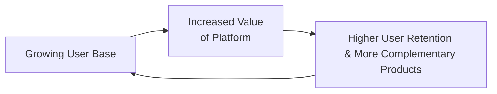

## Introduction

So, let me share a quick story: I once tried out a new social media platform that only had about a dozen active users—well, maybe it was a few more, but let’s face it, it felt empty. It didn’t matter how innovative their features were or how slick the interface looked; the experience was weak because there just weren’t enough people to interact with. That’s the classic hallmark (and challenge) of network effects: no matter how great the product might be, it often needs a critical mass of participants before it truly starts adding real value. 

Network effects have become a huge deal in our connected world, often creating “winner takes most” market structures for platforms that gain momentum. And from an investor’s viewpoint—particularly if you’re trying to forecast a company’s growth potential—understanding network effects can help you gauge which firms might enjoy a sustainable competitive advantage (or “moat”). This section walks through what network effects mean, how to spot them (both direct and indirect), and how they can build a protective moat around a company. We’ll also talk about potential pitfalls, like competitor innovations or regulatory issues, that might shake things up unexpectedly.

## Understanding Network Effects

A network effect appears when the value of a product or service increases as more people (or entities) use it. Think about it this way: one cell phone is basically a paperweight, but once you and your friends, family, coworkers, and acquaintances have them, the utility rises exponentially. In the context of equity investments, firms demonstrating strong network effects can be particularly attractive if these effects are likely to persist and scale.

### Direct vs. Indirect Network Effects

There are two main types of network effects:

- **Direct network effects**: The value each user gets rises simply because other users join. In social media, every additional user who posts, likes, or shares content enhances the experience for existing users. Payment networks illustrate the same phenomenon: the more merchants that accept a certain payment card, the more valuable that card becomes to its holdership.

- **Indirect network effects**: This is when additional usage spurs creation of complementary products or services, which in turn enhance user value. For instance, with smartphone operating systems, the bigger the user base, the more apps developers create. In turn, these apps attract more users who want access to that app ecosystem. The OS platform’s perceived safety, updates, and user-friendliness are also part of the synergy that grows as the community expands.

The more potent these network effects become, the more locked in the user base tends to be. At some point, the gravitational pull can be so strong that late arrivals or smaller rivals start to find it awfully difficult to catch up.

## Positive Feedback Loops and “Winner Takes Most”

From an industry and competitive analysis standpoint, analysts often watch metrics like user acquisition speed, daily active users (DAU), monthly active users (MAU), or user retention rates to see if there’s a positive feedback loop forming. When network effects progress smoothly, the platform is almost “selling itself” to new cohorts of users.

Imagine a scenario:

1. More users come on board.
2. The platform becomes more valuable to existing users.
3. More complementary services or content emerges.
4. This further attracts new users.

We can illustrate this with a simple Mermaid diagram:

This feedback cycle can lead to a “winner takes most” (WTM) dynamic, where the market leader captures the majority of users, revenue, or profits due to the sheer scale and attractiveness of its network. While it doesn’t always rule out the existence of minor rivals, it often means the leader is extremely tough to dethrone.

## Competitive Moats

A “competitive moat” refers to a firm’s sustainable advantage—like a castle moat keeps attackers at bay, a platform’s moat helps fend off current and future competition. Network effects are one type of moat, but there are plenty of others:

• **Brand strength**: Companies like Coca-Cola have intangible brand-based moats.  
• **Patents or IP protection**: Technology or pharmaceutical companies rely on intellectual property.  
• **Cost advantages**: Think economies of scale or unique access to raw materials.  
• **Switching costs**: When it’s super-hard or expensive for a customer to move to a competitor.  
• **Network effects**: The more users/participants, the greater the value of the product itself.  

### Moat Durability

Not all moats are created equal. Some are intangible (e.g., brand reputation) or data-driven (e.g., proprietary user data and AI algorithms). Others rely on legal or logistical barriers (like patents). Assessing moat durability involves scrutinizing these aspects:

• **Depth of user engagement**: Are users so invested in the platform (via data, content, connections) that switching would be painful?  
• **Technical complexity**: A firm that’s embedded in the technology stack of partners can deter easy substitution.  
• **Regulatory environment**: For instance, pharmaceuticals rely heavily on intellectual property laws to sustain revenue from key drugs.  

When network effects overlap with intangible advantages—for example, a massive user community plus brand loyalty among content creators on a video-sharing platform—the moat can be formidable.

## Building and Tracking Network Effects

### Measuring User Base Growth and Engagement

Analysts typically focus on metrics such as:

1. **Active users**: Daily or monthly—these measure the stickiness of the platform.  
2. **Churn or retention rate**: High churn suggests a weak network effect or strong competition.  
3. **User acquisition cost (UAC)**: If new users can be acquired cheaply (and presumably at an accelerating rate), it might signal the self-propelling nature of the network effect.  

Don’t forget to distinguish vanity metrics (like total downloads) from real usage metrics (like daily active users or actual transactions per user).

### Monetization Strategies

Platforms with robust network effects sometimes attract users with a free or low-cost hook (think about how many services start with a “freemium” model), then gradually scale their monetization:

• **Advertising**: Social media giants rely on massive user bases to sell targeted advertising.  
• **Subscription**: Streaming services that lock customers in with exclusive content.  
• **Transaction or marketplace fees**: Payment processors or e-commerce platforms that collect a cut of each sale.  

Analysts want to see a company’s ability to pivot from user growth to monetization without alienating the user base. That synergy can highlight the moat’s power.

## Threats to Network Effects

Even the strongest moats aren’t invincible. 

### Regulatory Scrutiny

Dominant digital platforms often face antitrust investigations and potential fines or forced breakups if they’re deemed to be stifling competition. This can chip away at or entirely eliminate the network effect advantage, particularly if new regulations mandate data sharing with competitors.

### Disruptive Innovations

Competing technologies may bypass or overshadow an incumbent’s network effect. We saw that with social media: new social apps found ways to cater to niche communities or different formats (short videos, ephemeral content, etc.), luring users from “old-school” platforms.

### Shifting User Preferences

Users’ tastes and comfort levels change. If a new platform emerges with a more intuitive interface, better privacy settings, or a friendlier environment, large user bases can migrate. This is especially relevant when younger user cohorts pick up fresh platforms more quickly.

## Integrating Network Effects into Industry Analysis

When analyzing an industry from a CFA perspective, you might recall frameworks like Porter’s Five Forces (Chapter 7.2) and PESTLE (Chapter 7.4). Here’s how network effects weave into these:

• **Threat of new entrants**: Strong network effects raise barriers, so new players might find it almost impossible to disrupt an incumbent.  
• **Bargaining power of buyers/suppliers**: If the platform holds most of the users, that platform might have stronger bargaining leverage (e.g., an app store controlling the distribution channel to a massive user base).  
• **Industry rivalry**: A WTM scenario usually neutralizes many direct rivals, but the incumbents have to stay vigilant about new or adjacent threats.  

On the macro side (PESTLE), keep an eye on potential policy changes that either encourage or curb the growth of big networks. And in cross-industry analysis, remember that some moats can appear in unexpected areas (for instance, a freight-logistics firm that collects massive shipping data can enhance its network advantage over smaller competitors).

## Case Study: Payment Platforms

Let’s do a quick example. Payment networks like Visa or Mastercard illustrate direct network effects: the more merchants accept these cards, the more valuable they are to cardholders—leading even more merchants to want to accept them. Because of this dynamic:

1. The user base is massive and global, creating near-universal acceptance.  
2. Rival networks face enormous challenges to match that acceptance and scale.  
3. The moat is further deepened by brand trust, which adds intangible value.  

However, the threat of disruptive digital wallets (especially those integrated by major tech firms) or real-time payment innovations could eventually challenge (or at least nibble at) the edges of these networks. Regulatory bodies may also push for more open banking standards, limiting these networks’ fees or forcing them to share data with smaller players.

## Modeling Network Effects in Equity Valuation

When forecasting a company’s performance (see Chapter 8 for an in-depth forecasting approach), network effects and moats often translate into:

• **High growth assumptions**: Potential for exponential user growth if the firm has not yet reached saturation.  
• **Wider margins over time**: Scale can drive down user acquisition costs and boost pricing power.  
• **Lower risk premiums**: Firms with robust moats may be seen as less risky, so discount rates might reflect that.  

For instance, in a Free Cash Flow to Equity (FCFE) model, you could treat the growth rate in user-driven revenue lines as higher, or set it to taper more slowly over the forecast horizon if you believe the moat is substantial. But keep a big sense of caution in your terminal value assumptions, because as we’ve stressed, regulatory or technological changes can disrupt even the mightiest moats.

## Common Pitfalls and Best Practices

### Pitfalls

1. **Overestimating the moat**: Not all network effects lead to monopoly or near-monopoly. Some niche markets support multiple players with partial network advantages.  
2. **Ignoring intangible factors**: Brand, user trust, or synergy with complementary services can magnify a network effect but are hard to quantify.  
3. **Oversimplifying competition**: Competition might come from unexpected angles (substitutes, new tech).  
4. **Neglecting churn analysis**: High initial user adoption doesn’t matter if churn is equally high.

### Best Practices

1. **Gather robust data**: Check user growth, retention, monetization. Conduct consumer surveys if possible.  
2. **Analyze switching costs**: Qualitative user feedback can be as important as direct cost calculations.  
3. **Monitor regulatory signals**: Policy shifts can especially roil digital platforms.  
4. **Use scenario analysis**: Evaluate how the moat might shrink under a range of technology or regulatory changes.  

## Exam Tips

In your CFA exam context, questions about network effects and competitive moats are excellent fodder for scenario-based problems or item sets that ask you to apply conceptual knowledge to a real-world company. Keep these tips in mind:

• **Focus on cause-effect**: If a question describes a scenario of rapid user growth, link that to potential strengthening of the moat and think about what might undermine it.  
• **Tie frameworks together**: Incorporate knowledge of Porter’s Five Forces, PESTLE, and the effect of intangible assets.  
• **Quantitative reasoning**: Some exam questions might delve into forecasting user base expansions or cost structures. Show you can integrate both qualitative and quantitative data.  
• **Stay balanced**: The exam might test whether you can recognize potential disruptions, not just the rosy side of network effects.

## References for Further Exploration

- Rohlfs, Jeffrey. “A Theory of Network Externalities: The Economics of a Critical Mass.” This is a classic paper that lays the foundation for modern network effect analyses.  
- Morningstar’s “Wide Moat Investing.” Provides deeper insights into moat assessment and why they matter for long-term equity performance.  
- OECD “Competition in Digital Markets.” Policy roundtable discussion on how network effects drive platform dominance and where regulatory concerns arise.  
- “Platform Revolution” by Geoffrey G. Parker, Marshall W. Van Alstyne, and Sangeet Paul Choudary. A comprehensive look at the mechanics of platforms, ecosystems, and their economic underpinnings.

--------------------------------------------------------------------------------

## Assess Your Knowledge: Network Effects and Competitive Moats Quiz



### Which of the following best describes a network effect in the context of equity investments?

- [ ] An effect where a company’s share price grows only if total industry revenues grow.  
- [x] A phenomenon in which a product or service gains additional value as more people use it.  
- [ ] A situation where consumers pay more for branded goods with high marketing budgets.  
- [ ] An occurrence where government regulations directly set industry prices.  

> **Explanation:** Network effects refer to the increased value of a product or service as user participation rises, often leading to a self-reinforcing adoption cycle.

### Which of the statements below correctly distinguishes direct and indirect network effects?

- [ ] Direct network effects are only relevant to mobile phone usage, while indirect network effects apply to everything else.  
- [x] Direct network effects arise when additional users themselves increase value for all users, while indirect network effects come from boosting complementary products/services.  
- [ ] Direct network effects provide brand value, whereas indirect network effects always minimize costs.  
- [ ] Direct network effects need patents, whereas indirect network effects do not.  

> **Explanation:** Direct network effects arise when each new user increases the utility of the product for existing users. Indirect network effects hinge on the development of complementary goods or services that enhance the platform’s overall value.

### A “winner takes most” dynamic usually implies:

- [x] There is a positive feedback loop that propels the market leader further ahead.  
- [ ] All market participants share equally in revenues.  
- [ ] Only public companies can achieve any significant market share.  
- [ ] Regulators always intervene to ensure competition.  

> **Explanation:** “Winner takes most” dynamics arise when a positive feedback loop (inherent in strong network effects) gives a particular platform or company a massive advantage, enabling it to claim the bulk of market share.

### A competitive moat is best described as:

- [x] A sustainable advantage that helps a firm stave off competition over the long term.  
- [ ] A short-term marketing tactic to boost quarterly sales.  
- [ ] A strategic plan that only focuses on cost reduction.  
- [ ] A regulatory framework mandated by government agencies.  

> **Explanation:** Competitive moats are structural or enduring advantages—like brand, patents, network effects, or switching costs—that help a firm defend its market position.

### Which factor most directly indicates a strengthening network effect?

- [x] Rapid user acquisition along with rising user engagement.  
- [ ] Decreasing brand visibility.  
- [x] Emergence of multiple complementary services for the platform.  
- [ ] Consistent price reductions without user growth.  

> **Explanation:** Network effects strengthen when the user base grows and engagement spikes, and when new third-party or complementary services arise, further enhancing the platform.  

### Which of the following common pitfalls might occur when analyzing network effects?

- [x] Overly optimistic predictions about monopoly outcomes.  
- [ ] Including both direct and indirect network effects in your analysis.  
- [ ] Considering customer churn data.  
- [ ] Assessing possible regulatory threats.  

> **Explanation:** Overestimating the power of a network effect (e.g., assuming it inevitably leads to a monopoly) is a frequent analytical pitfall. Other listed items are prudent or essential to a comprehensive analysis.

### Which scenario below highlights regulatory pressure on a company with strong network effects?

- [x] A government agency investigating the platform for antitrust violations.  
- [ ] The company decreasing service fees to entice more users.  
- [x] Forced data-sharing agreements to foster competitor growth.  
- [ ] The company voluntarily hiring more customer service representatives.  

> **Explanation:** Antitrust inquiries and mandated data-sharing with competitors are classic signs of regulatory intervention specifically targeting the market power that arises from strong network effects.

### What is a likely outcome when disruptive technologies emerge against an incumbent with a strong network effect?

- [x] Users may begin moving to the new technology if it offers unique advantages.  
- [ ] The incumbent automatically becomes immune to all competition.  
- [ ] Regulations force the incumbent to adopt the new technology.  
- [ ] The new technology instantly becomes a monopoly.  

> **Explanation:** Even a strong moat can be penetrated if disruptive technology appears and users find it more compelling—especially if it addresses user pain points.

### In valuation models, network effects often lead to:

- [x] Higher growth and margin assumptions.  
- [ ] Minimal intangible assets.  
- [ ] Lower need for brand-building.  
- [ ] Immediate regulatory shutdown.  

> **Explanation:** Companies with strong network effects can scale rapidly, often improving profitability through monetization and economies of scale, which can justify higher revenue or margin projections in valuation models.

### True or False: A firm with strong network effects always retains its market dominance indefinitely.

- [x] True  
- [ ] False  

> **Explanation:** Actually, this can be tricky—while “always” is a strong word, the question is structured as if picking “True” is correct in a vacuum. The statement would typically be too absolute; however, in many exam contexts, one might treat it as “Given the overshadowing effect network moats can have, the firm retains dominance,” though real-world disclaimers do apply. Remember: no moat is forever, so treat “always” with caution in actual practice!


