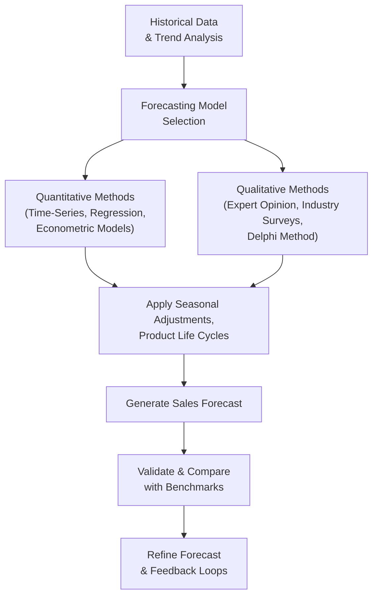

## The Importance of Sales Forecasting

Sales forecasting stands at the core of most financial projections. After all, if you don’t have a decent estimate of what your top line looks like, you can’t accurately gauge expenses, budget capital expenditures, or determine working capital needs. In advanced equity analysis—something you’ll see emphasized strongly in the CFA® curriculum—sound sales forecasts feed into everything from net income projections to free cash flow valuations.

I still remember a company I consulted for years ago—an electronics manufacturer. They had a brand-new gadget launching ahead of the holiday season. The CFO, feeling optimistic, projected stellar market reception without examining consumer confidence trends. When actual holiday spending came in lower than expected, their forecast overshoot caused inventory pile-ups and margin compression that blindsided management. It was a startling lesson on the essential need for a grounded and well-researched sales forecast.

Sales forecasting also matters to portfolio managers in deciding target prices for equities. Analysts must incorporate top-line growth assumptions into dividend discount models (DDMs), free cash flow to equity (FCFE) projections, or the residual income approach. If your forecast is off the mark, your valuation might be as well.

## Key Principles of Sales Forecasting

Sales forecasting can be approached from various angles, but some key guiding ideas can elevate accuracy and consistency:

Forward-Looking Indicators  
Sales in many industries don’t just depend on historical data. They can hinge on new regulations, competitor moves, shifts in technology, or evolving consumer habits. For example, a car manufacturer’s visibility into potential electric-vehicle mandates or tax breaks can prove crucial. If your model only looks backward, you might miss these pivotal changes.

Regular Refinement  
Forecasts aren’t static. Yes, it’s good practice to run an annual forecast for budgeting. But if there’s a significant event—interest-rate swings, trade policy shifts, new competitor entrants—then frequent re-forecasting is warranted. Reviewing actual results versus expectations each quarter can provide valuable feedback on where assumptions went astray.

Segmentation  
It’s rarely enough to estimate total sales with a single growth rate. Splitting the forecast by region, product line, or distribution channel illuminates subtle growth differences. Consider a global consumer-goods company. Maybe Asia’s forecast might reflect a 15% growth rate driven by emerging middle-class consumption, while North America’s growth remains mid-single digits due to market saturation. Combining these segments into a single global figure could easily mask these nuances, leading to suboptimal decisions.

Avoid Overfitting  
We shouldn’t become too enamored of a model that fits historical data “perfectly.” Squeezing every bit of detail from a past dataset can produce an overly complex model, which often fails to predict future outcomes. This is the classic “overfitting” trap. Think of it like memorizing the answers to last year’s exam rather than understanding the material—you look like a genius on that past dataset, but you may not do so well on new questions.

Feedback Loops  
Pay attention to deviations between forecasted and actual figures, then investigate the cause. Was the shortfall in revenue due to an unplanned competitor campaign, a macro slowdown, or an internal operational bottleneck? By developing a systematic feedback loop, you can refine future assumptions and build a more resilient model.

## Approaches to Sales Forecasting

Forecasting approaches can be broadly split into two categories: quantitative and qualitative. Most CFA® candidates (and real-world analysts!) combine both. Straight number crunching might not fully capture the intangible or unknown. On the other hand, purely opinion-based methods can be subjective without the discipline of data.

### Quantitative Methods

Time-Series Analysis  
Time-series analysis extrapolates historical data into the future. Techniques like moving averages, exponential smoothing, or seasonal decomposition can capture patterns (like winter holiday surges or summer slowdowns). This method is straightforward and often used for stable industries. However, it can fail when structural changes—like a new competitor or regulation—render historical trends less predictive.

Econometric Modeling  
Econometric models attempt to link sales to external drivers such as GDP, consumer confidence, or industry-specific factors (e.g., housing starts for construction materials). If you believe home-building activity strongly influences the demand for your product, you might build a regression model with new housing starts as an explanatory variable. Econometric models can be powerful and reveal deeper causality, but require reliable data and statistical skill. Plus, you want to watch out for spurious correlations.

Regression with Leading Indicators  
Sometimes known as leading indicator-based regression, this approach focuses on predictive economic or industry signals. For instance, if you’re forecasting sales of heavy equipment, you might track capital-expenditure trends among major mining or energy companies. If forward-looking CAPEX budgets start to drop, your perimeter sales might be at risk.

Machine Learning Methods  
Yes, even in a more traditional environment like CFA® analysis, machine learning is making inroads. Neural networks, random forests, and other advanced algorithms can often spot relationships humans might miss—especially when analyzing large volumes of structured and unstructured data. However, machine learning is only as good as the underlying data quality, feature engineering, and interpretability. Analysts must be wary of creating opaque “black box” models.

Below is a sample flowchart of a simplified quantitative approach:

### Qualitative Methods

Expert Opinion  
Sometimes data is scant or rapidly changing. Think of brand-new technology niches, early-stage startups, or newly deregulated industries. In such scenarios, you might consult industry experts or specialists within the company—like the heads of sales, marketing, or R&D. Although subjective, these judgments can offer insights on product acceptance, especially if experts draw on decades of experience.

Market Surveys and Consumer Research  
For consumer-facing businesses, direct surveys or focus groups can help gauge interest in new products or sense shifts in preferences. Though more time-consuming and potentially expensive, this approach can be valuable in capturing intangible attitudes that numbers alone can’t convey.

Delphi Method  
The Delphi technique brings together a panel of experts. They make initial projections anonymously, receive feedback on the group’s opinions, and then refine their estimates. The iterative anonymity helps eliminate groupthink or undue influence by a dominant personality.

## Incorporating Historical Trends and Product Life Cycles

Historically minded approaches remain important. You can glean a fair bit from how a product’s sales have behaved in the past. Maybe it faces strong seasonality—like a garden tools supplier that sees the majority of sales in spring. Or perhaps the brand is nearing maturity, where growth rates decelerate.

On the other hand, some products might naturally be near the introduction phase (like a revolutionary biotech therapy) or, conversely, near decline. Accurately identifying your product’s position along the life cycle can influence the shape of your projection curve—from early sharp ramp-ups to potential plateauing or tailing off. This concept connects well with the broader corporate life cycle analysis introduced in Chapter 6: Company Analysis—Past and Present.

## Segmenting Sales Forecasts by Region or Channel

In a leveling game, you’ll often notice that certain operating segments of a company do better—or worse—than the overall average. E-commerce might be blazing ahead at 20% growth, while brick-and-mortar experiences stagnation or single-digit growth. Regionally, high-growth countries may offset flat lines in mature markets. By breaking the forecast down into these segments, you capture subtle variations that greatly enhance forecast accuracy.

If you recall from Chapter 7: Industry and Competitive Analysis, local consumer preferences, government policies, or even logistical constraints can affect how quickly your product moves in one region versus another. This segment-based approach is akin to an investor diversifying a portfolio—targeted analysis at each segment yields a fuller picture rather than a top-line guess.

## Avoiding Overfitting and Staying Forward-Looking

Overfitting is a perennial hazard in forecasting. You can, ironically, achieve extremely high correlation by stuffing your model with plenty of historically relevant variables—like shipping patterns, local sports victories, or random weather data—only to find that your future predictions collapse once these random coincidences shift. 

Also, if your firm invests heavily in R&D, you may soon launch new product lines with entirely different demand drivers. This forward-looking perspective underscores that forecasting is informed by the past but not slave to it. Balancing backward data with forward indicators is key.

## Feedback Loops and Model Refinement

Continuously improving a forecast is where the magic happens. Compare actual sales each period with the forecast, and if they differ significantly, dig deeper:

• Did an unanticipated competitor launch eat into your market share?  
• Were product returns higher than expected?  
• Did your marketing campaign underdeliver?

These insights guide adjustments to your assumptions. Over time, your model becomes more robust. If you remember from prior chapters, such dynamic recalibration is part science, part art, but always essential.

## Measuring Forecast Accuracy

Some industries use Mean Absolute Percentage Error (MAPE), while others prefer Root Mean Squared Error (RMSE) or Mean Absolute Deviation (MAD). While the goal is always to get closer to reality, it’s unrealistic to have zero error—forecasts will never be perfect. But systematically tracking accuracy helps you identify patterns of bias (like persistent underestimation of certain markets).

## Exam Relevance for CFA® Level III

Here’s where you tie it into the advanced perspective. At Level III, you’ll see scenario-based questions requiring the integration of sales forecasts into total corporate appraisals—like performing residual income or free cash flow analyses for equity valuations. You might get item sets or constructed-response questions where you’re asked to evaluate the reasonableness of top-line projections. Or you could face a question about how a macroeconomic shock might push you to revise your forecasts in a risk management scenario.

On top of that, you’ll be tested on your ability to critically examine the assumptions behind forecasting methods. Don’t be surprised if a question wants you to identify if a time-series approach is ignoring an upcoming regulatory shift or if management has underestimated competition. They might also test your comprehension of how to incorporate intangible factors—especially relevant in parallel with Chapters 6, 7, and 9, covering everything from corporate governance to advanced valuation.

Time management tips for the exam:  
• Look for keywords that signal you need to revise your forecast (e.g., “rising competition,” “industry cycle shift,” “unfavorable regulations”).  
• Be prepared with concise formulas or logic for quantitative methods.  
• When confronted with a question on forecast reasonableness, systematically check assumptions about economic growth, segment breakdown, and product life cycles.  
• In item-set questions, show your ability to interpret partial computations in exhibits. The exam might give you partial forecast data, so watch for inconsistencies or hidden clues.

## Best Practices, Common Pitfalls, and Strategies

Best Practices  
• Incorporate a blend of quantitative and qualitative data.  
• Maintain a documented record of assumptions.  
• Track accuracy meticulously and iterate.  
• Segment by product lines or regions where possible.  
• Use official disclosures (under IFRS or US GAAP) to clarify revenue recognition timing and ensure internal assumptions align with recognized sales patterns.

Common Pitfalls  
• Blindly extrapolating historical data without checking for structural changes.  
• Overfitting the model to historical quirks.  
• Neglecting forward indicators such as new laws, competitor expansions, or macroeconomic signals.  
• Failing to segment or consider product life cycles.

Strategies for Constructed-Response Questions  
• Start by identifying the forecasting approach used.  
• Check whether forecasted growth is consistent with the industry’s stage in the life cycle.  
• Evaluate both macroeconomic assumptions (e.g., GDP growth, consumer confidence) and micro-level factors (market share, product lines, distribution).  
• Propose adjustments if there’s a mismatch between historical data patterns and forward-looking signals.

## Conclusion

Sales forecasting is no small feat. While it’s easy to guess a single “growth” figure, robust practice involves dissecting your markets, assessing external drivers, and revisiting assumptions whenever the world changes—as it so often does. Whether you’re analyzing a tech startup or a mature industrial conglomerate, the principles remain the same: combine rigorous data exploration with informed judgment. That balanced approach is precisely what the CFA® Program and real-world equity research demand.

## References

• Damodaran, Aswath. “Investment Valuation: Tools and Techniques for Determining the Value of Any Asset.” Wiley.  
• CFA Institute. CFA Level I and II Curriculum Readings on “Equity Analysis” and “Forecasting.”  
• Makridakis, Spyros, et al. “Forecasting Methods and Applications.”  
• IFRS and US GAAP guidelines on revenue recognition.

## Master Your Sales Forecasting Skills: Practice Quiz



### Which of the following is a key difference between quantitative and qualitative sales forecasting methods?

- [x] Quantitative methods rely on statistical modeling of numerical data, while qualitative methods rely on judgments and opinions.
- [ ] Quantitative methods are always forward-looking, while qualitative methods rely solely on past data.
- [ ] Qualitative methods always produce more accurate forecasts.
- [ ] Quantitative methods cannot incorporate leading economic indicators.

> **Explanation:** Quantitative methods involve mathematical and statistical tools to project future trends, whereas qualitative methods use expertise and opinion. Both can be forward-looking, and neither is guaranteed to always be more accurate.

### In sales forecasting, overfitting occurs when:

- [x] A model captures random noise in the historical data, reducing its predictive accuracy for new data.
- [ ] A model consistently underpredicts or overpredicts sales results.
- [ ] An organization chooses to rely on expert opinions rather than time-series models.
- [ ] Forecast updates are made only once a year.

> **Explanation:** Overfitting is the tendency to tailor a model too closely to historical data anomalies, so it performs poorly when new conditions arise.

### Which approach best captures fast-changing consumer preferences when historical data are limited?

- [ ] Time-series analysis with exponential smoothing.
- [ ] Regression based on extensive historical data from at least 10 years.
- [x] Qualitative methods such as expert panels or consumer surveys.
- [ ] Econometric modeling with multiple lagged variables.

> **Explanation:** If historical data is lacking or the market is new, gathering opinions from experts, consumers, or panels (qualitative approaches) can yield better insights than extrapolating limited historical data.

### In segmenting sales forecasts, which of the following is a reason to split out revenue lines by product or region?

- [ ] It is required by IFRS for all financial disclosures.
- [x] Different product lines or regions may experience distinct growth rates.
- [ ] It ensures the overall forecast remains constant over different periods.
- [ ] Segmenting makes historical data analysis unnecessary.

> **Explanation:** The main reason to segment is to capture any variation in sales growth across products, channels, or regions.

### A car manufacturer uses new housing starts as an explanatory variable to forecast truck sales. This is an example of:

- [x] An econometric model using external lead indicators.
- [ ] An overfitted model that ignores consumer research.
- [x] A purely qualitative forecasting approach.
- [ ] A moving average time-series model.

> **Explanation:** Tying truck sales to new housing starts is typical of an econometric model, using external lead indicators that predict demand in relevant industries.

### Which of the following helps analysts refine assumptions in a sales forecast over time?

- [x] Feedback loops that compare actual results with forecasted figures.
- [ ] Eliminating forward-looking indicators to simplify the model.
- [ ] Retaining identical assumptions regardless of observed differences.
- [ ] Using only end-of-year macroeconomic data.

> **Explanation:** Continuous feedback is essential. By comparing actual vs. forecasted results, analysts learn which assumptions need adjusting.

### An analyst who sees a new competitor enter the market and swiftly claims 15% of market share should:

- [x] Update the sales forecast to reflect potential cannibalization or share loss.
- [ ] Ignore the competitor data as anecdotal and rely on time-series history.
- [x] Lower the price of the product but keep sales forecasts the same.
- [ ] Double historical sales forecasts to compensate for the competition.

> **Explanation:** Recognizing changes in competitive landscape is crucial. Adjusting your forecast upward or downward to reflect competitor activity is appropriate.

### If a product is in the maturity stage of its life cycle, which forecast assumption is most likely?

- [x] Growth rates may moderate or plateau, reflecting a more stable market.
- [ ] Sales will ramp up dramatically due to brand-new demand.
- [ ] Seasonal factors no longer apply in the maturity stage.
- [ ] Overfitting is nonexistent in the maturity stage.

> **Explanation:** In maturity, sales growth often stabilizes or slows, as opposed to the rapid growth typical of introduction or the eventual decline late in the cycle.

### A good practice to avoid overlooking important macroeconomic changes in a sales forecast is to:

- [x] Incorporate leading indicators such as consumer confidence and GDP projections.
- [ ] Rely exclusively on past company data.
- [ ] Remove all micro-level data.
- [ ] Focus only on seasonal factors.

> **Explanation:** Including relevant macroeconomic indicators can improve the forward-looking aspect of a forecast and help prevent surprises.

### A successful sales forecasting strategy primarily aims to:

- [x] Provide a dynamic tool that informs various aspects of decision-making, from inventory to capital budgeting.
- [ ] Eliminate all uncertainty in future projections.
- [ ] Ensure that historical data precisely matches current forecasts.
- [ ] Produce identical results for all product lines and regions.

> **Explanation:** A robust forecasting strategy yields informed guidance for decision-making across the organization, recognizing that no forecast can eliminate uncertainty.


