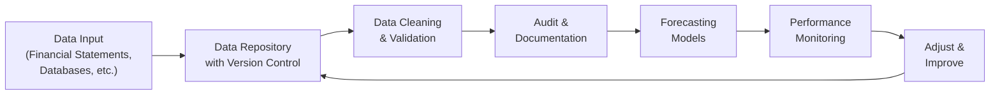

## Introduction
Forecasting company performance hinges on consistently reliable inputs. Whether you are evaluating a mature industry leader or an emerging start-up, the quality of your collected data can make or break the accuracy of your forecasts. In earlier sections of Chapter 8, we explored overarching forecasting techniques (Section 8.1) and approaches to scenario analysis (Section 8.4). Here, we turn the spotlight onto the often underappreciated but critical process of data collection, ensuring data integrity, and avoiding pitfalls that can undermine your entire projection process.

In practice, forecasting goes far beyond picking a growth figure from last quarter’s financial statement or pulling a competitor’s margin estimate from a quick web search. Each piece of data—revenue figures, macroeconomic indicators, or cost assumptions—requires careful scrutiny, adjustment, and validation. While it may seem tedious, strong data discipline is integral to meeting the standards expected of professional analysts engaging in equity research, consistent with the CFA Institute’s Code and Standards.

Below, we delve into the best methods for gathering data, establishing integrity checks, and sidestepping common mistakes. We also examine the importance of data governance and documentation—crucial elements in a robust forecasting framework that can withstand stakeholder scrutiny and adapt to rapidly shifting market conditions.

## The Importance of Data in Forecasting
Before diving into collection and integrity, let’s first frame why data matters so profoundly in forecasting:

• Data is the foundation: All forecasting models—whether a simple percentage-of-sales approach (Section 8.9) or a sophisticated Monte Carlo simulation (Section 8.8)—rely on inputs from historical financial statements, industry benchmarks, and economic indicators.  
• Garbage in, garbage out (GIGO): If your historical financial statements contain errors or your industry research is incomplete, even the most elegant valuation model (see Chapter 9) will yield misleading results.  
• Regulatory and ethical considerations: Proper data collection and governance align with professional standards. Inconsistent or selectively chosen data could lead to biased forecasts, raising ethical and reputational risks.  

## Data Collection
Data collection is the first step in creating reliable forecasts. It involves gathering quantitative and qualitative information from multiple sources, then reconciling and organizing it in a usable format.

### Identifying Key Sources
Data for equity forecasting typically comes from:

• Financial statements (annual reports, interim reports, MD&A segments).  
• Regulatory filings (10-Ks, 10-Qs under US GAAP; annual and semiannual under IFRS).  
• Company presentations and press releases.  
• Industry and consumer databases, such as Bloomberg, Thomson Reuters, FactSet, and specialized sector reports.  
• Macroeconomic publications from government agencies or NGOs (e.g., Federal Reserve or European Central Bank economic bulletins).  
• Analyst consensus estimates and related research notes.  

When pooling from multiple avenues, remain vigilant for differences in definitions or time horizons. For example, some databases report trailing twelve-month data, while others report discrete quarterly results, leading to potential mismatches of figures if not reconciled carefully.

### Ensuring Consistency in Data Definitions
Discrepancies often arise when different providers classify revenue or operational segments differently. Always clarify definitions behind:

• Revenue recognition timing (particularly relevant for subscription or long-term contract businesses).  
• Expense categories and how one data source might bundle costs differently from another.  
• Currency exchange rates used in international statements.  

A best practice is to develop a “data dictionary” or reference table, especially if multiple analysts collaborate on a project. This data dictionary outlines how each line item is defined, the data source, and adjustments for comparability across periods and entities.

### A Note on Currency Units
If you’re analyzing a multi-national enterprise, currency considerations are central. Decide whether you’ll translate all data into a base currency at average or spot rates, and then apply consistent methods period over period. Even minor exchange rate variances can compound into large distortions in multi-year forecasts.

## Data Integrity
Once raw data is in hand, your next step is ensuring it is accurate, free of errors, and comprehensive. Even small mistakes or overlooked anomalies can severely mislead forecasts—particularly in highly competitive industries where marginal differences in cost assumptions or market share can be determinative.

### Data Cleaning and Validation
Data cleaning typically includes:

1. Identifying outliers: Check for any data points that look abnormally large or small compared to historical ranges. An outlier might reflect a genuine anomaly (e.g., a one-time extraordinary item) or a clerical error.  
2. Removing duplicates: Especially relevant if data from multiple sources overlaps. One might end up double-counting sales figures or cost measures if not careful.  
3. Correcting errors: Sometimes financial statements are restated after publication. Always confirm you have the most recent version of each database or filing.  

Validation procedures typically involve verifying that each major line item ties back to its original source. Where adjustments or normalizations are made—such as removing one-time restructuring charges—document these thoroughly.

### Documenting Adjustments and Assumptions
Analysts often restate financial statements to improve comparability or highlight operating performance (e.g., ignoring merger-related expenses). Each adjustment should be logged in an “Assumption Log” or “Adjustment Log,” which includes:

• Date of the adjustment.  
• Source of information prompting the restatement.  
• Rationale behind it.  
• Method used to incorporate it into the forecast.  

## Common Pitfalls
Forecasting involves many subtle traps. Let’s tackle the top culprits that can derail your data-driven insights:

### Overreliance on Short-Term Trends
If you focus solely on recent sales spikes, you might overlook longer product cycles or broader economic patterns. For instance, a short-term bump in e-commerce sales might coincide with holiday shopping, but it may not be sustainable year-round. Be sure to align short-term data with an understanding of the product’s or sector’s broader trajectory, referencing industry life cycles (Chapter 7).

### Ignoring Macroeconomic Indicators
It’s surprisingly easy to project a rosy growth path in isolation. But if economic data suggests a looming recession or interest rate hike, ignoring these signals can lead to unrealistic revenue forecasts and potential mispricing in your equity valuation (see Chapter 9, Section 9.3 on Price Multiples).

### Inconsistent Assumptions
Maintaining logical consistency across all assumptions is critical. A classic error is projecting aggressive revenue increases without adjusting the cost structure. High growth often implies more administrative overhead, marketing expense, and possibly higher working capital needs. Mismatched assumptions about growth and costs distort profitability metrics like EBIT margins, leading to erroneous valuations.

### Underestimating Competition
In dynamic industries, a competitor’s reaction to your subject firm’s actions can drastically alter market share projections. Consider price wars, new product introductions, or promotional strategies. Reviewing competitor conference calls or M&A activity can provide valuable data to calibrate your assumptions.

### Anecdote: A Slipping Margin
One senior analyst once told me (over coffee, of course) about a forecast that assumed seven years of 20% annual revenue growth without altering the firm’s cost structure. The result? Margin assumptions ballooned unrealistically, and the projected bottom line soared. Investors eventually realized the firm had to scale up manufacturing and marketing, which cut margins. The analyst revised the model too late, denting the credibility of the research team.

## Data Governance
Data governance involves establishing a framework of practices and procedures to manage how data is collected, stored, and used:

• Version Control: Keep track of various document iterations so you can revert to prior versions or audit changes if a discrepancy arises.  
• Access Controls: Restrict editing rights to ensure only authorized personnel can modify vital data or forecasting spreadsheets.  
• Audit Trails: Implement logs that note who changed what data and when, along with a reason for the change.  

By adopting robust governance structures, you not only increase transparency for regulators and internal stakeholders but also solidify trust in the integrity of your forecasts.

Below is a simplified diagram illustrating a typical data governance cycle:

In this cycle:
• “Data Input” represents the raw collection of financial statements, industry reports, and macroeconomic data.  
• “Data Repository” captures the centralized system or database with version control.  
• “Data Cleaning & Validation” is a step to identify anomalies, remove duplicates, and make adjustments.  
• “Audit & Documentation” ensures tracking of changes and assumptions.  
• “Forecasting Models” feed off the validated data.  
• “Performance Monitoring” compares actual outcomes to forecasts.  
• “Adjust & Improve” ensures a continuous loop toward better data and forecasting methodology.

## Documentation and Cross-Verification
### Assumption Log
As you refine your forecasts, new data or competitive insights will inevitably surface. Track these changes in an Assumption Log. Recording prime assumptions, sources, and the date added (or changed) fosters continuity and transparency. It also allows you to pinpoint errors quickly if the forecast underperforms down the line.

### Compare with Industry Benchmarks
Cross-verification not only detects outliers but also identifies potential errors. If your model projects a 30% operating margin while the industry average is around 10%—and there is no compelling strategic advantage for that firm—you may have discovered a data or assumption error. Use analyst consensus estimates and commonly monitored metrics (e.g., the Herfindahl–Hirschman Index or HHI covered in Chapter 7.8) to see if your forecast assumptions align with market norms or highlight compelling reasons for the deviation.

### Iterate and Evolve
Forecasting is never truly finished. After each reporting period, compare your forecast to actual results. Investigate any significant deviations. Did you ignore a macroeconomic factor? Did an unforeseen competitor discount campaign alter market share? By incorporating these lessons, your forecasting frameworks can improve gradually over time.

## Best Practices for Continuous Improvement
1. Keep Data Current: Always refresh your data sets when new reports or regulatory filings become available.  
2. Calendarize Annual Data: Standardize each company’s fiscal year data into a consistent calendar period if comparing across multiple stocks.  
3. Stress Testing: As covered in Section 8.4 on scenario analysis and stress testing, apply alternate assumptions on data sets to gauge the resilience of your forecast.  
4. Governance Check-ins: Schedule periodic reviews to ensure version control is functioning, logs are up to date, and the entire analysis team adheres to consistent protocols.  

## Conclusion and Exam Tips
Effective forecasting in equity analysis depends on meticulous data collection and governance. Any shortcuts—like ignoring short-term anomalies or failing to align cost structures with revenue growth—can snowball into major valuation errors. For the CFA exam context:

• Remember that data accuracy and integrity are part of the ethical foundation of equity research.  
• Expect scenario-based questions that test how you might adjust or verify questionable data sources.  
• Watch for pitfalls (e.g., ignoring macro data) or inconsistencies in assumptions (e.g., high revenue growth with stable costs) in item-set vignettes.  
• Document your assumptions, and be ready to explain adjustments to standard metrics—this is a common theme in constructed-response questions.  

By diligently applying the principles of data validation, thorough documentation, and cross-verification, you can confidently present forecasts that stand up to scrutiny—and ultimately support stronger investment decisions.

## References
• IBM’s “Data Management and Governance” whitepapers for corporate data integrity.  
• CFA Program Curriculum, “Fintech and Data Analysis in Investment Management.”  
• Harvard Business Review articles on best practices in data-driven decision-making.  
• Relevant IFRS and US GAAP guidelines on revenue recognition (IAS 18/IFRS 15, ASC 606).  
• CFA Institute Code of Ethics and Standards of Professional Conduct, focusing on diligence and thoroughness.

## Test Your Knowledge: Data Collection, Integrity, and Common Pitfalls



### Which of the following best illustrates a potential mismatch in assumptions during forecasting?

- [ ] Projecting higher growth while also projecting a slight increase in variable costs  
- [ ] Projecting a moderate economic expansion alongside stable consumer demand  
- [x] Projecting rapid sales growth with no change in operating expenses  
- [ ] Projecting stable sales and stable capital expenditures  

> **Explanation:** A classic pitfall is assuming rapid top-line growth without increasing costs such as manufacturing, marketing, or distribution, leading to unrealistic margin forecasts.

### Why might an analyst maintain an Assumption Log?

- [ ] To provide an overview of past stock price movements  
- [ ] To record technical analysis signals  
- [x] To document each assumption’s source and rationale for future reference  
- [ ] To compare a firm’s dividend history with macroeconomic trends  

> **Explanation:** An Assumption Log develops transparency in the forecasting process by noting each assumption’s origin, rationale, and the date it was incorporated or revised.

### When adjusting data for comparability across multiple sources or regions, the analyst should:

- [x] Check for differences in currency and revenue recognition practices  
- [ ] Merge all income statement items without footnotes  
- [ ] Rely solely on annual data from the company’s investor relations site  
- [ ] Always convert data using spot rates from the final day of the reporting period  

> **Explanation:** Different data sources can introduce variations in currency, definitions, and time frames. The analyst should reconcile these differences carefully and document each change.

### Which of the following is a key reason to review macroeconomic indicators in a forecast?

- [ ] Macroeconomic indicators rarely impact small-cap firms  
- [x] Broad economic conditions significantly influence revenue and cost projections  
- [ ] Macroeconomic trends only matter for fixed-income assets  
- [ ] Regulatory bodies require it for compliance reasons  

> **Explanation:** Macroeconomic conditions, such as interest rates or GDP growth, influence consumer demand, cost of capital, wage inflation, and numerous other fundamentals that shape a firm’s performance trajectory.

### One recommended approach to improve data integrity involves:

- [x] Performing regular audits and documenting any changes to the database  
- [ ] Keeping all forecasts confidential with no peer review  
- [ ] Ignoring restatements by the company that might affect historical data  
- [ ] Consolidating all data into a single spreadsheet without version control  

> **Explanation:** Periodic audits ensure version control is enforced and data changes are justified. This approach reduces errors, facilitates transparency, and builds trust in the forecasting process.

### Inconsistent assumptions could arise if:

- [ ] The cost of capital is set according to CAPM  
- [ ] Quarterly data is annualized appropriately  
- [x] You apply a 15% sales growth rate but assume no increase in production capacity  
- [ ] You assume a temporary recession and reduce sales projections accordingly  

> **Explanation:** Whenever revenue is projected to increase significantly, the supporting expenses and capacity constraints need to be similarly accounted for to avoid mismatched assumptions.

### According to best practices in data governance, “version control” means:

- [x] Consistently tracking all changes to a dataset or forecast model over time  
- [ ] Preventing anyone except the CFO from editing forecast data  
- [ ] Allowing each team member to have their own untracked model at all times  
- [ ] Permanently locking the data to preserve initial assumptions  

> **Explanation:** Version control involves properly logging each iteration of the dataset or model so that analysts can revert to prior versions or assess the evolution of key assumptions.

### Why is cross-verification with competitor and industry benchmarks useful?

- [ ] It proves all your assumptions are automatically correct  
- [ ] It is only necessary for technology companies  
- [x] It highlights extreme values or inconsistencies and may prompt model adjustments  
- [ ] It protects the analyst from professional liability  

> **Explanation:** Cross-referencing forecasts with competitor indicators or industry averages helps identify anomalies that might reflect errors in your assumptions or data.

### Which of the following describes the continuous improvement cycle in forecasting?

- [ ] Forecast → Lock the model → Move on  
- [ ] Collect data → Skip validation → Present final forecast  
- [ ] Wait for external audits → Make changes every five years  
- [x] Forecast → Compare to actuals → Investigate deviations → Update assumptions  

> **Explanation:** Forecasting should be an iterative process, constantly refined as new data arrives and deviations become apparent.

### True or False: Overreliance on short-term trends can lead to faulty long-term forecasts.

- [x] True  
- [ ] False  

> **Explanation:** Heavy emphasis on short-term fluctuations without accounting for cyclical or structural trends increases the risk of inaccurate long-term projections.


