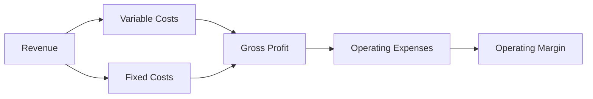

## Overview
Forecasting a company’s expenses, margins, and capital expenditures (capex) is a crucial part of equity analysis. After all, strong revenue growth might look exciting, but if costs spiral out of control, earnings and shareholder value can be quickly eroded. I remember talking with a friend—an entrepreneur in the tech space—who marveled at his ballooning sales, only to realize later that his overhead and variable costs were eating most of those gains. So, accurate forecasting of both the top and bottom line truly matters.

Here, we’ll focus on how to estimate expenses by classifying them into the right buckets (fixed vs. variable), review different cost drivers, project reliable margins, and calculate future capital expenditures. We’ll also dig into how depreciation, economies of scale, and scenario analysis come into play.

## Classifying Expenses: Variable vs. Fixed
A strong forecasting model starts by sorting costs into variable or fixed categories. That way, you can quickly see which costs—the variable ones—grow (or shrink) with revenue, and which ones—the fixed ones—won’t budge unless strategic decisions prompt changes.

• Variable Costs: These costs scale with the level of output. Think raw materials in manufacturing, shipping charges for an online retailer, or credit card processing fees for an e-commerce site.  
• Fixed Costs: These costs stay mostly the same in the short term, regardless of sales volume. Classic examples include rent, insurance, long-term subscription services, and certain salaries.

When analysts break down costs in this manner, they can model how changes in volume might reverberate through the income statement. This approach supports more robust “what-if” evaluations (for instance, asking: “What if the company sells 10% more units than last year?”).

Below is a simple diagram illustrating how revenue flows into costs and margins:

## Historical Cost Patterns and Cost Drivers
Forecasting expenses often starts with analyzing a company’s historical financial statements. If you notice that direct materials or certain types of labor have consistently moved in tandem with revenue, that’s a big clue you’re dealing with variable costs. On the flip side, persistent overhead items—office lease, depreciation, and so on—point to a fixed cost structure.

• Look for patterns across multiple reporting periods.  
• Compare expense ratios to revenue (e.g., Cost of Goods Sold ÷ Revenue).  
• Consider external data such as inflation, industry wage tendencies, or changes in commodity prices.

Sometimes, you’ll find that an expense won’t neatly fit into “fully fixed” or “fully variable” categories. Maybe it has a partly fixed component, plus a variable “usage” portion. In that case, you might prorate the cost or create a hybrid approach.

## Margins: Gross, Operating, and Net
Margins offer a window into how efficiently a firm converts revenue into profit. By comparing margins across several periods—and against competitors—you can identify cost inefficiencies and hidden trends. Key margin metrics include:

• Gross Margin = (Revenue – Cost of Goods Sold) ÷ Revenue  
• Operating Margin = Operating Income ÷ Revenue  
• Net Margin = Net Income ÷ Revenue  

When forecasting, analysts typically start from sales projections, then break down expected costs at the gross margin level. After that, they layer in operating expenses (including depreciation and amortization) to arrive at operating profit. Finally, they account for taxes and interest to estimate net margins.

Suppose our hypothetical firm has a gross margin around 50% historically, and management guidance plus industry comparisons suggest it might move up to 55% over the next two years, thanks to better pricing power. If, at the same time, overhead expenses are expected to climb 10% due to rising salaries and new marketing campaigns, you’ll need to carefully reconcile these trends to determine whether the operating margin might inch higher or remain flat.

## Projecting Depreciation and Amortization
Depreciation (for tangible assets) and amortization (for intangible assets) can be material line items in a company’s cost structure. They often show up as part of operating or non-cash expenses—and can trick us if we look only at net income.

Analyzing depreciation involves:  
• Reviewing existing fixed assets, their useful lives, and depreciation methods (straight-line, declining balance, etc.).  
• Assessing future capital expenditures that will eventually increase the depreciation base.

Amortization for intangibles (like patents or software licenses) follows a similar rationale. We want to see how soon intangible assets might be fully written off and whether new intangible investments will come into play.

## Capital Expenditures (Capex)
Capex represents the funds earmarked for acquiring or upgrading physical assets. In practice, we split capex into maintenance capex versus growth capex:

• Maintenance Capex: Expenditures needed for existing operations to sustain efficiency, replace broken equipment, or keep systems up to date.  
• Growth Capex: Investments that expand a firm’s capacity or capabilities—such as adding a new production line or acquiring a competitor.

For forecasting, it helps to tie projected capex to revenue and operational strategy. If a manufacturing company is at 80% capacity, but management plans to open two more plants, you know growth capex is on the horizon. Meanwhile, standard maintenance capex can often be estimated by looking at historical relationships with revenues or depreciation (e.g., a rule of thumb might be maintenance capex ≈ depreciation in stable times).

## Best Case, Base Case, and Worst Case
Any cost forecast is inherently uncertain. That’s why it helps to run multiple scenarios:

• Best Case: Assume economies of scale kick in strongly, variable costs drop per unit, or certain raw material prices fall. Operating margins may expand.  
• Base Case: The most likely scenario, where current trends persist, and management’s guidance is accurate.  
• Worst Case: Assume supply-chain disruptions, rising commodity costs, or unexpected wage inflation. Margins may take a hit, and capex might jump due to emergency replacements or adaptation costs.

Here’s a simple illustration of scenario analysis for forecasting operating margin:

| Scenario   | Revenue (in millions) | Variable Cost (%) | Fixed Cost (in millions) | Operating Margin (%) |
|------------|-----------------------|--------------------|--------------------------|-----------------------|
| Best Case  | $100                 | 40%                | $30                      | 30%–32%              |
| Base Case  | $90                  | 45%                | $30                      | 23%–25%              |
| Worst Case | $80                  | 50%                | $30                      | 15%–17%              |

In practice, you’ll expand on these numbers and feed them into pro forma income statements and cash flow forecasts to see how net income and free cash flow might emerge.

## Economies of Scale (Or Lack Thereof)
When companies grow, they can enjoy economies of scale, meaning average cost per unit goes down. This often happens in manufacturing or tech-driven firms, where overheads are spread over larger output volumes. On the other side, some companies experience diseconomies of scale when complexity, bureaucracy, or distribution inefficiencies creep in with expansion.

Recognizing these thresholds is a big part of forecasting. If a firm is nearing a major efficiency milestone—say, fully automating part of the plant—operating margins might improve significantly. Conversely, if you see signs of diseconomies (too many product lines, too many remote offices), margin forecasts should reflect potential cost inflation.

## Using Management Guidance and Industry Benchmarks
Analysts frequently refine their estimates with inputs from:

• Management Guidance: Senior executives often provide direction on expected cost levels, upcoming projects, or expansions.  
• Industry Benchmarks: Comparing the firm’s cost ratios and margins to those of peers can highlight potential improvements or pitfalls.  
• Supply Chain Analysis: Understanding the ecosystem of suppliers, buyers, logistics, and how each link contributes to cost or margin.

Just remember that management can be optimistic at times about cost savings or synergy benefits—take guidance with a grain of salt. That said, it’s still an invaluable data point for your model.

## Practical Example and Case Study
Let’s say we have a mid-sized electronics manufacturer—call it StarTech, Inc.—with the following traits:
• Historical gross margin of around 40%.  
• Fixed annual overhead of $15 million.  
• Variable costs historically at 30% of revenue.  
• Management planning to launch a new product line, expecting growth capex of $5 million each year for the next two years.  

Step-by-step:
1. We start by forecasting revenue based on current demand and potential new product traction.  
2. We keep variable cost proportion at 30% of the forecasted revenue.  
3. We hold fixed costs at $15 million for the next year but adjust them slightly upward to $16 million in Year 2, anticipating incremental staff hires.  
4. Depreciation is forecast to rise from $3 million to $4 million in Year 2, reflecting the additional capex.  
5. We also forecast StarTech’s operating margin by incorporating potential efficiency gains from streamlined production processes.

If, halfway through the next year, commodity prices spike or supply routes become more expensive, StarTech might see its variable costs jump. This change would push margins downward. We’d then update the model with these new assumptions (and likely run a few “what-if” scenarios).

## Key Considerations and Common Pitfalls
• Overlooking Partial Variable Costs: Some costs are partially fixed and partially variable. Oversimplifying them can lead to inaccurate forecasts.  
• Relying Too Much on Past Averages: Costs can diabolically change due to new product launches, supply-chain shifts, or changes in strategic direction.  
• Misjudging Growth Capex vs. Maintenance Capex: If a forecast lumps everything into “capex,” you can miss a crucial insight about how a firm is investing for future growth vs. just keeping the lights on.  
• Underestimating the Impact of Depreciation: Over time, depreciation can significantly reduce reported earnings, even if cash flow is not immediately affected.  
• Blind Faith in Economies of Scale: One of my colleagues once predicted unstoppable margin expansion for a growing software firm, only to see the firm’s costs balloon due to new compliance requirements and global expansion complexities.

## Encouraging Continuous Learning
Recognizing how expenses, margins, and capex interrelate is a fundamental skill for any equity analyst. As you build and refine models, challenge your assumptions by stress-testing them against actual corporate events or abrupt industry changes. Perhaps talk to peers or review advanced discussions in the CFA Program Curriculum for deeper guidance on forecasting nuances. Keep an eye out for new ways to parameterize your forecasts—Monte Carlo simulations or machine learning techniques can add fresh insight if used appropriately.

## References
- Berk, Jonathan, and Peter DeMarzo. “Corporate Finance.” Pearson.  
- CFA Program Curriculum, “Financial Statement Modeling” and “Corporate Issuers.”  
- Penman, Stephen. “Financial Statement Analysis and Security Valuation.”  

---

## Test Your Knowledge: Forecasting Expenses, Margins, and Capex



### Which of the following best describes the difference between variable and fixed costs?

- [ ] Variable costs remain constant regardless of production, while fixed costs fluctuate directly with sales volume.
- [ ] Variable costs include depreciation, while fixed costs include raw materials.
- [x] Variable costs change proportionally with production output, whereas fixed costs remain largely unchanged in the short run.
- [ ] Variable costs only apply to large corporations, while fixed costs apply to smaller firms.

> **Explanation:** Variable costs (e.g., raw materials) rise or fall with production levels; fixed costs (e.g., rent) generally do not fluctuate immediately with output.

### When forecasting operating margin, which of the following is usually the starting point?

- [ ] A detailed breakdown of administrative expenses.
- [x] Sales (revenue) projections.
- [ ] Calculations for net income.
- [ ] Detailed tax analysis.

> **Explanation:** Operating margin forecasts typically begin with projected revenue, from which analysts derive cost estimates (both variable and fixed), leading to an operating income figure.

### Which expenditure type is primarily aimed at sustaining current operations rather than expanding them?

- [x] Maintenance capex
- [ ] Growth capex
- [ ] Research & Development
- [ ] Marketing & Advertising

> **Explanation:** Maintenance capex involves replacing or repairing existing equipment necessary for ongoing operations; growth capex is allocated to expand or improve productive capacity.

### A company experiences lower average costs per unit as production level increases. What term best describes this phenomenon?

- [x] Economies of scale
- [ ] Diseconomies of scale
- [ ] Structural inefficiency
- [ ] Marginal costing

> **Explanation:** Economies of scale occur when increased production leads to a decline in per-unit cost, often due to spreading fixed costs across more units.

### Which of the following is a potential pitfall when forecasting expenses?

- [ ] Separating fixed and variable costs
- [ ] Consulting industry benchmarks
- [x] Oversimplifying partially variable costs
- [ ] Using multiple scenario analyses

> **Explanation:** Partially variable costs can lead to misleading forecasts if treated as purely fixed or purely variable, so proper segmentation is essential.

### In a “worst-case” scenario analysis, which factor is typically assumed?

- [ ] Rising economies of scale
- [x] Higher commodity or input prices
- [ ] Rapid growth in margins
- [ ] Reduced fixed costs

> **Explanation:** A worst-case scenario often assumes negative pressures, such as higher input prices and reduced demand, leading to lower profits.

### Depreciation expense generally ________ as more capital expenditures are made.

- [ ] stays the same
- [x] increases
- [ ] decreases
- [ ] always remains negligible

> **Explanation:** Over time, new capital assets add to the depreciation base, causing depreciation expense to rise.

### Which of the following statements about management guidance is most accurate?

- [x] It can be valuable for refining forecasts but may be overly optimistic at times.
- [ ] It should always be taken exactly as stated, as management has perfect information.
- [ ] It usually underestimates future costs across all industries.
- [ ] It is rarely provided by companies and generally unreliable.

> **Explanation:** While management’s insights are valuable, analysts should still scrutinize them critically, as executives may be optimistic or subject to optimism bias.

### When forecasting for a capital-intensive manufacturer, how might you approximate maintenance capex in a stable environment?

- [ ] Equal to total revenue
- [ ] 10% of EBIT
- [x] Roughly equal to depreciation
- [ ] Half of operating income

> **Explanation:** A common rule of thumb ties maintenance capex to the ongoing depreciation expense, assuming the company is maintaining its current asset base.

### True or False: Forecasting a company’s expenses is a purely mechanical exercise with no need for qualitative assessments.

- [ ] True
- [x] False

> **Explanation:** Forecasting involves both quantitative modeling and qualitative judgments (e.g., changes in strategy, management optimism, macroeconomic factors), so it’s never purely mechanical.


