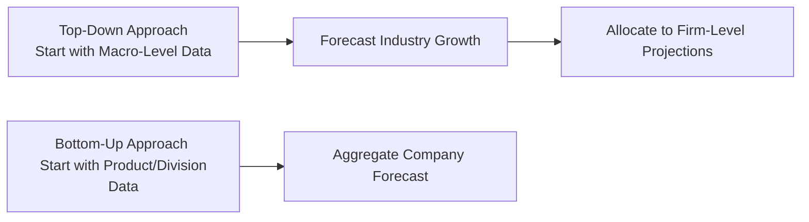

## Introduction and Context

Forecasting future performance is both an art and a science. You’ve probably noticed that some companies seem laser-focused on macroeconomic data—like overall GDP growth or industry-wide demand—to estimate sales. Others concentrate on granular, product-level sales forecasts (sometimes down to the number of widgets each sales rep can move). In this section, we explore these two primary approaches:

• Top-Down Forecasting  
• Bottom-Up Forecasting  

We’ll also discuss tips for blending the two approaches to create more resilient financial projections. This is especially vital when developing equity forecasts for valuation models (see Section 9.1 on Dividend Discount Models and Section 9.2 on Free Cash Flow to Equity Models, where forecast accuracy plays a massive role in company valuation).

## What Is Top-Down Forecasting?

Top-down forecasting starts from the macro-level—think overall economic or industry-level data—then cascades that information down to the individual company. This approach often leverages big-picture indicators such as:

• GDP growth rates  
• Inflation trends  
• Industry or sector growth percentages  
• Regional or global demand drivers (consumer sentiment, interest rate environment)  

The idea is: If the entire economy expects to grow by a certain percentage, then your sector has some share of that growth, and finally your firm should land somewhere within that range based on its estimated market share.

### Advantages of Top-Down Forecasting

1. Alignment with Macroeconomic Trends  
   Top-down forecasts can help you stay aligned with the broader economic environment. If a major recession looms or if robust government stimulus is expected, top-down models generally capture these big shifts early on.

2. Efficiency  
   Starting with global or national data can be more efficient in terms of research. You rely on external consensus forecasts, industry reports, and known macro factors, rather than sifting through endless internal data lines.

3. High-Level Perspective  
   By focusing on big-picture trends, you’re less likely to get lost in the weeds. If, for example, GDP is projected to grow 5% but your bottom-up forecast suggests a revenue growth of 40%, a big question emerges: Are you missing some crucial macro reality?

### Limitations of Top-Down Forecasting

1. Less Detail on Product Lines  
   Because top-down forecasts flow from an economy-wide or industry-wide perspective, it’s easy to miss company-specific or product-specific nuances.

2. Potential Oversimplification  
   When you assume that your firm will simply follow the industry’s trajectory, you might overlook a new product launch or cost-cutting initiative that can significantly diverge from the broader trend.

3. Risk of Lagging Data  
   Macroeconomic data is sometimes updated less frequently and carries potential revisions. In rapidly changing environments, top-down models can lag behind real-time micro signals.

### Practical Example: Top-Down in Action

Imagine you’re forecasting a home appliance manufacturer’s revenues for the next three years:

• Step 1: You start by looking at consensus GDP growth forecasts, let’s say around 3%.  
• Step 2: You see that the home appliance industry is expected to expand at about 6% (owing to increased housing starts or rising consumer confidence).  
• Step 3: Your company has a stable market share of about 10% in that industry.  

Multiplying 6% by your 10% share implies your revenues might increase by roughly 0.6% in real terms (before inflation), plus any price changes. You then refine for inflation or other relevant factors. This gives you an initial macro-aligned estimate—quick and straightforward.

## What Is Bottom-Up Forecasting?

Bottom-up forecasting begins at the granular, product or division level, and works upward to create an overall company forecast. You rely on:

• Individual product sales projections  
• Department-level operating plans and budgets  
• Sales pipeline data (e.g., leads in various stages of closing)  
• Likely purchase orders from key customers  

It’s a bit like building a house brick by brick: each product line’s forecast is a brick, and combined, they form the entire company.

### Advantages of Bottom-Up Forecasting

1. Detailed Company-Specific Insights  
   If you have brand-new product lines, special promotional strategies, or major capital investments, a bottom-up approach can capture these nuances precisely.

2. Ownership by Internal Teams  
   Bottom-up forecasts often resonate better with internal managers—they take responsibility for their segment’s forecast, producing richer, ground-level insights.

3. Early Detection of Shifts  
   Because you’re constantly looking at micro-level data, you might catch real-time changes in product demand or distribution bottlenecks more quickly.

### Limitations of Bottom-Up Forecasting

1. Overoptimism or Bias  
   Product teams might be overly optimistic, especially if incentives are tied to hitting certain targets. Reconciling these inflated numbers can be challenging.

2. Complexity and Data-Intensiveness  
   Collecting and compiling data from various departments is time-consuming. If your data isn’t cleaned properly or your internal tracking systems are outdated, the entire forecast can be off.

3. Lack of Macro Context  
   While focusing on micro-level details, managers may overlook critical macroeconomic shifts. You might paint a rosy picture based on a robust sales pipeline, only to find the overall economy contracting.

### Practical Example: Bottom-Up in Action

Let’s continue with our home appliance manufacturer:

• Step 1: The sales team for the “Smart Refrigerator” product line forecasts a 12% increase in sales due to a new marketing campaign.  
• Step 2: The “Eco-Friendly Washing Machine” segment expects an 8% rise because of an upcoming green-energy tax credit.  
• Step 3: The “Budget Dryer” line sees flat growth, maybe 0%.  

You aggregate these projections—along with other products—and arrive at a total revenue figure for the company. It might show, say, a consolidated 10% top-line growth. But notice something: if your macro environment is only growing at 3%, this begs the question—are you overestimating demand or gaining significant market share?

## Visualizing the Approaches

Below is a simple Mermaid.js diagram comparing the two methodologies:

While top-down flows from the outside macro environment inward, bottom-up builds from specific internal data outward to big-picture forecasts.

## Combining Both Approaches

The sweet spot—most professionals find—lies in blending both methods:

• Start by producing a top-down forecast.  
• Build a bottom-up forecast independently.  
• Reconcile the differences.  

For instance, if your top-down estimate suggests 5% overall growth, but your bottom-up approach indicates 15%, it’s time to investigate. Is there an industry-wide assumption that your internal staff missed? Or does your company have a game-changing product that’s not reflected in the macro data?

### Reconciliation Steps

1. Compare Growth Rates  
   Look at your top-line growth: If there’s a large gap, start by questioning the biggest assumptions—macroeconomic or micro-level.

2. Investigate Key Assumptions  
   Did your top-down approach assume a stable market share, while your bottom-up approach assumes a huge market share jump? Are you launching major strategic initiatives that top-down numbers don’t reflect?

3. Adjust and Refine  
   Update your forecasts as you identify credible support for certain assumptions. If you confirm that a new product will indeed lead to market share gains, revise the top-down numbers accordingly. Or, if you find that a macro slowdown is imminent, you might trim your bottom-up forecasts.

4. Align with Strategic Initiatives  
   Cross-check that your final forecast aligns with the company’s planned product launches, cost-saving measures, or expansions into new markets. This ensures synergy between high-level economic realities and your firm’s unique strategy.

## Demand Drivers and Industry Reports

No forecast is complete without a thorough look at the demand drivers in your industry. Are consumer incomes rising? Have interest rates dropped, fueling consumption? These macro-level shifts can significantly alter your top-down forecast. Meanwhile, product-level innovations and marketing campaigns at your own company can shape your bottom-up data.

Industry reports, whether from trade associations or analyst research, often provide critical insights. If consensus forecasts predict a slowdown in housing construction, for instance, your bottom-up estimates for new-home appliances might be overly rosy if you fail to adjust.

## The Role of Sales Pipelines and Internal Data

Sales pipelines are invaluable for bottom-up forecasting because they provide real-time signals about future orders. However, weigh them against consensus macro data. If your sales pipeline is bulging but interest rates are projected to rise sharply, you could see potential customers drop out at the last minute. Data integrity and timeliness matter, so ensure your CRM (Customer Relationship Management system) or enterprise data set is up to date.

## Navigating Common Pitfalls

• Overreliance on Historical Trends  
  Both methods can fail if they rely too heavily on past performance. Markets evolve, and new technologies disrupt entire industries.  

• Double Counting  
  When combining top-down and bottom-up data, be careful not to double count certain revenue streams or product lines.  

• Ignoring Interim Adjustments  
  Forecasts are seldom “set and forget.” They’re dynamic. Regularly review your assumptions, especially in volatile environments.  

## Best Practices for Implementation

• Start with Reliable Data  
  Use respected sources for macroeconomic forecasts (e.g., IMF, central banks, major consulting firms) and maintain clean internal databases for micro data.  

• Leverage Scenario Planning  
  Try building multiple top-down forecasts (e.g., base case, optimistic, pessimistic) and see how they compare to your bottom-up scenarios.  

• Document Assumptions  
  State them explicitly, so that disagreements can be traced to their root cause.  

• Encourage Collaboration  
  Engage both finance and operational teams to ensure no big piece of information remains siloed.  

## Exam Relevance and Practical Applications

At the CFA Level I, forecasting is typically introduced in the context of equity valuation and financial statement analysis. However, mastery of the subject is essential for more advanced tasks (as you’ll see in advanced portfolio management at Level III). Imagine an exam question that challenges you to justify the difference between a top-down GDP-based growth estimate for a firm and a bottom-up product line forecast. You might have to identify the core assumption that explains discrepancies or propose solutions for refining the forecast. In real-world portfolio management, your accuracy in forecasting can mean the difference between allocating capital to a fast-growing firm or missing out because you underestimated its potential.

## References and Further Reading

• Porter, Michael E. “Competitive Strategy.” Free Press.  
• CFA Program Curriculum, “Equity Investments” and “Portfolio Management” sections.  
• McKinsey & Company. “Valuation: Measuring and Managing the Value of Companies.”  

(See also Sections 8.1 and 8.2 in this volume for more detail on forecasting principles, expense estimates, and capital expenditures.)

## Test Your Knowledge: Top-Down vs. Bottom-Up Forecasting



### Which statement best describes top-down forecasting?

- [ ] It starts with segment-level data and moves up to a consolidated company forecast.  
- [x] It begins with macro-level indicators like GDP, then narrows down to industry and firm projections.  
- [ ] It focuses exclusively on historical company data.  
- [ ] It requires no reconciliation with bottom-up forecasts.  

> **Explanation:** Top-down approaches typically begin with broad economic or industry-level data and then allocate that growth rate or trend down to the individual firm’s revenue or income statement projections.

### Which of the following is an advantage of a bottom-up forecasting approach?

- [ ] It ensures alignment with the overall economy’s performance.  
- [ ] It completely eliminates biases.  
- [x] It incorporates detailed insights from the company’s product lines or divisions.  
- [ ] It is simpler and faster than top-down.  

> **Explanation:** Bottom-up forecasting collects product line or departmental projections and aggregates them, capturing more specific details and nuances than top-down methods.

### When is a top-down forecasting approach most beneficial?

- [ ] When no reliable macroeconomic data is available.  
- [x] When clear macroeconomic trends strongly influence the entire industry.  
- [ ] When company-specific data is highly accurate.  
- [ ] When internal managers want ownership of the forecast.  

> **Explanation:** Top-down excels when the broader economic or industry outlook heavily dictates how companies within that sector will perform. Major macro trends often override smaller-scale factors.

### Which factor frequently undermines the accuracy of bottom-up forecasts?

- [x] Overoptimism from product or sales teams.  
- [ ] Lack of publicly available economic data.  
- [ ] High correlation with the business cycle.  
- [ ] Reliance on consensus estimates.  

> **Explanation:** One major pitfall of bottom-up is that local product managers or sales leaders may inflate their targets due to personal incentives or wishful thinking.

### How can analysts best reconcile large discrepancies between top-down and bottom-up forecasts?

- [x] Investigate each approach’s assumptions to identify overoptimistic or outdated factors.  
- [ ] Automatically adopt the top-down forecast, because macro data is always perfect.  
- [ ] Assume bottom-up is correct if sales pipelines are robust.  
- [ ] Split the difference between the two and move on.  

> **Explanation:** Reconciling differences requires analyzing the assumptions behind each forecast. If one methodology overlooks a significant factor (e.g., major product launch), you must adjust that approach accordingly.

### A major benefit of merging top-down and bottom-up approaches in forecasting:

- [x] Achieving a balanced view that reflects both macro trends and company-specific factors.  
- [ ] Replacing the need for any external data sources.  
- [ ] Guaranteeing 100% forecast accuracy.  
- [ ] Eliminating the need for scenario planning.  

> **Explanation:** By combining both methods, analysts gain a more holistic view, capturing the overarching economic context as well as the specific realities of the firm’s operations.

### If the bottom-up approach projects 25% revenue growth for a company while the top-down approach projects 5%, an appropriate next step would be:

- [x] Investigate whether new product launches or market share gains could justify a higher growth rate than the industry average.  
- [ ] Immediately discard the top-down forecast.  
- [ ] Use the average and finalize growth at 15%.  
- [ ] Ignore the discrepancy since both are just estimates.  

> **Explanation:** A large discrepancy indicates the need for deeper analysis of assumptions on market share or new product impacts—one or both forecasts might be missing critical information.

### What is one common reason for a gap in a top-down versus bottom-up forecast for the same firm?

- [ ] Both forecasts used identical assumptions.  
- [x] The top-down approach may assume stable market share, while the bottom-up approach anticipates significant share gains.  
- [ ] The bottom-up approach relies only on publicly-available macro data.  
- [ ] They use the same data sources.  

> **Explanation:** Top-down approaches generally assume steady market share, while product-level teams might be counting on strategic initiatives to significantly increase that share—leading to gaps.

### How can macroeconomic consensus forecasts be leveraged in top-down forecasting?

- [x] By incorporating them into broad growth or recession assumptions when estimating industry-level performance.  
- [ ] By applying them only to the company’s internal product-level data.  
- [ ] By discarding them in favor of internal departmental data.  
- [ ] By treating them as inherently inaccurate.  

> **Explanation:** Consensus forecasts from institutions or economists serve as a starting point for the big-picture economic environment, which is crucial in top-down projections.

### Reconciling top-down and bottom-up forecasts typically involves a “reconciliation” step. True or False?

- [x] True  
- [ ] False  

> **Explanation:** Reconciling differences—through investigating assumptions, aligning with strategic initiatives, and refining data—is the hallmark of a robust, blended forecasting methodology.


