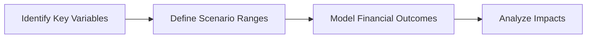

## Introduction
Scenario analysis and stress testing might sound fancy, but at their core, they’re about imagining different possible futures and then asking, “Hey, how would our company fare in each?” In real life, I once worked at a tech startup that suddenly faced a massive spike in raw material costs. Our ability to quickly pivot—and not panic—came from a good old-fashioned scenario analysis we’d done months before. It gave us a roadmap for dealing with rising costs. That’s precisely the kind of value scenario analysis and stress testing aim to bring.  

Within the broader scope of forecasting (see Sections 8.1–8.3 for background on sales forecasting and top-down vs. bottom-up methodologies), scenario analysis and stress testing provide a structured way to explore how companies might perform under multiple “what if?” conditions. Let’s see how these tools help you refine your forecasts and make better strategic decisions.

## Key Concepts in Scenario Analysis
Scenario analysis is basically a broader look at possible ways the future might develop. Typically, you’ll model three scenarios, such as:
• An upside scenario (super optimistic—think unexpected sales booms or favorable market expansions).  
• A base scenario (the “most likely” or “neutral” path).  
• A downside scenario (adverse conditions, such as slowdowns in consumer demand or rising input costs).

By systematically considering these scenarios, you deepen your awareness of how different economic, industry, and company-specific factors may combine to produce widely varying outcomes.

### Scenario Analysis vs. Sensitivity Analysis
Now, you might be thinking, “Didn’t we just talk about sensitivity analysis in Section 8.5?” Good catch. Sensitivity analysis typically tweaks one variable at a time—like interest rates or commodity prices—to see the impact on your bottom line. Scenario analysis, on the other hand, changes multiple variables at once to reflect a cohesive story about how events might unfold. For example, if an economic downturn occurs, you might see lower consumer confidence, lower sales volume, potential deflationary pressures, and tightened credit conditions all at once.

### Steps in Scenario Analysis
Though the process can differ from company to company (and from analyst to analyst), here’s a common structure for building a scenario analysis:



1. Identify Key Variables: These can include sales growth rates, operating costs, price elasticity, competition, and economic indicators like GDP or interest rates.  
2. Define Scenario Ranges: For each variable, specify plausible ranges. The upside case, for example, might have strong GDP growth and robust demand for your company’s products.  
3. Model Financial Outcomes: Craft a pro forma financial statement or cash flow projection under each scenario to see how the changes ripple through costs, revenues, and profit margins.  
4. Analyze Impacts: Compare results, highlight differences, assess how each scenario might affect liquidity, capital structure, and overall viability.

## An Introduction to Stress Testing
Stress testing is like scenario analysis but on steroids. Instead of mild or moderate changes, you’re imagining extreme conditions:
• Severe recessions or global financial crises.  
• Sharp commodity price shocks (think oil spiking from \$60 to \$120 practically overnight).  
• Major supply chain disruptions (recall events like the 2020–2021 global logistics snarl).  
• High-impact regulatory shifts (say, an unexpected ban on a crucial input material).  

Stress tests try to push your assumptions to their limits. The goal is to see if the company can still keep afloat—or at least quickly recover—when most things go “comically wrong.” In some industries, especially banking or insurance, regulatory bodies require periodic stress tests. But stress testing is valuable even for smaller firms since it reveals vulnerabilities that might otherwise lurk under typical forecasting exercises.

## Identifying Key Risk Factors
Before you can proceed with stress testing, it pays to ask: “Which factors pose the greatest threat to survival?” This can differ drastically by industry. For instance:

• A large exporter might be super vulnerable to currency depreciations.  
• A healthcare company might fret about regulatory changes that affect reimbursement rates.  
• A retailer could be extremely sensitive to consumer sentiment.  
• A mining firm might face volatility in commodity prices or even environmental regulations.  

When you layer on the possibility of second-order effects, things get more interesting. A slump in consumer sentiment can lead to lower retail spending, which triggers a wave of store closures, which then further reduces consumer confidence in a negative feedback loop. Stress testing forces you to follow these chains of cause and effect, ensuring your analysis is more than just a single-variable exercise.

## Building a Stress Test
Although stress tests can be large-scale, multi-department initiatives in big corporations, you can outline the basics in a few structured steps:

1. Define Extreme Yet Plausible Scenarios  
   Think about events like a 25% drop in consumer demand, a doubling of interest rates, or a new tax law that hikes corporate taxes by 10%.  

2. Estimate First- and Second-Order Effects  
   If raw material costs rise 50%, you not only see a direct margin squeeze but might also have to reduce marketing or R&D to conserve cash. That leads to long-term brand erosion or missed product cycles—yikes.

3. Model Financial Statements  
   Incorporate these effects into your income statement, balance sheet, and cash flow statements. Your financial model must reflect how each shock hits different line items.  

4. Evaluate Liquidity & Solvency  
   Stress tests don’t just measure near-term hits to profits. They aim to show whether the firm can continue meeting liabilities. For instance, how quickly might you deplete your revolving credit facility if the crisis persists for two years?

5. Draft a Mitigation Strategy  
   If the test results look too scary, that’s actually good news (sort of). It warns you to recalibrate your capital structure, adjust your supply chain, or secure alternative funding before the real shock arrives.

## Scenario Probabilities and Plausible Outcomes
Sometimes, you’ll attach numerical probabilities to each scenario—like 20% chance of a downturn, 60% base case, 20% upside. In other cases, it’s enough to compare scenarios qualitatively. Particularly for stress testing, you might not assign probabilities if the scenario is meant to be a rare and severe “tail event.”  

Either way is fine, provided you communicate the reasoning. In practice, many firms prefer to keep it simple: “Here are three or four possible scenarios. We’re not sure which will hit, but we want to be prepared.”

## Communicating Findings to Stakeholders
I vividly recall a CFO who once said, “A scenario analysis nobody sees is worthless.” She had a point: if leadership doesn’t understand the potential range of outcomes, or if the insights are never shared with capital markets or employees, the analysis might as well be collecting dust in your drawer.  

Effective communication means presenting the scenarios clearly, showing key metrics (profit margin, cash burn rate, liquidity position), and highlighting recommended actions. Some tips:

• Keep the dashboards clean and visual. Tables of numbers are fine, but charts can better illustrate the difference between scenarios.  
• Highlight the “what-now?” factor—spell out how capital allocation, strategic investments, or departmental budgets might change if the downside scenario starts unfolding.  
• Include cross-departmental input. Operations teams can shed light on supply chain contingencies, and risk teams can highlight compliance or credit concerns.

## Adjusting Based on Results
Scenario analysis and stress testing are not a “one-and-done” event. You can use the findings to:

• Rethink capital structure: Maybe you need a bit more cash buffer or a different debt maturity profile.  
• Improve liquidity management: Possibly renegotiate short-term lines of credit or reevaluate your working capital strategy.  
• Strengthen supply chain: In a stress scenario, if your single supplier in Country X goes offline, do you have backups in other countries?  
• Refine strategic initiatives: Sometimes, you’ll prioritize certain R&D projects that appear crucial for an upside scenario that you see as increasingly probable.

## Practical Example of Scenario Analysis with Python
Let’s walk through a straightforward coding snippet to illustrate scenario analysis in action. Suppose you’re analyzing a manufacturing company. We have a base revenue assumption of \$100 million. Let’s define three scenarios—Optimistic, Base, and Pessimistic—and see how revenue and margin might shift.

```python
import numpy as np

scenarios = {
    'Optimistic': {'growth': 0.10, 'margin': 0.40},
    'Base':       {'growth': 0.03, 'margin': 0.35},
    'Pessimistic':{'growth': -0.05,'margin': 0.30}
}

def forecast_revenue(base_revenue, growth_rate):
    return base_revenue * (1 + growth_rate)

base_revenue = 100_000_000

for scenario, assumptions in scenarios.items():
    new_revenue = forecast_revenue(base_revenue, assumptions['growth'])
    margin = assumptions['margin']
    profit = new_revenue * margin
    print(f"{scenario} scenario:")
    print(f"  Revenue: ${new_revenue:,.2f}")
    print(f"  Profit:  ${profit:,.2f}\n")
```

This simple approach exemplifies how easy it is to script out different scenarios once you’ve defined the underlying assumptions. Of course, a full-blown scenario analysis might incorporate more detailed forecasting for expenses, capital expenditures, working capital changes, and financing flows.

## Stress Testing Example: Commodity Price Shock
For a commodity-intensive manufacturer, let’s say we want to simulate a stress test where steel prices surge 60% over a six-month window:

• Baseline steel price: \$500 per metric ton.  
• Stress scenario: \$800 per metric ton.  
• Elasticity of cost: For every 1% steel price increase, your total cost of goods sold (COGS) might jump by 0.2%.  

In the stress scenario, you’d calculate your new COGS, factor in potential changes to your sales volume (since you might raise prices or see margin compression), and see how your working capital is impacted if you need to keep larger steel inventories. This demands a deeper look at second-order impacts like needing bigger credit lines to fund inventory or discounting finished goods if demand slumps.

## Cross-Functional Collaboration
Don’t forget: scenario analysis and stress testing thrive on broad input. A finance team focusing purely on the numbers might overlook operational quirks like specialized labor shortages or compliance changes. Bringing in folks from operations, compliance, HR, and sales often illuminates hidden interdependencies.  

An example: If you run a stress scenario on a 30% drop in customer demand, the HR team might highlight that you would need to downsize staff or renegotiate union agreements. The operations team might note that shutting down a production line would create lead times if demand suddenly rebounds. The synergy of these inputs makes your scenarios more realistic.

## Best Practices and Common Pitfalls
• Best Practices  
  – Update scenarios regularly. The world changes fast. Your analysis should, too.  
  – Balance complexity and clarity. Too many variables can overwhelm; focus on the ones with the biggest potential impact.  
  – Document assumptions thoroughly, so others can track how you arrived at certain outcomes.  

• Pitfalls  
  – Over-optimism in the upside scenario. This can lead to complacency if you treat the downside as “unlikely.”  
  – Not going extreme enough in stress testing. Remember, stress scenarios capture tail risks—don’t be shy about pushing them.  
  – Failing to communicate. A scenario is only valuable if decision-makers see it, engage with it, and shape strategies around it.

## Summary
Scenario analysis guides you through imagining a reasonable range of future outcomes—helpful for everyday decision-making—while stress testing dives into the deep end of unlikely yet severe events. Both protect your organization from being blindsided by changing conditions. Whether you’re a small startup or a multinational corporation, these approaches keep you on your toes, ensuring you’re ready for anything from small market shifts to outright crises.  

If you integrate scenario analysis with the other forecasting techniques we’ve covered, particularly top-down and bottom-up methodologies (Section 8.3), expense and margin projections (Section 8.2), and sensitivity analysis under different macroeconomic conditions (Section 8.5), you’ll be building a robust, holistic view of your company’s future.

## Glossary
• Scenario Analysis: A modeling approach that evaluates the impact of different sets of assumptions or situations.  
• Stress Testing: A form of scenario analysis that examines extreme conditions to test a firm’s resilience.  
• Key Risk Factor: A variable that can significantly influence a company’s financial performance.  
• Downside Scenario: A negative forecast case that tests the repercussions of declining business or market conditions.  
• Upside Scenario: A positive forecast case reflecting strong growth or favorable market shifts.  
• Tail Risk: The risk of rare but severe outcomes or losses beyond typical scenarios.  
• Sensitivity Variable: A specific input (e.g., interest rate, commodity price) whose change is tested for impact on results.  
• Mitigation Strategy: A plan to reduce or control the severity of an identified risk.

## References
• Jorion, Philippe. “Value at Risk: The New Benchmark for Managing Financial Risk.”  
• Taleb, Nassim Nicholas. “The Black Swan.” Random House.  
• CFA Program Curriculum, “Risk Management” topics.  

## Test Your Knowledge: Scenario Analysis & Stress Testing



### Which statement best describes the difference between scenario analysis and sensitivity analysis?

- [ ] They are identical approaches focusing on a single variable at a time.  
- [x] Scenario analysis evaluates the impact of multiple changing variables, while sensitivity analysis focuses on one at a time.  
- [ ] Sensitivity analysis requires building multiple scenarios simultaneously.  
- [ ] Scenario analysis does not account for macroeconomic shifts.  

> **Explanation:** Sensitivity analysis typically tweaks a single input at a time. In contrast, scenario analysis changes several inputs simultaneously to portray different possible futures.

### In the context of stress testing, which situation would best illustrate a severe tail event?

- [ ] A small rise in labor costs.  
- [x] A sudden, sustained 50% drop in consumer demand coupled with a credit freeze.  
- [ ] A moderate increase in raw material prices within the usual range.  
- [ ] Stagnant sales for one quarter.  

> **Explanation:** Stress tests focus on extreme but plausible events, such as a major demand collapse and credit constraints, which significantly threaten a firm’s survival.

### Which key element should be included when communicating scenario analysis results to stakeholders?

- [ ] Only the best-case scenario, to maintain positivity.  
- [ ] Raw data tables without any commentary.  
- [x] Clear visuals highlighting the performance differences under each scenario and recommended actions.  
- [ ] Confidential inputs for internal use only.  

> **Explanation:** Scenario results must be clear, actionable, and visually accessible so that all stakeholders understand potential outcomes and strategies.

### What is the primary benefit of incorporating second-order effects in scenario analysis?

- [ ] It ensures the mathematical model remains simple.  
- [ ] It replaces the need for probability assumptions.  
- [x] It captures how changes in one area (e.g., consumer demand) can trigger further, indirect impacts (e.g., store closures).  
- [ ] It eliminates the need for cross-functional collaboration.  

> **Explanation:** Second-order effects look beyond direct consequences, identifying how an initial shock cascades into other parts of the business ecosystem.

### Which statement accurately describes how a company might adjust its capital structure after conducting a stress test?

- [x] The company may decide to hold more cash or renegotiate debt terms to maintain flexibility.  
- [ ] A strong stress test outcome always implies increasing leverage.  
- [ ] Stress tests rarely influence capital structure decisions.  
- [ ] The company automatically buys back shares after each stress test.  

> **Explanation:** Stress tests often highlight the need for better liquidity or different debt maturities. The firm might aim to increase its financial flexibility under harsh scenarios.

### When assigning probabilities to different scenarios, which approach is correct?

- [ ] Always assign probabilities with precise decimal points.  
- [ ] Assign each scenario a 50% likelihood by default.  
- [x] You can assign probabilities if they help your analysis, but it’s also valid to compare scenarios without explicit probabilities.  
- [ ] Exclude probabilities in scenario analysis at all costs.  

> **Explanation:** Assigning probabilities is a choice. Sometimes it’s helpful, but other times, particularly with extreme stress scenarios, probability assignment can be speculative, so qualitative reviews may suffice.

### How might cross-functional collaboration improve scenario analysis?

- [ ] By limiting inputs to one department.  
- [x] By blending financial data with operational insights, revealing hidden vulnerabilities or interdependencies.  
- [ ] By quickly finalizing scenarios without detailed feedback.  
- [ ] By avoiding any outside opinions during scenario creation.  

> **Explanation:** Involving various departments (finance, operations, HR, compliance, etc.) ensures that different perspectives and data points feed into richer, more realistic scenarios.

### In stress testing, why is it crucial to consider a firm’s capacity to meet liabilities over time rather than focusing solely on net income?

- [ ] Net income always understates the firm’s actual performance.  
- [ ] There are no differences between net income and liquidity metrics.  
- [ ] Short-term liabilities do not matter in extreme events.  
- [x] The ability to continue meeting obligations (liquidity and solvency) is critical for survival, even if net income is temporarily affected.  

> **Explanation:** Surviving a crisis requires the company to remain liquid and meet debt obligations, which is not always captured fully by net income figures.

### Which of the following represents a major pitfall when conducting scenario analysis?

- [ ] Documenting assumptions for each scenario.  
- [ ] Linking scenario outcomes to strategic decisions.  
- [x] Assuming mild changes only and failing to test sufficiently extreme conditions.  
- [ ] Combining internal and external data sources.  

> **Explanation:** A common pitfall is underestimating the severity of adverse conditions, leading to an overly optimistic or incomplete scenario analysis.

### True or False: Stress testing is typically a one-time exercise conducted only during major economic disruptions.

- [x] True  
- [ ] False  

> **Explanation:** While many firms initiate formal stress tests during major disruptions or regulatory reviews, best practices suggest periodic stress testing so that the organization stays prepared for unforeseen shocks at any time.


