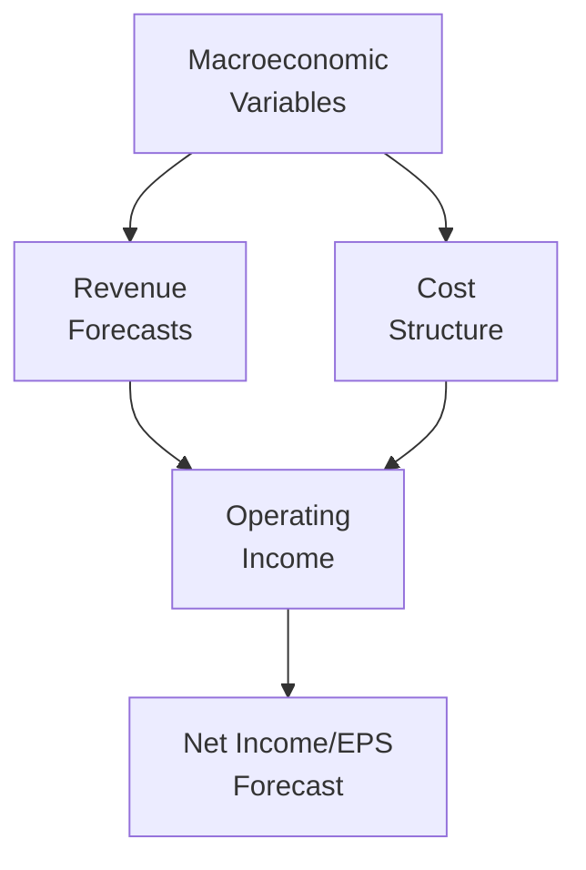

## Introduction and Key Concepts

Sensitivity analysis is one of those techniques you might’ve heard thrown around in finance meetings—along with scenario analysis and stress testing—but it’s often misunderstood or used in a superficial way. In a nutshell, sensitivity analysis looks at how small changes in one input variable, such as interest rates or inflation, can affect a company’s financial outputs (like EPS, net income, or operating margins). By isolating each factor, you see which variables have the greatest impact on your forecasts. This insight can be pretty powerful when deciding where to focus your risk management efforts.

Now, why is that even relevant for a CFA candidate? Well, it shows up in the “Company Analysis—Forecasting” piece of the puzzle. More so, in real-world equity valuation, ignoring sensitivity analysis can lead to nasty surprises. When I started out, I had a manager who once said, “If there’s one number you should always test in your forecast, it’s the interest rate.” And guess what? He was usually right, because changes in interest rates ripple through bond yields, equity discount rates, consumer spending, and more.

## Differences Between Sensitivity and Scenario Analysis

Even though these terms often get used interchangeably, they aren’t the same:

• Sensitivity Analysis  
  – Focuses on one input variable at a time.  
  – Asks the “What if interest rates go up by 100 basis points?” question in isolation.  
  – Useful for pinpointing which variables are most “sensitive” (no pun intended).

• Scenario Analysis  
  – Involves changing multiple variables at once.  
  – Typically structures “best,” “base,” and “worst” cases, or maybe references economic states like recession and expansion.  
  – Provides a more holistic view of how the business (or portfolio) might perform when macro factors move together.

## Why Sensitivity Analysis Matters for Forecasting

You probably know that forecasting isn’t a one-and-done exercise. You can come up with a deliciously precise model for next year’s revenue, but if you have no idea how changes in GDP growth, inflation, or consumer confidence might knock your model off track, you could find yourself well off the mark. Sensitivity analysis helps:

• Reveal critical assumptions.  
• Highlight which variables you need to monitor closely (e.g., the unemployment rate might not matter much if your firm sells luxury goods primarily to high-end consumers).  
• Provide a roadmap for hedging or risk mitigation.  
• Enhance communication with stakeholders—instead of handing them a single forecast, you can say, “And here’s how that forecast changes if inflation ticks up by 50 basis points.”

## Selecting Key Macroeconomic Variables

Let’s consider some usual suspects:

• GDP Growth: When GDP is expanding, consumer and business spending typically rise, boosting corporate revenues. A forecast might assume 2% annual GDP growth. But what if it’s 3% or 1%? This difference can swing your top line substantially.  
• Interest Rates: Borrowing costs, discount rates, and consumer credit usage—these all hinge on interest rates. A business with high leverage or sales reliant on consumer installments might be ultra-sensitive to interest rate hikes.  
• Inflation: Drives up input costs and can force you to pass on higher prices, potentially shrinking demand if it gets out of hand.  
• Unemployment Rate: A rising unemployment rate typically reduces consumer spending and can increase labor market slack, suppressing wages or raising layoffs.  
• Currency Exchange Rates: For global firms, fluctuations in exchange rates can be a biggie, affecting revenues, costs, and net income when translated back into the home currency.

Selecting which variables matter depends on the nature of your company. A domestically focused utility might not care too much about exchange rates but will care intensely about interest rates and regulatory constraints. A global consumer goods company might be laser-focused on GDP growth in different regions or currency fluctuations.

## Building Sensitivity Ranges Using Correlations

One of the biggest mistakes in sensitivity analysis is picking arbitrary increments—like, “We’ll test ±10% changes in sales.” But all changes are not equally likely. That’s where historical data or correlation analysis comes in. By studying how your output has historically reacted to changes in macro variables, you can pick more realistic ranges.

For instance, if data from the last 20 years shows that a 1% hike in interest rates typically reduces your company’s year-over-year sales growth by 0.5%, you can incorporate that relationship into your sensitivity table. This approach ensures that you don’t end up with wild, improbable forecasts or trivial changes that wouldn’t matter anyway.

Here’s a simple correlation-based example. Suppose we have a variable “Sales Growth” historically correlated at -0.4 with “10-year Treasury Rate.” If the 10-year Treasury Rate rises from 2.0% to 3.0%, your sales growth might shift from 5% to around 4.6%:

KaTeX block (optional example):

\Delta \text{Sales Growth} = \rho \times (\Delta R) \times \beta


Where:  
• ρ is the correlation (negative in this case).  
• (ΔR) is the change in interest rates.  
• β is a scaling factor derived from regression analysis.

## Visualizing Sensitivity: A Mermaid Diagram

The following diagram illustrates, at a high level, how changes in macro variables can feed into forecasting models. Each input influences a specific part of your income statement, which then affects net income or EPS.



From the diagram, you can see:

• Macroeconomic variables (like GDP growth, inflation, and interest rates) feed into both revenue forecasts and cost structure assumptions.  
• Revenue projections and cost projections combine at the operating income line.  
• Changes in operating income ultimately roll through to net income (and EPS), which you might use for valuation or performance metrics.

## Constructing a Sensitivity Table

A robust but straightforward approach is to build a data table that shows how a change in one macro assumption (column headings) affects your forecast. For example, with interest rates, you might consider increments of ±50 basis points (bps), ±100 bps, and ±150 bps. Then, you list the resulting net income or EPS under each assumption.

Imagine a scenario where your base interest rate assumption is 3%. The table might look like this:

| Interest Rate (%) | Net Income (Base = $100M) | EPS (Base = $1.50) |
|-------------------|---------------------------|--------------------|
| 1.5               | $115M                     | $1.73             |
| 2.0               | $110M                     | $1.66             |
| 3.0 (Base)        | $100M                     | $1.50             |
| 4.0               | $90M                      | $1.35             |
| 4.5               | $85M                      | $1.28             |

Here, you see how net income (and by extension EPS) drops as interest rates climb. These changes might reflect higher borrowing costs for the firm, lower consumer demand for credit-driven purchases, or a higher discount rate for investments the company is making. Keep in mind that these numbers are purely illustrative.

## How to Apply Sensitivity Findings

Let’s say your analysis shows net income is especially sensitive to interest rates—far more so than to inflation or GDP growth rate changes. This tells you:

• You may want to hedge interest rate exposure, perhaps through interest rate swaps or by locking in fixed-rate financing.  
• You could keep a closer eye on Federal Reserve policy announcements or bond market movements to adjust your assumptions more frequently.  
• Because interest rates overshadow other variables, you might place more emphasis on controlling leverage or raising capital when rates are low.

On the other hand, if sensitivity analysis says inflation is your biggest worry (maybe you run a heavy manufacturing process), you’d structure your vendor contracts to lock in prices or keep more raw material inventory on hand when inflation threats loom. 

## Integrating Sensitivity with Scenario Analysis

Even though sensitivity analysis and scenario analysis are distinct, they complement each other. For example, you could blend them:

1. Perform your standard scenario analysis:  
   • Scenario A: High GDP growth, rising inflation, higher interest rates.  
   • Scenario B: Stagnant economy, flat inflation, stable interest rates.  
   • Scenario C: Low GDP growth, potential deflation, near-zero interest rates.

2. Within each scenario, perform sensitivity analysis on the key variable that’s most uncertain in that scenario. Maybe in Scenario A, interest rates are the big swing factor, whereas in Scenario C, you might tweak your inflation assumptions heavily. This multi-layer approach provides a holistic view and helps ensure you’re not blindsided by a single focus.

## Continuous Recalibration

Economic conditions can evolve rapidly—just think about how quickly interest rate expectations changed during certain global crises or how inflation soared in some years. It’s essential to revisit your sensitivity ranges periodically. The correlations you used a couple of years ago might not hold up anymore if new structural or cyclical shifts have taken place.

Treat your sensitivity analysis as a living, breathing piece of your forecasting process rather than a static report. If you sense that the Federal Reserve’s policy path is going to deviate from your baseline, or that GDP forecasts from the IMF or major banks have changed, update your analysis. Doing so can help you avoid stale assumptions.

## Example: A Quick Python Snippet

If you’re into scripting, here’s a quick snippet demonstrating how you could automate sensitivity for interest rates and GDP growth. It’s simplistic, but it illustrates how you might loop through multiple values:

```python
import numpy as np

base_interest_rate = 0.03
base_gdp_growth = 0.02
base_net_income = 100_000_000

# For example, a 1% interest rate increase might reduce net income by 5%
interest_rate_sensitivity = 0.05
gdp_growth_sensitivity = 0.03

interest_rates = np.arange(0.01, 0.06, 0.01)  # 1% to 5%
gdp_growths = np.arange(0.00, 0.06, 0.01)    # 0% to 5%

results = []
for ir in interest_rates:
    for gdp in gdp_growths:
        # Changes relative to base
        ir_diff = ir - base_interest_rate
        gdp_diff = gdp - base_gdp_growth
        # Calculate effect on net income
        net_income = base_net_income
        net_income *= (1 - (ir_diff / 0.01) * interest_rate_sensitivity)  # Simplistic approach
        net_income *= (1 + (gdp_diff / 0.01) * gdp_growth_sensitivity)
        results.append((ir, gdp, net_income))

for r in results[:5]:
    print(f"Interest Rate: {r[0]*100:.2f}%, GDP Growth: {r[1]*100:.2f}%, Net Income: ${r[2]:.2f}")
```

This simplistic approach might not replace a robust financial model, but it helps illustrate how you can systematically explore multiple macro assumptions.

## Best Practices and Pitfalls

• Use Realistic Sensitivity Ranges: Overly large or small shifts might be meaningless if they’re improbable.  
• Don’t Ignore Less Obvious Variables: Commodity prices, regulatory changes, or even consumer confidence can be critical for certain industries.  
• Document Assumptions Clearly: Everyone on your team should know how you derived those ±1% or ±2% changes.  
• Review Correlations Regularly: Relationships between macro variables and your financial results can change over time.  
• Combine Tools: Sensitivity sets the stage, while scenario analysis provides a full symphony of changes.  
• Avoid Analysis Paralysis: Testing every single variable can be counterproductive. Focus on the “big ticket” items that meaningfully affect your bottom line.

## Exam Tips for CFA Candidates

From an exam perspective, be prepared to:  
• Calculate or interpret the impact of a given change in a macroeconomic variable on net income or EPS.  
• Discuss how to identify and select “key” variables in sensitivity analysis.  
• Contrast sensitivity analysis with scenario analysis in discussion or short-answer questions.  
• Identify data sources (like FRED, IMF, S&P Global, and Moody’s Analytics) for macroeconomic forecasts.  
• Recognize that you might have to provide or interpret a data table filled with multiple increments of an input variable.

As you’re practicing, keep thinking: “Which variables matter most for this kind of company or industry?” That’s precisely what the exam might test—your understanding of the interplay between macro factors and company fundamentals.

## References for Further Exploration

• Federal Reserve Economic Data (FRED): https://fred.stlouisfed.org  
• CFA Program Curriculum—Corporate Finance and Economics sections  
• S&P Global and Moody’s Analytics for macroeconomic forecasts  
• International Monetary Fund (IMF) World Economic Outlook

## Test Your Knowledge: Sensitivity Analysis Under Different Macroeconomic Scenarios



### Which of the following best describes sensitivity analysis?
- [x] Evaluating how changes in a single input variable affect a particular outcome
- [ ] Developing multiple cases by changing multiple input variables at once
- [ ] Testing a range of possible macroeconomic outcomes to address multiple risk factors
- [ ] A method that only applies to forecasting foreign exchange rates

> **Explanation:** Sensitivity analysis looks at changing one variable at a time to see its effect on the output, while scenario analysis involves shifting multiple variables.

### When performing sensitivity analysis on interest rates, which of the following steps is most appropriate?
- [x] Determine realistic rate increments by examining historical interest rate fluctuations
- [ ] Use arbitrary step intervals of 5% for interest rates
- [ ] Assume interest rates remain constant over the forecast period
- [ ] Exclude the impact of borrowing costs on net income calculations

> **Explanation:** A key best practice is to use historically informed intervals that reflect typical or possible fluctuations rather than random or overly large increments.

### In a sensitivity table for net income, interest rates might be varied in increments of ±50 bps. The term “bps” stands for:
- [ ] Breakpoint Signals
- [x] Basis Points
- [ ] Borrowing Percentage Shifts
- [ ] Bond Price Surcharges

> **Explanation:** “bps” stands for basis points, where one basis point equals 0.01%.

### Sensitivity analysis is likely to be LEAST helpful in:
- [ ] Identifying the single most impactful macroeconomic variable
- [x] Determining how multiple macroeconomic inputs interact simultaneously
- [ ] Estimating the potential decrease in net income if interest rates rise
- [ ] Isolating the effect of inflation on the cost of goods sold

> **Explanation:** Sensitivity analysis handles individual variables. When you want to see how multiple variables shift in tandem, you do scenario analysis.

### How can correlations be used to improve the accuracy of sensitivity analysis?
- [x] By providing historical context for how a change in one variable typically affects others
- [ ] By narrowing the scenario analysis to only two variables
- [ ] By ensuring all variables shift by the same percentage
- [ ] Correlations are irrelevant in sensitivity analysis

> **Explanation:** Correlations reveal historical relationships. This insight helps determine realistic ranges and more precise adjustments for sensitivity exercises.

### You observe that for every 1% increase in the unemployment rate, your company’s revenue declines by about 2%. Which best practice is this an example of?
- [x] Using historical correlations as a guide
- [ ] Excluding second-order macroeconomic effects
- [ ] Modeling interest rate changes in isolation
- [ ] Employing only scenario analysis techniques

> **Explanation:** This is an example of how historical data (a correlation or regression result) aids in creating realistic sensitivity estimates.

### When should you revisit and update your sensitivity analysis assumptions?
- [x] Whenever there is a significant shift in macroeconomic conditions or forecasts
- [ ] Every five years
- [ ] Only if the central bank changes the interest rate by more than 200 bps
- [ ] Never, since assumptions remain valid over long periods

> **Explanation:** Macroeconomic conditions can change rapidly. Recalibrating your assumptions is crucial to maintaining forecast accuracy over time.

### A company that sells most of its products overseas is extremely sensitive to:
- [ ] Local consumer trends in domestic markets only
- [ ] Unemployment rates in a single city
- [ ] Housing market changes in one specific state
- [x] Currency exchange rate fluctuations

> **Explanation:** A business with a global revenue base is particularly exposed to changes in exchange rates, so it’s a key variable to test in sensitivity analysis.

### Which of the following is a valid reason for combining scenario analysis with sensitivity analysis?
- [ ] They are actually identical approaches
- [x] Scenario analysis shows the combined effect of multiple changes, while sensitivity drills down on individual variables
- [ ] Neither method works on macroeconomic data
- [ ] Both methods require ignoring historical correlations

> **Explanation:** Scenario and sensitivity analyses offer different perspectives. Scenario analysis addresses multiple changes at once, whereas sensitivity isolates variables.

### True or False: Sensitivity analysis never factors in inflation changes.
- [ ] True
- [x] False

> **Explanation:** Inflation can be a critical variable in sensitivity analysis, especially for companies with large cost structures that rely on raw materials.


