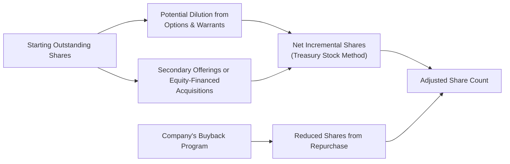

## Overview

Forecasting equity dilution and share repurchases is critical for anyone analyzing a company's future earnings potential and valuation metrics. If you’ve ever been blindsided by a sudden secondary offering—trust me, I know the feeling!—you’ll appreciate how changes in share count can dramatically shift earnings per share (EPS) forecasts and, ultimately, a firm’s share price. In the context of CFA Level III curriculum—where portfolio-level decision-making and nuanced modeling are central—understanding the interplay among stock option exercises, share repurchase strategies, and the treasury stock method can help you build more robust forecasts.

Below, we’ll walk through the core concepts of forecasting equity dilution and repurchases, highlight the effect on per-share metrics, and illustrate how to apply these insights in real-world valuation scenarios. We’ll also dip into regulatory constraints, capital allocation frameworks, and best practices to consider when building your models.

## Key Concepts

### What Is Equity Dilution?

Equity dilution happens when a company issues new shares, reducing existing shareholders’ percentage ownership. Examples include:

• New share offerings (secondary offerings).  
• Stock option exercises, often from employee incentive programs.  
• Acquisitions in which the acquirer issues shares to finance the transaction.

The net effect: The same pie (company value) is sliced into more pieces, typically lowering ownership percentage (and possibly EPS) for current shareholders. Dilution can be minimal or significant depending on the magnitude of new shares issued.

### Share Repurchases as a Counterbalance

On the flip side, companies may choose to buy back their own shares—perhaps because they think the stock is undervalued or wish to optimize their capital structure. Share repurchases reduce the number of outstanding shares, which can offset or partially offset dilution from broader equity programs. Repurchases also affect per-share metrics; everything else equal, fewer outstanding shares typically boost EPS and can potentially elevate certain valuation ratios.

### Regulatory and Tax Considerations

In some jurisdictions, share repurchases might face regulatory hurdles. For instance, there can be black-out periods where insiders can't execute buybacks, or there may be strict guidelines on the volume of shares a company can repurchase. Tax laws can also influence whether companies prefer distributing excess cash via repurchases instead of dividends. As a portfolio manager or equity analyst in a global context, be mindful that these rules vary widely by region (and sometimes even by exchange).

## Modeling Equity Dilution

### Stock Options and the Treasury Stock Method

One standard approach to forecasting dilution from stock options or warrants is the treasury stock method (TSM). In short, the TSM assumes:

1. In-the-money options or warrants are exercised at their strike price.  
2. The company uses the proceeds from those exercises to repurchase shares at the current market price (treasury shares).  
3. Net incremental shares are what remain after this hypothetical buyback.

Mathematically, it can be expressed as:


\text{Incremental shares} = \text{Number of options/warrants} \times \frac{\text{(Market price – Strike price)}}{\text{Market price}}


So your diluted share count might look like:


\text{Diluted shares} = \text{Basic weighted average shares} + \text{Incremental shares from in-the-money options/warrants}


Of course, the real world is rarely so neat. Maybe not all employees exercise their options simultaneously. Vesting schedules, insider trading windows, and corporate share buyback programs often complicate things. Nevertheless, the TSM gives you a recognized baseline for forecasting and is typically used in diluted EPS calculations under both IFRS and U.S. GAAP.

### Vesting Schedules and Share Price Assumptions

When building your pro forma financial statements, consider how quickly options are likely to vest. Are they front-loaded or is there a cliff vest at the end of three years? Are the options significantly in the money, or are they near the strike price (which might delay exercise)? It often helps to layer in some scenario analysis:

• Bullish scenario: The share price soars, increasing the likelihood of exercise.  
• Bearish scenario: The share price languishes, making option exercise less attractive.  

In each scenario, you’d estimate the incremental shares added to your forecast. Sometimes you might do a sensitivity table to see how EPS changes with different share price assumptions.

## Forecasting Share Repurchases

### Capital Allocation and Management Guidance

Why do companies repurchase shares? Among the most common reasons:

• They have excess cash with limited high-ROI investment opportunities.  
• They believe the stock is undervalued.  
• They aim to offset dilution from stock-based compensation plans.  

Forecasting repurchases often hinges on a firm’s historical track record and the signals management sends. Maybe management has publicly committed to a buyback plan of $100 million per quarter. Or the firm’s financial policy might say they’ll return 50% of free cash flow to shareholders once debt metrics reach a certain threshold.

### Market Conditions and Timing

Markets can throw curveballs: interest rate changes, credit availability, and regulatory interventions can force a company to pause or accelerate its repurchase strategy. A distressed market might temporarily halt repurchase programs in favor of strengthening the balance sheet. Alternatively, in a low-interest-rate environment, companies might issue cheap debt to finance repurchases. Be on the lookout for these pivot points when building your forecast.

## Impact on Valuation Metrics

### Earnings Per Share (EPS)

EPS is often the yardstick for measuring financial performance. Changes in share count directly affect EPS forecasts:

EPS = (Net income) ÷ (Adjusted weighted average shares outstanding)

If your model overlooks equity dilution or incorrectly assumes share repurchases, you might end up with unrealistically high or low EPS. Overestimating EPS can lead to a too-rosy price target, while underestimating it can cause you to be overly cautious.

### Book Value per Share (BVPS)

Book value per share offers another lens through which to view repurchases or new share issuance. A giant new issuance might push BVPS upward if new equity capital arrives above current book value. Conversely, repurchases at a price higher than book value might reduce BVPS. Subtle changes to BVPS can be relevant to certain valuation approaches, especially in financial sectors where book value matters a lot (e.g., banking).

### Voting Power and Ownership Structure

If you’re analyzing a company with dual-class shares or significant insider ownership, new share issuance can shift voting dynamics. Likewise, share repurchases in a company with concentrated ownership may inadvertently boost certain shareholders’ influence if they choose not to tender their shares. While the direct effect on your quantitative model might be small, it can have corporate governance implications (e.g., activism risks, proxy battles).

## Putting It All Together in a Diagram

Here’s a simple diagram illustrating how new share issuance and share repurchases interplay with the adjusted share count in your forecasts:

Reading left to right:

1. Start with your currently outstanding shares.  
2. Layer in possible dilution from options/warrants or new shares from secondary offerings.  
3. Determine net incremental shares using the treasury stock method (or your preferred approach).  
4. Subtract shares if the company is actively repurchasing stock.  
5. End up with your adjusted share count.

## Practical Example

Imagine a company, TechNova, that has 100 million shares outstanding and 10 million stock options outstanding at a strike price of $25. Today, TechNova’s market price is $40. Also assume the company has announced a $100 million share buyback program. Let’s do a quick run-through:

1. Options Dilution (Treasury Stock Method)  
   - In-the-money amount = $40 (market) – $25 (strike) = $15.  
   - Proceeds if all 10 million options are exercised = $25 × 10 million = $250 million.  
   - Shares that can be repurchased with $250 million at $40 each = 6.25 million.  
   - Net new shares = 10 million – 6.25 million = 3.75 million.  
   - Adjusted share count = 100 million + 3.75 million = 103.75 million (if all options are exercised simultaneously).

2. Share Repurchase  
   - A $100 million buyback at $40 per share buys 2.5 million shares.  
   - Adjusted share count post-buyback = 103.75 million – 2.5 million = 101.25 million.

This simplified approach lumps a bunch of assumptions into a single calculation. In reality, you might vary the timing or partial exercise of options, and the repurchase might happen over an entire fiscal year. But the logic above is exactly how you’d forecast in a model to see EPS in one scenario vs. another.

## Best Practices for Forecasting

• Use scenario analysis to account for different share price paths and varying repurchase strategies.  
• Keep an eye on management’s explicit buyback guidance (e.g., open authorizations, announced buyback budgets).  
• Monitor vesting schedules and option expirations, as option exercises often cluster near certain time points.  
• Factor in potential changes triggered by large M&A deals involving equity financing.  
• Periodically revisit your share count assumptions. Management intentions can shift quickly, especially when the macro environment changes.  

## Common Pitfalls and Challenges

• Overlooking out-of-the-money options that might become in the money if share prices rise significantly.  
• Underestimating share-based compensation. Some firms ramp up equity-based incentives over time, introducing more dilution than expected.  
• Failing to factor in black-out periods or regulatory constraints limiting share repurchases.  
• Forgetting about interplay with corporate governance—voting power can shift in ways that affect strategic decisions.  

## Exam Relevance and Final Tips

At the CFA Level III exam, you might encounter scenario-based questions involving:

• Pro forma EPS calculations under different assumptions about buybacks and new share issuance.  
• Valuation assessment where you have to adjust the share count in a discounted cash flow (DCF) or relative multiples analysis.  
• Corporate governance discussions about how changing ownership structures might influence board decisions and strategies.

Time management is crucial. If you see a multi-part essay requiring a step-by-step calculation for diluted EPS, keep your approach organized:

1. Identify total basic shares.  
2. Calculate incremental shares from in-the-money options or warrants (treasury stock method).  
3. Subtract anticipated share repurchases if relevant.  
4. Arrive at your final share count for per-share metrics.

Being able to articulate the *why* behind each assumption (share price growth, vesting timelines, management’s capital allocation plans) often wins you critical points in constructed-response questions.

## References and Additional Resources

• Damodaran, Aswath. “Damodaran on Valuation.”  
• CFA Program Curriculum, “Financial Reporting and Analysis” and “Equity Investments” sections.  
• SEC Filings (Form 10-K & 10-Q) for detailed data on share-based compensation and repurchase activity.  
• IFRS 2 (Share-based Payment) and ASC 718 (Stock Compensation under U.S. GAAP) — for details on accounting for stock options.  

---

## Forecasting Equity Dilution and Share Repurchases: 10 Practice Questions for CFA Level III



### Question 1

Which of the following best describes equity dilution?

- [ ] An increase in each shareholder’s ownership percentage caused by buybacks.
- [x] A decrease in each shareholder’s ownership percentage due to new shares issued.
- [ ] A temporary reduction in share price limited to short sellers.
- [ ] A scenario in which dividends increase faster than EPS.

> **Explanation:** Equity dilution occurs when a company issues additional shares, reducing existing shareholders' proportional ownership.

### Question 2

Company ABC has 20 million options outstanding with a strike price of $30. If the current share price is $50, what is the in-the-money amount per option?

- [ ] $0
- [x] $20
- [ ] $30
- [ ] $50

> **Explanation:** The in-the-money amount is market price minus strike price ($50 – $30 = $20).

### Question 3

Under the treasury stock method, net new shares for options are best calculated by:

- [ ] Total options multiplied by the strike price, divided by the market price.
- [x] Total options multiplied by (market price – strike price) ÷ market price.
- [ ] Basic shares minus total options outstanding.
- [ ] Book value per share multiplied by the cost of repurchase.

> **Explanation:** Under the treasury stock method, the net new shares from in-the-money options = (Market price – Strike price) / Market price × Number of options.

### Question 4

When a company repurchases its own shares at a price above book value per share, which of the following is most likely to occur?

- [ ] Book value per share will always remain unchanged.
- [ ] Book value per share increases, because net income is unaffected.
- [ ] No impact on share count.
- [x] Book value per share can decrease, as the buyback reduces shareholders’ equity disproportionately.

> **Explanation:** Repurchasing shares at a price above the firm’s current book value per share lowers overall book value per share.

### Question 5

Which factor is LEAST relevant when forecasting share repurchases?

- [x] Seasonal demand for the company’s product.
- [ ] Management’s capital allocation guidance.
- [ ] The company’s free cash flow levels.
- [ ] The availability and cost of debt financing.

> **Explanation:** While seasonal demand might affect revenues, it typically does not directly drive share repurchase policies. Management guidance, free cash flow, and borrowing costs are more critical inputs.

### Question 6

Which scenario would most likely delay or reduce a company’s share repurchase activity?

- [x] A sudden credit tightening and higher interest rates.
- [ ] A bullish market with lower trading volumes.
- [ ] A vesting schedule of employee stock options.
- [ ] High insider share ownership.

> **Explanation:** If borrowing becomes more expensive, companies may choose to preserve cash or use cash differently, delaying share repurchases.

### Question 7

A firm’s total outstanding shares are 150 million. In one scenario, all in-the-money options, representing 5 million shares of potential dilution, are exercised. The firm also repurchases 3 million shares. What is the adjusted share count?

- [ ] 148 million
- [ ] 150 million
- [x] 152 million
- [ ] 158 million

> **Explanation:** Start with 150 million shares, add 5 million from new option exercises, then subtract 3 million for the share repurchase. Net = 152 million.

### Question 8

Which statement best captures a potential pitfall in forecasting equity dilution?

- [ ] Overestimating the effect of out-of-the-money options during a bear market.
- [x] Underestimating the potential for options to become in the money if share price rises.
- [ ] Assuming repurchases at the same share price in all scenarios.
- [ ] Including both diluted and basic EPS in the same forecast model.

> **Explanation:** A common pitfall is failing to recognize that out-of-the-money options can quickly enter the money if the stock price rises sharply, increasing future dilution.

### Question 9

Why might a firm conduct a secondary offering instead of a debt issue?

- [ ] To avoid diluting existing shareholders.
- [x] To strengthen the balance sheet without incurring additional debt obligations.
- [ ] To increase EPS immediately.
- [ ] Because the share price is below book value.

> **Explanation:** A secondary offering raises equity capital, which can bolster the balance sheet by reducing reliance on debt, even though it dilutes existing shareholders.

### Question 10

Forecasting equity dilution is primarily important for long-term valuation because it affects future EPS calculations.

- [x] True
- [ ] False

> **Explanation:** True. The timing and magnitude of share issuance or option exercises will directly affect per-share statistics such as EPS, which are crucial for valuation models and investment decisions.


