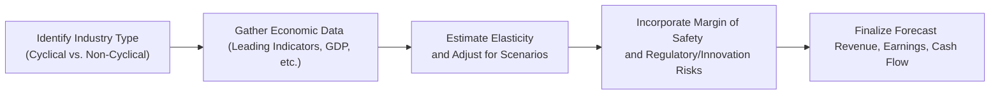

## Overview and Importance

Forecasting patterns in corporate revenues, earnings, and cash flows is challenging enough on its own, but things get a bit trickier when we bring in the concept of economic cycles. Some firms flourish when the economy expands and then struggle in a recessionary environment. Others seem to chug along steadily, relatively unfazed by macroeconomic turbulence. In practice, it’s crucial to understand these differences—because if you mix up a cyclical firm with a non-cyclical one in your valuation or growth assumptions, well, you might be in for a surprise when the next downturn hits.

In this section, we’ll look closely at the differences between cyclical and non-cyclical (often called “defensive”) companies, explore the unique factors that influence their performance, and discuss practical forecasting techniques. We’ll also share a few personal anecdotes and real-world examples, so you can see how these principles come to life.

## Distinguishing Cyclical and Non-Cyclical Firms

Cyclical firms typically ride the waves of the broader economy. Think automotive manufacturing, construction, steel producers, or high-end consumer discretionary goods—these sectors usually see a nice revenue bump when consumers and businesses have extra cash on hand. But in a recession, demand for new cars, houses, or other discretionary purchases can drop sharply.

Non-cyclical firms, on the other hand, sell goods and services that people tend to buy regardless of the economic climate—like food, household products, or utilities. This is why consumer staples, utilities, and healthcare are labeled as “defensive.” Their revenues and margins stay relatively stable (though no industry is completely immune to economic factors).

Imagine two companies, both starting with annual sales of $100 million:
• A cyclical automaker’s revenues might surge to $130 million in a boom but tumble to $70 million in a bust.  
• A non-cyclical consumer staples firm might grow modestly to $105 million in a boom and only drop to $95 million in a slump.  

This illustration highlights how economic swings tend to have a more pronounced effect on cyclical firms.

## Economic Indicators and Industry Sensitivities

### Leading Indicators for Cyclical Firms
For businesses whose performance hinges on where we are in the economic cycle, it’s vital to track leading (and sometimes lagging) indicators that can give you a heads-up about shifts in demand. Common metrics include:

• Housing starts (pointing to future construction activity)  
• Business confidence and consumer sentiment surveys  
• Inventory levels and manufacturing indexes (e.g., PMI)  
• Interest rates and credit availability  

When these data points start flashing either green or red, cyclical sectors often respond faster than others. In other words, if you see a drop in housing starts, it may indicate a slowdown in the construction sector, which, in turn, can ripple out to manufacturers of building materials and related industries.

### Defensive Indicators for Non-Cyclical Firms
Non-cyclical industries typically exhibit smaller fluctuations in response to macroeconomic changes. Still, that doesn’t mean you can ignore broader trends. A sudden surge in inflation, shifting regulations, or supply chain disruptions could impact even the most defensive sectors. Regulatory changes in healthcare, for example, might significantly impact revenues, especially if reimbursement rates are affected. Utilities might face new environmental compliance costs that cut into margins. So forecasting isn’t a matter of ignoring macro data entirely—it’s about calibrating your models to reflect a narrower range of outcomes.

## Adjusting Forecast Models

### Sales, Earnings, and Cash Flow Projections
The starting point for forecasting is typically revenue. For cyclical firms, you might build scenarios tied to different stages of the business cycle. During expansions, you can assume higher revenue growth rates—maybe referencing historical expansions for a sense of scale—and incorporate a margin of safety (we’ll get to that concept soon) so you don’t get carried away by optimism.

When the economy is at or nearing a peak, I’ve personally seen some analysts almost forget that a recession can happen. They forecast year-on-year double-digit revenue growth without acknowledging that cyclical downturns have historically hit the business every few years. You know what happens next: a downturn arrives, the firm’s actual revenue falls short, and estimates end up badly off-target. So always keep a balanced approach.

For non-cyclical businesses, the forecasting approach is often more stable from year to year. You might focus on incremental changes in market share or minor shifts in consumer behavior. If you’re looking at consumer staples, changes in population growth or subtle shifts in consumer preferences (e.g., an emphasis on healthier foods) can matter more than the macroeconomic cycle.

### Margins and Cost Structures
Cyclical firms also frequently deal with variable cost structures that rise quickly in expansion and drop (sometimes not quickly enough!) in contractions. Go one step further by tracking how quickly the firm can adjust labor costs or capital expenditure. If they face fixed cost pressure in a downturn, that can amplify the earnings contraction. For non-cyclical firms, overhead might be more stable, but you still need to watch out for regulatory changes, commodity prices for inputs, or technology shifts.

### Demand Elasticity and Consumer Confidence
In cyclical sectors, demand elasticity is typically high. If disposable incomes shrink, consumers cut back. That’s why new car or high-end furniture sales often take a big hit in a recession. For non-cyclical firms, demand elasticity is lower: necessities like basic household products or essential medications see fewer consumption cuts.

Consider modeling elasticity by making revenue a function of disposable income growth. For instance:

(1)  

\text{Revenue}_{\text{Cyclical}} = \text{Base Revenue} \times \bigl( 1 + \alpha \times \Delta \text{Disposable Income}\bigr)


Where ≈ is the elasticity factor. A higher α implies a larger swing in revenue whenever disposable income changes.

## Timing the Peaks and Troughs

### Looking to History
Nothing beats checking how a business performed in prior cycles. This is where peak-to-trough analysis comes in handy. Examine historical patterns:  
• How far did revenue (and margins) fall during the last recession?  
• How quickly did earnings recover when the economy picked up?  

Let’s say a cyclical construction company’s revenue historically dropped by an average of 30% from peak to trough. If your base case forecast for the next potential downturn only assumes a 5% decline, that might be too optimistic.

### Leading vs. Lagging Cycles
Have you ever noticed that some industries peak before the economy as a whole, while others peak after? For instance, homebuilding often leads the overall cycle (downturns in homebuilding can signal an oncoming recession). Meanwhile, corporate tech spending might lag behind changes in general economic conditions. Understanding where a particular industry sits in the chain of events helps you forecast with more precision.

## Margin of Safety

### Being Conservative in Booms
One practical tip: build a buffer into your forecasts if a cyclical sector has enjoyed a prolonged expansion. You don’t want to appear like Cassandra, always prophesying doom, but in cyclical analysis, it’s better to be an “optimistic realist.” Suppose you’re forecasting a cyclical airline during an economic boom. You might incorporate a cautious assumption about how a mild recession (or even higher fuel costs) could impact passenger demand in the next few years.

### Continual Scenario Updates
That old adage “Hope for the best, prepare for the worst” applies here. Cyclical industries can turn on a dime, so keep track of updated macro data. At times, you’ll need to pivot your forecast in real time, especially if new economic reports or corporate guidance begins hinting at a slowdown.

## Non-Cyclical Doesn’t Mean Risk-Free

### Disruptive Innovations
Even though consumer staples, utilities, and healthcare have relatively steady demand, disruptions still happen. Technology can reshape entire industries—just look at how telemedicine platforms have impacted certain areas of healthcare. Forecasting should capture potential game changers. Maybe a consumer staples firm that’s slow to adopt e-commerce channels might risk losing market share to nimbler competitors.

### Regulatory Changes
Industries like utilities or healthcare operate under strict regulations that can shift unpredictably. A new policy or tariff can reduce profitability or require expensive capital investments. So, while you don’t expect a big dip in demand, you must keep an eye out for how external compliance costs or tariffs might affect your forecasts.

## Practical Example of Forecasting Assumptions

Let’s try a simple numeric illustration comparing two hypothetical companies—Cyclico Auto and Defenso Staples:

1. Macroeconomic Growth Assumption:  
   • Base-case annual GDP growth: 2%.  
   • Upside scenario: 4%.  
   • Downside scenario: 0%.  

2. Company Sales Elasticity:  
   • Cyclico Auto: Revenue elasticity = 2.5× GDP growth.  
   • Defenso Staples: Revenue elasticity = 0.5× GDP growth.

3. Revenue Projections (in $ millions, starting point $100m each):  

   | Scenario    | GDP Growth | Cyclico Auto | Defenso Staples |
   |------------ |----------- |------------- |---------------- |
   | Base (2%)   | 2.0%       | 100 × (1 + 2.5×0.02) = 105.0  | 100 × (1 + 0.5×0.02) = 101.0 |
   | Upside (4%) | 4.0%       | 100 × (1 + 2.5×0.04) = 110.0  | 100 × (1 + 0.5×0.04) = 102.0 |
   | Downside(0%)| 0.0%       | 100 × (1 + 2.5×0.00) = 100.0  | 100 × (1 + 0.5×0.00) = 100.0 |

Notice how sensitive Cyclico Auto is to different GDP growth rates, while Defenso Staples remains much more stable.

## Visual Overview of Forecasting Steps

## Exam Relevance

From a CFA exam perspective (whether you’re at Level I or beyond), expect to see scenario-based questions examining how you’d adjust forecasts for a cyclical vs. a non-cyclical firm. You could be asked to identify the correct revenue growth assumptions under various economic scenarios, interpret changes in leading indicators, or calculate the impact of changing disposable incomes on demand for discretionary products.

Forecasting cyclical industries is also where ethics can sneak in—analysts must avoid selectively optimistic assumptions that bolster a “preferred” result. The CFA Institute Code and Standards call for diligence, reasonable basis, and independence of thought, which means you need to maintain discipline and transparency about your approach.

## Practical Tips for the Exam

• Correlate the economic scenario with cyclical vs. non-cyclical assumptions—avoid applying the same growth assumptions to all industries.  
• Pay attention to margin of safety in cyclical forecasts, particularly if a question points to “deeply optimistic” or “peak economic conditions.”  
• Practice scenario analysis—a staple in exam questions that ask you to evaluate potential business outcomes under varying economic assumptions.  
• Don’t forget that “non-cyclical” does not equal “risk-free.” Always consider unique factors like regulatory or technological disruption.  

## References for Further Study

- CFA Program Curriculum, “Equity Investments” and “Economics” sections on business cycles.  
- Stowe, John D., and Jacques R. Gagné. “Capital Budgeting and Cyclical Businesses.”  
- The National Bureau of Economic Research (NBER): http://www.nber.org  
- Official CFA Institute publications on Ethical and Professional Standards.  
- For additional macro insights, consider global organizations like the OECD and IMF.

## Key Takeaways

• Cyclical industries are strongly influenced by broader economic upturns and downturns.  
• Non-cyclical industries are less sensitive to macro swings but still face unique risks (e.g., regulation, innovation).  
• Demand elasticity, disposable income metrics, and leading indicators play critical roles in forecasting cyclical revenue.  
• During expansions, incorporate a margin of safety for cyclical firms to avoid overly optimistic targets.  
• Analyzing historical peak-to-trough performance is an excellent starting point for anticipating future volatility.  
• Even for non-cyclical firms, maintain vigilance regarding potential regulatory and technological disruptions.  

-----

## Test Your Knowledge: Forecasting Cyclical vs. Non-Cyclical Firms



### Which of the following industries is most likely considered cyclical?

- [ ] Utilities providing electricity to households
- [ ] A grocery chain specializing in staple foods
- [x] A car manufacturer producing luxury vehicles
- [ ] A pharmacy chain selling prescription medications

> **Explanation:** Luxury automotive sales tend to strongly depend on economic conditions, with consumers cutting back on such discretionary purchases during recessions.

### What does the term “peak-to-trough” refer to?

- [ ] The lowest and highest share prices in a single trading day
- [ ] A statistical method for measuring standard deviation
- [x] The top and bottom points of an economic or business performance cycle
- [ ] An inventory management system using reorder points

> **Explanation:** Peak-to-trough describes the highest and lowest points of a firm’s performance during the course of an economic cycle.

### When forecasting cyclical firm revenues, which of the following adjustments is most appropriate during economic expansions?

- [x] Incorporating a larger margin of safety to account for potential reversals
- [ ] Projecting exponential growth without any downside scenarios
- [ ] Using a zero-bound approach to cost structure
- [ ] Eliminating capital expenditures entirely

> **Explanation:** An additional margin of safety is prudent in cyclical industries, especially when the economy is booming and the risk of a future downturn rises.

### If a company’s product demand is highly sensitive to changes in disposable income, it likely has:

- [ ] Low demand elasticity
- [x] High demand elasticity
- [ ] Price inelastic, stable demand
- [ ] No price sensitivity

> **Explanation:** A product with high demand elasticity sees larger fluctuations in demand as disposable income changes.

### Which economic indicator is commonly considered a leading indicator for construction-related industries?

- [ ] Inflation rate
- [ ] Unemployment rate
- [x] Housing starts
- [ ] Historical corporate bond yields

> **Explanation:** Housing starts can signal upcoming trends in the construction sector. If housing starts decline, construction activity often follows.

### Which of the following best describes a non-cyclical (defensive) industry?

- [x] An industry offering goods/services that people need irrespective of economic conditions
- [ ] An industry that thrives only when interest rates are high
- [ ] An industry that relies primarily on consumer confidence for growth
- [ ] An industry where revenues sharply drop during recessions

> **Explanation:** Defensive industries—like utilities or consumer staples—are characterized by stable demand regardless of economic cycles.

### Which statement about non-cyclical firms is correct?

- [x] They still face risks such as regulatory changes and technological disruption
- [ ] They never see profit declines
- [ ] They are immune to any economic fluctuations
- [ ] Their stocks have the highest returns in a bull market

> **Explanation:** Non-cyclical or defensive companies do see less revenue volatility, but remain exposed to other risks, including new regulations or industry-specific disruptions.

### A firm forecasts using scenario analysis. In its upside scenario, it expects real GDP growth of 5%. If the cyclical revenue elasticity is 2.0×, how much would revenue grow if the firm’s current sales are $100 million?

- [ ] $102 million
- [x] $110 million
- [ ] $105 million
- [ ] $125 million

> **Explanation:** Assuming no base growth besides GDP impact, revenue could rise by (5% × 2) = 10%, leading to $100 million × 1.10 = $110 million.

### Which of the following is a primary reason to differentiate cyclical from non-cyclical firms during equity analysis?

- [ ] To ensure all industries use the same forecasting models
- [ ] To reduce the need for historical analysis
- [ ] To disregard macroeconomic conditions altogether
- [x] To properly adjust revenue and earnings forecasts for varying economic sensitivities

> **Explanation:** Cyclical and non-cyclical firms have distinct demand and risk patterns, which must be accounted for during forecasts.

### True or False: A utility company offering electricity finds its revenues change drastically with each interest rate fluctuation.

- [ ] True
- [x] False

> **Explanation:** Utilities are generally less sensitive to minor interest rate changes because demand for electricity is fairly stable, making them more defensive and non-cyclical.


