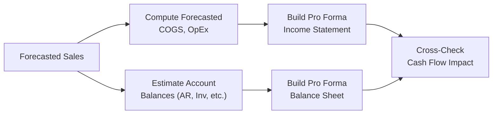

## Introduction
Have you ever tried to predict a company’s next set of financial statements and felt unsure where to begin? Well, one tried-and-true method that many analysts lean on—especially when time is short—is the percent-of-sales forecasting approach. It's straightforward and can be surprisingly powerful, but it’s hardly a magic wand for all forecasting problems. In this section, we’ll walk through the nuts and bolts of the method, tie it to real-world scenarios, and offer best practices to avoid the usual pitfalls.

There's a small anecdote I always recall: in my early analyst days, I was asked to whip up full financials for a rapidly growing e-commerce company. I was short on time, so I leaned heavily on the percent-of-sales approach. I found that while it gave us a quick snapshot of potential future performance, we discovered later that the marketing budget didn't actually scale the same way as sales—because they decided to invest heavily in influencer partnerships. That taught me the importance of regularly double-checking assumptions.

## Foundational Principles of the Percent-of-Sales Method
Percent-of-sales forecasting is really about linking a company’s financial statement items—like cost of goods sold (COGS), operating expenses, and working capital schedules—to one central driver: sales. Here’s why it works:

• Many costs naturally vary with sales: Think raw materials or packaging costs, which often scale more or less directly with how many units are sold.  
• Certain balance sheet items—like accounts receivable and inventory—also track sales, because higher sales usually create more receivables and require more inventory to meet customer demand.  
• Capital investments can sometimes be projected as a fixed proportion of sales, especially in industries where capacity expansions are fairly uniform and predictable.  

In practice, you look back at historical or industry benchmarks to figure out the average percentage each account typically represents relative to sales. Then you apply those percentages to your sales forecast. Voilà—you get a pro forma (i.e., projected) income statement and balance sheet.

Whether you're helping a small startup or building a sophisticated model at a multinational corporation, the logic often remains the same: forecast sales first and anchor many other line items to that figure.

## Key Components of the Approach
Before we jump into an example or “how to,” let’s break down the main components you’re likely to apply percent-of-sales to:

• Cost of Goods Sold (COGS): This is one of the most common places to start. COGS has a direct relationship with sales, as it reflects the direct costs associated with producing goods or services.  
• Operating Expenses: Certain SG&A (selling, general, and administrative) expenses can scale with sales (like sales commissions). Others, like rent, tend to be more fixed.  
• Working Capital Items: Accounts receivable, inventory, and accounts payable often grow in line with sales activity.  
• Capital Expenditures (CapEx): In some businesses, CapEx lags behind sales, but in others it’s directly proportional to anticipated growth. If you know the company is hitting a capacity ceiling, your CapEx might need a sharper upward revision.  
• Debt and Financing Costs: These might be partially tied to sales if the firm has a history of raising debt proportional to expansions. However, financing can also be more complex, depending on capital structure decisions.

## Step-by-Step Implementation

### 1. Estimate Sales
It all kicks off with a robust sales forecast. If you need a refresher, you can look back at Section 8.1 (Principles and Approaches to Sales Forecasting), where we discuss how to project sales using top-down market analysis or bottom-up product analysis.

Suppose you anticipate sales growth of 10% for next year based on market research, prior growth trends, and competitor analysis. Let’s denote your base-year sales as S₀. Then your forecasted sales (S₁) is:

$$
S_{1} = S_{0} \times (1 + 0.10)
$$

### 2. Determine Historical Ratios
Next, you’ll calculate historical ratios for each item as a percentage of sales. For instance, if the company historically reports COGS at 65% of sales, you note that figure.  

Use caution here—that 65% might not hold if the company is planning a dynamite new production strategy that lowers manufacturing costs or if raw material prices are climbing. Adjust if you have reason to believe there will be a deviation from past patterns.

### 3. Adjust for Known Changes
Now you refine these historical ratios based on any upcoming business decisions or external factors. For example:

• A new marketing campaign might significantly increase Marketing Expense as a percent of sales—at least initially.  
• If the company is nearing production capacity, it might have to invest in new facilities, and overhead costs might jump.  
• Technological updates could reduce costs, creating an economy of scale.

### 4. Build the Pro Forma Income Statement
Let’s start constructing a simple pro forma income statement. Using KaTeX notation, you might structure the forecast as:

$$
\text{Forecasted line item} = \left(\frac{\text{Historical line item}}{\text{Historical sales}}\right) \times \text{Forecasted sales}
$$

For illustration, let’s say your base-year data (in millions) is:  
• Sales (S₀) = \$100  
• COGS = \$65 (which is 65% of sales)  
• Operating Expenses (OpEx) = \$20 (which is 20% of sales)  
• Net Income = \$10 (10% of sales, simplified)  

If you forecast next year’s sales at \$110 million (S₁ = \$100 × 1.10), then you might forecast:  
• COGS = 65% × \$110 = \$71.5  
• OpEx = 20% × \$110 = \$22.0  
• Forecasted Net Income could be around \$11 million (10% × \$110), although you’ll refine this once interest and taxes are updated.

### 5. Build the Pro Forma Balance Sheet
Balance sheets follow a similar logic but might require more nuance:

• Accounts Receivable: If historically it’s 15% of sales and you’re not changing credit policies, use 15% of your new forecasted sales.  
• Inventory: If it has hovered around 10% of sales but you anticipate a shift in product mix, you might either keep the 10% or adjust up to reflect new product lines.  
• Accounts Payable: Often expressed relative to COGS or to total expenses.  
• Fixed Assets: If you’re below capacity, scaling them proportionately might suffice. If you’re at or near full capacity, you’ll likely need to plug in higher CapEx (and thus a bigger jump in net fixed assets).

### 6. Check Consistency Across Financial Statements
Hang on—don’t just trust the results as soon as you punch in your formulas. If your model shows a massive spike in sales but doesn’t properly reflect a matching increase in Accounts Receivable or Inventory, you’ll have some internal inconsistencies.

Look at your projected statements holistically—Income Statement, Balance Sheet, and Cash Flow Statement should be aligned. For instance, if Accounts Receivable jumps due to higher sales, that should reduce near-term operating cash flow unless your terms with customers change.

Below is a simple flowchart illustrating how the major statements and line items connect in percent-of-sales forecasting:

## Potential Pitfalls and How to Address Them

### Over-Reliance on Historical Averages
One of the biggest mistakes is blindly relying on old data. Historical averages might be the easiest to grab, but if the company has restructured, changed its product mix, or launched into a new region, those historical percentages get less useful. Keep an eye out for strategic shifts.

### Ignoring Step Changes in Costs
If the firm is near capacity, overhead costs or depreciation might jump once new production lines are built. If you keep everything pegged at the same ratio to sales, you can end up underestimating big expansions.

### Failing to Capture Economies of Scale
On the flip side, if the company has significant economies of scale, certain expense categories may grow more slowly than sales. You might see COGS or SG&A expense ratios decline over time. Missing this factor can lead to overstating expenses.

### Inadequate Sensitivity Analysis
What if sales come in 20% under your forecast because the market’s weaker than expected? It’s wise to test a few alternative scenarios. That’s where Chapter 8.4 (Scenario Analysis and Stress Testing) and 8.5 (Sensitivity Analysis) come into play.

### Mismatch Between Balance Sheet Figures and Cash Flow
All changes in working capital have a direct impact on operating cash flow. If Accounts Receivable or Inventory balloons because of higher sales, you need to incorporate that into your cash flow statement.  

## Real-World Example
Let’s imagine a mid-sized electronics manufacturing firm, TekNov8, that historically maintains these relationships:

• Sales (current year): \$200 million  
• COGS: 60% of sales = \$120 million  
• SG&A: 25% of sales = \$50 million  
• Accounts Receivable: 18% of sales  
• Inventory: 12% of sales  

Now, TekNov8 is expanding to a new distribution channel. They project next year’s sales at \$240 million, which is a 20% uplift. They plan to hire more staff for marketing but also expect improved manufacturing efficiency. So they decide:  
• COGS ratio declines slightly from 60% to 58%.  
• SG&A ratio increases from 25% to 28%.  
• Accounts Receivable remains at 18%.  
• Inventory ratio might go up to 13% due to new product lines requiring more specialized components.  

Their pro forma line items become:
• COGS = 58% × \$240 million = \$139.2 million  
• SG&A = 28% × \$240 million = \$67.2 million  
• Accounts Receivable = 18% × \$240 million = \$43.2 million  
• Inventory = 13% × \$240 million = \$31.2 million  

And from there, you build out a full pro forma income statement, balance sheet, and eventually a pro forma statement of cash flows. This quick example shows how small percentage changes can significantly alter the bottom line.

## Best Practices in Reassessing Key Assumptions
1. Monitor Strategic Shifts: If new markets, new technology, or acquisitions are in play, update your ratios.  
2. Revisit Macroeconomic Indicators: Each quarter or year, check if inflation, commodity prices, or interest rates are shifting the cost base.  
3. Collaborate with Operational Teams: Sometimes finance folks are siloed. Ask operational managers about capacity, pricing changes, and cyclical patterns.  
4. Use Multi-Period Averages: Instead of a single-year ratio, especially if prior years were volatile.  
5. Analyze Competitors and Industry Benchmarks: External data can offer perspective—maybe you’re missing out on a known shift in the industry cost structure.

## Conclusion
The percent-of-sales approach is an elegant, versatile method that helps analysts quickly build pro forma statements. But be mindful: the simpler the tool, the more it requires constant rechecking of assumptions. In real life, some line items just won’t move in lockstep with sales. The best practice is to combine this method with deeper insight from your team’s knowledge, scenario analysis, and thorough cross-checks against the firm’s strategic direction and capacity constraints.

It’s a bit like painting with broad strokes first and then refining the details. You’ll get a decent big-picture forecast quickly, and then you can fine-tune it to capture the nuances. Used well, percent-of-sales forecasting gives you a head start on more sophisticated valuations, capital allocation decisions, and scenario planning.

## References
• CFA Program Curriculum, “Financial Analysis Techniques”  
• Palepu, Krishna G., et al. “Business Analysis and Valuation: Using Financial Statements.”  
• Articles in The Journal of Corporate Accounting & Finance on budgeting best practices

## Test Your Knowledge: The Percent-of-Sales Forecasting Approach



### Which of the following best describes the percent-of-sales method?
- [x] A technique where financial statement items are forecasted by applying a historical or industry-average ratio to projected sales.
- [ ] A method of forecasting solely based on government GDP data.
- [ ] A tool used exclusively for long-term capital budgeting.
- [ ] A technique for valuing intangible assets using discounted cash flows.

> **Explanation:** The percent-of-sales method identifies a ratio of each line item to sales, then uses that ratio to project the item based on future estimated sales.

### What is a key advantage of using the percent-of-sales method?
- [ ] It captures the effects of major strategic shifts without adjustments.
- [x] It offers a straightforward, time-efficient way to develop pro forma statements.
- [ ] It predicts tax changes with perfect accuracy.
- [ ] It requires minimal understanding of historical data.

> **Explanation:** Its simplicity and speed make the method appealing. However, you must adjust assumptions for significant corporate events.

### If a company is near full capacity, which statement is most accurate regarding its percent-of-sales forecast?
- [ ] The percent-of-sales approach will be more reliable because capacity expansion does not affect overhead costs.
- [ ] The company should decrease its COGS ratio to improve forecasted net income.
- [x] The company may need to substantially adjust overhead costs from historical percentages.
- [ ] The method becomes invalid and should be abandoned entirely.

> **Explanation:** If a company is near full capacity, overhead or fixed costs may rise sharply once new capital expenditures are required.

### An electronics retailer historically has a 45% gross margin (i.e., 55% COGS as a percentage of sales). If projected sales are $200 million, what is the expected COGS using the percent-of-sales method?
- [ ] $90 million
- [x] $110 million
- [ ] $45 million
- [ ] $200 million

> **Explanation:** 55% of $200 million = $110 million in forecasted COGS.

### Which line item is least likely to be projected as a strict percentage of sales under the percent-of-sales method?
- [x] Depreciation expense on recently acquired unique machinery.
- [ ] COGS for direct materials.
- [ ] SG&A expenses for a sales-driven marketing campaign.
- [ ] Accounts receivable.

> **Explanation:** Some depreciation expenses are fixed or heavily dependent on specific capital acquisitions rather than fluctuating closely with sales levels.  

### Why might a company’s accounts receivable forecast as a percentage of sales suddenly change?
- [x] Because credit policies or customer payment patterns shift.
- [ ] Because the CFO wants to simplify the forecasting method.
- [ ] Because the production process undergoes automation.
- [ ] Because the company’s share price changes.

> **Explanation:** Changes in credit terms or collection practices affect the ratio of receivables to sales.

### Which of the following best addresses the risk that historical ratios may not remain relevant?
- [ ] Perform no adjustments and assume past results reliably predict future.
- [ ] Exclude overhead costs from the forecast.
- [x] Use scenario analysis or sensitivity analysis to reflect possible changes.
- [ ] Apply the percent-of-sales method only in downturns.

> **Explanation:** Scenario or sensitivity analysis allows the forecaster to test various outcomes when historical relationships might break down.

### Which of these factors typically requires adjusting historically derived overhead expense ratios?
- [x] Economies of scale that reduce variable cost per unit as production rises.
- [ ] A stable operational environment with no backlog.
- [ ] Successive years of identical sales growth.
- [ ] Consistent debt ratios over five years.

> **Explanation:** Economies of scale can shift how overhead costs scale with sales—often resulting in lower costs as a percentage of revenue.

### In percent-of-sales forecasting, a significant increase in forecasted sales is likely to do which of the following?
- [x] Increase both inventory and receivables, reducing near-term operating cash flow.
- [ ] Decrease inventory because of economies of scale.
- [ ] Have no impact on working capital requirements.
- [ ] Automatically decrease the company’s overhead costs.

> **Explanation:** Higher projected sales generally drive working capital items (inventory, receivables) upward, which can impact cash flow.

### The percent-of-sales method is best described as:
- [x] True
- [ ] False

> **Explanation:** True. The percent-of-sales method is indeed a systematic and widely used approach to formulating pro forma financial statements, although it requires adjustments for potential capacity constraints, strategic changes, and economies of scale.


