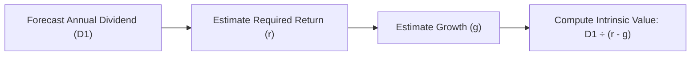
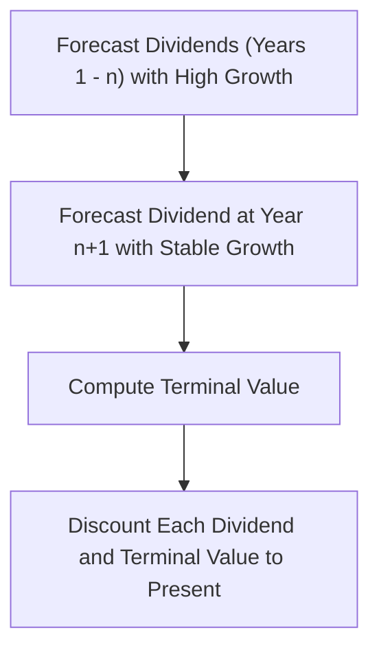
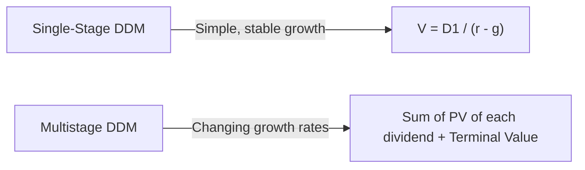

## Introduction and Overview

Dividend Discount Models (DDMs) hold a special place in equity valuation because, at their core, they’re beautifully intuitive: the value of a share of stock is simply the sum of all the future dividends you expect to receive, discounted to today’s dollars (or euros, yen, etc.). Sounds pretty elegant, right? In practice, though, applying DDMs can feel a bit more complicated—particularly if you’re juggling changing growth rates, uncertain discount rates, and real-world market conditions.

But I remember the first time I heard about the Dividend Discount Model, I thought: “Wait—so all I need is the future dividends, my required return, and a growth rate? Easy.” Then I found out about multiple valuation stages, terminal value assumptions, and how the model can go haywire if your growth rate is too close to your required rate of return. That’s when I realized: “Ah, it’s not always that simple.”

Still, whether you’re studying for the CFA Level I exam or looking to ground your equity valuations in time-tested principles, the DDM forms a bedrock. So let’s start with the basics—Single-Stage (often known as the Gordon Growth Model) and then progress to Multistage models. We’ll get into key formulas, essential assumptions, pitfalls, and methods to incorporate real-world constraints.

## The Single-Stage (Gordon Growth) Model

### Core Concept

The Single-Stage Dividend Discount Model (DDM), commonly referred to as the Gordon Growth Model, assumes that a firm’s dividends grow at a constant, unchanging rate forever. I know that can sound a bit unrealistic, but many mature companies with stable operations—think large utility companies—can come close to this scenario, at least over extended periods.

Mathematically, the Single-Stage DDM states:


V_0 = \frac{D_1}{r - g}


where:  
• \\(V_0\\) = Current intrinsic value of the stock.  
• \\(D_1\\) = Expected dividend at the end of the first year.  
• \\(r\\) = Required rate of return (often derived from CAPM or other risk/return models).  
• \\(g\\) = Expected constant growth rate of dividends.

### Key Assumptions

• Dividends grow at a constant rate \\(g\\), indefinitely.  
• \\(r > g\\), since if \\(g \geq r\\), the model breaks down or implies an infinite valuation.  
• The company’s payout policy remains consistent and does not drastically shift over time.  

To illustrate how this model flows, here’s a small Mermaid diagram:

And that’s it. On the surface, it’s straightforward: one formula, three main variables. But real-life complexities—like unpredictable dividend policies or big changes in capital structure—mean you need to approach the Gordon Growth Model with caution.

### Practical Example of the Single-Stage Model

Let’s do a quick numeric example, to make this more concrete.

Suppose a utility firm’s current annual dividend is \$2.00 per share. Management and analysts forecast that dividends will increase by 3% every year. Meanwhile, you decide your required rate of return, \\(r\\), is 7%. 

• The dividend one year from now, \\(D_1\\), will be:

D_1 = 2.00 \times (1 + 0.03) = 2.06.

• Therefore, using Gordon Growth:

V_0 = \frac{2.06}{0.07 - 0.03} = \frac{2.06}{0.04} = 51.50.


So, if you trust these assumptions (a big “if,” right?), you might conclude the stock is worth \$51.50 per share. If it’s trading at \$45, maybe you see value; if it’s trading at \$60, you might pass. 

### Potential Pitfalls and Limitations

1. Growth Rate Close to Required Return  
   If \\(g\\) is 6.5% and \\(r\\) is 7%, you wind up dividing by something that’s just 0.5%. That can create a massive valuation, and you have to ask yourself: “Does it really make sense for the company’s growth to be so high forever?” Possibly not.

2. Dividend Policy Changes  
   Some firms aren’t consistent with their dividend payouts. They might decide to invest heavily in growth, cutting dividends, or they might do buybacks. This can effectively disrupt the “steady growth rate” assumption.

3. Irrelevance to Non-Dividend Payers  
   Let’s be honest: many fast-growing tech companies either pay no dividend or pay a negligible amount. The single-stage model sort of breaks down there. We might come back to them with something like a multistage approach… or maybe a different valuation metric entirely.

4. Macroeconomic Shifts  
   If an economic downturn forces companies to freeze or reduce dividends, that constant growth rate you baked in might suddenly be out the window.

You can see how even a simple formula requires a thoughtful approach. But let’s not throw the baby out with the bathwater. For stable, mature companies with proven track records of dividend growth, the single-stage model can offer a good ballpark estimate—and a quick one. Just remember it’s built on quite a few assumptions that might shift out from under you.

## The Multistage Dividend Discount Model

### When to Use Multistage Models

Let’s say we have a firm that’s just emerging from a big technology transition. Maybe for the next few years, management says they’ll grow dividends at 12%—which is pretty high. But eventually, the advantage will narrow, competition will come in, and you expect the growth rate to settle at 4%. 

The single-stage approach doesn’t handle that well, because it demands a constant \\(g\\). To handle more realistic scenarios, we turn to the Multistage Dividend Discount Model (often called the “Two-Stage” or “Three-Stage” DDM, though you can theoretically have as many stages as you want).

### Structure and Formula

In a two-stage model, we typically break up the firm’s life into two periods:
1. High-growth period (Stage 1): Dividends are forecast to grow at a higher rate, \\(g_1\\), for a certain number of years (often noted as \\(n\\) years).  
2. Long-term stable growth period (Stage 2): After year \\(n\\), dividends grow at a more sustainable, constant rate, \\(g_2\\).

At the end of the high-growth period, we often compute a “terminal value,” which represents the present value of all dividends from Year \\(n+1\\) onward, assuming the stable growth rate. Then, we discount the entire stream of dividends—including the terminal value—back to the present.

Symbolically, for a two-stage model:


V_0 = \sum_{t=1}^{n} \frac{D_t}{(1+r)^t} + \frac{TV_n}{(1+r)^n},


where:
- \\(D_t\\) are the dividends in each of the next \\(n\\) years, growing at higher rate \\(g_1\\).
- \\(TV_n\\) is the terminal value at the end of year \\(n\\), often estimated by applying the Gordon Growth Model at that point:


TV_n = \frac{D_{n+1}}{(r - g_2)}.


Below is a quick Mermaid diagram illustrating the valuation process conceptually:

### Practical Example of a Two-Stage DDM

Let’s say you have a company that just launched a blockbuster product. You estimate a 10% dividend growth for the next three years. After that, you believe competition will catch up, and the growth will normalize to 4% indefinitely. The stock’s current dividend is \$1.00, and your required rate of return is 8%.

1. Forecast Dividends in High-Growth Phase  
   - \\(D_1 = 1.00 \times (1 + 0.10) = 1.10\\)  
   - \\(D_2 = 1.10 \times (1 + 0.10) = 1.21\\)  
   - \\(D_3 = 1.21 \times (1 + 0.10) = 1.331\\)

2. Forecast Dividend in Stable Growth (Year 4 onward)  
   Now from Year 4 onward, growth is 4%. So:
   - \\(D_4 = 1.331 \times (1 + 0.04) = 1.38524\\) (just for context when we do the terminal value).

3. Compute Terminal Value at the End of Year 3  
   Using the Gordon Growth formula for the stable period:
   
   TV_3 = \frac{D_4}{r - g_2} 
          = \frac{1.38524}{0.08 - 0.04} 
          = \frac{1.38524}{0.04} 
          = 34.631.
   

4. Discount All Cash Flows to the Present  
   Now discount each of the first three dividends plus the terminal value (which is added to the Year 3 dividend stream) back to \\(t=0\\) at the 8% required return:

   
   V_0 = \frac{1.10}{1.08} + \frac{1.21}{(1.08)^2} + \frac{1.331 + 34.631}{(1.08)^3}.
   
   - \\(PV(D_1) = \frac{1.10}{1.08} \approx 1.0185.\\)
   - \\(PV(D_2) = \frac{1.21}{(1.08)^2} \approx \frac{1.21}{1.1664} \approx 1.037.\\)
   - \\(PV(D_3 + TV_3) = \frac{1.331 + 34.631}{(1.08)^3} \approx \frac{35.962}{1.2597} \approx 28.55.\\)

   Summing them up:
   
   V_0 \approx 1.0185 + 1.037 + 28.55 \approx 30.6055.
   

So you’d estimate the firm is worth about \$30.61 per share based on your two-stage dividend assumptions. 

### Insights on Multistage Models

• You can break the high-growth period into multiple mini-stages if you believe the growth path will taper more gradually (a three-stage model, for instance).  
• The terminal value can dwarf the sum of the earlier phases. You’ll notice that 34.631 (the terminal value) contributed almost the entire chunk of the final discounted figure. Always pay attention to your terminal value assumptions.  
• The discount rate \\(r\\) and the stable growth rate \\(g_2\\) must remain realistic (i.e., \\(g_2\\) less than \\(r\\)).

## Best Practices and Common Pitfalls

### 1. Estimating Growth Rates  
• High-growth vs. stable growth: applying the wrong growth rate to the stable phase is a classic mistake. If you assume 8% growth forever, but your required return is 9%, be prepared for a massive inflated value.  
• Macroeconomic ties: consider inflation, real GDP growth, and industry conditions. If the economy is only growing at 2% real, can your company sustain a 12% dividend growth for decades?

### 2. Estimating the Discount Rate  
• CAPM Example: 
  
  r = R_f + \beta (R_m - R_f)
  
  Where \\(R_f\\) = risk-free rate, \\(R_m\\) = market return, and \\(\beta\\) is the company’s sensitivity to the market. Different analysts might apply different betas. Watch out for this variation.  
• Other Risk Premiums: Some prefer the bond yield plus risk premium approach. The idea is to take the yield on the firm’s long-term debt and add a premium for equity risk.  

### 3. Potential COVID/Global Conflict Twist  
• Once the world discovered how quickly external shocks can slam supply chains and business demand, it became clear that even stable dividend payers might have “blips.” Build in scenario analysis—maybe a moderate scenario, a worse scenario, and a best-case scenario.  

### 4. Double Counting or Inconsistent Forecasts  
• If a firm is repurchasing shares aggressively, that may change how quickly dividends might grow on a per-share basis. Make sure your assumptions about share count, payout ratio, and earnings growth are all consistent.

## Interrelationships with Other Valuation Concepts

Dividend Discount Models are a major cornerstone, but they’re not the only game in town. You might recall from other parts of Chapter 9 that you can value equity using Free Cash Flow to Equity (FCFE) or by comparing Price Multiples (like P/E or EV/EBITDA). In practice, analysts compare these approaches. If, say, your DDM-based valuation yields \$50 but your P/E-based approach and FCFE approach both suggest \$40, that discrepancy could be a red flag—or a buying opportunity, depending on your assumptions.

## Diagram: Single-Stage vs. Multistage at a Glance

For a little extra clarity, here’s a side-by-side snapshot:

Both hinge on discounting dividends but differ in their assumptions about growth. Single-stage is straightforward but risky if growth is not truly stable. Multistage is more realistic for growth that eventually tapers—though it’s more complex.

## Exam Relevance and Tips

• The CFA Level I exam often tests your understanding of the single-stage (Gordon Growth) model. You might be asked to plug in the numbers, interpret the result, or identify incorrect uses of the model (like \\(g > r\\)).  
• You can also face questions on two-stage or even three-stage DDM. They’ll typically give you growth rates in different phases, plus a discount rate. You’ll need to carefully forecast dividends, compute a terminal value, and discount everything back.  
• Time Management: You might see item sets or short answer questions requiring swift, methodical calculations. Practice your arithmetic so you don’t get bogged down.  
• Clear Step-by-Step: They might present tricky details, like a partial-year dividend. Pay attention: sometimes you see “the next dividend will be paid in exactly one year,” or “the last dividend was just paid,” which can change the formula for \\(D_1\\).

## Real-World Anecdote

A friend of mine once used a single-stage DDM on a high-growth biotech startup—big no-no. The firm had never paid dividends but was planning to start in three years. He assumed a near-constant growth rate based on super-optimistic projections. The result was a borderline ridiculous valuation way above the market price. After the share price later dropped and the firm cut its future dividend outlook, he realized that the single-stage approach was ill-suited. The key lesson: pick the right model for the right scenario.

## Conclusion

Dividend Discount Models—both single-stage and multistage—remain bedrock tools for anyone analyzing equities from a dividend perspective. The single-stage (Gordon Growth) approach is elegantly simple but only relevant when dividends grow at a stable rate that’s comfortably below the required return. Multistage models address the realistic idea that growth rates evolve over a company’s life cycle.

Meanwhile, remember that your model is only as good as your inputs—particularly your growth projections and required rate of return. A small tweak in growth can shift valuations dramatically. These models offer a framework, not a crystal ball. For the CFA exam, focus on mastering the formulas, understanding which model is appropriate when, and practicing enough so you can do the calculations (and interpret the results) confidently under time pressure.

## References

• CFA Institute Program Curriculum, Equity Valuation Readings.  
• Pinto, Jerald E. (CFA). “Equity Asset Valuation.” Wiley.  
• Damodaran, Aswath. “Investment Valuation.” NYU Stern: http://pages.stern.nyu.edu/~adamodar/  

--------------------------------------------------------------------------------

## Test Your Knowledge: Dividend Discount Models Essentials



### Which key assumption underpins the Single-Stage (Gordon Growth) Dividend Discount Model?

- [x] Dividends grow at a constant rate indefinitely.
- [ ] Dividends are paid only once per year.
- [ ] The company’s initial growth rate is negative.
- [ ] Management buys back shares every quarter.

> **Explanation:** The Gordon Growth Model assumes a perpetually constant dividend growth rate.

### In a two-stage DDM, what is the most common reason for using more than one growth rate?

- [x] Companies often experience high initial growth that eventually slows to a steady rate.
- [ ] Regulatory constraints force multiple growth rates to be used.
- [ ] Investors prefer complexity in their valuation models.
- [ ] It’s a requirement under IFRS accounting norms.

> **Explanation:** Real-world businesses rarely grow at a constant rate for all time, so they’re often modeled with multiple phases of growth (e.g., high-growth, then stable).

### According to the Gordon Growth Model, how is the intrinsic stock value computed?

- [x] D₁ ÷ (r – g)
- [ ] (Earnings – Dividends) × (Payout Ratio)
- [ ] (FCFF ÷ WACC) – Net Debt
- [ ] EV ÷ EBITDA

> **Explanation:** The key Gordon Growth Model formula is the next-year dividend divided by the difference between the required return and dividend growth rate.

### If a company’s dividend growth rate (g) is very close to its required rate of return (r), what is the primary concern?

- [x] The valuation may be inflated or extremely sensitive to small input changes.
- [ ] It’s guaranteed to create an undervalued scenario.
- [ ] The model automatically reverts to the two-stage approach.
- [ ] The cost of equity is then undefined.

> **Explanation:** When g ≈ r, the denominator (r – g) becomes very small, which shoots the valuation to an unrealistically high or unstable level.

### A key difference between single-stage and two-stage DDM setups is:

- [x] The assumption about how dividend growth rates behave over time.
- [ ] The discount rate used in the model.
- [x] The explicit calculation of a terminal value after a high-growth phase.
- [ ] The approach to intangible asset valuation.

> **Explanation:** Two-stage DDM uses different growth rates for different periods and explicitly computes a terminal value at the end of the high-growth period.

### Suppose you model a stock with a two-stage DDM and find that the computed terminal value is more than twice the sum of all the discounted dividends in the first stage. What does this likely indicate?

- [x] The terminal value assumption significantly drives valuation; the stable phase warrants extra scrutiny.
- [ ] The model is incorrectly specified and must be recalculated.
- [ ] The company is generating zero dividends initially.
- [ ] The discount rate must be lowered to balance out the terminal value.

> **Explanation:** It’s common for the terminal value to make up a large chunk of the total estimated value, implying that minor changes in stable-phase growth or discount rate will have a big impact on results.

### Which of the following is true about multistage DDMs with a high-growth period followed by a mature, stable growth period?

- [x] They can more accurately capture a firm’s dividend trajectory across different life cycle stages.
- [ ] They are simpler to apply than the single-stage DDM.
- [x] They often rely on forecasting a terminal value after the high-growth phase.
- [ ] They assume dividends remain constant during the high-growth period.

> **Explanation:** Multistage DDMs reflect a firm’s realistic progression from rapid growth to stable growth. They are more complex but more accurate in many real-world scenarios.

### Which factor typically justifies a higher “g” in the early stage of a multistage DDM?

- [x] Significant competitive advantage and expansion opportunities.
- [ ] Increased cost of debt.
- [ ] Economic recession that reduces overall demand.
- [ ] Mandatory share buybacks.

> **Explanation:** High-growth stages often reflect the company’s temporary competitive advantage, unique product innovation, or market expansion before it levels off.

### In a multistage DDM, the “terminal value” at the end of the forecast period is usually calculated using what formula?

- [x] D(n+1) ÷ (r – g₂)
- [ ] CAPM ÷ Beta
- [ ] (Earnings – Dividends) × 1.05
- [ ] FCFE × (1 + g) ÷ (r – g)

> **Explanation:** The terminal value is frequently found using a Gordon Growth assumption at the end of the last explicitly forecasted year.

### True or False: If a firm does not currently pay dividends but promises to start after three years, it cannot be valued using a multistage DDM.

- [x] True
- [ ] False

> **Explanation:** While the statement might sound sensible at first, the truth is a bit nuanced. Usually, for a firm not paying dividends now, you might anticipate the timing of future payouts and apply a multistage model once dividends begin. However, if you’re strictly interpreting “no current dividends,” a pure DDM structure may not apply until dividends are actually forecast to start. (Practically, you could forecast zero dividends for the first few stages but can lead to model complexities.)


