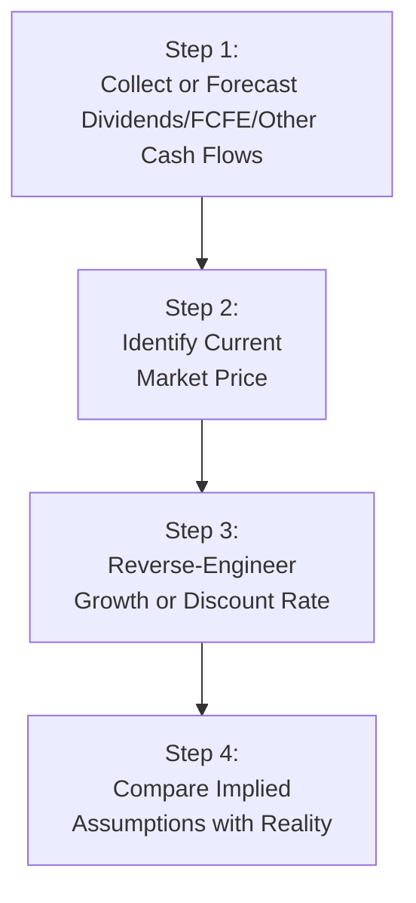

## Introduction

I still remember the first time I tried to untangle a stock’s implied assumptions. My manager, peering over my shoulder, asked, “What’s the market telling us it believes about this company’s future?” Well, at the time, I was just fiddling with a dividend discount model (DDM) and focusing on my own assumptions about growth. But it turns out there's a whole technique—often referred to as reverse-engineering market expectations—where you start with the market price and work backward to see what the market might be projecting for growth rates, margins, or returns. This approach felt a bit like discovering that you can read a puzzle from both sides. And it’s an excellent tool for both advanced and budding analysts to sharpen their sense of what’s “baked in” to the current stock price.

Reverse-engineering market expectations is the practice of digging into an existing market valuation and teasing out which assumptions, such as revenue growth or profit margins, are required to justify that value. We might solve for the internal rate of return (IRR) implied by current pricing. Alternatively, we could solve for the growth rate or profit margin that would make today’s price fair value under a specific valuation model. As you continue your studies in equity valuation (referencing earlier sections like 9.1 on dividend discount models and 9.2 on free cash flow models), you’ll find that reverse-engineering is a logical extension of all those standard models.

## The Rationale Behind Reverse-Engineering

Why would a person bother with reverse-engineering? Well, the simplest reason is to see if the market’s assumptions are too optimistic or too conservative relative to yours. If the implied growth rates or future margins the market suggests seem impossible—like a startup with an implied perpetual growth of 20%—that might be a signal the stock is overvalued. If those implied assumptions look strangely dour—like a world-class brand with zero long-term growth implied—it might be undervalued.

This ties neatly to the concept of market efficiency. While the market collectively incorporates a lot of available information, it can still misjudge certain stocks or sectors. Reverse-engineering expectations helps an analyst compare their own narratives and estimates with this “crowd-sourced” set of implied forecasts. It’s like bridging the gap between your personal valuation model and consensus views.

## Common Applications

• Assessing Price Justification: You might see a stock trading at a new high and wonder, “Is that price even rational?” Reverse-engineering transforms that curiosity into a concrete process.  
• Bridging Consensus Forecasts: When analysts publish price targets and earnings estimates, it can be challenging to reconcile them. Reverse-engineering clarifies what each price target implies about the underlying assumptions.  
• Scenario Analysis: Suppose you assume a “bull case” scenario. Reverse-engineering can show you exactly which margins or revenue growth rates would need to materialize to achieve that scenario.  
• Confirming Research: It’s one thing to say a stock is overvalued or undervalued. It’s another to say, “The current price implies a 12% five-year CAGR in revenue. I believe this sector typically grows at 5%, so there’s a big mismatch.”

## Key Concepts and Glossary

Before we get too deep, let’s revisit a couple of key definitions that will keep popping up:

• Market-Implied Growth: The growth rate embedded in the current market price of a company’s equity. If you were to assume everything else (discount rate, payout ratio, etc.) is constant, this is the growth rate that justifies the stock’s current price.  
• Internal Rate of Return (IRR): The discount rate that makes the net present value (NPV) of expected future cash flows from an investment exactly zero. For equity valuation, the IRR can be interpreted as the expected return an investor is paying for given the assumed future cash flows.

## Valuation Models Suited for Reverse-Engineering

Although you can do a reverse-engineering exercise with almost any valuation method, a few standard models come up often in practice.

### Dividend Discount Model (DDM)
The classic DDM states:

$$
P_0 = \frac{D_1}{r - g},
$$

where:  
• \\(P_0\\) = current stock price,  
• \\(D_1\\) = expected dividend at the end of the first year,  
• \\(r\\) = required return on equity, and  
• \\(g\\) = sustainable growth rate in dividends.

If we already know \\(P_0\\) and \\(D_1\\), we could “reverse-engineer” \\(r\\) or \\(g\\). For example, solving for \\(g\\):

$$
g = r - \frac{D_1}{P_0}.
$$

This \\(g\\) is then interpreted as the market-implied growth rate, given the current price \\(P_0\\) and a known \\(r\\). If that growth rate looks too high or too low based on your understanding of the company’s fundamentals, you have a basis for further investigation.

### Free Cash Flow to Equity (FCFE) Models
Similarly, for a single-stage FCFE model:

$$
P_0 = \frac{\text{FCFE}_1}{r - g},
$$

the same logic applies. If you plug in the company’s cost of equity (\\(r\\)), the forecasted FCFE in one year (\\(\text{FCFE}_1\\)), and the current price, you solve for \\(g\\). Alternatively, fix your growth assumption and solve for \\(r\\). The interpretation is similar—but you’re using cash flow instead of dividends.

### Multi-Stage Models
Real-world companies often have different growth phases, so multi-stage models incorporate multiple assumptions for each period:

$$
P_0 = \sum_{t=1}^{n} \frac{\text{FCFE}_t}{(1+r)^t} + \frac{\text{TV}_n}{(1+r)^n}.
$$

The terminal value (\\(\text{TV}_n\\)) usually encapsulates a stable or perpetual growth assumption. In that scenario, pulling out an implied growth or cost of equity can be more involved, but the principle stays the same: you have the current price, so you can solve for whichever variable you want, provided you hold everything else constant.

## A Visual Overview

Below is a simple flowchart illustrating the logical steps you might take in a reverse-engineering process:



## A Basic Example

Let me share a quick scenario inspired by my early attempts at expectations investing:

• Company ABC has a current stock price of $100.  
• We estimate a required return on equity (\\(r\\)) at 8% based on CAPM (from earlier sections, you might recall how to compute cost of equity).  
• The next year’s expected dividend (\\(D_1\\)) is $2.50.

Using a single-stage DDM:

$$
P_0 = \frac{D_1}{r - g}.
$$

Plug in \\(P_0 = 100\\), \\(D_1 = 2.50\\), \\(r = 0.08\\). Solve for \\(g\\):


100 = \frac{2.50}{0.08 - g}.



100 (0.08 - g) = 2.50.



0.08 - g = \frac{2.50}{100} = 0.025.



g = 0.08 - 0.025 = 0.055 \quad (5.5\%).


So the current market price implies a long-term dividend growth rate of 5.5%. If, as an analyst, you have reason to believe that 2-3% is a more realistic growth rate for a mature company in a slow sector, you might conclude the market is somewhat over-optimistic. Alternatively, if your fundamental analysis leads you to a growth estimate of 7% or 8%, the current market valuation may actually be conservative—an opportunity, perhaps, for a buy recommendation.

## Using IRR to Judge Holdings

Another angle is to consider that if you buy the stock at $100 and expect certain cash flows, you can compute the internal rate of return (IRR) of those projected cash flows and compare it to your required return. If the IRR is higher than your required return, you might see that investment as undervalued. If it’s lower, maybe that’s a sign it’s overvalued.

Let’s do a quick Python snippet for those who enjoy a bit of code. Imagine you have a projected 5-year set of free cash flows plus a terminal value at year 5. We can guess the discount rate that sets the present value equal to $100.

Example code snippet:

```python
import numpy as np
import sympy as sp

cash_flows = [5, 10, 12, 15, 20 + 80]  # last entry includes terminal value
price_today = 100

r = sp.Symbol('r', real=True, positive=True)

# CF_1/(1+r) + CF_2/(1+r)^2 + ... + CF_5/(1+r)^5 - 100
pv_equation = sum([cash_flows[t]/((1+r)**(t+1)) for t in range(len(cash_flows))]) - price_today

solution = sp.nsolve(pv_equation, 0.10)  # initial guess of 10%
print("Implied IRR = {:.2%}".format(solution))
```

This snippet solves for the discount rate (\\(r\\)) that leads to an NPV of 0, effectively giving you the IRR. You then compare that IRR to your CAPM-based required return or your personal hurdle rate. If IRR is higher, maybe that’s a buy. If lower, not so much.

## Alignment with Market Efficiency

Now, let’s pause and see how this all connects back to the broader concept of market efficiency, which you may recall from Chapter 4. In a perfectly efficient market, the stock price and all the underlying assumptions would be “correct” in a risk-adjusted sense. But as we know, efficiency can be limited by behavioral factors, incomplete information, or good ol’ fear and greed. Reverse-engineering helps you spot when the market might be collectively painting a too-rosy picture or a too-gloomy scenario.

## Common Pitfalls and Cautions

Although reverse-engineering is powerful and, honestly, kind of addicting once you get good at it, there are a few cautionary flags to keep in mind:

• Oversimplified Models: If you rely on a single-stage DDM but the company has multiple phases of growth, your implied result can be misleading. Always choose a model that’s consistent with the company’s reality.  
• Fluctuating Inputs: The required return on equity (\\(r\\)) is itself an estimate. If you get that off by 1 or 2%, your implied growth or IRR can shift dramatically.  
• Behavior of Terminal Values: In multi-stage models, the terminal value can constitute a huge chunk of the total valuation. Misjudging that piece can severely skew your reverse-engineered assumptions.  
• Dangerous Extrapolations: Just because the implied assumption is 12% doesn’t mean it’s stable or realistic. The market’s short-term mania could be inflating that. Dig deeper before drawing definitive conclusions.

## Best Practices for Reverse-Engineering

• Start with Reasonable Inputs: Use a discount rate anchored in CAPM or a well-reasoned alternative. Double-check that your short-term and long-term growth assumptions are credible.  
• Cross-Verify with Multiple Models: Don’t rely on just the DDM if the company rarely pays dividends or if FCF patterns are erratic. Consider a multi-stage FCFE, residual income approach, or enterprise value multiples.  
• Compare to Peers: If the implied growth for your company dwarfs that of similar companies in the same sector, it’s a clue to keep investigating.  
• Stay Curious: Little hesitations like “Hmm, does 10% growth over 10 years in a saturated market make sense?” can save you from big missteps.

## Bridging Consensus Forecasts

Analysts and research desks often publish 12-month price targets. By plugging in a consensus target price into a valuation model, you can quickly figure out the implied discount rate or growth rate behind that target. Compare it to your own research. If your diligence suggests the company’s margin expansion could never reach that level, or if you find the target’s growth expectation extremely conservative, you have an evidential basis for disagreement.

## Using Reverse-Engineering for Scenario Analysis

Say you’re building a bull, base, and bear scenario for an e-commerce giant:

• Bull scenario: 15% revenue growth for five years, 25% operating margins, 9% discount rate.  
• Base scenario: 10% revenue growth, 20% margins, 9% discount rate.  
• Bear scenario: 5% revenue growth, 15% margins, 10% discount rate.

You can then see what the current trading price implies about each scenario. If the current price lines up more or less with your base scenario, that might suggest the market sees the same outlook. If it’s above your bull scenario, maybe the market is super-optimistic. If below your bear scenario, that’s either a major mispricing or you might need to revisit your assumptions.

## Potential Link to Behavioral Biases

In Chapter 4, we also covered how behavioral biases can distort market pricing. Overconfidence and herding might push valuations away from fair value. Reverse-engineering can highlight these extremes. If the implied growth rate is far from the consensus fundamental analyst reading, it might be a sign that emotion and momentum are in play.

## Implementation in Real-World Practice

In real teams, a lead analyst might say, “All right, folks, let's see what kind of growth or margins are embedded in that new IPO’s price.” Everyone on the team would gather existing research, competitor analysis, and macro outlook data. They’d run the numbers, see the implied metrics, and then debate whether those metrics are realistic. It’s a surprisingly simple but powerful approach to identify misalignment.

## Practical Exam Tips

• Show Your Work: On the CFA exam, you might be asked to find the implied growth rate or discount rate. Demonstrate your steps. Clarity is essential in constructed-response questions.  
• Triangulate with Multiple Methods: If you have time, confirm results using both a DDM and a FCFE approach, or at least mention the alternative in an essay response.  
• Keep an Eye on Terminal Value: Especially in multi-stage models, ensure your terminal value assumptions are well explained.  
• Manage Time: Reverse-engineering questions often require algebraic manipulation. Practice enough so you can solve quickly and confidently.

## References and Further Reading

• CFA Institute Curriculum – Equity Valuation (Market Efficiency and Valuation Techniques).  
• Rappaport, A. & Mauboussin, M. (2001). “Expectations Investing.” Harvard Business School Press.  
• Damodaran, A. (various editions). “Investment Valuation.” John Wiley & Sons.  
• For a deeper, data-driven approach, see “Equity Valuation: Science, Art, or Craft?” curated articles from the CFA Institute.

---

## Test Your Knowledge: Reverse-Engineering Market Expectations



### Which best describes the concept of “reverse-engineering market expectations”?

- [x] Inferring growth or return assumptions from the prevailing market price
- [ ] Applying a mechanical price multiple to determine a fair value
- [ ] Calculating a company’s free cash flows before interest and taxes
- [ ] Converting bond yields into a discount rate for equity

> **Explanation:** Reverse-engineering involves using observable market information (the current price) to back out the implicit assumptions about growth or returns baked into that price.

### In a single-stage Dividend Discount Model (DDM), the market-implied growth rate g can be computed by:

- [x] g = r – (D₁ / P₀)
- [ ] g = (PVᵣ / FCFE)
- [ ] g = (β × (Rₘ – R𝒻)) – k
- [ ] g = 1 – payout ratio

> **Explanation:** If P₀ = D₁ / (r – g), then solving for g yields g = r – (D₁ / P₀).

### What is the main benefit of using reverse-engineering when analyzing equity valuations?

- [ ] It guarantees more accurate earnings forecasts.
- [x] It reveals the market’s embedded assumptions for comparison with an analyst’s view.
- [ ] It replaces conventional valuation methods.
- [ ] It eliminates the need for a discount rate.

> **Explanation:** Reverse-engineering shows you which assumptions (growth, margins, etc.) are already priced in. This helps you evaluate if those assumptions are realistic.

### An analyst wants to see if the market is overly optimistic. She extracts an implied growth rate of 15% for the next decade in a mature, slow-growing industry. This suggests:

- [x] The market’s implied expectations may be too aggressive.
- [ ] The stock is uninvestable because no company can grow that fast.
- [ ] The market is very efficient and unbiased.
- [ ] The growth rate must be comparable to the cost of equity.

> **Explanation:** A 15% growth expectation for a mature industry is often a sign the market might be too optimistic.

### Which statement about IRR in the context of reverse-engineering is most accurate?

- [x] IRR is the discount rate at which the present value of future cash flows equals the current price.
- [ ] IRR is always the same as the company’s weighted average cost of capital (WACC).
- [ ] IRR only applies to scenarios involving perpetual zero growth.
- [ ] IRR is determined by adding the dividend yield to the payout ratio.

> **Explanation:** By definition, IRR sets net present value to zero, which is how you create an implied discount rate from current price and forecasted cash flows.

### A multi-stage model complicates reverse-engineering because:

- [ ] It cannot accommodate different growth rates.
- [ ] It is rarely used for equity valuation.
- [x] Multiple parameters (such as changing growth rates or terminal values) must be pinned down.
- [ ] The DDM formula is more accurate than multi-stage models.

> **Explanation:** Multi-stage models have multiple periods and terminal value assumptions, making it more complex to isolate a single implied variable.

### Which of the following is a best practice for reverse-engineering?

- [ ] Ignore your own discount rate estimates to avoid bias.
- [ ] Assume growth is constant forever in all companies.
- [x] Cross-verify implied assumptions using multiple models.
- [ ] Always conclude that the market is wrong.

> **Explanation:** Checking assumptions across different valuation models prevents overreliance on a single, possibly misleading framework.

### A large portion of a company’s value rests in the terminal value (TV). In a reverse-engineering approach, if the stock’s current price implies a very high TV growth assumption, an analyst would likely:

- [x] Investigate whether the long-term growth assumption is realistic.
- [ ] Automatically conclude the company is undervalued.
- [ ] Reduce the discount rate to compensate for a large TV.
- [ ] Ignore the TV and re-run calculations without it.

> **Explanation:** Terminal value is frequently a big piece of valuation. If implied TV growth is extremely high, the analyst must question whether that assumption aligns with reality.

### In bridging the gap between analyst forecasts and consensus price targets, reverse-engineering helps by:

- [x] Identifying the growth rate or margins implied by the consensus target.
- [ ] Converting the consensus price into intangible asset values.
- [ ] Guaranteeing alignment with historical data.
- [ ] Recalculating historical book value for each peer.

> **Explanation:** Reverse-engineering clarifies the actual growth or margin assumptions that support consensus price targets, bridging estimation differences.

### True or False: Reverse-engineering market expectations can only be applied to dividend-paying companies.

- [ ] True
- [x] False

> **Explanation:** Although DDM is a popular approach, reverse-engineering can be applied to FCFE, residual income, and other models as well, including companies that do not pay dividends.


