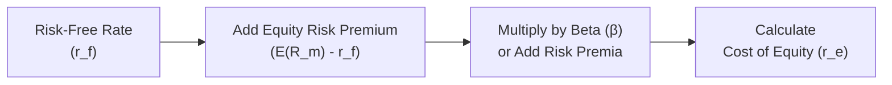

## Understanding the Basics

Sometimes, when I started learning about equity valuation, I’d get stuck on the concept of the “Cost of Equity.” I remember asking myself: “Why isn’t it enough just to look at the company’s profits and call it a day?” Well, the cost of equity answers the question: “What’s the minimum return that investors (shareholders) expect to earn for risking their capital in a firm’s shares?” If that return isn’t offered, rational investors might say, “Nope, not worth it,” and place their money elsewhere.

The required return on equity, often called the cost of equity, encapsulates a few essential building blocks:

• A baseline risk-free rate (rᶠ).  
• A premium to compensate for equity risk, known as the equity risk premium (ERP).  
• Adjustments for company-specific factors like size, liquidity, and leverage (often captured in “beta” or added as separate components).

This required return is also the discount rate in many valuation models, such as the Dividend Discount Model (DDM) and Free Cash Flow to Equity (FCFE) approaches. Accurately estimating the required return protects us from over- or undervaluing a share.

## Core Components of the Cost of Equity

### Risk-Free Rate

The risk-free rate (rᶠ) is the foundation. Typically, an investor picks a government bond yield in a stable currency (e.g., the yield on 10-year U.S. Treasury bonds if you’re analyzing U.S.-based companies). The key assumption is that these government bonds have negligible default risk. If they don’t (or if the government is less stable), you’d choose something else as your “almost risk-free” baseline.

### Equity Risk Premium (ERP)

Over the risk-free rate, investors demand an additional premium to compensate for the fact that stocks are riskier than government bonds. The ERP often gets estimated using historical returns—comparing market index returns to risk-free returns—but forward-looking models also exist (which can rely on surveys, implied methods, or fundamental analysis). If the equity market has historically returned 7% above the risk-free rate, an investor might consider 7% to be a decent proxy for ERP. But keep in mind: The actual figure can differ significantly based on the market’s current conditions, investor sentiment, or even the length and period of the historical data chosen.

### Beta (β)

In many models, such as the Capital Asset Pricing Model (CAPM), we capture firm-specific risk in the variable β (beta). Beta measures how sensitive a company’s stock returns are to the overall market’s returns. A beta of 1 indicates that the stock tends to move in line with the market. A beta higher than 1 suggests amplified volatility relative to the market; a beta lower than 1 indicates lower sensitivity.

If a stock is more volatile than the overall market, investors expect a higher return to be compensated for this extra risk, so a higher beta typically leads to a higher cost of equity. Conversely, a low-beta, more stable stock might have a smaller bump over the risk-free rate.

## CAPM Approach

The Capital Asset Pricing Model (CAPM) remains one of the most popular methods for estimating the cost of equity. It’s typically expressed as:

rₑ = rᶠ + β × [E(Rₘ) – rᶠ]

Where:

• rₑ = Required return on equity (cost of equity).  
• rᶠ = Risk-free rate.  
• β = Beta of the stock.  
• E(Rₘ) – rᶠ = Equity Risk Premium (the market’s return minus the risk-free rate).

CAPM is elegant (and sometimes criticized for being too simplistic). But for exam day, it’s crucial to know how to work it. You’ll use it constantly in discounted cash flow models and to evaluate whether an investment is offering enough return to justify its risk. If you happen to misestimate beta or the market premium, your cost of equity gets skewed—potentially by a large margin.

## DDM-Based Approach

Another way to estimate the required return on equity is by flipping around the Gordon Growth version of the Dividend Discount Model (DDM). The Gordon Growth Model states:

P₀ = D₁ / (rₑ – g)

Where:

• P₀ is the current share price.  
• D₁ is the expected dividend one year from now.  
• rₑ is the required return on equity.  
• g is the constant growth rate of dividends.

If you rearrange it to solve for rₑ:

rₑ = (D₁ / P₀) + g

This method presumes a stable growth in dividends forever—an assumption that’s not realistic for every firm. It’s quite sensitive to the growth rate (g). If g is just 1% off, the entire cost of equity could drastically change. So, we use it more commonly for mature companies with predictable dividend policies.

## Build-Up Methods

Sometimes, especially in smaller or privately held companies where we can’t easily measure beta or we have no track record in the public markets, analysts use a build-up method:

1. Start with the risk-free rate.  
2. Add an equity risk premium.  
3. Layer on size premiums (smaller companies have historically higher risk and may command an extra 1-2% or more).  
4. Add an industry premium if applicable (some sectors, like biotech, often have more risk).  
5. Include additional factors like liquidity premium, country-specific risks, or even a management quality premium if relevant.

The sum of these components is the cost of equity. This build-up approach offers flexibility but can be tricky to calibrate because you might not have a single widely accepted source for each premium.

## Why the Cost of Equity Matters

Within equity valuation (for instance, in the chapters on Dividend Discount Models or FCFE-based valuations), the required return on equity is your discount rate for measuring the present value of future cash flows or dividends. Underestimate it, and you might produce a valuation “too high” (making the stock appear cheaper than it is). Overestimate it, and you might dismiss a potentially worthwhile investment.

Additionally, the cost of equity is an integral part of the Weighted Average Cost of Capital (WACC), a metric used by corporate finance professionals to assess capital structure, evaluate project feasibility, and plan strategic financing decisions. If the cost of equity is off, your WACC is off too—and that can lead to misallocation of resources within a firm.

## A Quick Real-World Anecdote

A while back, I was analyzing a mid-sized software firm that was bragging about its future potential. Management insisted it should be valued at high multiples, citing their robust pipeline of subscription-based users. But they also used a cost of equity that was suspiciously low—like 6%—despite an environment where the risk-free rate alone was around 3%. Given the nature of the firm (small cap, new product lines, fierce competition), a build-up approach suggested the cost of equity was probably closer to 10%. That difference alone dramatically changed how the valuation turned out. And wouldn’t you know it, a year later, the company’s actual performance spotlighted how that lower rate had made the equity look artificially attractive.

## Diagramming the Process

Below is a simple diagram showing how the major approaches flow into calculating the final cost of equity. This can help visualize the different paths you might take:



This diagram is a simplified depiction, but it captures some central elements: you’ve got your baseline (the risk-free rate), you adjust for market risk or other possible premiums, and you arrive at your cost of equity.

## Estimating CAPM in Python (Optional Snippet)

If you love a little coding, here’s a quick snippet showing the CAPM approach in Python:

```python
def cost_of_equity(rf, beta, market_return):
    """
    Calculate the cost of equity using CAPM.
    :param rf: Risk-free rate as a decimal. E.g., 0.03 for 3%.
    :param beta: Beta of the stock.
    :param market_return: Expected market return as a decimal.
    :return: Cost of equity as a decimal.
    """
    return rf + beta * (market_return - rf)

rf_rate = 0.03      # 3% risk-free
stock_beta = 1.2    # example beta
market_ret = 0.08   # 8% expected market return
r_e = cost_of_equity(rf_rate, stock_beta, market_ret)  # 0.036 = 3.6%
```

Of course, in real-world analysis, you’d use tested historical data or forward-looking estimates for inputs. Beta might be derived from a regression of stock returns vs. market index returns over a multi-year period.

## Advanced Considerations

• Multifactor Models: Instead of CAPM’s single-market factor, models may include additional systematic factors: size, value, momentum, quality, etc. This changes how you measure each premium—but at the core, you’re still adding or subtracting incremental returns for incremental risk exposures.  
• Adjustments for Leverage: Betas can be levered or unlevered depending on the firm’s capital structure, so sometimes you’ll adapt the cost of equity for changes in debt-to-equity ratios.  
• Country or Sovereign Risk: If a firm is operating in a high-risk region, you might add a sovereign risk premium to the cost of equity.  
• Non-Recurring or Idiosyncratic Factors: Special circumstances, such as unique litigation or one-time catastrophic events, might push you to deviate from a purely formula-based approach.

## Common Pitfalls

1. **Using an inappropriate Risk-Free Rate**: If you analyze a company in an emerging market but use a developed-market treasury yield as your risk-free rate without adjustments, you risk underestimating.  
2. **Misestimating Beta**: Beta can vary widely depending on the period of measurement, frequency of data (daily vs. monthly), or how leveraged the firm is. Picking an incorrect beta can throw your cost-of-equity calculation off significantly.  
3. **Forgetting Growth Rate Sensitivity**: If you’re in a stable DDM approach, be mindful of how g (growth rate in dividends) changes. Even a 0.5% difference in an assumed perpetual growth rate can dramatically alter the cost of equity.  
4. **Overlooking Qualitative Factors**: Relying solely on numbers can be dangerous. A small tech startup might have a “nice” historical beta if that short window was calm, but once competition heats up, the real risk might not align with that historical measure.  
5. **Combining Methodologies Incorrectly**: Some folks average out the CAPM, DDM, and a build-up approach. This can be okay, but only if you understand each method’s limitations and weighting. Blindly averaging might muddy the waters instead of clarifying them.

## Practical Tips for the Exam

On exam day, you might be asked to:

• Calculate the cost of equity using CAPM with given data (risk-free rate, beta, market return).  
• Rearrange a DDM formula to solve for rₑ.  
• Identify the impact of incorrectly specified betas on a firm’s valuation.  
• Interpret how changes in country risk or size premia affect the build-up approach.  
• Evaluate a scenario where a candidate has used a questionable risk-free rate or a suspiciously low equity risk premium.

Keep in mind that each method has a particular set of assumptions. Don’t forget to highlight any real-world constraints, such as dividend stability or data availability.

## Bringing It All Together

The required return on equity is the bedrock of equity valuation. It quantifies not just how you discount future gains or dividends but also how you perceive the risk undertaken by the shareholder. A slight difference—maybe 1%—can mean a big change in what you think a fair value for a company is. A robust approach to estimating rₑ might incorporate multiple methods: CAPM for a baseline, the Dividend Growth Model if there is a stable track record of dividends, plus adjustments for firm size or region if needed.

Ultimately, cost of equity is about ensuring that you—and your clients or stakeholders—are being fairly compensated for the risk. If someone offers you a 5% return in a world where the risk-free rate is 2%, is that enough to handle the ups and downs of equity markets? Maybe so, maybe not. Your job is to measure this as accurately as possible.

## References for Further Study

• CFA Program Curriculum, “Quantitative Methods for Valuation.”  
• “Equity Asset Valuation” by Jerald E. Pinto et al. (particularly the sections on cost of equity estimation).  
• Damodaran, Aswath. “Investment Valuation.” Includes deeper treatments of build-up methods and country risk.  
• Online Tools: Bloomberg and other financial data providers for up-to-date risk-free rates, market returns, betas, and more.  

## Final Exam Tips

• Practice with real data: Yahoo Finance or other data providers can give you up-to-date risk-free rates and betas. Do a quick sample exercise on CAPM or the DDM.  
• Master the algebra: If a question requires rearranging the Gordon Growth Model, be comfortable doing it quickly.  
• Know your assumptions: The exam might test whether you understand the conditions under which a certain model is valid (e.g., stable dividend policy for the Gordon Growth Model).  
• Watch for “gotchas” in numeric examples: You might see a daily or monthly risk-free rate that needs converting to annual, or you might need to remove inflation from nominal rates.

-----------------------------------------------

## Practice Questions: Required Return on Equity



### A company has a risk-free rate of 3%, a market return of 8%, and a beta of 1.2. What is the cost of equity using CAPM?

- [ ] 5.0%
- [x] 9.0%
- [ ] 7.2%
- [ ] 11.0%

> **Explanation:** Using CAPM: rₑ = 3% + 1.2 × (8% − 3%) = 3% + 1.2 × 5% = 3% + 6% = 9%.


### An analyst uses the Gordon Growth Model to find the cost of equity. If D₁ is 2.00, P₀ is 40, and the growth rate (g) is 4%, which is the resulting cost of equity?

- [x] 9.0%
- [ ] 8.5%
- [ ] 10.0%
- [ ] 6.0%

> **Explanation:** rₑ = (D₁ / P₀) + g = (2.00 / 40) + 0.04 = 0.05 + 0.04 = 0.09 or 9%.


### When using a build-up method for a small private company, an analyst starts with a 2.5% risk-free rate, applies a 6.0% market premium, and adds a 2% size premium. What is the final cost of equity?

- [ ] 8.5%
- [ ] 9.0%
- [x] 10.5%
- [ ] 11.0%

> **Explanation:** Summation approach (2.5% + 6.0% + 2.0%) = 10.5%.


### Suppose you have a firm operating in a politically unstable country. Which best describes how to handle the cost of equity calculation?

- [x] Add a country risk premium to reflect higher uncertainty.
- [ ] Ignore country risk and rely solely on historical market returns.
- [ ] Reduce the risk-free rate to account for currency hedging.
- [ ] Omit the equity risk premium because it’s captured by beta.

> **Explanation:** For emerging or unstable markets, you add a specific premium (country risk premium) to capture additional risk not fully reflected by a standard ERP or beta.


### Which situation most likely causes an overestimation of the cost of equity when using CAPM?

- [x] Using a beta that is overly high due to outdated data.
- [ ] Selecting a risk-free rate that is too low.
- [ ] Overestimating the company’s stable growth rate.
- [ ] Using a dividend yield that is too low.

> **Explanation:** If beta is inflated (perhaps from a short period of extreme volatility), it leads to an inflated CAPM estimate of the cost of equity.


### In the context of DDM, a small increase in the growth rate “g” can lead to:

- [ ] A neutral effect on the cost of equity.
- [x] A significant decrease in the implied cost of equity.
- [ ] No effect on dividend-based calculations.
- [ ] An automatic revision to beta.

> **Explanation:** As g rises in the DDM formula rₑ = (D₁ / P₀) + g, for a given P₀ and D₁, rₑ decreases if the growth rate goes up (since P₀ is typically fixed by the market).


### You compare two companies: Company A has a beta of 0.8, while Company B has a beta of 1.5. Both face the same risk-free rate and equity risk premium. Which statement is correct regarding their costs of equity using CAPM?

- [x] Company B will have a higher cost of equity.
- [ ] Company A will have a higher cost of equity.
- [x] Company B’s required return includes more market risk compensation.
- [ ] Both companies have the same cost of equity.

> **Explanation:** The higher the beta, the higher the expected or required return, so Company B has a higher cost of equity.


### In the build-up approach, which component is least likely to be included explicitly?

- [x] Dividend growth rate
- [ ] Size premium
- [ ] Industry premium
- [ ] Liquidity premium

> **Explanation:** The build-up approach aggregates various premiums onto the risk-free rate. Dividend growth rate is not typically added as a “premium”; it’s used in the DDM approach if needed.


### Which of the following would immediately increase the cost of equity under the CAPM framework?

- [x] Increasing market volatility leads to a higher equity risk premium.
- [ ] Decreasing the expected rate of inflation in a stable economy.
- [ ] Lowering the firm’s financial leverage.
- [ ] Decreasing the tax rate on dividends.

> **Explanation:** An increase in the ERP due to higher market volatility raises the cost of equity directly in the CAPM model.


### True or False: Smaller companies generally have a lower cost of equity due to their greater flexibility.

- [x] True
- [ ] False

> **Explanation:** While one might argue smaller firms can be more agile, empirical evidence tends to show they face higher risk and thus higher cost of equity (i.e., small-cap premium). The statement as given is reversed in many real-world scenarios, so be cautious. 


