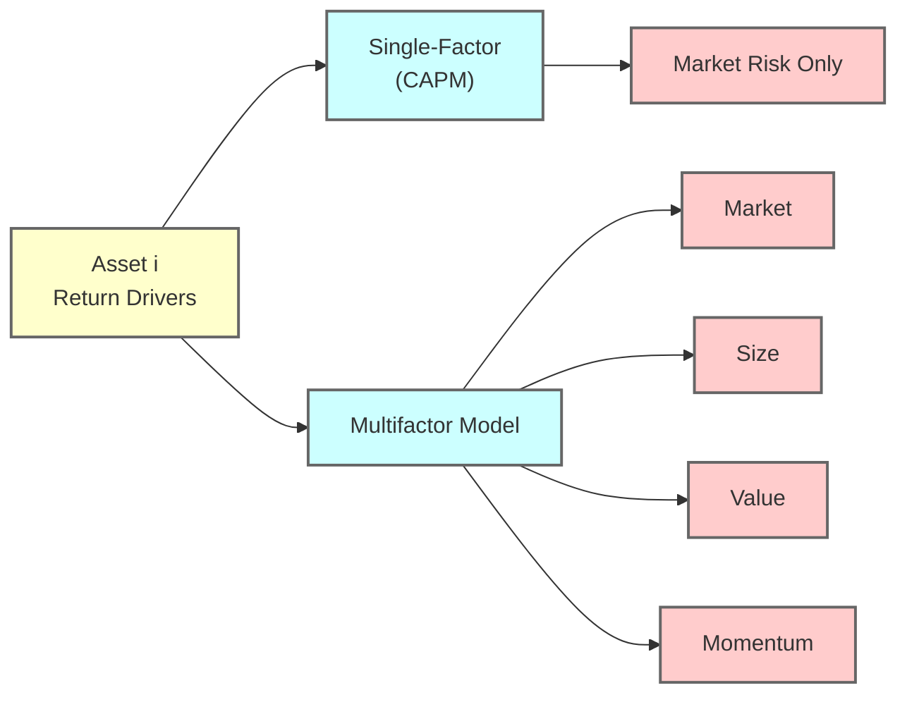

## Overview and Motivation

I remember the first time I tried to apply the Capital Asset Pricing Model (CAPM) in a real-world scenario; I was helping a friend figure out whether a particular stock was worth buying. We sat around a kitchen table—coffee cups in hand—trying to decode why certain stocks commanded higher returns than others. We’d just learned about CAPM in our finance class and had heard about multifactor models springing up in academic journals. Honestly, it felt like entering a whole new world: the idea that a handful of factors could explain the seemingly chaotic movement of individual stock prices was both mind-blowing and a bit intimidating.

In this section, we’ll dig into the CAPM, a single-factor model that forms a foundation for modern finance. Then we’ll move on to multifactor extensions such as the Fama-French and Carhart models, which attempt to capture real-life nuances in stock returns. Our goal is to shed light on the practical usage of these models for equity valuation, especially when it comes to estimating the cost of equity, analyzing performance attribution, and other applications in equity investments.

## CAPM at a Glance

The Capital Asset Pricing Model (CAPM) is one of the cornerstones of modern finance. It states that the expected return of a security (or portfolio) is driven by its exposure to market risk, measured by Beta (β).  

Mathematically:

E(Rᵢ) = Rf + βᵢ [E(Rm) − Rf]

Where:  
• E(Rᵢ) = Expected return on the ith asset.  
• Rf = Risk-free rate (often proxied by Treasury bill yields).  
• E(Rm) = Expected return on the overall market portfolio.  
• βᵢ = Beta of the ith asset, which measures the sensitivity of the asset’s returns to the market portfolio returns.  
• [E(Rm) − Rf] = The market risk premium (or equity risk premium).

### Key Assumptions of CAPM

• Markets are frictionless: No transaction costs, no taxes, infinite divisibility of assets.  
• Investors hold diversified portfolios that eliminate unsystematic (idiosyncratic) risk.  
• Investors are rational mean–variance optimizers.  
• All investors have the same time horizon and homogenous expectations (everyone sees the same risk and return distribution).  
• There is a single source of systematic risk: market risk.

Even though these assumptions are quite strong, the CAPM framework remains widely used—particularly for estimating the cost of equity or for portfolio performance benchmarking. For instance, if you’re working in corporate finance, you’ll often see accountants and analysts use CAPM to discount future cash flows in project valuation. Meanwhile, equity analysts rely on it to derive required return estimates for valuing a company’s shares.

## Beyond the Single Factor

Now, let’s be real: in real-world markets, multiple drivers influence how a stock’s price moves. Market risk is huge, but so are things like a company’s size, how “value” oriented or “growth” oriented it is, whether the stock has exhibited upward momentum, and so on. That’s where multifactor models come in.

While CAPM relies on a single factor (the market portfolio), multifactor models incorporate additional risk factors that research has shown can systematically affect returns. These factors are often referred to as “systematic” or “common” risk factors because they affect a wide range of securities and cannot be eliminated via diversification.

## Multifactor Model Architecture

A typical multifactor model might look something like this:

E(Rᵢ) = Rf + ∑ βᵢ₍ᵏ₎ × Factor Premium₍ᵏ₎

Where each βᵢ₍ᵏ₎ measures the asset’s sensitivity to the kth factor, and the Factor Premium₍ᵏ₎ is the expected premium (extra return) associated with that factor.

### Popular Factors

• Market Risk (MKT): The traditional equity market factor from CAPM.  
• Size (SMB, “small minus big”): This factor aims to capture the performance difference between small-cap and large-cap stocks.  
• Value (HML, “high minus low”): Focuses on the return differential between stocks with high book-to-market ratios (value companies) and those with low book-to-market (growth companies).  
• Momentum (WML, “winners minus losers”): Reflects the idea that stocks which have performed well continue to do so, at least in the short run.  
• Liquidity: Sometimes included to capture liquidity premiums that investors demand for holding less liquid stocks.

### Diagram: Single-Factor vs. Multifactor Architecture

Below is a Mermaid diagram illustrating the conceptual difference between a single-factor CAPM and a generic multifactor model.

## Fama-French Three-Factor Model

One of the pioneering multifactor frameworks is the Fama-French three-factor model. Professors Eugene Fama and Kenneth French posited that aside from market risk, two other firm characteristics—size and value—play significant roles in explaining stock returns over the long run.

The model is often stated as:

E(Rᵢ) − Rf = β₁ [E(Rm) − Rf] + β₂ SMB + β₃ HML

Where:

• (E(Rᵢ) − Rf): Excess return over the risk-free rate for stock i.  
• (E(Rm) − Rf): Market risk premium (same as in CAPM).  
• SMB (“small minus big”): Captures the size factor—small-cap vs. large-cap stock returns.  
• HML (“high minus low”): Captures the value factor—value stocks vs. growth stocks.  

### Interpretation
If β₂ is significantly positive, you might interpret that the stock leans toward smaller companies—which historically have higher average returns (though possibly higher risk). A positive β₃ might suggest a tilt toward value stocks.

### Practical Example
Let’s say you run a portfolio that primarily invests in small-cap technology firms. Empirically, you discover that your portfolio’s return is particularly sensitive to the SMB factor. To get a sense of how your portfolio’s performance might fare under varying market conditions, or to confirm if your returns consistently rely on the small-cap premium, you’d look at your estimated β₂ for SMB. If it’s large and significant, it tells you that a lot of your outperformance (or possibly underperformance) stems from your tilt toward small companies.

## Carhart Four-Factor Model

Mark Carhart expanded the Fama-French three-factor model by adding a fourth factor: momentum (sometimes called WML, for “winners minus losers”). This factor emerges from the observation that stocks with strong recent performance often continue outperforming for a short period.

The Carhart formula typically is written as:

E(Rᵢ) − Rf = β₁ [E(Rm) − Rf] + β₂ SMB + β₃ HML + β₄ WML

Where β₄ is the factor loading on the momentum factor.

### Momentum Factor
Momentum strategies—often used by quantitative hedge funds—ride the trend that recent “winners” keep winning. But these can be risky, as abrupt reversals are common if market sentiment shifts. The Carhart model attempts to quantify how much of a stock’s or portfolio’s performance arises from momentum exposure.

## Advantages of Multifactor Models

• Better explanatory power: Multifactor models often capture more total variation in stock returns compared to a single-factor model.  
• Deeper insight: By identifying which factor exposures drive returns, you can make more informed decisions about risk budgeting and portfolio construction.  
• Performance attribution: When your portfolio outperforms or underperforms, it’s easy to break that out into performance from each factor and any true alpha you might be generating.

## Challenges of Multifactor Models

• Data complexity: Constructing factors like SMB, HML, and WML requires large datasets with updated financial statements and price histories.  
• Model specification: Over time, new factors have been proposed (profitability, investment patterns, liquidity, etc.). Distinguishing a genuine factor from data-mining artifacts can be tricky.  
• Factor correlations: Sometimes factors overlap or become correlated, which can dilute or amplify certain exposures.  
• Evolving definitions: The precise definitions of “value” or “momentum” can shift as the market environment changes or new academic research refines factor measurement.

## Applications in Equity Valuation and Portfolio Management

### Cost of Equity Estimation

Many analysts still rely on CAPM to estimate the required return (cost of equity) for discounting future cash flows. In certain sectors known for their high exposure to small-cap or value phenomena, some analysts plug multifactor betas into their discount rates. However, this approach is more complex and can be difficult to apply consistently if factor betas aren’t readily available.

### Performance Evaluation

Multifactor models are particularly useful for performance attribution. For example, if a fund is marketing itself as a “value” fund, you can evaluate how much of that fund’s returns are coming from the value factor vs. skillful stock picking. This can help you identify “closet indexers” who are passively riding well-known factor returns rather than truly adding alpha.

### Risk Management

By understanding how a portfolio’s return correlates with each risk factor, portfolio managers can structure hedges, set exposure limits, or allocate capital to ensure that the portfolio’s drawdowns (loss scenarios) are within acceptable ranges. If your holdings have a strong tilt toward small-cap value stocks, you might want to keep an eye on macro environments where that tilt becomes unfavorable, e.g., recessions that hit small-cap companies harder.

## Example: Calculating Expected Return Using CAPM and Fama-French

Let’s run through a simplified numeric example to illustrate how you might use these models in practice. Suppose:

• Risk-free rate (Rf) = 2%  
• Market risk premium (E(Rm) − Rf) = 5%  
• SMB Premium = 2% (historical average difference between small- and large-cap returns)  
• HML Premium = 2.5% (historical average difference between value and growth)  

### CAPM Approach

• β = 1.2 (relative to the market)

Expected Return = 2% + 1.2 × 5% = 2% + 6% = 8%

### Fama-French Approach

• β₁ (Market) = 1.2  
• β₂ (SMB) = 0.4  
• β₃ (HML) = −0.3

Excess Return = (1.2 × 5%) + (0.4 × 2%) + (−0.3 × 2.5%)  
Excess Return = 6% + 0.8% − 0.75% = 6.05%

Thus, E(Rᵢ) = 2% + 6.05% = 8.05%

Notice the difference is small, but it can grow larger depending on the factor loadings and the magnitude of the factor premiums. If your portfolio is heavily tilted toward small, high book-to-market companies, the differences can be more pronounced.

## Best Practices and Pitfalls in Applying Factor Models

• Stay updated: Academic and industry research on new factors never stops. Keep an eye on well-backed studies rather than chasing “the flavor of the month.”  
• Avoid overfitting: Don’t just pick factors that perfectly explain past returns (data mining). Use economic reasoning.  
• Consider transaction costs: Strategies exploiting certain factors (like momentum) can be expensive to trade frequently.  
• Monitor stability: Factor premiums change over time and can be cyclical. The “value” premium has fallen under scrutiny in certain market environments.  
• Regulatory environment: When using or disclosing factors in client-facing material, ensure you meet local and global regulatory standards for performance presentation.

## Exam Tips and Strategies

• Expect both conceptual and numeric questions. The exam might test your understanding of the CAPM formula, or ask you to identify and interpret factor loadings from a given regression output.  
• Practice performance attribution: Understand how to break down a portfolio’s returns into factor-based components vs. alpha.  
• Don’t ignore the assumptions: The CFA curriculum loves to focus on the underlying assumptions of these models—and how or why they might fail in the real world.  
• Cross-reference related sections: For instance, Section 9.3 (Price Multiples) and Section 9.11 (Required Return on Equity) often converge with the concepts of CAPM and factor-based cost of equity.

## References and Further Reading

• CFA Institute Program Curriculum on Portfolio Management and Advanced Asset Pricing  
• Fama, E. F., & French, K. R. (1993). “Common Risk Factors in the Returns on Stocks and Bonds.” Journal of Financial Economics.  
• Carhart, M. M. (1997). “On Persistence in Mutual Fund Performance.” The Journal of Finance.  
• Fama & French papers available at SSRN: https://papers.ssrn.com

---

## Test Your Understanding of CAPM and Multifactor Models



### Which of the following statements best describes the CAPM?

- [x] It is a single-factor model that explains returns using only market risk.
- [ ] It is a multi-factor model that explains returns using market, size, and value.
- [ ] It is a model that attributes all returns to idiosyncratic risk.
- [ ] It is a model meant solely for fixed income securities.

> **Explanation:** CAPM relies on market risk as the only systematic factor, whereas multifactor models bring in additional risk factors.

### What is an example of a factor typically included in multifactor models but not captured in CAPM?

- [ ] Default risk.
- [x] Size (SMB).
- [ ] Currency risk hedging factors.
- [ ] Time-value mismatch factor.

> **Explanation:** Classic extensions, such as the Fama-French model, add size as a systematic factor. CAPM only includes market risk.

### In the Fama-French three-factor model, which component captures the difference in the performance of small-cap versus large-cap stocks?

- [ ] HML.
- [ ] WML.
- [x] SMB.
- [ ] MKT.

> **Explanation:** SMB stands for “small minus big” and tracks the difference in returns between small and large firms.

### Which of the following best describes how the Carhart model extends the Fama-French three-factor model?

- [ ] By introducing a liquidity factor.
- [ ] By replacing HML with momentum.
- [ ] By removing the market factor.
- [x] By adding a momentum factor (WML).

> **Explanation:** Mark Carhart added the momentum factor to the Fama-French model, resulting in a four-factor framework.

### According to CAPM, what happens to the required return if a stock’s beta increases, ceteris paribus?

- [x] Increases linearly.
- [ ] Decreases linearly.
- [ ] Remains the same.
- [ ] Experiences an exponential increase.

> **Explanation:** The model states that E(Rᵢ) = Rf + βᵢ [E(Rm) − Rf]. An increase in βᵢ escalates the overall required return in a linear fashion.

### Which statement about multifactor models is most accurate?

- [x] They potentially explain more variations in stock returns compared to CAPM.
- [ ] They always perform better than CAPM in forecasting future returns.
- [ ] They eliminate all systematic risk from a portfolio.
- [ ] They require no additional data compared to CAPM.

> **Explanation:** Multifactor models incorporate multiple risk dimensions and therefore can explain a greater portion of return variance. However, superior predictive performance is not guaranteed.

### If a portfolio's returns can be entirely explained by market, size, and value factors, how much alpha does it theoretically have?

- [ ] A small positive alpha.
- [x] Zero alpha.
- [ ] A large negative alpha.
- [ ] Cannot be determined.

> **Explanation:** Alpha refers to the return unexplained by systematic factors. If all returns are attributed to these factors, alpha is effectively zero.

### Which factor is commonly associated with continued performance following increased returns over the recent past?

- [ ] Size factor.
- [x] Momentum factor.
- [ ] Value factor.
- [ ] Market factor.

> **Explanation:** Momentum (WML) explains the tendency for recent winners to continue winning in the short run.

### One major challenge of multifactor models is:

- [x] Factor overfitting due to extensive data mining.
- [ ] Overly simplistic structure compared to CAPM.
- [ ] Lack of broad industry adoption.
- [ ] Not aligning with any academic research.

> **Explanation:** A key issue in multifactor modeling is distinguishing genuine predictive factors from those found purely through data mining, which may not hold up out-of-sample.

### True or False: Multifactor models assume that all investors hold the risk-free asset and a market portfolio of all risky assets, as initially specified by CAPM.

- [x] True
- [ ] False

> **Explanation:** Multifactor models build on the same theoretical underpinnings of CAPM—investors hold efficiently diversified portfolios—while adding multiple risk dimensions. Their assumptions about investor behavior and market completeness are broadly similar.


