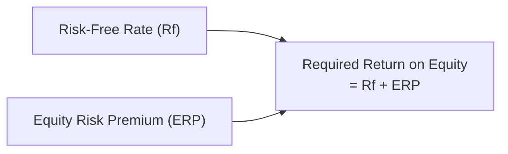

## Setting the Stage: Why the Equity Risk Premium Matters

I remember the first time I came across the idea of the Equity Risk Premium (ERP). I was a fresh-faced analyst, excited about applying the Capital Asset Pricing Model (CAPM) in real-world scenarios. Then—bam—I realized that CAPM’s “secret sauce,” the ERP, could drastically change my required return calculations. I thought, “Wow, who knew that ‘a few percentage points above the risk-free rate’ could be such a big deal?”

In simple terms, the ERP is the extra return investors demand for investing in stocks over a risk-free asset (often proxied by government T-bills or bonds). If you imagine you have two buckets: one filled with risk-free government securities and one filled with a broad equity index, the difference in their expected returns should, in theory, capture the entire stock market’s additional risk. Of course, “in theory” rarely lines up perfectly with reality, and that’s where both historical data and forward-looking estimates come into play.

This topic is absolutely central to equity valuation: from calculating the cost of equity capital to discounting future cash flows, from gauging required rates of return to running multifactor models. Read on, and we’ll walk step by step through how the ERP is derived, including the standard historical approach, the forward-looking approach, and the synergy that emerges when we use them both in practice.

## Historical Approach: Understanding the Past

The historical method is exactly what it sounds like—looking at what actually happened in the past and projecting it forward. The logic is simple: if, over the last 50 or 100 years, a broad market equity index generated a 7% average annual return above T-bills, then we could say, “All right, maybe that’s a fair guess for the next few decades.” But of course, life seldom stays consistent, and the dreaded biases—sample period bias, survivorship bias, and more—can creep in.

### Basic Steps in a Historical Approach

• Select a Reference Market Index and a Risk-Free Security  
  Typically, the index is something broad-based like the S&P 500 in the United States or another well-tracked market index in your region if you’re focusing on a particular market. As for the risk-free proxy, we often use long-term government bonds or short-term Treasury bills. The choice can make or break your final ERP result, so be consistent.

• Compute Average Returns Over a Prespecified Period  
  We gather returns (annual, monthly, or daily) for both the equity index and the risk-free asset. Then we calculate the average difference. There’s a discussion around using arithmetic means versus geometric means:
  - Arithmetic Mean: Tends to be more reflective of expected one-period returns going forward.  
  - Geometric Mean: Captures compound growth over multiple periods.

• Adjust for Inflation, Taxes, and Other Factors (Depending on Analysis)  
  Some practitioners look at nominal returns; others prefer real (inflation-adjusted) returns. Decide in advance so you don’t end up misquoting the ERP by ignoring inflation’s role over long sample periods.

### Key Challenges and Adjustments

• Survivorship Bias  
  This might sound like a fancy term, but it basically means we’re ignoring losers that dropped out of the game. Historically, only successful markets (and companies) might be included in the data, which can inflate the observed return. So if we use an index that excludes companies that went bankrupt or countries with markets that collapsed, we likely get an overestimate of the ERP.

• Sample Period Bias  
  The historical ERP often depends on your start and end dates. Maybe you started measuring right after World War II, or maybe the dataset included extreme bull markets. So watch out for the chosen window. Observing a period from 1970 to 1999 might give a different result than from 1990 to 2020.

• Data Revisions and Composition  
  Index composition can change: mergers, acquisitions, rebalances, and changes in listing rules. Over the long run, these modifications can influence calculations. Many professional data providers (like Morningstar/Ibbotson or other academic sources) publish updated numbers that incorporate corrections.

In real practice, you might see numbers like 5% to 7% for the U.S. market’s historical premium over 20-year T-bonds. But if you measure a different time frame or look at a different country, you could land somewhere else entirely (maybe 3%, maybe 8%). That’s why we also consider forward-looking approaches.

## Forward-Looking (Ex-Ante) Approach

Ever tried to gauge whether it will rain tomorrow by looking out your window? Historical data (it’s raining today!) helps, but you’ve also got your weather forecast (forward-looking). The same principle applies to ERP estimation: we check weather patterns (historical data) but also meteorologists’ predictions (analysts’ forecasts).

The forward-looking (ex-ante) approach aims to estimate the ERP by considering what investors expect to happen in the future. That might be dividend growth rates, earnings forecasts, GDP growth projections, or consensus surveys among market participants.

### Implied Equity Risk Premium 

A big star of the forward-looking show is the implied ERP. Think of it this way: If you assume the current market price is “correct,” and you pair that with assumed future cash flows (like dividends or free cash flows), you can back-solve for the discount rate that sets the present value of those cash flows equal to the market price. Then you subtract the risk-free rate from that discount rate to get the implied ERP.

This approach is dynamic—if stock prices surge without an equivalent jump in expected dividends, the implied ERP might drop. If prices crater while dividends remain strong, the implied ERP might rise. Here’s a quick conceptual formula (in a purely simplified sense):

  
Rᵉ = (Expected Dividends Next Period / Price) + g
  
Where:  
• Rᵉ is the required return on equity.  
• g is the expected long-term growth rate in dividends (or earnings).  

Thus, the Implied ERP = Rᵉ – Rf.

It feels neat and “self-correcting” because it hinges on current prices and forward-looking expectations. But watch out—those expectations can be off. If your assumed growth rate is unrealistic, you’ll get a funky ERP estimate.

### Survey-Based Approach

In some situations (like small, emerging markets or corners of the market with limited historical data), analysts may rely on explicit surveys. These surveys ask top strategists, fund managers, and economists for their best guess of a 10-year or 15-year equity premium. You might think it’s a bit “soft” or subjective, but combining a wide range of expert opinions can offer unique insights—especially in markets with limited historical coverage.

For instance, a typical survey might show an average ERP expectation of 5.5% with a standard deviation of 1%, gleaned from some 60 analysts around the globe. The challenge is that sentiment can shift quickly, and these surveys can sometimes reflect herd mentality. Regardless, they’re a useful supplement to more quantitative approaches.

### Dividend Growth Models and Macroeconomic Inputs

Sometimes you’ll see elaborate forward-looking models that combine predictions of GDP growth, corporate earnings growth, changes in payout ratios, and inflation. This can be particularly relevant when analyzing markets that are evolving or transitioning. The logic says if we can guess how fast the economy and corporate profits expand, we can figure out the expected return to shareholders—then measure that spread over the risk-free rate.

Of course, the downside is forecast risk. If the economy tanks or global trade changes dramatically, your neat spreadsheet numbers might turn out to be, well, meaningless. That’s why in practice, analysts often blend historical results with forward-looking macro insights.

## Balancing Historical and Forward-Looking Estimates

Most practitioners don’t rely solely on one approach. A purely historical approach can be backward-looking and potentially misleading if the market environment has fundamentally changed (think technology booms, interest-rate cycles, or financial crises). Meanwhile, forward-looking estimates hinge on what we expect to be the “new normal,” which could be inaccurate if the market or forecasting techniques are flawed.

A balanced method might look like:  
• Start with the historical average as a “baseline.”  
• Adjust upward or downward based on contemporary signals, such as lower growth estimates or changing market structures.  
• Cross-check results using implied ERP or survey-based insights.  

If historical data says the ERP should be around 6%, but your implied approach suggests 4% (maybe the market is richly priced?), and a leading global investment bank’s survey is at 5%, you might decide 5% is a workable middle ground. This is often described colloquially as combining art and science.

## Common Pitfalls and Practical Tips

• Overconfidence in a Single Number  
  Try not to treat your ERP estimate like a hard-coded, unchanging figure. Market conditions evolve, so update your assumptions regularly.

• Inappropriate Data Series or Mismatched Horizons  
  Make sure the time horizon of your ERP matches the horizon of your valuation or analysis. If you’re valuing a 20-year cash flow stream, it might be more relevant to use a long-term risk-free rate than a 3-month T-bill.

• Inconsistency Across Valuation Inputs  
  If you’re using an implied ERP method, ensure that your growth and discount rate assumptions align with the same geographic market and currency basis.

• Ignoring Macroeconomic Shifts  
  A sudden structural change (e.g., a country shifts from an emerging market to a fully developed economy) can invalidate prior historical estimates.

## Exam Relevance and Integration in CFA Ethics and Standards

For the CFA exam, you’re expected to recognize how the ERP fits into the big picture of equity valuation. This means tying your ERP assumptions to the risk-free rate, applying them in CAPM or multifactor models, and checking consistency with final valuations. Also remember the CFA Code of Ethics and Standards of Professional Conduct: misrepresenting data or ignoring obvious limitations in your ERP approach can violate Standard I(C) (Misrepresentation) or Standard V(B) (Communication with Clients and Prospective Clients). You should fully disclose the sources, assumptions, and limitations of your ERP estimates.

In the Level III context, you’ll likely see scenario-based questions about deciding between two or three ways to estimate the ERP. They can show you historical data, a forward-looking scenario, or a combination—perhaps in an item set that includes macroeconomic projections. Always keep an eye on how changes in the ERP might alter portfolio allocations, risk budgeting, or performance analyses.

## References and Further Reading

• CFA Institute Program Curriculum on Equity Risk Premium Methods.  
• Morningstar/Ibbotson SBBI Yearbooks for historical return data.  
• Damodaran, A. (various annual updates on implied equity risk premiums, available online).  
• Ilmanen, A. Expected Returns: An Investor’s Guide to Harvesting Market Rewards.  
• CFA Institute Code of Ethics and Standards of Professional Conduct.

## Conclusion: Bringing It All Together

It’s fascinating—some folks prefer their ERP estimate with pure historical flavor, while others demand forward-looking spice, and still others enjoy a carefully blended “ERP cocktail.” In my experience, the best approach is to keep an open mind and not fall into the trap of worshipping a single method. Use multiple data points, question your own biases, and keep up with what’s happening in the markets. That’s how you’ll deliver a robust and defensible equity risk premium estimate.

Anyway, thanks for joining me on this little journey. The ERP feeds into so many aspects of equity valuation—CAPM, multifactor models, cost of equity, you name it. And as with any critical variable, handle with care. Because it can make all the difference between a thumbs up or a thumbs down on an investment decision.

## Test Your Knowledge: Equity Risk Premium Approaches Quiz



### Which of the following best describes the concept of the Equity Risk Premium (ERP)?
- [ ] It is the reward for assuming inflation risk relative to real returns.
- [ ] It is the difference between the nominal return and the inflation rate.
- [x] It is the additional return investors require over a risk-free asset for investing in equities.
- [ ] It is the minimum dividend yield needed to invest in stocks.

> **Explanation:** The ERP is essentially the premium (additional return) investors demand for bearing the extra risk of the equity market compared to risk-free securities.

### Which of the following is true regarding survivorship bias in calculating historical equity returns?
- [x] It often results in an overestimation of actual equity returns over the long run.
- [ ] It typically underestimates the equity returns because it excludes high-return companies.
- [ ] It has little impact on historical calculations of the ERP.
- [ ] It only affects calculations in emerging markets.

> **Explanation:** Survivorship bias excludes failed or delisted companies from the dataset, thereby inflating the observed returns for the “survivors.”

### When comparing arithmetic mean returns and geometric mean returns in historical ERP calculations, which statement is correct?
- [ ] The arithmetic mean always understates future expected returns.
- [x] The arithmetic mean is often used for shorter-term forecasting, while the geometric mean reflects compound growth over time.
- [ ] The geometric mean is always higher than the arithmetic mean.
- [ ] Both means will lead to the same ERP estimation if data is consistent.

> **Explanation:** The arithmetic mean is typically aligned with expected one-period returns, whereas the geometric mean takes compounding into account for multi-period analysis.

### Which of the following is an example of a forward-looking (ex-ante) approach to estimating the ERP?
- [ ] Calculating the average return difference between stocks and bonds from 1950 to 2000.
- [ ] Using the monthly change in the Consumer Price Index.
- [x] Deriving the discount rate that equates expected future dividends to today’s market price.
- [ ] Adjusting historical returns for survivorship bias.

> **Explanation:** Forward-looking methods rely on current valuations and future expectations. The implied ERP is a prime example, as it backs out the required rate of return from market price and expected cash flows.

### In a survey-based ERP approach:
- [x] Analysts and fund managers are polled for their expected equity returns above a risk-free rate.
- [ ] The ERP is derived strictly by analyzing past corporate bankruptcies.
- [x] Results might reflect consensus beliefs or “herd mentality.”
- [ ] The ERP is obtained by applying identical discount rates to multiple equity markets.

> **Explanation:** A survey-based approach compiles expert opinions about future equity returns relative to the risk-free rate. It can be prone to consensus bias but is also practical where historical data is scarce.

### Which statement about combining historical and forward-looking ERP approaches is accurate?
- [x] It can help balance the strengths and weaknesses of each method.
- [ ] It usually produces erroneous estimates.
- [ ] It is discouraged by standard industry practice.
- [ ] It eliminates the need for data on market returns.

> **Explanation:** By combining historical averages with ex-ante models, analysts often arrive at a more robust and balanced estimate of the ERP.

### Suppose you notice that the equity market is trading at historically high valuations and expected dividend growth is moderate. The implied ERP compared to historical ERP might be:
- [x] Lower, because high valuations imply a lower yield on future expected dividends.
- [ ] Higher, as stock prices typically rise on fundamentals.
- [x] Potentially more accurate than historical ERP during significant market transitions.
- [ ] Inherently unreliable for any practical applications.

> **Explanation:** High valuations mean today’s price is large relative to dividends or earnings, which generally leads to a lower implied ERP if growth assumptions stay moderate.

### Which of the following is NOT typically considered a limitation of forward-looking ERP estimates?
- [ ] Accuracy of growth forecasts may be questionable.
- [ ] Market consensus may change rapidly.
- [x] Historical data is too heavily weighted in the analysis.
- [ ] Survey responses may reflect subjective biases.

> **Explanation:** Forward-looking estimates primarily rely on forecasts rather than on extensive historical data, so “too heavily weighted historical data” is not a limitation of forward-looking approaches.

### An analyst wants to use a survey-based ERP for a unique emerging market that lacks extensive historical data. Which of the following is a primary concern?
- [x] Potential herd mentality could skew the consensus forecast.
- [ ] The approach is too time-consuming to administer.
- [ ] Data availability will never improve over time.
- [ ] It is impossible to adjust for risk factors unique to that market.

> **Explanation:** A major drawback to survey-based approaches is that groups of analysts can converge on consensus estimates that may not bare out in reality (“groupthink”).

### From a regulatory and compliance perspective, is it acceptable for an analyst to disclose only the final ERP estimate to clients, without mentioning the source data or assumptions used?
- [x] True
- [ ] False

> **Explanation:** Under CFA Institute Standards, particularly Standard V(B) on Communication with Clients, analysts must disclose key factors, assumptions, and limitations underlying their investment analyses. Simply announcing the final ERP without context can be considered a misrepresentation or insufficient communication.


