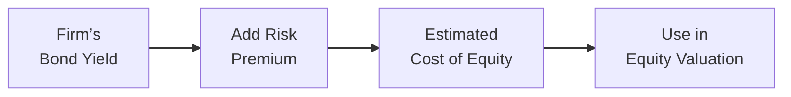

## Overview

The Bond Yield Plus Risk Premium approach is one of those techniques for estimating a firm’s cost of equity that often feels refreshingly straightforward. You take the company’s long-term bond yield—something that’s usually listed in plain sight if the firm has publicly traded debt—and tack on a certain “premium” to capture the higher risk of equity compared with debt. I remember the first time someone explained it to me, and I thought: “That’s it? Just bond yield plus some margin?” And sure enough, that’s the gist of it. But, as you’ll see, carefully understanding this approach, especially if a firm’s capital structure is shifting or if its bond rating changes, is really important for nuanced valuation work.

The goal in all these cost of equity models—from Dividend Discount Models (see sections 9.1 and 9.16) to Free Cash Flow to Equity frameworks (9.2), the Capital Asset Pricing Model (9.12), and multifactor models—is to arrive at the right discount rate for forecasting and valuation. The Bond Yield Plus Risk Premium method fits neatly among these, offering a practical way to estimate required returns, especially in real-world settings where the firm’s bond information is readily available. Let’s take a closer look at how it works, why you might choose it, and also some caveats to keep in mind.

## Conceptual Foundation

Equity, by definition, takes a riskier position in a company’s capital structure than debt. Bondholders typically have priority in liquidation; as a result, the returns demanded by stockholders should be correspondingly higher. In that sense, the difference between the required return on equity and the bond yield is the equity risk premium for that particular company. 

So if a firm’s current bond yield is, say, 5.5%, and you think the additional risk for its equity is about 4%, you’d estimate the cost of equity at about 9.5%. This premium you tack on is intended to compensate equity investors for the extra volatility and subordination to bondholders.

Mathematically, we often see it written:


r_e = \text{Bond Yield} + \text{Risk Premium},


where:
• \\(r_e\\) is the required return on equity.  
• Bond Yield is the yield to maturity on the firm’s publicly traded debt.  
• Risk Premium is an increment reflecting the additional compensation equity investors require.  

## Detailed Mechanics

### Observing the Bond Yield

Before you do any fancy math, you need to figure out the firm’s long-term bond yield. This is usually gleaned from:

- The market prices for existing bonds, from which you can back out the yield.  
- Published yield data on traded corporate debt.  
- Possibly a rating agency or a bond quotation source that explicitly states the yield to maturity.

Be mindful that yields can change quickly with interest rates and market perceptions of a firm’s credit risk. For instance, if your sample bond’s maturity is in six months rather than 10 years, you might not be getting an appropriate gauge of the long-term cost of debt.

### Estimating the Equity Risk Premium

Next, you have to pin down the risk premium. Some analysts do this by looking at typical spreads between equity and bond returns for companies of a certain credit rating. Others rely on historical data for the firm or peer companies. In an ideal world, we’d pick a premium that precisely captures the “spread” demanded by equity holders—but in reality, it can involve some subjectivity. During buoyant economic times, that spread might compress if investors collectively become more risk tolerant. During recessions, it might widen because investors demand extra compensation.

### Combining Them

Once you have both figures in place:


r_e = 
\underbrace{\text{(Firm’s Bond Yield)}}_{\text{Observe from market}} \;+\; 
\underbrace{\text{(Equity Risk Premium)}}_{\text{Often estimated}}


Now you have your cost of equity. Feels straightforward, right? The trick is ensuring that you’re using the right bond yield (i.e., one reflective of a stable capital structure) and an appropriate premium (contextualized for the macro environment and the firm’s risk profile).

## Visual Representation

Below is a simple Mermaid diagram that displays how the Bond Yield Plus Risk Premium approach fits into a broader equity valuation framework:



This diagram shows how you start with the bond yield, combine it with a risk premium, and arrive at \\( r_e \\), which you then plug into a host of valuation models (e.g., Dividend Discount, FCFE models, or residual income approaches).

## Comparison with Other Cost of Equity Models

It’s worth noting how this approach fits relative to other cost of equity methods:

• CAPM (Section 9.12): Uses market risk premium, beta, and risk-free rate. It’s quite common, but requires a reliable beta estimate and a stable market risk premium.  
• Build-Up Method: Adds various premia (size, industry, country, etc.) to a risk-free rate but can suffer from subjectivity in premium selection.  
• Bond Yield Plus Risk Premium: Typically simpler if you already know your firm’s debt yield, but still depends on a subjectively chosen spread.  

## Practical Example with Python Snippet

Suppose a company’s 10-year corporate bonds are trading to yield 6.2%. You suspect equity holders want around a 3.8% premium to own the common shares. The required return on equity would then be 6.2% + 3.8% = 10.0%.

Because I like to illustrate short calculations programmatically, here’s a tiny hypothetical Python snippet:

```python
bond_yield = 0.062
equity_premium = 0.038

cost_of_equity = bond_yield + equity_premium
print(f"Cost of Equity = {cost_of_equity * 100:.2f}%")
```

Output:
Cost of Equity = 10.00%

Sure, it’s not rocket science, but it’s a nice way to confirm that your math is correct when you’re juggling multiple scenarios.

## Strengths of the Approach

• Straightforward: It doesn’t require a deep dive into market betas or factor loadings.  
• Relevant for Leverage: If a firm’s capital structure is stable and you have a good bond yield, it provides a robust starting point.  
• Quick to Implement: Estimation is often feasible in a few steps, and you don’t necessarily need extensive data on the overall market.

## Potential Limitations

• Equity Risk Premium Volatility: The premium itself can be tricky to estimate. It’s rarely static—it tends to shift with the business cycle.  
• Capital Structure Changes: If the company’s leverage ratio is in motion, the yield on existing bonds may not reflect future capital structure dynamics.  
• Other Market Factors: If trading volumes on the bonds are thin or if they’re near maturity, the observed yield might not be representative.

## Implementation Considerations

- Ideally, choose a longer-term bond to better match the equity horizon.  
- Monitor the bond’s liquidity—if the bond doesn’t trade much, the yield might not be reliable.  
- Keep an eye on credit rating outlooks. If a downgrade or upgrade is looming, the bond yield might be a moving target.  
- Revisit the risk premium. In expansions, you might see narrower spreads. In downturns, expect a higher spread. 

## Personal Anecdote and Reflective Insight

Years ago, I worked with a small-cap company that had a single outstanding bond used to finance a big warehouse expansion. We used the Bond Yield Plus Risk Premium method, and it worked like a charm. We had a neatly observable yield, which hovered around 7%. Then we tossed on a 3% premium because the equity was considered moderately risky (though not extreme). That gave us a 10% cost of equity that ended up matching quite well with the implied discount rate from the firm’s price multiples. But you know how it goes—once the company leveraged up for another project, that single bond’s yield jumped to 9%. Suddenly, the cost of equity soared as well. It was a pretty vivid reminder that if a firm’s capital structure is changing, you can’t just pick a single bond yield and forget about it.

## Best Practices and Common Pitfalls

• **Regular Updates**: Don’t set your cost of equity once and call it a day. The premium and bond yield need periodic revisiting.  
• **Comparable Analysis**: Cross-check the firm’s bond yield against peers with similar credit ratings. If the peer group yields are meaningfully different, ask why.  
• **Avoid Overly Short-Dated Bonds**: A bond maturing soon is not likely a good reference for the firm’s long-term risk.  
• **Excessive Consistency**: If you always pick a 4% risk premium every year, you might be ignoring changes in the business cycle.

## Additional Insights

### Sensitivity to Leverage

Because the bond yield is closely tied to leverage, be wary of companies that might raise more debt or engage in deleveraging. If the firm’s debt ratio is set to shift dramatically, you might be looking at a distorted cost of equity. In practice, consider adjusting the yield for your target capital structure analysis—much like you would in a Weighted Average Cost of Capital (WACC) exercise.

### Relation to the Risk-Free Rate

In periods of very low or very high interest rates, bond yields might move significantly. An increasing yield suggests a rising interest rate environment or a greater perceived default risk for the firm. This can create spikes in your cost of equity that reflect market stress rather than any fundamental change in the firm’s business. So remain vigilant about unusual macro conditions.

### Role for Emerging or Frontier Markets

In emerging markets (see Chapter 1.10 for discussion on “Emerging and Frontier Market Equities”), bond yields and credit quality can swing more dramatically. You might end up with a wide yield that might or might not reflect the next 10 years, especially if sovereign risk is also a factor. Some analysts add a country risk premium on top of this approach, effectively turning it into a “Bond Yield Plus Risk Premium Plus Country Risk Spread.” 

## Example Calculation Walkthrough

Let’s consider a scenario to illustrate the step-by-step logic:

• Company ABC has a 7% yield on its 10-year bonds.  
• You estimate that the equity risk premium usually demanded by the market for companies of comparable credit quality is 4%.  
• Therefore, the cost of equity is: 7% + 4% = 11%.  

Now imagine that a year later, ABC’s business prospects deteriorate, leading its credit rating to drop:  
• Bond yield: Now 8.5%.  
• Equity risk premium: You believe is slightly higher at 5%, due to the greater business risk.  
• New cost of equity: 8.5% + 5% = 13.5%.  

That’s a pretty hefty jump, reflecting both the updated credit concerns and the market’s perception of heightened equity risk. In a real-world setting, you’ll probably refine these estimates further, perhaps by looking at peers or adjusting for changes in the overall interest rate environment.

## Putting It All Together

The Bond Yield Plus Risk Premium approach is a handy tool in the analyst’s arsenal for figuring out a company’s cost of equity. Though it appears simple, it’s anchored in the idea that shareholders face more risk than debtholders and thus require a higher return. The key lies in selecting the right bond yield (long-term, liquid, stable capital structure) and an appropriate equity risk premium that reflects current market conditions and your subjective judgments about the firm’s risk profile.

And yes, it’s wise to compare your result with other models like CAPM or the build-up approach. Divergences can reveal potential issues in your assumptions, or they might indicate that the Bond Yield Plus method is not capturing certain nuances for highly dynamic or leveraged companies.

## References

- CFA Institute (Multiple Sections on Corporate Finance and Cost of Capital).  
- “Investment Valuation” by Aswath Damodaran (for comprehensive cost of equity methodologies).  
- Chapter 1.10 of this text (Emerging and Frontier Market Equities) for insight on unique challenges in less-developed markets.  

Remember: there’s no perfect approach to cost of equity, but the Bond Yield Plus Risk Premium method remains a solid, user-friendly option—particularly for companies with reliable bond data.

---

## Test Your Knowledge: Bond Yield Plus Risk Premium Approach



### When using the Bond Yield Plus Risk Premium approach, which element typically serves as the foundation for the equity cost calculation?

- [x] The company's current long-term bond yield.
- [ ] The industry average bond yield.
- [ ] The market risk-free rate.
- [ ] The company’s equity beta.

> **Explanation:** The Bond Yield Plus Risk Premium method starts with the firm’s observed bond yield and then adds a risk premium for equity.

### Which of the following is the primary rationale for adding a risk premium to the company’s bond yield?

- [ ] Debt holders have less market risk than equity holders.
- [x] Equity investors have a lower claim priority and require higher compensation.
- [ ] Equity investors want to match the company’s bond coupons.
- [ ] Capital structure doesn’t affect the inherent firm risk.

> **Explanation:** Equity holders face greater risk than bondholders, so they demand a premium above the bond yield.

### One advantage of the Bond Yield Plus Risk Premium approach is that:

- [x] It is relatively straightforward if the firm’s bond yield is readily observable.
- [ ] It completely removes subjectivity from equity valuation.
- [ ] It guarantees a more accurate cost of equity than the CAPM.
- [ ] It uses only historical averages for precise forecasting.

> **Explanation:** The method is easy to implement if the firm’s bond yield is visible, although it doesn’t remove the need for judgment in choosing the equity risk premium.

### A key limitation of the Bond Yield Plus Risk Premium approach is:

- [ ] You cannot use it if the firm has publicly traded debt.
- [ ] It excludes any premium for economic or market risk.
- [x] The equity risk premium can fluctuate with business cycles and structural changes.
- [ ] It eliminates the need for a stable capital structure.

> **Explanation:** The chosen equity risk premium might vary with economic and capital structure dynamics, diminishing the approach’s reliability.

### When calculating the bond yield for this approach, which of the following considerations is most important?

- [x] Use a long-term maturity bond to reflect the equity’s long-term horizon.
- [ ] Always use the bond closest to maturity for greater accuracy.
- [ ] Only use bonds with a subordinated status.
- [ ] Use a bond that trades at par, regardless of maturity.

> **Explanation:** A longer-term bond yield typically aligns better with the time horizon of equity valuation.

### How might an analyst determine the magnitude of the risk premium in the Bond Yield Plus method?

- [ ] By using the CAPM’s equity beta.
- [ ] By analyzing trailing net income growth rates for five years.
- [x] By observing historical spreads between the firm's equity returns and bond yields or using peer/industry data.
- [ ] By strictly following rating agency announcements for bond ratings.

> **Explanation:** Many analysts rely on historical data or a comparison to similar companies’ bond-yield-to-equity-return spreads.

### Which factor could cause the Bond Yield Plus Risk Premium approach to overestimate a company’s cost of equity?

- [ ] Decreasing interest rates in general.
- [x] Improperly high estimation of the equity risk premium.
- [ ] Basing the approach on short-term treasury yields.
- [ ] Incorporating a negative beta.

> **Explanation:** An overly high premium assumption will result in an inflated cost of equity estimate.

### If a firm’s bond yield rose from 5% to 7% due to a deteriorating credit outlook, which outcome can an analyst expect if they’re using the Bond Yield Plus Risk Premium approach?

- [x] The estimated cost of equity would likely increase.
- [ ] The cost of equity remains unchanged.
- [ ] The risk-free rate is automatically adjusted lower.
- [ ] The equity risk premium would always fall.

> **Explanation:** A rising bond yield, holding the risk premium assumption constant or higher, increases the computed cost of equity.

### What is one reason analysts might favor the Bond Yield Plus method over CAPM?

- [ ] CAPM is too complicated to calculate for any company.
- [x] Bond yields can be more directly observable than a firm’s beta, simplifying the analysis.
- [ ] CAPM does not consider systematic factors.
- [ ] CAPM fails to include any equity risk premium.

> **Explanation:** CAPM requires beta estimation, which can be complex or unstable, while bond yields are often found directly in the market.

### True or False: The equity risk premium in the Bond Yield Plus approach remains constant regardless of economic conditions.

- [ ] True
- [x] False

> **Explanation:** The equity risk premium may change based on macroeconomic factors, market sentiment, and the firm’s capital structure.


