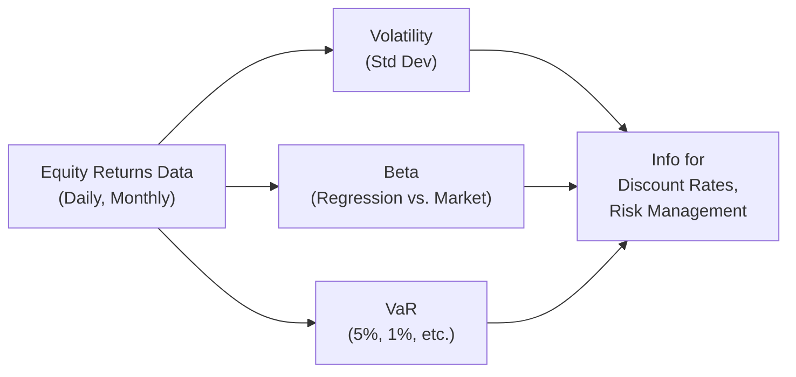

## Introduction

It’s funny—sometimes we get so caught up in potential returns that we forget the old adage: “Risk and return go hand in hand.” Equity analysts and portfolio managers often focus on possible gains without sufficiently examining how volatility, value at risk (VaR), and beta interact to form the broader risk mosaic. These three indicators can profoundly influence the discount rates we use, the hedging strategies we implement, and even the types of stocks we include in our portfolios.

Here, we’ll walk through the concepts of volatility, VaR, and beta, exploring their definitions, formulas, and practical applications. We'll see how each metric captures a slightly different facet of risk. We’ll also discuss common pitfalls, best practices, and real-world scenarios—along with a dash of personal insight to keep the conversation interesting.

## Volatility: Capturing Total Risk

### Defining Volatility

Volatility is basically the standard deviation of an asset’s returns. If you take a series of returns (daily, monthly, or yearly) and calculate the extent to which these returns deviate from their average, you end up with a single number that reflects how "wild" the stock’s (or portfolio’s) ride might be. The greater the standard deviation, the more the asset’s returns are scattering around the mean—suggesting greater uncertainty. 

We define sample standard deviation mathematically as:


s = \sqrt{ \frac{1}{n-1} \sum_{i=1}^{n} (r_i - \bar{r})^2 },


where:
• \\( r_i \\) = the return for period \\( i \\).  
• \\( \bar{r} \\) = the mean (average) return over \\( n \\) periods.  
• \\( n \\) = total number of return observations.  

When standard deviation is high, we’re often looking at a security with more significant price fluctuations. This can, in some contexts, mean increased potential upside (but also bigger drawdowns). Many investors use volatility as a broad marker for total risk. 

### Practical Example

Let’s say we have an emerging market stock that has posted the following monthly returns (in percent) for the last four months: +5%, –3%, +10%, +2%. 

1. Mean (\\(\bar{r}\\)): \\((5 - 3 + 10 + 2) / 4 = 14 / 4 = 3.5\%\\)  
2. Differences from the mean: \\( \{ 5 - 3.5, -3 - 3.5, 10 - 3.5, 2 - 3.5 \} = \{1.5, -6.5, 6.5, -1.5\} \\)  
3. Squared differences: \\(\{2.25, 42.25, 42.25, 2.25\}\\)  
4. Sample variance (divide sum by \\(n-1=3\\)): \\(\frac{2.25 + 42.25 + 42.25 + 2.25}{3} = \frac{89}{3} = 29.67\\)  
5. Standard deviation: \\(s = \sqrt{29.67} \approx 5.44\%\\)

That 5.44% standard deviation tells us this stock’s monthly returns are relatively volatile. If we annualize it (rough approximation by multiplying by \\(\sqrt{12}\\)), we’re looking at something around 18.86% annualized volatility. That’s a ballpark figure, but it can be handy for gauging total risk.

### Why It Matters

Volatility matters for at least three reasons:
1. **Valuation:** Stocks with higher volatility might require a higher discount rate.  
2. **Portfolio Construction:** We often look at total portfolio volatility by considering correlations among holdings.  
3. **Behavioral Traps:** Crazy fluctuations can make it emotionally tough to hold onto riskier positions. If you’ve ever owned a high-volatility stock that soared 15% one week only to drop 12% the next, you’ve felt this.

## Value at Risk (VaR): Potential Loss at a Certain Confidence

### The Concept of VaR

Value at Risk is a statistical measure that aims to answer the question: “How bad can it get at a certain confidence level over a certain time horizon?” For instance, a daily 1% VaR of \$100,000 means that there’s a 1% chance you could lose more than \$100,000 on a single trading day. Conversely, it’s saying that 99% of the time, the loss is expected to be below \$100,000. 

### Different Approaches to VaR

There are three main approaches to compute VaR:

1. **Analytical (Parametric) VaR:** Assumes returns follow a specific distribution—most commonly the normal distribution. You use the mean and standard deviation of returns along with the appropriate z-score to estimate the loss threshold.  

2. **Historical Simulation:** Uses actual historical returns over a chosen look-back period. You sort the daily returns from worst to best and identify the cutoff (e.g., the 5th percentile for 5% VaR).  

3. **Monte Carlo Simulation:** Creates a large number of simulated return paths (based on assumptions about volatility, correlations, etc.) and determines the distribution of returns. Then you pick the threshold that gives you the desired tail probability.

### Simple Numerical Illustration

Imagine you hold a portfolio currently valued at \$1,000,000 with an expected daily return of 0% (for simplicity), and a daily volatility (standard deviation) of 2%. Using a 1-day parametric VaR at a 5% confidence level with a z-score of about 1.645:


\text{VaR} = 1{,}000{,}000 \times 0\% - 1.645 \times (0.02 \times 1{,}000{,}000) \approx \$32{,}900 


It implies there is about a 5% chance the portfolio could lose more than \$32,900 in a single day, assuming a normal distribution of returns. Of course, real-world distributions can have fatter tails (i.e., more extreme events) than the normal distribution suggests, so VaR has its critics.

### Limitations of VaR

One big caveat: VaR does not tell you how much you can lose beyond that threshold—only that you might lose more with a certain probability. Events in the tail of the distribution (sometimes drastically bigger losses) are not captured by VaR alone. This is why many risk managers look at metrics like “Conditional Value at Risk (CVaR),” or “Expected Shortfall,” to measure average losses in those worst-case scenarios.

## Beta: Systematic Risk Relative to the Market

### Defining Beta

Beta is a measure of an asset’s sensitivity to market movements (systematic risk). When we talk about “systematic risk,” we’re talking about risk that you can’t get rid of via diversification. If your stock has a beta of 1.2, it theoretically moves, on average, 1.2% for every 1% movement in the overall market index. Beta is critical for capital budgeting, discount rate estimation, and portfolio construction (think CAPM or multi-factor models).

### Formula and Computation

Mathematically, beta can be expressed as:


\beta_i = \frac{\text{Cov}(R_i, R_{\text{market}})}{\text{Var}(R_{\text{market}})},


where:
• \\( R_i \\) = returns of the individual asset \\( i \\).  
• \\( R_{\text{market}} \\) = returns of the market (often proxied by a broad equity index).  
• Cov(·,·) = covariance operator.  
• Var(\\( R_{\text{market}} \\)) = variance of the market returns.

A quick route to find beta is often a regression approach:
1. Regress the asset’s returns on the market’s returns.  
2. The slope of the regression line is your beta.  

### Short Python Example

Below is a tiny snippet to compute beta using a linear regression approach in Python, just in case you find yourself analyzing data in a Jupyter notebook:

```python
import numpy as np
from sklearn.linear_model import LinearRegression

r_asset = np.array([0.02, -0.01, 0.03, 0.005, 0.01])
r_market = np.array([0.01, -0.005, 0.02, -0.002, 0.007])

r_market_reshaped = r_market.reshape(-1, 1)

model = LinearRegression()
model.fit(r_market_reshaped, r_asset)
beta_estimated = model.coef_[0]

print("Estimated Beta:", beta_estimated)
```

This slope coefficient is your beta. If it prints something like 1.25, that means your asset is a bit more volatile than the overall market.

### Real-World Interpretation

- **Beta > 1:** More sensitive to market moves. When the market goes up (down), the stock tends to go up (down) by a higher percentage.  
- **Beta < 1:** Less sensitive to market moves. Could be considered defensive or less risky in systematic terms.  
- **Negative Beta:** Moves in the opposite direction of the market—often a rare find outside certain hedging vehicles.  

### Beta in Valuation

Most of us have seen the Capital Asset Pricing Model (CAPM) at some point:  

\text{Required Return} = R_f + \beta (R_m - R_f),

where \\(R_f\\) is the risk-free rate, and \\(R_m\\) is the expected return of the market. This formula is used to figure out the cost of equity (i.e., discount rate). A higher beta means a higher required return, because you’re taking on more systematic risk.

## Comparisons and Interrelationships

So, how do these measures play together? In short:

- **Volatility** (standard deviation) focuses on total risk—systematic and unsystematic combined.  
- **VaR** zeroes in on potential worst-case (or “near worst-case”) losses over a set horizon at a chosen confidence.  
- **Beta** isolates only the systematic portion of risk, ignoring idiosyncratic issues that can be diversified away.

In practice, an equity analyst might look at volatility to gauge total stock risk, beta to measure how changes in the broader market might affect the stock, and VaR to plan around probable losses in a portfolio context. Comprehending each metric’s limitations is essential to forming a holistic risk assessment plan.

Below is a simple diagram illustrating how these measures fit into an overall equity risk framework:



## Best Practices and Common Pitfalls

### Best Practices

1. **Use Multiple Measures:** Relying solely on a single metric (e.g., “Just VaR is enough!”) can give you a lopsided picture. Combine VaR, volatility, and beta with fundamental analysis.  
2. **Stress Testing Beyond VaR:** Consider additional tail-risk measures like Expected Shortfall, scenario analyses, and stress tests.  
3. **Adjust for Non-Normal Distributions:** If data exhibits skewness or heavy tails, parametric VaR might be less accurate.  
4. **Periodic Recalculation:** Risk metrics can shift—especially in volatile markets—so recalculate frequently.  

### Common Pitfalls

1. **Ignoring Correlation:** Volatility can be misleading when used in isolation from correlation/covariance data within a portfolio.  
2. **Focusing on Ex Post Beta:** Real-life beta is dynamic. A single historical estimate can get stale if the firm’s risk profile changes.  
3. **VaR Overconfidence:** VaR is not a silver bullet. It doesn’t say anything about losses beyond that threshold.  
4. **Extrapolating Past Volatility:** Past volatility is no guarantee of future volatility (and we see plenty of black swan events that break all the rules).  

## Real-World Scenario

I remember a time—about a decade ago—when I was analyzing a biotech firm that was pre-earnings. Its beta was near 2.2, indicating high responsiveness to the broader market. However, the standard deviation on a standalone basis was even wilder—reflecting additional firm-specific risk. Meanwhile, VaR was relatively high because of the large daily price swings. Our team decided to reduce position size rather than bail out entirely, as we had some conviction in the long-term value. Eventually, the stock soared, but not without giving us a nerve-racking ride. This taught me never to rely solely on just one measure like beta or standard deviation. Indeed, the firm-specific risk overshadowed the general market pattern at times.

## Exam Relevance and Practical Use

From a CFA exam perspective, you may see:
- **Item sets** requiring you to calculate standard deviation or interpret beta values in a scenario: e.g., “Given the regression results above, identify the asset’s beta and discuss its portfolio implications.”  
- **Constructed-response** questions about risk management, where you might need to compute the 5% VaR or discuss how changes in volatility can shift discount rates for equity valuation.  
- **Multiple-choice** items testing your understanding of tail-risk concepts, or how to interpret a negative beta stock.

When tackling these questions, make sure you’re comfortable with formulas, interpret the results correctly, and connect the metrics to the bigger picture of valuation or portfolio management. In other words, never lose sight of the “why” behind each calculation.

## References and Further Reading

- CFA Institute, “Quantitative Methods” and “Portfolio Management” Readings  
- Hull, John. “Risk Management and Financial Institutions.” (Wiley)  
- Jorion, Philippe. “Value at Risk: The New Benchmark for Managing Financial Risk.” (McGraw-Hill)  
- CFA Institute Code of Ethics and Standards of Professional Conduct (for considerations on disclosures and risk management practices)

## Test Your Knowledge: Equity Risk Indicators—Volatility, VaR, and Beta



### Which of the following best describes volatility in the context of equity investments?

- [x] The standard deviation of returns, indicating the dispersion around the mean.
- [ ] The measure of downside loss at a specific confidence interval.
- [ ] The sensitivity of an investment to the overall market’s movements.
- [ ] A regression-based measure of systemic exposure.

> **Explanation:** Volatility is typically defined as the standard deviation of returns, which quantifies how spread out returns are around their average.

### Which statement about Value at Risk (VaR) is most accurate?

- [ ] It accounts for the maximum possible loss over the life of the investment.
- [x] It specifies a threshold loss amount that is unlikely to be exceeded at a given confidence level.
- [ ] It guarantees that the portfolio cannot lose more than the VaR figure.
- [ ] It is always based on a normal distribution assumption.

> **Explanation:** VaR indicates the worst expected loss at a certain confidence level and time period, but it does not cap or guarantee the maximum loss.

### An equity has a beta of 1.3. This suggests:

- [x] The equity tends to move 1.3% for every 1% move in the market, on average.
- [ ] The equity has lower volatility than the market.
- [ ] The equity is considered a “defensive” stock.
- [ ] The equity has zero market risk exposure.

> **Explanation:** A beta above 1 means the equity is more sensitive to market movements, typically moving more than the market over a given period.

### A portfolio’s daily 5% VaR of $20,000 implies:

- [ ] The portfolio cannot lose more than $20,000 in a single day.
- [ ] There is a 20% chance of losing $5,000.
- [x] There is a 5% chance the portfolio may lose more than $20,000 in a single day.
- [ ] The portfolio has a standard deviation of 5%.

> **Explanation:** A 5% VaR of $20,000 means that on 5% of days (i.e., once every 20 trading days, on average), the loss could exceed $20,000.

### Which of the following is a limitation of using volatility as the sole measure of risk?

- [x] It does not distinguish between upside and downside fluctuations.
- [ ] It does not detect changes in the market’s sensitivity.
- [x] It automatically accounts for tail events accurately.
- [ ] It measures systematic but not unsystematic risk.

> **Explanation:** Standard deviation treats upward and downward movements equally. It also does not differentiate between systematic vs. unsystematic risk. Additionally, it may not capture extreme tail risk accurately.

### What is one reason analysts use Beta for equity valuation?

- [x] It helps determine the cost of equity in models such as CAPM.
- [ ] It measures the entire distribution of returns for an asset.
- [ ] It calculates the tail risk for the investment.
- [ ] It can be used directly to compute VaR.

> **Explanation:** Beta is used in the CAPM to derive the required return on equity by linking systematic risk with expected returns.

### If an equity exhibits a negative beta, this means:

- [x] The equity’s returns tend to move inversely to the market return.
- [ ] The equity faces zero risk from the market’s movements.
- [x] The equity has a high probability of large losses.
- [ ] It cannot be assessed by standard deviation.

> **Explanation:** A negative beta implies that when the market rises, the equity often declines (and vice versa), hence an inverse relationship.

### Which technique is most appropriate for measuring worst-case losses during a severe market downturn?

- [x] Stress testing or scenario analysis that extends beyond standard parametric VaR.
- [ ] Annualized volatility alone.
- [ ] A single estimate of beta from a short-dated regression.
- [ ] A purely historical VaR using a brief, upward-trending sample period.

> **Explanation:** Stress testing or scenario analysis can reveal how the portfolio might behave under severe or extreme market conditions, capturing more catastrophic losses than standard VaR or short-horizon regression might show.

### Why might historical simulation VaR be misleading if the market environment has changed significantly?

- [x] Because it relies on historical data, it might not reflect new regimes or conditions.
- [ ] It cannot be computed for more than 30 days at a time.
- [ ] It combines both systematic and unsystematic risk into a single figure.
- [ ] It does not use percentile rankings when sorting returns.

> **Explanation:** If the current market is substantially different (e.g., higher volatility regime) from the historical period, historical VaR may underestimate (or overestimate) potential losses.

### A higher beta typically leads to a higher required rate of return under the CAPM framework.

- [x] True
- [ ] False

> **Explanation:** By definition, beta measures systematic risk, and CAPM states that a higher level of systematic risk demands a higher required return.


