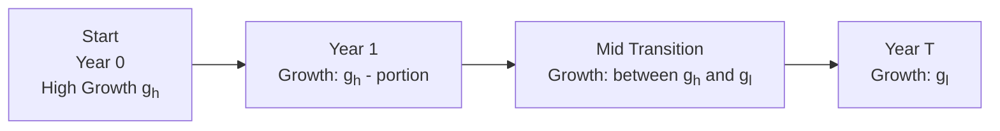

## Introduction and Context

The H-Model is a nuanced take on dividend discount models (DDMs). Many of us get comfortable with the Gordon Growth Model (the “single-stage DDM”), which assumes a constant dividend growth rate forever. But, in the real world, companies often go through transitions. Maybe they start growing like wildfire—10% or more—then slow down to a modest 3 or 4% once they mature. If you’ve ever analyzed a young tech company turned stalwart, you’ve witnessed that exact pattern. The high growth rate doesn’t vanish overnight; it gradually tapers off. The H-Model helps us capture that smooth shift from high growth (gₕ) to lower, stable growth (gₗ) over a specific transition period.

## Key Concepts and Underpinnings

Before diving into the formula, it’s good to recall that all DDMs rest on the premise that the intrinsic value of a stock stems from the present value of its future dividends. The big difference with the H-Model is that the expected growth rate isn’t immediately or uniformly “stable,” but rather decays linearly over time.

• gₕ (High Growth Rate): The initial, elevated dividend growth in the near term.  
• gₗ (Low or Stable Growth Rate): The more sustainable, long-run growth rate the firm eventually adopts.  
• H (Half-Life Parameter): Usually half the number of years of the transition period. If you anticipate the high-growth phase to fade over 10 years, H is 5.

## The H-Model Formula

The standard H-Model formula values the stock as follows:


\text{Value of the Stock} = \frac{D_0 \times (1 + g_\ell)}{r - g_\ell} \;+\; \frac{D_0 \times H \times (g_h - g_\ell)}{r - g_\ell},


where:  
• D₀ = The current dividend (most recent).  
• r = Required rate of return (or cost of equity).  
• gₕ = High growth rate in the near term.  
• gₗ = Long-term stable growth rate.  
• H = (Years of transition) / 2.

In plain English, this formula is actually two parts. The first part, (D₀ × (1 + gₗ)) / (r – gₗ), is like a Gordon Growth Model assuming the lower, stable growth rate. The second part, (D₀ × H × (gₕ – gₗ)) / (r – gₗ), adds the extra “oomph” from the gradual decline from gₕ to gₗ.

## Intuitive Understanding

If you’ve used a two-stage model that abruptly transitions from gₕ to gₗ, you might notice how unrealistic a sudden “switch” can feel. A lot of real companies don’t just slip from 10% growth in year 4 to 3% in year 5 with no middle ground. The H-Model tries to smooth that out, effectively saying, “We assume a linear path from that 10% to 3% over X years.” Think of it almost like slicing up the difference (gₕ – gₗ) across the transitional period so that each year the growth rate shifts slightly downward, meeting gₗ by the end.

Frankly, I’ve found this approach super helpful with cyclical companies that come out of a boom phase—they won’t sustain that big 12% growth once industry tailwinds slow, but they also won’t typically plummet to 3% next fiscal year. You can imagine a linear fade from 12% in Year 1 to 3% by Year 6 or 7, or however you see the transition unfolding.

## Common Assumptions and Parameters

1. Linear Decline: The growth rate is presumed to decline in a linear fashion from gₕ to gₗ.  
2. Stable Phase Beyond Transition: After the transition, the expectation is that the company will stay at gₗ indefinitely (like a stable, mature firm).  
3. Constant Payout Behavior: Dividends are assumed to continue being paid and grown in line with these projected rates. Changes to capital structure or payout policy can disrupt these assumptions.  
4. Known or Estimable Time Horizon: You pick an approximate “transition window.” If you think the shift from high to stable growth lasts 10 years, you set H = 5.

## Derivation at a Glance

Conceptually, the H-Model can be derived by imagining a short series of simple DDM sub-periods that gradually reduce from gₕ to gₗ. Summing all these sub-period present values yields an (almost) closed-form expression. The “almost” part is because we treat the decline as perfectly linear, which, in practice, might only be approximately true.

## Practical Example

Let’s do a quick hypothetical scenario:

• D₀ = $2.00  
• High Growth Rate (gₕ) = 9%  
• Stable Growth Rate (gₗ) = 3%  
• Required Rate of Return (r) = 10%  
• Transition Period = 10 years (so H = 5)

Following the formula:

1) First, compute the baseline value if the firm’s dividends grew at gₗ forever:  
   (D₀ × (1 + gₗ)) / (r – gₗ) = (2.00 × (1 + 0.03)) / (0.10 – 0.03)  
   = (2.00 × 1.03) / 0.07  
   = 2.06 / 0.07  
   = $29.43

2) Then, calculate the “extra” component from the linear fade:  
   (D₀ × H × (gₕ – gₗ)) / (r – gₗ) = (2.00 × 5 × (0.09 – 0.03)) / (0.10 – 0.03)  
   = (2.00 × 5 × 0.06) / 0.07  
   = (2.00 × 5 × 0.06) = 0.60 × 5 = 3.00  
   Actually let’s do it step by step: 2.00 × 5 = 10, multiplied by 0.06 = 0.60, oh wait, that’s an inconsistency—let’s do it carefully.  
   2.00 × 0.06 = 0.12, times 5 = 0.60. Right, so the numerator is 0.60.  
   Then 0.60 / 0.07 = approximately 8.57  

So, total value ≈ 29.43 + 8.57 = $38.00 (rounded a little).  

This $38 is an estimate that acknowledges the reality that dividend growth will gradually descend from 9% to 3%. You might compare it to a simple two-stage model or alternative multi-stage approaches for sanity checks.

## Mermaid Diagram: Growth Transition

Below is a simple timeline visualization of how the growth rate transitions from gₕ to gₗ. Notice the linear fade:



## Sample Python Code for H-Model Calculation

For those who prefer a quick computational approach, here’s a tiny Python snippet that calculates the H-Model price:

```python
def h_model_value(D0, g_high, g_low, r, transition_years):
    """
    Returns the estimated stock value using the H-Model.
    D0: current dividend
    g_high: high growth rate
    g_low: low (stable) growth rate
    r: required rate of return
    transition_years: total years over which high growth transitions to low growth
    """
    H = transition_years / 2.0
    # Part 1: Base Gordon Growth component at g_low
    base = (D0 * (1 + g_low)) / (r - g_low)
    # Part 2: Additional fade-in from high growth to low growth
    fade = (D0 * H * (g_high - g_low)) / (r - g_low)
    return base + fade

D0_example = 2.00
g_high_example = 0.09
g_low_example = 0.03
r_example = 0.10
transition_years_example = 10

value_estimate = h_model_value(D0_example, g_high_example, g_low_example, 
                               r_example, transition_years_example)

print(f"The estimated value is: ${value_estimate:.2f}")
```

## Limitations and Caveats

• Sensitivity to Inputs: The H-Model can be sensitive to the difference between gₕ and gₗ. If that gap is huge, the second term can heavily outweigh the first, making your valuation vulnerable to small errors in growth projections.  
• Transition Length Guess: We’re forced to pick how long the high growth will last. If we guess incorrectly, the model can overshoot or undershoot the true value.  
• Linear Assumption: Real businesses rarely proceed in perfect lines. If actual growth curves are more “step-like” or “uneven,” the H-Model might not capture those nuances.  
• The r – gₗ Constraint: Just like in other DDM approaches, you need r > gₗ for the model to make sense. If your stable growth rate somehow matches or exceeds r, you’ll either get nonsensical or infinity-like valuations.  

## Best Practices in Usage

• Cross-Check with Other Models: Often, analysts compare H-Model valuations to those from two- or three-stage DDMs. If the results diverge wildly, ask why.  
• Combine with Qualitative Insights: Are there reasons to believe the firm’s growth rate might ramp down more (or less) steeply? Keep a watchful eye on company fundamentals, management guidance, and industry outlook.  
• Keep Revisit Intervals Short: Revisit your H-Model assumptions regularly—dividend policies and growth patterns can shift faster than you think.  

## Real-World Anecdote

I once worked on a manufacturing company that had an unusually long fade from a robust 15% growth down to a modest 5%. Manufacturing expansions can be steady, but it turned out their shift to stable growth took over a decade because new technologies kept fueling moderate expansions. The H-Model was super helpful because it let me spread that higher growth out over a lengthier runway. Some old-school colleagues asked, “Why not just pick a simpler two-stage model?” Well, we did that too, just to compare. And guess what? The two-stage model’s abrupt switch gave us a significantly lower valuation. The H-Model turned out to match actual dividend policy patterns closer because the “slope” downward in growth was more faithful to reality.

## Final Thoughts and Cross-Reference

The H-Model is a handy approximate tool nested among other multi-stage dividend discount approaches. For more on multi-stage FCFE and advanced modeling, you might dip back to Section 9.8, “Multi-Stage FCFE Models with Changing Growth Patterns.” If you want to mix in capital structure changes, you’ll find the discussion on that in Chapter 9.2. Keep in mind, all these models rely on the same fundamental principle: the present value of expected future cash flows (or dividends). The more precise we get with growth assumptions, the closer we might come to a realistic fair value.

## References and Further Exploration

• CFA Institute Program Curriculum – Advanced Dividend Valuation Models.  
• Pinto, Henry, Robinson, and Stowe, “Equity Asset Valuation” – Great for deeper H-Model excursions.  
• Hackel and Livnat, “Cash Flow and Dividend Discount Models” – Insight into the reliability of DDMs in different market conditions.  
• Damodaran, “Investment Valuation” – Among the best references for multi-stage valuations and real-world application tips.  

## Test Your Knowledge on the H-Model and Dividend Growth



### Which of the following best describes the H-Model?  
- [x] It assumes dividend growth transitions linearly from a high rate to a stable rate.  
- [ ] It assumes no change in dividend growth over time.  
- [ ] It introduces negative growth from Year 1 onward.  
- [ ] It relies exclusively on free cash flow to equity.  

> **Explanation:** The H-Model is specifically designed for situations where dividend growth smoothly transitions from a high rate to a lower stable rate over time.

### In the H-Model formula, H is typically defined as:  
- [x] Half the number of years during which the growth rate shifts from high to stable.  
- [ ] Twice the number of years during which the growth rate remains high.  
- [ ] The entire length of time the company pays dividends.  
- [ ] The difference between r and gₗ.  

> **Explanation:** By definition, if the transition period is 10 years, H is set to 5.

### When applying the H-Model, what is the principal reason for including the second term (D₀ × H × (gₕ - gₗ)) / (r - gₗ)?  
- [x] To account for the gradual fade from gₕ to gₗ.  
- [ ] To capture fixed capital spending adjustments.  
- [ ] To add a risk premium for dividend uncertainty.  
- [ ] To ensure the denominator remains constant.  

> **Explanation:** The second term in the H-Model captures the “excess” dividends generated by the higher initial growth rate during the linear fade-down period.

### Which of the following can make the H-Model highly sensitive to small changes in assumptions?  
- [x] A large difference between gₕ and gₗ.  
- [ ] Strictly equal values for gₕ and gₗ.  
- [ ] A risk-free rate set to zero.  
- [ ] A short transition period.  

> **Explanation:** The difference (gₕ – gₗ) can magnify minute changes in input growth rates, leading to large swings in valuation.

### An analyst values a stock using the H-Model with a 6% gₕ, 2% gₗ, and a 10-year transition. Which statement is correct if she changes gₕ to 7% but keeps all else constant?  
- [x] The extra fade component increases, so the stock’s value rises.  
- [ ] The stable value portion (first term) increases, but the fade portion decreases.  
- [ ] The transition period decreases, reducing the half-life parameter.  
- [ ] The cost of equity must be recalculated accordingly.  

> **Explanation:** If gₕ increases from 6% to 7% (with the same gₗ), the difference (gₕ – gₗ) widens, increasing the second term’s contribution to total value.

### If an analyst picks a transition period that is too long, how does it affect the H-Model valuation?  
- [x] It likely overstates the incremental effect of high growth and inflates the valuation.  
- [ ] It prematurely reverts to the stable growth rate.  
- [ ] It invalidates the linear divisibility assumption.  
- [ ] It has no impact on the second term.  

> **Explanation:** Choosing a longer transition period (and thus a larger H) means you assume the company enjoys “excess growth” for an extended time, which increases the valuation.

### In practice, analysts often compare H-Model results with alternative valuation techniques because:  
- [x] The H-Model’s linear decline assumption can be unrealistic, thus cross-checking is prudent.  
- [ ] They must comply with IFRS regulations that forbid single-method valuations.  
- [ ] The H-Model only works for technology stocks.  
- [ ] Other methods frequently produce lower valuations by design.  

> **Explanation:** Many real-world growth patterns do not follow a perfect linear fade, so best practice is to cross-verify outcomes with other valuation models.

### From an exam perspective, which of the following is the most critical requirement for the H-Model?  
- [x] r > gₗ, to ensure the denominators remain positive and the valuation is finite.  
- [ ] gₗ must exceed gₕ.  
- [ ] All dividends must be paid annually in perpetuity without interruption.  
- [ ] The transition period must be three years or less.  

> **Explanation:** Like other dividend discount models, the discount rate must exceed the stable growth rate to generate a meaningful finite valuation.

### True or False: In the H-Model, if gₕ and gₗ are equal, the second term of the formula becomes zero.  
- [x] True  
- [ ] False  

> **Explanation:** The second term (D₀ × H × (gₕ – gₗ)) is multiplied by (gₕ – gₗ). When gₕ = gₗ, that difference is zero, making the second term vanish.

### True or False: The H-Model completely captures all real-world complexities in dividend payouts without any approximation.  
- [x] False  
- [ ] True  

> **Explanation:** The H-Model is still a simplified representation. It assumes a linear decay in growth, which may not precisely mirror future realities.


