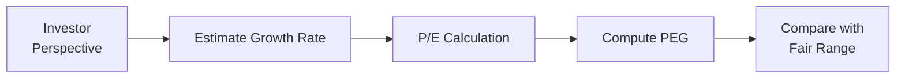
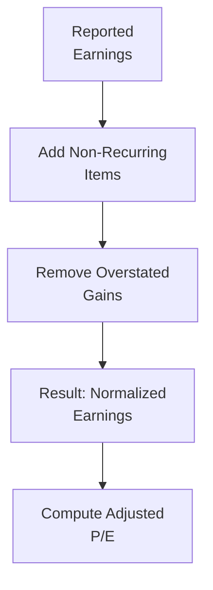

## Introduction

So, let's talk about something I remember puzzling over during my early days in equity research: we all know the Price-to-Earnings (P/E) ratio is a classic yardstick, but what happens when you throw growth into the mix? That’s where the PEG ratio steps in—P/E divided by expected earnings growth. It sounds straightforward at first, right? But as with most finance concepts, there’s a whole lot more beneath the surface. And what if the “E” part of P/E is less than perfect, requiring adjustments for cyclical or one-time items? That’s where Adjusted P/E Multiples become vital. 

In this section, we’ll do a deep dive into how the PEG ratio is calculated, what it implies, the hitches that come with using it, and then turn our attention to the intricacies of Adjusted P/E Multiples. And trust me, once you master these concepts, you’ll have a more nuanced appreciation for how analysts interpret valuation multiples. Let’s have some fun with it—well, as much fun as number-crunching can be!

## Understanding the PEG Ratio

The PEG ratio is essentially meant to standardize a firm’s P/E ratio by its growth rate. You can think of it like: “Sure, Company A has a high P/E, but they’re growing like crazy, so maybe that high P/E is justified.” Numerically, the PEG ratio is:


\text{PEG Ratio} \;=\; \frac{\text{P/E Ratio}}{\text{Expected Growth Rate}}


The expected growth rate is typically expressed as a percentage. For instance, if a company’s P/E is 20 and its expected annual earnings growth is 10%, the PEG ratio is:


\frac{20}{10} = 2.0


Some analysts will use the growth rate in decimal form (e.g., 0.10 for 10%), which would yield a PEG of 200. The key is consistency in your approach. Many prefer to keep the growth rate in percentage terms to avoid confusion.

### Why Growth Matters

Let’s say a firm’s earnings are expected to grow by 5% per year, while another competes at a 15% growth rate. We can’t just say one is “better” or “worse” purely on the P/E or purely on the growth rate. PEG helps combine both. 

If you recall from earlier chapters (for example, from our coverage of P/E multiples in Section 9.3), a higher P/E might signal overvaluation or a strong future outlook—or both. The PEG ratio tries to refine that reading: a high P/E may be justified if the company’s growth prospects are truly exceptional. The “rules of thumb” often say:  
• PEG around 1.0 may indicate something akin to “fair value.”  
• PEG below 1.0 might suggest undervaluation given growth.  
• PEG above 1.0 might indicate overvaluation—or simply robust growth that is priced, but not overpriced, into the stock.

However, these “rules” can be a bit too convenient. Companies in fast-changing industries like biotech can have elevated P/Es that remain “undervalued” anyway if growth surpasses projections. Meanwhile, mature industries may have lower P/Es and growth rates, making PEG interpretations trickier.

### Interpreting the PEG Ratio

Investors like to see how many “growth units” they get for each unit of P/E. But the growth estimate is always an assumption. Are we talking about next year’s growth? The next five years? A cyclical upturn? One-time revenue bumps? The reliability of the estimate is everything.

• If the growth rate is overestimated, then the PEG ratio might look artificially low and encourage you to think the stock is a bargain.  
• If the growth rate is underestimated, the opposite is true.  

So the PEG ratio is only as good as the growth estimate that goes into it. You’ll often see sell-side analysts present multiple scenarios (best, base, worst) for the growth rate, leading to different PEG outcomes.

### Potential Pitfalls of the PEG

1. Growth is rarely linear. A single growth rate might mask volatile ups and downs.  
2. Short-term vs. long-term. A high “next-year” growth rate might fizzle out.  
3. Industry differences. Some industries are cyclical, and looking at a single-year growth estimate might be misleading.  
4. Market sentiment. During bullish periods, any growth story might get inflated, so PEG alone won’t protect you from hype.  

It’s essential to realize that PEG, like all multiples, isn’t a magical valuation bullet. In fact, combining PEG with other measures—like the Free Cash Flow to Equity (FCFE) or Dividend Discount Models—can give you a richer picture (see earlier discussions in Section 9.1 and Section 9.2).

## Case Study: Using the PEG Ratio

Let’s say we have two companies in the robotics sector:

• RobotX (P/E = 30, Projected Growth = 20%)  
• MechTech (P/E = 25, Projected Growth = 10%)  

For RobotX:


\text{PEG} = \frac{30}{20} = 1.50


For MechTech:


\text{PEG} = \frac{25}{10} = 2.50


By looking at their PEG ratios, MechTech has a higher PEG, which might initially suggest it’s relatively more expensive given its expected growth. Of course, the question is: Are we sure that MechTech’s 10% forecast is accurate? Could it be 15%? Also, are we confident RobotX can achieve 20% growth? If RobotX’s growth was only 15%, the PEG rises to 2.0, meaning it’s not quite the bargain you might have thought. 

This example underscores the significance of the growth forecast—small changes can alter the perceived valuation dramatically.

## Adjusted P/E Multiples

Sometimes the “E” in P/E can be, well, messy. Companies have one-time gains or costs—maybe selling a business unit, or incurring a large restructuring charge. Or they might have intangible amortization that doesn’t reflect ongoing operations under IFRS or US GAAP. When these unusual items significantly distort reported earnings, we look to “normalize” or “adjust” them to get a clearer view of the company’s ongoing earning power.

### Common Adjustments

1. **Non-Recurring Items**  
   • Restructuring charges  
   • Lawsuit settlements  
   • Impairments  
   • Inventory write-downs  

2. **Share-Based Compensation**  
   Under IFRS and US GAAP, share-based compensation is an expense, but some analysts prefer adjusting it out if it’s large and lumpy—though others argue it’s a real cost.  

3. **Intangible Amortization**  
   Suppose a firm acquires another company and has to amortize intangible assets. Some argue this is a non-cash charge that doesn’t affect future operations. Others want to keep it in, especially if acquisitions are frequent.  

4. **Normalized Profit Margins**  
   For cyclical companies in industries like steel or autos, a single-year snapshot can be misleading if the economy is at a peak or trough. Analysts calculate “mid-cycle” earnings as a fairer representation.

### Calculating Adjusted Earnings

Here’s a simplified approach:

1. Start with the company’s bottom-line net income (under IFRS or US GAAP).  
2. Identify all one-time or irregular items.  
3. Determine which items you believe are truly non-recurring or non-economic.  
4. Add those back (or subtract them out, if it’s a one-time gain) to get adjusted net income.  
5. Divide the stock price by your adjusted EPS for an adjusted P/E.

### Example of Adjusted P/E

Imagine a tech company called BlueChip Tech. Reported EPS is $2.00, but the company had a $0.50/share restructuring charge (labeled one-time) and a $0.20 one-time gain on asset disposal. If the stock trades at $40, the reported P/E is 20x ($40 / $2.00).

But if you believe the restructuring charge was truly out-of-the-ordinary, you add it back: adjusted EPS becomes $2.50. If you also remove the $0.20 gain, you reduce EPS back down to $2.30:


\text{Adjusted EPS} = \$2.00 + \$0.50 - \$0.20 = \$2.30


Then:


\text{Adjusted P/E} \;=\; \frac{\$40}{\$2.30} \approx 17.4


Depending on your assessment of future repeatability of these events, that difference between 20x and 17.4x can be huge in shaping your valuation conclusions.

## Integrating PEG and Adjusted P/E

In many cases, an analyst might want to look at both the raw PEG ratio and a growth-adjusted multiple using adjusted earnings. This can offer a more comprehensive picture. For instance, you might calculate a “cleaner” P/Ebased ratio by removing known non-recurring items, then compute a PEG ratio off that adjusted earnings figure. 

Remember, though, that you’re layering assumptions on top of assumptions: first about adjustments, then about growth. Always keep your assumptions clear, documented, and test them with sensitivity analysis. 

## Best Practices and Common Pitfalls

• **Triangulate Valuations**  
  Don’t rely only on PEG or only on adjusted P/E. Use multiple measures such as FCFE-based valuations or dividend discount models for cross-checking.

• **Forecast Reliability**  
  Growth estimates can be optimistic—especially from company management. Make sure to benchmark growth rates against past performance, industry averages, and macroeconomic conditions.

• **Peer Group Comparisons**  
  If you’re looking at a cyclical auto manufacturer, compare its adjusted P/E to peers also in the cyclical auto space. The same goes for growth rates.

• **Extra Scrutiny of “One-Time” Items**  
  Sometimes companies call the same type of charge “non-recurring” year after year. Analyze whether it’s truly one-off or if it’s more or less recurring in nature.

• **Be Mindful of Accounting Standards**  
  IFRS vs. US GAAP can differ on how certain expenses or revenues are recognized. This might influence your adjustments. Check for footnotes in the financial statements.

• **Assess the Time Horizon**  
  For PEG, are you measuring 1-year growth or 5-year growth? The further out you go, the bigger the margin for error.

## Conclusion and Final Exam Tips

PEG ratios and Adjusted P/E multiples are powerful tools that add layers of insight to the standard P/E approach. The PEG ratio helps you see whether a high P/E might be justified by robust growth. Meanwhile, Adjusted P/E ensures that the “E” we use actually represents true, sustainable earnings. 

For exam-day success (and real-world success, too), be ready to:  
• Evaluate how changes in growth assumptions can alter the PEG ratio.  
• Spot tricks in financial statements where a company might call recurring costs “one-time.”  
• Recalculate earnings for cyclical firms using normalized figures.  
• Cross-verify your valuations with other metrics—like FCFE or Residual Income.  

And if you get a constructed-response question on the exam that asks you to identify non-recurring items and compute an adjusted multiple, carefully reference any company footnotes or disclaimers. Then be sure to articulate which adjustments you consider valid or not—and why. If the question also asks for a growth assumption, reference industry benchmarks or macro data to support your final number.

Good luck, and may you never be led astray by the illusions of unadjusted P/Es or inaccurate growth forecasts!

## References

• CFA Institute curriculum for Equity Analysis, “Equity Analysis: Industries and Companies.”  
• Lynch, Peter. “One Up on Wall Street” (original proponent of the PEG ratio).  
• IFRS and US GAAP guidelines for share-based compensation and intangible amortization.  
• Relevant sections in Chapter 9 of this Volume on Dividend Discount Models, FCFE Approaches, and Multiples-based valuation.

---

## Test Your Knowledge: PEG Ratios and Adjusted P/E Multiples



### Which statement best describes the PEG Ratio?

- [ ] It is the ratio of a company’s growth rate to its earnings per share.  
- [x] It is a company’s P/E ratio divided by its earnings growth rate.  
- [ ] It is always a more reliable valuation metric than the pure P/E ratio.  
- [ ] It is purely a forward-looking ratio that disregards historical data.  

> **Explanation:** The PEG ratio is calculated by taking the P/E ratio and dividing it by the company’s expected earnings growth rate.  

### How can an overly optimistic earnings growth forecast affect the PEG ratio?

- [x] It can make the PEG ratio appear deceptively low.  
- [ ] It will always inflate the PEG ratio.  
- [ ] It has no impact because PEG is backward-looking.  
- [ ] It only matters if the company is cyclical.  

> **Explanation:** Since the PEG ratio divides the P/E by the growth rate, overstated growth leads to a smaller denominator, artificially lowering the PEG ratio.  

### When adjusting earnings to calculate an Adjusted P/E multiple, which item is least likely to be removed from reported earnings?

- [ ] One-time gains from a discontinued operation.  
- [ ] Restructuring charges that do not recur frequently.  
- [x] Routine share-based compensation for employees.  
- [ ] Legal settlements for one-off lawsuits.  

> **Explanation:** Routine share-based compensation can be an ongoing and material expense. Many analysts argue it is a real cost that should remain in earnings, though specific practices vary.  

### A company with a Price of $50 and reported EPS of $2.50 had a $0.60 one-time restructuring charge and a $0.20 one-time gain. What is its Adjusted EPS?

- [ ] $3.30  
- [ ] $2.10  
- [x] $2.90  
- [ ] $3.10  

> **Explanation:** Adjusted EPS = 2.50 + 0.60 – 0.20 = 2.90.  

### Which of the following is a potential weakness of using the PEG ratio?

- [x] It relies heavily on uncertain earnings growth forecasts.  
- [ ] It does not incorporate cyclical considerations.  
- [ ] It only measures past performance.  
- [ ] It fails to incorporate share prices.  

> **Explanation:** PEG is useful but is highly sensitive to the accuracy of the projected earnings growth rate.  

### If a firm’s P/E is 25 while its growth rate is 25%, how is the PEG ratio typically calculated?

- [ ] PEG = 25 / 0.25 = 100  
- [x] PEG = 25 / 25 = 1.0  
- [ ] PEG = 0.25 / 25 = 0.01  
- [ ] PEG = (25 + 25) / 2 = 25  

> **Explanation:** Analysts typically keep the growth rate in percentage form when calculating PEG.  

### Which of the following best describes “Normalized Earnings?”

- [ ] Earnings that include only taxes and depreciation.  
- [x] Earnings adjusted to remove cyclical spikes or troughs, providing a more sustainable level of profitability.  
- [ ] Earnings measured under IFRS but not US GAAP.  
- [ ] Earnings after factoring in share-based compensation.  

> **Explanation:** Normalized earnings represent a mid-cycle approximation of a company’s profitability, stripped of unusual or extreme fluctuations.  

### In practice, why might analysts calculate both a raw PEG ratio and one using adjusted earnings?

- [x] To account for potential non-recurring items embedded in reported earnings while still assessing growth implications.  
- [ ] To comply with IFRS rules that require parallel calculations.  
- [ ] To maintain consistent methodology with bond analysts.  
- [ ] It is mandated by all local regulators.  

> **Explanation:** Using adjusted earnings ensures you remove distortions, while still benefiting from the growth perspective offered by the PEG concept.  

### A high PEG ratio could imply all of the following except:

- [ ] Possibly overvaluation.  
- [ ] Growth assumptions that may be too optimistic.  
- [ ] Investors are paying a high price for each unit of growth.  
- [x] The stock has low volatility in the market.  

> **Explanation:** A high PEG ratio often points to a potentially high price relative to growth; it does not necessarily say anything about the stock’s volatility.  

### True or False: Non-recurring items should generally be added back to earnings when calculating an Adjusted P/E.

- [x] True  
- [ ] False  

> **Explanation:** By definition, non-recurring items are not part of the sustainable earnings figure and are commonly adjusted out to arrive at an earnings measure that better reflects ongoing profitability.  


