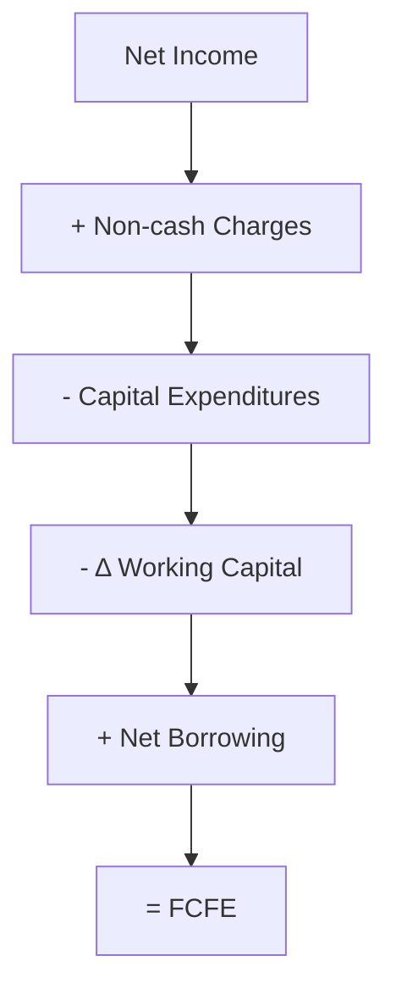

## Introduction and Core Concepts

Free Cash Flow to Equity (FCFE) is often seen as the “cash leftover” for common shareholders after a firm pays its operating expenses, invests in long-term assets, handles working capital needs, and meets its debt commitments. You might wonder, “Why should I bother with FCFE if I can just look at a company’s dividends?” Good question. Some firms don’t pay dividends (or pay fewer dividends than their cash flows might support), so using dividend-based valuation models like the Dividend Discount Model (DDM) in such cases can miss a big part of the story. By focusing on FCFE, analysts can capture the actual cash that flows to equity holders—even if that cash is not (currently) paid out as dividends.

Many practicing analysts rely on FCFE models to estimate a more direct measure of a firm’s intrinsic value. This approach is especially useful for growth companies reinvesting significant earnings or for cyclical firms whose dividends fluctuate. Essentially, the FCFE approach states: “Let’s see how much money ends up in shareholders’ hands if the company chose to distribute it.”

## The FCFE Formula

Before diving into growth assumptions and multi-stage projections, it helps to internalize the basic FCFE formula. One widely used expression is:

$$
\text{FCFE} = \text{Net Income} + \text{Non-cash Charges} - \text{Capital Expenditures} \\
\quad - \Delta \text{Working Capital} + \text{Net Borrowing}
$$

• Net Income (NI): This is what remains of a company’s revenue after subtracting operating expenses, interest, and taxes.  
• Non-cash Charges (NCC): Common examples include depreciation, amortization, and sometimes stock-based compensation if it’s a material cost not impacting cash.  
• Capital Expenditures (CapEx): Cash spent on long-term investments like new machinery, factories, or software.  
• Δ Working Capital (ΔWC): The difference between current operating assets and current operating liabilities from one period to the next.  
• Net Borrowing (NB): New debt issued minus debt repaid. Borrowing more increases the cash available to shareholders; repaying outstanding debt reduces it.

To visualize, here’s a small flowchart capturing how we arrive at FCFE:

This formula focuses on “owner’s earnings,” a concept sometimes attributed to Warren Buffett. FCFE effectively captures the net cash that could be paid to shareholders without impairing the company’s operations or growth prospects.

## Single-Stage FCFE Valuation

Sometimes you deal with companies whose FCFE growth rate you expect to remain relatively stable for the foreseeable future (like big, mature firms). In this scenario, the single-stage FCFE model (sometimes called a constant-growth model) could be the simplest approach. It mirrors the perpetuity formula in dividend-based valuations but uses FCFE instead of dividends:

$$
V_0 = \frac{\text{FCFE}_1}{r - g}
$$

Where:  
• \\( \text{FCFE}_1 \\) is the expected FCFE in one year.  
• \\( r \\) is the required return on equity (i.e., cost of equity).  
• \\( g \\) is the expected constant growth rate of FCFE.

Key assumptions:  
1. FCFE will grow at a constant rate \\( g \\).  
2. The cost of equity \\( r \\) remains the same over time.  
3. \\( r > g \\) (otherwise, the formula breaks down mathematically).

This single-stage approach is great if you truly think growth will remain stable—like if you’re analyzing a utility company with a fairly predictable market. But if you suspect a different growth pattern—rapid expansion followed by a slowdown, for instance—then you should consider multi-stage models.

## Multi-Stage FCFE Models

Not every company has stable growth. In reality, many young firms go through phases of intense growth before “slowing down” into a more mature phase. Thus, a multi-stage FCFE model might be more realistic. Let’s consider a two-stage example for demonstration:

1. **Stage 1** (High-growth period): From Year 1 to Year \\( n \\), assume FCFE grows at a higher rate, \\( g_1 \\).  
2. **Terminal Stage** (Stable growth period): From Year \\( n+1 \\) onward, assume the growth rate drops to \\( g_2 \\), reflecting a more mature business environment.

At the end of the first stage (Year \\( n \\)), you need to estimate a terminal value (TV) to capture all future cash flows beyond that point:

$$
\text{TV}_n = \frac{\text{FCFE}_{n+1}}{r - g_2}
$$

Then, you discount all FCFE amounts in the first stage plus the terminal value back to the present:

$$
V_0 = \sum_{t=1}^{n} 
\frac{\text{FCFE}_t}{(1 + r)^t} + \frac{\text{TV}_n}{(1 + r)^n}
$$

This is just one type of multi-stage model. If the growth pattern is more nuanced—like three or four distinct growth phases—analysts sometimes expand the model accordingly.

### Example: Two-Stage FCFE

Imagine a software company that’s relatively new and enjoying a 15% annual FCFE growth for the next five years (High-growth Stage). After that, the firm’s product lines mature, and growth flattens to 5% forever (Stable-growth Stage). Suppose the FCFE in the coming year is $10 million, the required return on equity \\( r \\) is 12%, and you want to do a two-stage valuation covering these phases:

• **Stage 1**: Years 1–5, FCFE grows at 15%.  
• **Stage 2**: Year 6 onward, FCFE grows at 5%.  

For Year 1:  

\text{FCFE}_1 = 10 \text{ million} \times (1 + 15\%) = \$11.5 \text{ million}


You’d calculate \\(\text{FCFE}_2, \text{FCFE}_3, \dots, \text{FCFE}_5\\) similarly, discount them back at 12%. Then the terminal value at the end of Year 5 is:


\text{TV}_5 = \frac{\text{FCFE}_6}{r - g_2} 


= \frac{ \text{FCFE}_5 \times (1 + 5\%) }{0.12 - 0.05}


Finally, discount that \\(\text{TV}_5\\) back five years. Summing all discounted FCFE for the first five years plus the discounted terminal value would give you \\(V_0\\), an estimate of the firm’s value today.

## Growth Rate Considerations

Choosing a realistic growth rate for FCFE isn’t always straightforward. I remember a friend once got a bit carried away analyzing a startup in a hot sector—she used a 20% growth rate for 25 years. That’s basically off the charts! In practice, you should consider:

• **Historical FCFE patterns** (if the firm’s older than a few years).  
• **Industry outlook** and the company’s market share trajectory.  
• **Reinvestment rates**: Companies can’t grow quickly without plowing capital back into the business.  
• **Economic or business cycle effects**: Growth might slow in a recession.  

Overestimating growth can severely inflate your valuation. Underestimating it can make you pass on big opportunities. A balanced, well-researched approach is usually best.

## Required Return on Equity (r)

The discount rate, \\( r \\), is often derived from the Capital Asset Pricing Model (CAPM) or from other multifactor models (see Section 9.12 for more on CAPM and factor models). Whichever approach you choose, it’s important that \\( r \\) reflects the systematic risk of the equity investment. If you pick a discount rate that’s too low, you’ll inflate the value. If it’s too high, you may undervalue the equity.  

## Comparing FCFE to Other Models

In practice, analysts will typically cross-check their FCFE-based valuation with at least one other method, like:

• **Dividend Discount Model (DDM)**, especially if the firm has a stable payout policy (see Section 9.1).  
• **Relative Valuation** using price multiples like P/E or EV/EBITDA (see Section 9.3).  
• **Residual Income Models** if the firm’s accounting numbers are more readily available and accurate (see Section 9.6).

Discrepancies among these approaches can raise questions. For instance, you might discover the company has a huge reinvestment plan that’s not obvious through a simple dividend yield. The FCFE model would pick this up, but a naive DDM might miss it entirely.

## Potential Pitfalls and Best Practices

1. **Ignoring Balance Sheet Effects**: Sometimes folks forget to properly account for net borrowing. If a company is aggressively paying down debt, your FCFE can be drastically lower.  
2. **Overly Optimistic Growth Assumptions**: It’s super tempting to put, say, 30% growth in perpetuity. But that’s rarely sustainable.  
3. **Mismatching Forecast Horizons**: In multi-stage models, be realistic about when a company transitions from rapid expansion to steady-state growth.  
4. **Inconsistent Discounting**: Make sure the FCFE, growth rates, and discount rates logically align. If you measure everything in real terms (excluding inflation), do the same across the board.  

## Practical Example

Let’s do a mini numeric example to bring it to life. Suppose a firm has:

• **Net Income**: \$50 million  
• **Non-cash Charges (Depreciation + Amortization)**: \$15 million  
• **CapEx**: \$20 million  
• **Δ Working Capital**: \$5 million (increase)  
• **Net Borrowing**: \$10 million  

Then:


\text{FCFE} = 50 + 15 - 20 - 5 + 10 = \$50 \text{ million}


As you can see, net borrowing of \$10 million helped offset those CapEx and working capital needs, leaving total FCFE at \$50 million. If management chooses, they can use these funds for dividends, share repurchases, or keep them on the balance sheet. But from a valuation standpoint, it’s the shareholder’s money—even if it’s just in the bank.

## ESG and FCFE

An increasingly discussed dimension is environmental, social, and governance (ESG) factors. While not unique to FCFE, you might incorporate ESG variables into your forecast if you expect them to impact the firm’s cost of equity \\( r \\) (due to perceived risks) or capital expenditures (e.g., investments in cleaner technologies). Although still evolving, Chapter 10 addresses ESG considerations more broadly.

## Integrating FCFE with Overall Equity Valuation

FCFE forms a key component of the broader equity valuation toolkit:

- For high-growth companies, the multi-stage FCFE approach is often more realistic than single-stage dividend discounting.  
- For stable, dividend-paying firms with minimal debt changes, an FCFE model may closely mirror a DDM.  
- Combining FCFE with scenario and sensitivity analyses (see Chapter 8.4 on scenario analysis) can yield robust insights into how changes in business drivers (like revenue growth or CapEx) affect overall valuation.

## Exam Tips and Wrap-Up

From an exam standpoint, you’ll want to remember:

• **Core Formula**: FCFE = NI + NCC – CapEx – ΔWC + Net Borrowing.  
• **Valuation**: Single-stage vs. multi-stage approaches.  
• **Growth Rates**: How to handle near-term vs. long-term growth.  
• **Comparison**: Recognize when DDM might be an alternative and why results might differ.  
• **Complexities**: Adjusting for large changes in debt or working capital.  

Be ready for practice questions that ask you to compute FCFE given a few financial statement items, then discount that FCFE at the appropriate required return on equity. You might also see conceptual questions testing your understanding of why or when you should use FCFE over other valuation models. Good luck, and remember that focusing on actual cash flows to equity holders is often the purest way to measure a company’s worth.  

## References and Further Reading

- CFA Institute Program Curriculum, “Equity” sections on cash flow valuation.  
- Pinto, Jerald E., CFA, et al. “Equity Asset Valuation.” Wiley.  
- Damodaran, Aswath. “Damodaran on Valuation: Security Analysis for Investment and Corporate Finance.” Wiley.  
- Penman, Stephen H. “Financial Statement Analysis and Security Valuation.” McGraw-Hill.  
- Chapter 8 (Company Analysis—Forecasting) and Chapter 9 (Equity Valuation—Concepts and Basic Tools) in this volume for deeper coverage of forecasting and valuation.

--------------------------------------------------------------------------------

## Test Your Knowledge: Free Cash Flow to Equity (FCFE) Models



### Which of the following is the best definition of Free Cash Flow to Equity (FCFE)?

- [ ] Cash flow from operations plus depreciation and amortization.
- [x] Cash flow available to common shareholders after all operating expenses, reinvestment, and debt-related payments.
- [ ] Cash flow from operations minus dividends.
- [ ] Cash flow from investing minus the cost of capital.

> **Explanation:** FCFE is the cash that remains after funding operations, paying expenses, dealing with required reinvestments (CapEx, working capital), and meeting debt obligations (including net borrowing).

### An analyst wants to use a single-stage FCFE model. She projects the FCFE next year to be \$5 million, assumes a required return on equity of 10%, and a constant growth rate of 4%. Which formula correctly represents the value today?

- [ ] V₀ = 5 / (0.04 - 0.10)
- [ ] V₀ = 5 × (1 - 0.04) / (0.10)
- [x] V₀ = 5 / (0.10 - 0.04)
- [ ] V₀ = 5 / 0.10 + 5 × 0.04

> **Explanation:** The single-stage FCFE model is FCFE₁ / (r - g). Here FCFE₁ = \$5m, r = 10%, g = 4%, so V₀ = 5 ÷ (0.10 - 0.04) = \$83.33m.

### The term “Net Borrowing” in the FCFE formula is generally defined as:

- [ ] All new equity issues minus dividends.
- [ ] A method to repurchase shares in the open market.
- [x] New debt issuance minus debt repayments in a given period.
- [ ] Depreciation and amortization charges for the period.

> **Explanation:** Net borrowing is the incremental cash flow from taking on new debt and paying back existing debt. It's added to net income (adjusted for non-cash items, capital expenditures, and working capital changes) to arrive at FCFE.

### If a firm’s debt-to-equity ratio is expected to increase over the coming years, what is the most likely impact on FCFE, all else being equal?

- [x] FCFE will generally increase because net borrowing is higher.
- [ ] FCFE will generally decrease because net borrowing is lower.
- [ ] There would be no effect on FCFE from a higher debt-to-equity ratio.
- [ ] FCFE is unrelated to changes in net borrowing.

> **Explanation:** Greater borrowing typically provides more cash inflows (as long as the firm is issuing more debt than repaying), thus boosting FCFE.

### Which of the following is NOT a typical reason to prefer an FCFE model over a Dividend Discount Model (DDM)?

- [ ] The company pays little or no dividends.
- [ ] The company’s dividend payout is irregular or highly discretionary.
- [ ] You want a comprehensive measure of cash that could be paid to shareholders.
- [x] The company has negligible capital expenditures.

> **Explanation:** Low capex doesn’t automatically favor FCFE over DDM. Sometimes a stable dividend payer with low CapEx requirements can be valued well using DDM. FCFE is often preferred for companies that pay no or minimal dividends because it captures the cash that could be returned to shareholders even if it is not distributed.

### In a two-stage FCFE model, you typically need to estimate:

- [x] FCFE during the high-growth years, then a terminal value at the start of stable growth.
- [ ] FCFE for the stable-growth stage only.
- [ ] Only the constant growth rate; an explicit forecast is unnecessary.
- [ ] Dividends paid in the high-growth period plus net borrowing.

> **Explanation:** A two-stage FCFE model requires projecting specific FCFE amounts during the initial (high-growth) phase, plus a terminal value calculated at the transition to stable growth.

### If the cost of equity (r) used in an FCFE model is too high, you will most likely:

- [x] Underestimate the equity value.
- [ ] Overestimate the equity value.
- [ ] Arrive at an identical value compared with DDM.
- [ ] Not affect the valuation since FCFE is unaffected by r.

> **Explanation:** The discount rate has an inverse relationship to present value. A higher discount rate compresses the present value of future FCFE, leading to a lower valuation.

### A firm has a Net Income of \$80 million, non-cash charges of \$10 million, capital expenditures of \$20 million, an increase in working capital of \$5 million, and net borrowing of \$4 million. Calculate FCFE.

- [ ] \$60 million
- [x] \$69 million
- [ ] \$85 million
- [ ] \$75 million

> **Explanation:** FCFE = 80 + 10 - 20 - 5 + 4 = \$69 million.

### One of the main advantages of using FCFE models is:

- [ ] They are unaffected by capital structure changes.
- [x] They reflect the actual cash flows available to equity shareholders.
- [ ] They ensure the dividend payout ratio is optimal.
- [ ] They do not require assumptions about growth.

> **Explanation:** FCFE models are useful because they focus on the actual cash flows that can be returned to equity owners.

### True or False: In a multi-stage FCFE valuation, the terminal value should be discounted back to today at the cost of debt.

- [x] True
- [ ] False

> **Explanation:** Actually, this statement is tricky. The cost of equity (not the cost of debt) is used to discount FCFE-based valuations. This statement is false in the sense that you do NOT use the cost of debt for discounting; you must use the cost of equity to discount future equity cash flows.


