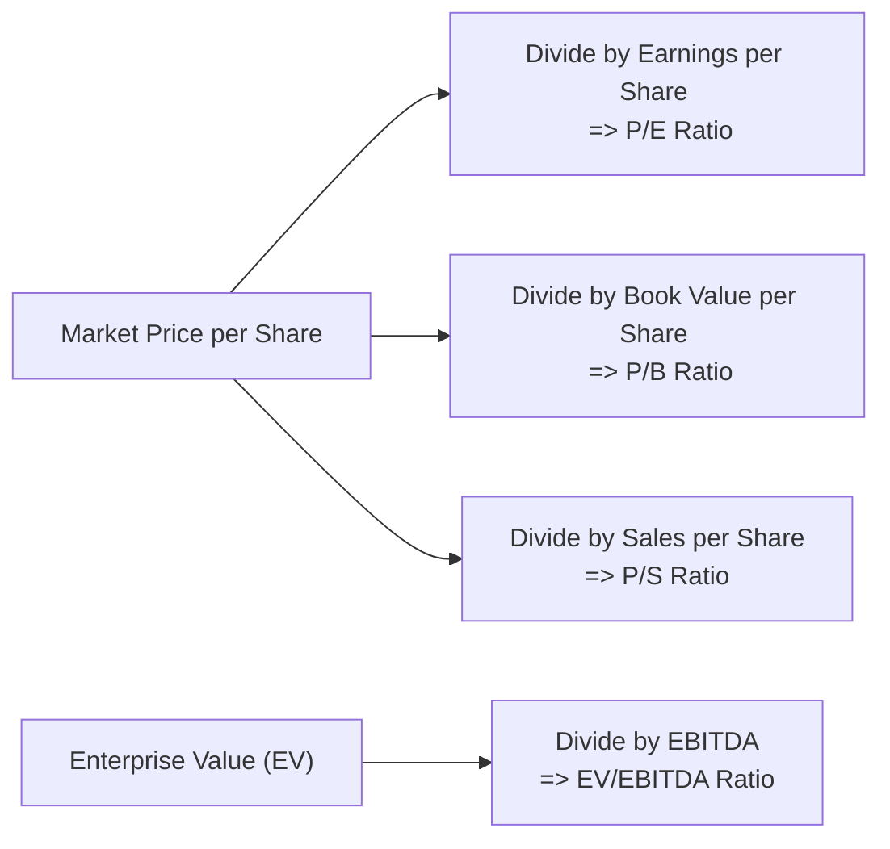

## Introduction

Ever chat with a friend about investing and wonder how folks decide if a stock is cheap or expensive? One tried-and-true approach is to use price multiples. And while this method sounds fancy, it’s basically about dividing a company’s market value by one of its fundamental measures—like earnings, book value, sales, or cash flow. In this section, we’ll explore why price multiples remain a staple in equity valuation, how to use them correctly, and the pitfalls you should avoid. After all, it can be all too easy to take one glance at a price-to-earnings (P/E) ratio and jump to conclusions. Let’s dig deeper and add a bit of nuance to your toolkit.

## Understanding the Basics of Price Multiples

Price multiples provide a simple way to compare different companies or the same company over time. They’re called “multiples” because they tell us how many times a fundamental measure (e.g., earnings) investors are willing to pay.

It’s sort of like buying a house: if two houses are similar in size and location, you might check the price per square foot to see which one’s a better deal. Similarly, in the equity world, we might check the “price per $1 of earnings” or “price per $1 of book value.”

In official terms, price multiples are often used for relative valuation—comparing a company’s metric to averages of peers or entire market indexes. If a company’s P/E is far above or below peers, we naturally ask why.

Below is a simple flowchart illustrating this concept:

## Key Price Multiples

### Price-to-Earnings (P/E) Ratio

• Formula:  

\text{P/E Ratio} = \frac{\text{Market Price per Share}}{\text{Earnings per Share}}


The P/E ratio is arguably the most well-known price multiple. It answers the question, “How many dollars am I paying for each dollar of this company’s earnings?” Let’s say a stock is trading at \$20 per share and its earnings per share (EPS) is \$2. Then the P/E is 10. That means the market values each dollar of earnings at \$10.

• Common Uses and Considerations  
  1. Quick Benchmark: You can rapidly compare a company to sector averages or the market.  
  2. Affected by Accounting Choices: Different methods of depreciation or revenue recognition can distort EPS.  
  3. Impacted by One-Time Items: A big gain (or loss) in one quarter can inflate (or deflate) EPS, thus skewing the ratio.

From personal experience, I once compared two technology stocks by P/E alone and missed that one had temporarily boosted earnings by selling off a patent. The ratio looked great, but realistically, the underlying operations were still lagging.

### Price-to-Book (P/B) Ratio

• Formula:  

\text{P/B Ratio} = \frac{\text{Market Price per Share}}{\text{Book Value per Share}}


If you’ve ever heard someone say, “This stock is trading below book value—what a bargain!” that person is referring to the P/B ratio. Book value per share usually represents a firm’s total assets minus liabilities, divided by the number of shares outstanding. A P/B ratio under 1.0 might suggest a heavily undervalued stock—or a company with serious problems.

• Typical Applications  
  1. Financial and Asset-Intensive Industries: For banks or real estate companies, the balance sheet is central to how they operate and generate profits.  
  2. Evaluating Distressed or Liquidation Scenarios: The P/B ratio can highlight whether the market believes the firm’s assets are overstated or underappreciated.  
  3. Intangible Assets: Firms with large intangible assets (e.g., brand names, patents) might be misleadingly undervalued on a book-value basis because intangible assets often aren’t fully captured on the balance sheet under certain accounting standards.

### Price-to-Sales (P/S) Ratio

• Formula:  

\text{P/S Ratio} = \frac{\text{Market Price per Share}}{\text{Sales per Share}}


This ratio is often used for companies that lack robust earnings—for instance, early-stage firms or cyclical players in a downturn.

• Why Analysts Love P/S  
  1. Less Manipulation: Sales are typically harder to manipulate compared to earnings.  
  2. Valuing Startups: Newer companies might have negative or negligible earnings, so P/E is meaningless but P/S can provide a starting point.  
  3. Industry Benchmarks: Sectors like software-as-a-service (SaaS) are sometimes valued on multiples of revenue because the market expects high future growth.

However, watch out if a company’s sales are artificially inflated by promotions or if it’s failing to manage costs. A high P/S alone isn’t always a sign of overvaluation if the company’s growth prospects are exceptional.

### EV/EBITDA (Enterprise Value–to–EBITDA)

• Formula:  

\text{EV/EBITDA} = \frac{\text{Enterprise Value}}{\text{Earnings Before Interest, Taxes, Depreciation, and Amortization}}


Enterprise Value (EV) is calculated as:


\text{EV} = \text{Market Capitalization} + \text{Total Debt} - \text{Cash and Equivalents}


EBITDA is a proxy for operating cash flow. Thus, EV/EBITDA measures the overall firm value (debt + equity) relative to the core operating income (EBITDA).

• Key Advantages  
  1. Accounts for Different Capital Structures: Because EV includes debt, two companies with different financing approaches can be more accurately compared.  
  2. Minimizes Accounting Distortions: EBITDA strips out depreciation and amortization, making cross-comparison among capital-intensive industries a bit easier.  
  3. M&A Context: In takeover scenarios, buyers often assume the target’s debt, so EV/EBITDA is a common approach.

• Cautions  
  1. Ignores Capital Expenditures: Depreciation is excluded, so you might underestimate the effect of heavy future capital spending.  
  2. Potential Overstatement of Operating Cash Flow: EBITDA is not identical to free cash flow.

## The Mechanism of Relative Valuation

Relative valuation involves contrasting a chosen ratio (e.g., P/E) against an appropriate benchmark such as:  
• Peer group averages  
• Sector or industry indexes  
• Overall market indexes  
• The company’s own historical multiples

If a firm’s P/E is 15 while the industry average is 20, you might suspect it’s undervalued—unless the firm has structural issues justifying the discount. Always ask why a multiple is higher or lower.

In practice, analysts build “comparable company” lists to gauge the average or median multiple across a relevant peer set. Then they’ll either:  
1. Compare the target firm’s ratio to the group’s.  
2. Calculate implied values by applying the average multiple to the target’s fundamentals (e.g., EPS or EBITDA).

## Ensuring Apples-to-Apples Comparisons

Remember that not all earnings are created equal. Differences in accounting standards (IFRS vs. U.S. GAAP), revenue recognition, or intangible asset treatments can distort the multiples. Here are a few things to watch out for:

1. Consistent EPS Calculation: Is the EPS diluted? Are one-time charges excluded?  
2. Adjust for Off-Balance-Sheet Items: Operating leases, pensions, or intangible assets can significantly change the effective book value or enterprise value.  
3. Capital Structure Differences: If one company used mostly debt to finance growth and another primarily used equity, you need to consider the added leverage.

## Strengths and Limitations of Price Multiples

### Strengths

• Quick Snapshot: Rapidly gives you a sense of valuation for screening or quick checks.  
• Easy to Convey: Easy to explain to clients or executives, “This stock trades at 12 times earnings.”  
• Broad Market Acceptance: Commonly used across industries, so you’ll find plenty of comparable data.

### Limitations

• Oversimplification: A single ratio can’t capture a company’s complexities, such as strategic moats, intangible assets, or cyclical fluctuations.  
• Can Be Influenced by Non-Recurring Items: M&A gains, write-offs, or tax credits can distort earnings-based multiples.  
• Sensitive to Shifts in Growth Expectations: Multiples can drastically expand or contract when market sentiment changes.

## Practical Example: Building a Comparable Company Analysis

Let’s try a simple, hypothetical scenario:  

• Your company, Alpha Corp, has:  
  - Stock price: \$50  
  - EPS: \$5  
  - Book value per share: \$40  
  - Sales per share: \$80  
  - EBITDA (annual) per share: \$10 (assuming 100 shares outstanding, total EBITDA = \$1,000)  
  - Debt: \$2,000  
  - Cash: \$500  
  - Market cap: \$5,000 (i.e., price \$50 × 100 shares)

• Calculate the following:  
  1. P/E = 50 / 5 = 10  
  2. P/B = 50 / 40 = 1.25  
  3. P/S = 50 / 80 = 0.625  
  4. EV = 5,000 + 2,000 – 500 = \$6,500  
  5. EV/EBITDA = 6,500 / 1,000 = 6.5

Next, gather the same info from Beta Corp and Gamma Corp—two close peers of Alpha. Suppose the industry average P/E is 12, and EV/EBITDA is 7. Then you might conclude Alpha trades slightly below the industry average. Is that because investors are missing something, or do they see slower future growth? That’s the essential detective work of equity analysis.

## Exam Relevance and Tips

From the CFA exam perspective, especially at Level I (and across subsequent levels), you’re expected to:

• Know how to calculate each multiple quickly.  
• Recognize when one multiple is more appropriate than another.  
• Discuss the limitations of each multiple (e.g., negative earnings complicate P/E).  
• Apply relative valuation to assess if a stock is over- or undervalued compared to peers.  
• Understand how different accounting treatments or capital structures can affect multiples.

When confronted with a constructed-response question or an item set, be ready to:  
1. Perform computations under time pressure (e.g., “Calculate the EV/EBITDA for each firm and compare to an industry average.”)  
2. Interpret the results with reference to the firm’s fundamentals.  
3. Consider adjustments for non-recurring items or differences in accounting.  

Pro tip for exam day: If you notice multiple choice answers with a suspiciously big difference in price multiples, double-check the numerator (market price, EV) or denominator (EPS, EBITDA) for potential changes from non-core items. Don’t forget to see if the problem statement indicates share buybacks or new equity issuance that might alter the share count.

## Best Practices and Potential Pitfalls

• Look Beyond the Ratio: If a P/E ratio looks oddly low, investigate the company’s recent earnings. Are they sustainable?  
• Combine Multiples: Emphasize more than one ratio for a holistic view—e.g., P/E plus EV/EBITDA.  
• Adjust for Growth Rates: A high multiple might be justified by robust growth, so focus on forward expectations.  
• Beware Cyclical Industries: Earnings can swing wildly (e.g., energy, airlines, commodities). In these cases, trailing P/E might be misleading; you might prefer an average of normalized earnings.  
• Holistic Industry Perspective: Compare with carefully chosen peers. A single outlier peer can skew the average drastically.

## References

• CFA Institute, “Financial Statement Analysis”  
• Koller, Tim, et al. Valuation: Measuring and Managing the Value of Companies. McKinsey & Company.  
• Graham, Benjamin, and David Dodd. Security Analysis.  
• IFRS and U.S. GAAP guidelines on financial statement presentation.

## Final Thoughts

Just like you wouldn’t buy a pair of shoes based solely on size without checking comfort or style, you shouldn’t bet everything on a single price multiple. Sure, they’re an indispensable part of the valuation toolbox, but complement them with a deep dive into the company’s fundamentals, industry position, and future growth prospects. And if one ratio is telling a drastically different story from the others, well, there’s the sign you should investigate a little more.

Keep practicing. The more you navigate real-world (and hypothetical) scenarios, the better you’ll be at picking the right multiples and interpreting them accurately. Good luck!

## Test Your Knowledge: Price Multiples and Relative Valuation



### Which price multiple is typically the most sensitive to capital structure differences?

- [ ] Price-to-Sales (P/S)
- [ ] Price-to-Earnings (P/E)
- [ ] Price-to-Book (P/B)
- [x] EV/EBITDA

> **Explanation:** EV/EBITDA includes both debt and equity, capturing how capital structure affects the total valuation of the firm.

### A high Price-to-Sales (P/S) ratio generally indicates:

- [x] Investors are paying more per dollar of sales, potentially reflecting strong growth expectations.
- [ ] The company’s shares are undervalued.
- [ ] The firm has low revenue and no growth potential.
- [ ] The company has a high dividend payout ratio.

> **Explanation:** A high P/S ratio means the market values each dollar of the firm’s revenue more highly. It may or may not signal overvaluation; context matters, especially growth prospects.

### When analyzing a P/E ratio, which of the following is a common cause of distortions?

- [ ] Low share price
- [x] One-time gains or losses affecting net income
- [ ] Stable capital structure
- [ ] Recessionary environments only

> **Explanation:** One-time gains or losses directly impact earnings, making the P/E appear higher or lower than typical operating performance would suggest.

### A stock trades at $60 per share, and its stated book value per share is $40. The Price-to-Book ratio is:

- [ ] 0.66
- [x] 1.5
- [ ] 2.0
- [ ] 2.5

> **Explanation:** Price-to-Book = $60 / $40 = 1.5.

### If Company X and Company Y have identical enterprise values, but Company X has higher debt, what can we typically infer about Company X’s market capitalization?

- [x] Company X’s market cap is likely lower.
- [ ] Company X’s market cap is likely higher.
- [x] Company X’s share price and number of shares are irrelevant for determining market cap.
- [ ] Company X’s market cap is the same as Company Y’s.

> **Explanation:** Enterprise Value = Market Cap + Debt – Cash. If EV is the same and debt is higher, market cap is usually lower to compensate (unless there’s a big difference in cash).

### Which price multiple is most commonly used to value companies with negative earnings?

- [ ] P/E ratio
- [ ] EV/EBITDA
- [x] P/S ratio
- [ ] P/B ratio

> **Explanation:** If earnings are negative, a P/E can’t be calculated meaningfully. P/S is often used as a workaround, especially in young or high-growth companies that are not yet profitable.

### A technology startup has been losing money for three years but has rapidly growing quarterly sales. Which ratio would equity analysts likely apply first for a quick valuation?

- [ ] P/E ratio
- [ ] Price-to-Book ratio
- [x] Price-to-Sales ratio
- [ ] EV/EBITDA

> **Explanation:** With negative earnings, a P/E ratio can be misleading (or simply not feasible). Analysts often look to sales-based multiples in such cases.

### One of the main benefits of EV/EBITDA is that it:

- [ ] Neglects leverage and focuses only on equity.
- [ ] Hides non-recurring items.
- [x] Incorporates debt and equity, enabling comparisons across different capital structures.
- [ ] Is easier to calculate than the P/E ratio.

> **Explanation:** Because EV includes both debt and equity, comparing it to EBITDA provides a more comprehensive look at a firm’s valuation than equity-only measures.

### If a firm’s P/B ratio is below 1.0, an analyst should:

- [x] Investigate why the market is discounting the firm’s net assets.
- [ ] Conclude immediately that the stock is undervalued.
- [ ] Assume future sales are likely to rise sharply.
- [ ] Always regard it as a growth stock.

> **Explanation:** A below-1.0 ratio could indicate an undervalued firm—or underlying issues concerning its assets or business prospects. Further analysis is essential.

### Price multiples are a convenient tool for comparing companies because they:

- [x] Provide a quick benchmark while allowing for simple cross-firm comparison.
- [ ] Remove the need for any fundamental analysis.
- [ ] Are invariant across accounting standards.
- [ ] Eliminate all market noise.

> **Explanation:** Price multiples offer a straightforward check but should be combined with deeper fundamental analysis. They do not neutralize all noise (accounting and other differences must be considered).


