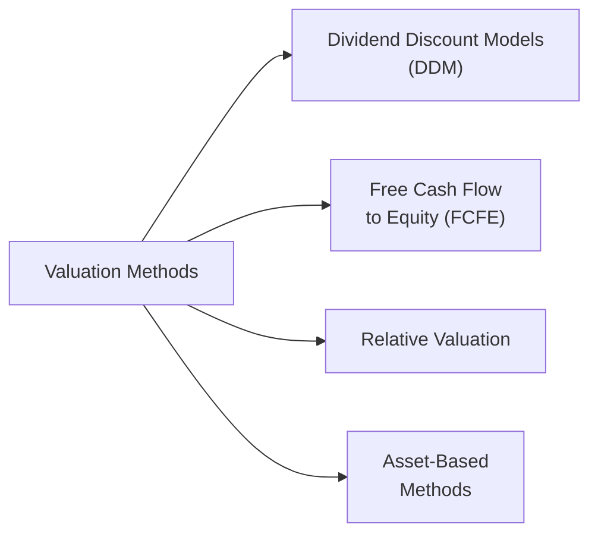

## Introduction

Valuing equities can sometimes feel like gazing down a winding road with a lot of twists and turns—you have multiple maps to guide you, but they each provide a slightly different route. In practice, analysts often use more than one valuation tool, cross-verifying and reconciling their results to build confidence in their conclusions. But what makes one approach more suitable than another in certain situations? And when might a technique’s limitations overshadow its theoretical elegance?

This section explores the core strengths and limitations of main equity valuation techniques—Dividend Discount Models (DDM), Free Cash Flow to Equity (FCFE) models, Relative Valuation, and Asset-Based Methods. We’ll also talk about how to reconcile different approaches to arrive at a balanced perspective. While the underlying math can be rigorous, the goal here is to build an intuitive grasp of each approach’s practical uses and to highlight common pitfalls. You’ll see references to advanced concepts (like scenario analysis or cost of equity computation), which you can revisit in earlier or later sections of this curriculum for deeper context. And I might drop in a quick anecdote or two about how these methods have hinted at unexpected results in real-world scenarios—sometimes in ways that made me raise an eyebrow or two.

For clarity, let’s start with a visual overview of the primary valuation techniques:

Each of these methods digs into a different aspect of firm value, relying on various assumptions about growth, risk, and expected returns. Let’s take them one by one.

## Dividend Discount Models (DDM)

### Brief Overview

Dividend Discount Models are often taught first because they feel elegantly simple: a stock’s value is the present value of all future dividends. In pure theory:


\text{Value}_0 = \sum_{t=1}^{\infty} \frac{D_t}{(1+r)^t},


where Dᵗ is the dividend at time t and r is the required rate of return.

### Strengths

• Theoretical purity: DDM thrives when dividends reliably track a firm’s long-term earnings power. It’s rooted in the idea that dividends are the actual cash flows shareholders pocket.  

• Easy to communicate: Many investors understand “my paycheck from this stock is its dividend,” so discounting those payments resonates intuitively.  

• Good fit for stable, mature firms: Companies in stable industries (e.g., utilities, some consumer staples) often have predictable, steady dividends, making a DDM quite powerful.  

### Limitations

• Dividend policy vs. economic reality: Companies often alter dividends in ways not perfectly aligned with long-term earnings (maybe cutting dividends to finance a major project). If dividends are erratic or not reflective of underlying earning power, DDM can produce misleading results.  

• Scale and timing: Some high-growth or early-stage firms either pay no dividends or have unpredictable payouts. In such cases, DDM is unworkable unless you project hypothetical dividend patterns.  

• Overreliance on r and g assumptions: If your inputs for required return (r) or growth (g) are slightly off, the final value can shift dramatically (particularly in multi-stage DDMs).  

## Free Cash Flow to Equity (FCFE) Models

### Brief Overview

FCFE models attempt to measure actual cash flows a firm can distribute to common shareholders after all expenses, reinvestment, and debt repayments. Think of it as a more “holistic” approach—beyond reported dividends, it looks at the real pot of money left for equity holders.


\text{Value of Equity} = \sum_{t=1}^{\infty} \frac{\text{FCFE}_t}{(1 + r)^t}.


### Strengths

• Flexibility in capturing economic reality: Unlike DDM, FCFE does not rely on a firm’s stated dividend policy. Instead, it looks at the money that could have been paid out.  

• Good for companies with variable dividend policies: Growth companies that plow back earnings might show zero actual dividends, yet have high free cash flow, making FCFE more relevant.  

• Direct link to firm operations and capital structure: Because FCFE factors in capital investments, changes in working capital, and net borrowing, it is less likely to ignore large financing or investment decisions.  

### Limitations

• Complexity and data intensity: Calculating FCFE accurately demands careful projection of capital expenditures, depreciation, changes in working capital, and debt flows. This can become complicated—especially if the firm’s capital structure is in flux.  

• High sensitivity to assumptions: If your forecast for CapEx or working capital needs is off, your FCFE forecast can swing widely.  

• Heavily reliant on stable capital structure assumptions: If the company frequently issues or repays debt unpredictably, modeling FCFE consistently can be tricky.  

## Relative Valuation

### Brief Overview

If you’ve ever heard “this stock trades at 15× earnings, while that peer trades at 18× earnings,” you’re talking about Relative Valuation. Common multiples include Price/Earnings (P/E), Price/Book (P/B), Price/Sales (P/S), and EV/EBITDA.

### Strengths

• Simple and market-oriented: You quickly see how a firm stacks up to peers on a variety of metrics.  
• Identifies potential mispricing: If a target firm’s multiples differ significantly from the industry norm, it could be undervalued or overvalued.  
• Easy to communicate: Many professional investors, corporate finance managers, and the financial press talk multiples—so it’s an accessible language.  

### Limitations

• Ignores firm-specific nuances: A company might have unique growth prospects or risk factors that aren’t captured by broad industry multiples.  
• Susceptible to market over- or under-valuation: If the overall sector is in a bubble, you might get artificially inflated multiples for “fair value.”  
• Inconsistent across sectors: Some sectors have consistently high multiples due to intangible assets or growth expectations (e.g., tech) which can hamper cross-sector comparisons.  

## Asset-Based Methods

### Brief Overview

Asset-based methods sum up the fair value of a company’s assets minus its liabilities. Often used as a “floor” valuation, it’s particularly relevant for companies in liquidation or in capital-intensive industries.

### Strengths

• Provides a tangible baseline: In distressed valuation scenarios, the liquidation or replacement cost of assets sometimes sets a minimum.  
• Less influenced by forecasting risk: Instead of guessing future growth or discount rates, you focus on existing asset valuations.  
• Useful for asset-heavy firms: Companies in real estate, insurance, or shipping often anchor on the appraised value of tangible assets.  

### Limitations

• Ignores intangible value: Growth opportunities, brand equity, or intangible assets might not show up properly on the balance sheet.  
• Can be outdated quickly: Market values of assets, especially intangible or specialized assets, can shift dramatically.  
• Not always relevant for going concerns: Most operating companies have value far beyond the net sum of their assets.  

## Reconciling Valuations (Triangulation)

In real-world valuation exercises, analysts often apply more than one method—especially for complex or high-stakes transactions. The practice of triangulation means weighting different valuation approaches by their perceived relevance, firmness of assumptions, and stage of the firm’s life cycle.

Ask yourself: Does the FCFE approach look drastically different from the DDM? If so, is that because management retains high earnings to reinvest? Or are we missing some hidden financing costs? Are the Price/Earnings multiples giving us a sense that the market sees something special about the company’s growth trajectory, while the asset-based approach suggests a fairly low baseline?

It’s in reconciling these values that a well-rounded perspective emerges:

• Consider the reliability of each method’s assumptions.  
• Analyze outliers: Why does one approach produce a significantly higher or lower value?  
• Reassess growth rates, discount rates, or any big changes in capital structure or dividend policy.  

## Sensitivity Analysis

One reason valuations can differ so widely is the sensitivity of certain models to key inputs, like growth rates or discount rates (r). Scenario and sensitivity analyses let you test whether your central assumptions hold water. For example, you might ask: “If growth stays at 4% instead of 6%, does the fair value measure shift by 5%, or by 50%?” Many a professional investor has learned the importance of performing these sensitivity checks—some the hard way, by seeing how a tiny change in discount rate can slash their estimated fair value in half.

## Empirical Data

In any valuation, bridging the gap between theory and real-world application relies on empirical data: actual historical financials, observed market multiples, and industry benchmarks. You may calibrate your FCFE forecasts using five years of a firm’s historical capital expenditures. Or you might pick a peer group for relative valuation based on real-time data of close competitors. The quality and relevance of these data points have a direct impact on the reliability of your final valuation. 

## Practical Example: Blending Methods

Let’s hypothesize a consumer products firm, “Lapai Foods.” They have a modest dividend policy but often repurchase shares instead of paying large dividends. Pop that scenario into your mind, and we quickly see:

• A strict DDM might undervalue Lapai Foods because the relatively small dividend yield doesn’t correctly represent the large free cash flow used for buybacks.  
• An FCFE model might show a higher fair value once we account for robust free cash flow overshadowing the modest dividend.  
• Relative Valuation might show Lapai Foods trading at a discount to the sector average due to lower reported earnings in the short term, if they’ve ramped up marketing spend.  
• Even an Asset-based approach might be interesting, but it could be too conservative if intangible brand value fails to show up on the balance sheet.

In reconciling these results, an analyst might weigh the FCFE approach a bit more than DDM—but also check the relative multiples to ensure the final valuation doesn’t drift too far from what market players are paying for comparable names. This approach to blending ensures no single method’s limitations overshadow the final conclusion.

## Common Pitfalls and Best Practices

• Blind reliance on multiples: Resist the urge to simply say “The sector average P/E is 18×, so that’s the fair multiple.” Different firms within the same sector can have widely varying business models and risk profiles.  
• Overlooking capital structure changes: If heavily indebted firms plan to pay down debt, future free cash flows might rise significantly. You want to incorporate that into your FCFE modeling.  
• Ignoring intangible assets: If a company’s intangible assets—like specialized technology or brand prestige—aren’t recognized in an asset-based approach, it’s easy to underestimate the true value.  
• Failing to stress-test assumptions: Run sensitivity analyses on discount rates, long-term growth rates, and short-term cyclical changes, especially if your firm is cyclical or prone to economic downturns.  

## Glossary

• Sensitivity Analysis: A technique that tests how valuation changes if a key input (like growth or the discount rate) deviates from the central assumption.  
• Empirical Data: Actual historical or market-based inputs used for calibrating projections or comparing realized trends against theoretical models.  
• Reconciling Valuations (Triangulation): The process of using multiple valuation approaches to arrive at a final, reasoned value range for an equity.  

## References and Further Reading

• CFA Institute Program Curriculum – Valuation Best Practices and Methodologies  
• Pinto, J. E., “Equity Asset Valuation,” (CFA Institute Investment Series) – provides a comparative overview of popular discount models and relative valuation.  
• For deeper dives on advanced topics such as multi-stage FCFE, see the sections on forecasting growth patterns in advanced corporate finance texts.  

---

## 10 Practice Questions: Strengths and Limitations of Valuation Techniques



### Which of the following is a key limitation of Dividend Discount Models (DDMs)?
- [ ] They cannot be applied to mature firms with stable dividends.
- [ ] They undervalue companies with high dividend payout ratios.
- [x] Their accuracy often suffers when dividends do not match the firm's actual earnings power.
- [ ] They do not require any inputs for growth rates or discount rates.

> **Explanation:** DDMs assume dividends serve as a direct measure of a firm's total distributable cash flow. When dividends differ significantly from a firm’s true earnings power, DDM results can be distorted.

### Free Cash Flow to Equity (FCFE) models are particularly sensitive to:  
- [ ] The company’s dividend payout ratio.  
- [x] Capital expenditures and changes in working capital assumptions.  
- [ ] The historical patterns of share repurchases.  
- [ ] Market sentiment about the overall stock market.  

> **Explanation:** FCFE is derived from operating cash flows, capital expenditures, and net debt flows. Errors in forecasting CapEx or working capital can lead to large misestimates of FCFE.

### A primary advantage of Relative Valuation is:
- [x] It can quickly identify potential mispricing by comparing a firm’s valuation multiples to industry peers.  
- [ ] It reveals a company’s true liquidation value.  
- [ ] It requires no market data.  
- [ ] It yields a definitive intrinsic value independent of market conditions.

> **Explanation:** Relative Valuation hinges on comparing industry or peer multiples. It’s a useful approach for spotting potential anomalies, although it depends heavily on market pricing.

### One weakness of Relative Valuation is that:
- [x] It can inherit over- or underpricing from the overall market or sector.  
- [ ] It automatically accounts for intangible assets.  
- [ ] It is never suitable for cyclical industries.  
- [ ] It always requires complex forecasting of CapEx.  

> **Explanation:** If the entire sector is over- or undervalued, simply matching peer multiples might give an erroneous impression of “fair” value.

### Asset-based methods are most appropriate when:
- [x] You are assessing a firm’s liquidation or breakup value.  
- [ ] The company has a robust trademark portfolio with no tangible assets.  
- [x] The company operates in a capital-intensive industry where tangible assets dominate.  
- [ ] You need a forward-looking measure of potential future growth.  

> **Explanation:** Asset-based approaches can provide a “floor” value, especially suitable for liquidation scenarios or asset-heavy businesses. However, they may ignore significant intangible growth opportunities.

### Which statement best captures the rationale behind using multiple valuation methods (a “triangulation” approach)?
- [ ] Each valuation method is accurate only for specific industries and must be used alone for best results.  
- [ ] Investors typically prefer DDM and never rely on other approaches.  
- [x] Different methods address distinct aspects of value; reconciling them can provide a more complete view.  
- [ ] Relative Valuation never conflicts with asset-based methods, so both are redundant.  

> **Explanation:** Triangulation combines various angles—a more complete picture of fair value emerges by comparing results from multiple approaches.

### When is DDM likely to be most accurate?
- [x] For a mature firm with stable and predictable dividends.  
- [ ] For a high-growth startup yet to declare any dividend.  
- [x] For a utility company with a long track record of steady dividend increases.  
- [ ] For a company that finances growth by consistently cutting dividends to zero.  

> **Explanation:** Firms that have stable, predictable dividends—often found in mature industries like utilities—frequently yield reliable DDM valuations.

### In an FCFE valuation, which of the following would decrease the estimated equity value, holding everything else constant?
- [x] Increasing capital expenditure assumptions.  
- [ ] Decreasing the discount rate.  
- [ ] Decreasing the working capital requirements.  
- [ ] Decreasing dividend payments.  

> **Explanation:** Higher CapEx projections reduce FCFE, thus lowering the estimated equity value when discounting future cash flows.

### A major drawback of asset-based methods for going-concern valuation is:
- [x] They may ignore significant intangible or growth-related value beyond tangible assets.  
- [ ] They are the only approach requiring a discount rate.  
- [ ] They cannot be used if the firm trades at a premium to its book value.  
- [ ] They always overvalue companies in manufacturing industries.  

> **Explanation:** Asset-based methods focus on tangible asset values and often fail to capture intangible growth opportunities, making them less relevant for healthy going concerns.

### True or False: Reconciling different valuation results can help identify unrealistic assumptions or data errors.
- [x] True  
- [ ] False  

> **Explanation:** A major benefit of performing multiple valuations is the opportunity to cross-check assumptions. Significant discrepancies invite review of model inputs, revealing mistakes or unrealistic projections.


