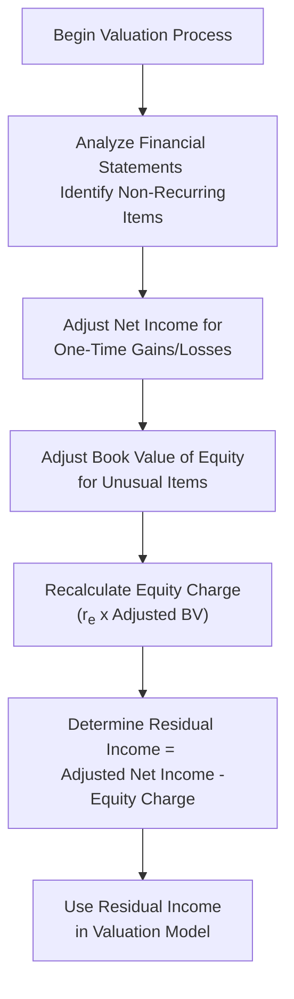
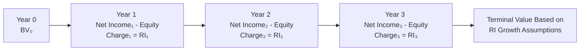

## Introduction

Residual Income (RI) models aim to measure the economic profit that a company generates over and above its cost of equity. Unlike dividend discount or free cash flow models, which focus on cash distributions or free cash flows, RI models place net income in the spotlight—adjusting for a notional equity charge. That equity charge represents the shareholders’ required rate of return multiplied by the book value of equity. In other words, the RI framework examines whether the company’s net income clears a hurdle rate set by shareholders’ opportunity costs.

In practice, analysts often prefer RI models for firms that do not pay dividends, that have volatile or unpredictable cash flows, or for those undergoing equity restructuring. One important consideration, however, is making sure net income is “clean”—meaning that you’ve adjusted out any one-time items that might distort how well (or poorly) the business is performing. In this section, we will break down the components of a Residual Income approach, discuss the adjustments for non-recurring items, and highlight practical steps for implementing these models in your valuation toolkit.

## Fundamental Concept of Residual Income

Residual income can be expressed in a straightforward equation:


\text{Residual Income} = \text{Net Income} - r_{e} \times \text{Book Value of Equity},


where:
- Net Income is the reported income after all operating expenses, interest, and taxes.
- \\( r_{e} \\) is the required return on equity (or cost of equity).
- Book Value of Equity is the shareholders’ equity on the balance sheet, ideally adjusted for any accounting anomalies.

The term \\( r_{e} \times \text{Book Value of Equity} \\) is sometimes called the “equity charge.” You can think of it like the cost of renting capital from shareholders. If the net income doesn’t cover that “rent,” the firm is not creating value for its shareholders; if it exceeds the charge, it is generating economic profit.

### Relationship to Shareholder Value Creation

For advanced equity analysis, the RI model ensures that investors are not content solely with net profit in absolute terms. Instead, they compare it to how much they need to earn to justify the risk of owning the stock. This is especially relevant for growth companies that invest heavily in R&D, or cyclical businesses whose free cash flows fluctuate significantly over time.

## Clean Surplus Relationship

A key assumption behind residual income models is the so-called “clean surplus” relationship. Essentially, clean surplus states that:


\text{Ending Book Value of Equity} = \text{Beginning Book Value of Equity} + \text{Net Income} - \text{Dividends}.


Under clean surplus accounting, changes in book value flow through net income or dividends alone, not through other comprehensive income (OCI). In practice, you’ll find that certain items—like foreign currency translation adjustments or changes in pension obligations—may bypass the income statement and appear in OCI. As an analyst, you must adjust or at least understand how these bypassing items affect the reported book value if you want a consistent application of residual income valuation. Without these adjustments, your calculated RI can misrepresent the true economic profitability.

## Equity Charge: Required Rate of Return and Book Value

### Required Rate of Return on Equity

Selecting the correct \\( r_{e} \\) (cost of equity) is a crucial step. Often, analysts employ the Capital Asset Pricing Model (CAPM) to estimate the cost of equity:


r_{e} = R_f + \beta \left( R_m - R_f \right),


where:
- \\( R_f \\) is the risk-free rate (e.g., long-term government bond yield).
- \\( R_m - R_f \\) is the equity market risk premium.
- \\( \beta \\) measures the company’s sensitivity to the overall market return.

Other approaches include multifactor models that integrate additional risk factors beyond CAPM, or the bond-yield-plus-risk-premium approach that adds a risk spread to corporate bond yields. Whichever method you adopt, consistency is key.

### Book Value of Equity

Book Value of Equity is often your anchor for computing the equity charge. However, intangible assets, goodwill, or revaluation reserves under IFRS can obscure the real capital base. Similarly, write-downs, share buybacks, or large extraordinary charges might artificially reduce equity. To interpret the results accurately, you may need to restate the book value to reflect a more “normal” capital structure.

## Non-Recurring Items and the Need for Adjustments

### Identifying Non-Recurring Items

Non-recurring items are unusual or infrequent events that can inflate or deflate net income in a single (or fleeting) accounting period. Examples include:

- Restructuring charges or large layoffs.
- Impairment of goodwill.
- One-time litigation settlements.
- Gains or losses from asset sales.
- Natural disaster–related expenses.
- Acquisition-related costs (e.g., integration costs).

For residual income analysis, it’s essential to isolate these items so you don’t mistakenly treat them as part of ongoing operational performance.

### Making Adjustments to Income and Book Value

Analysts often perform these adjustments to depict the “true” sustainable profitability:

1. Remove One-Time Gains and Losses: Subtract out (or add back) the net after-tax effect of these unusual items from net income.  
2. Adjust Balance Sheet: If a large write-off or restructuring changes the equity value, consider whether this item truly affects ongoing book value or if it’s an accounting-based restatement.  
3. Consider Tax Effects: Non-recurring items often come with unique tax treatments—deferred tax assets or liabilities may appear on the balance sheet. An overstatement of tax benefits could distort net income.  
4. Maintain Consistency Over Multiple Periods: If you’re doing a multi-period RI model, ensure that each period’s net income and book value reflect comparable accounting treatments.

By doing so, your model’s measure of residual income aligns more closely with the normalized economic profit tied to recurring operations.

## Incorporating Residual Income into Equity Valuation

### Single-Stage Residual Income Valuation

In the simplest form, you can value equity with a single-stage model:


\text{Intrinsic Value} = \text{Book Value}_0 + \frac{\text{Residual Income}_1}{r_e - g},


where:
- \\(\text{Book Value}_0\\) is the current (adjusted) book value of equity.
- \\(\text{Residual Income}_1 = E_1 - r_e \times \text{Book Value}_0\\), with \\(E_1\\) representing expected net income in the next period.
- \\(g\\) is the long-term growth rate in residual income, assumed to be constant.

This single-stage approach mirrors the idea behind Gordon Growth–type dividend models but uses residual income as the growth variable instead of dividends.

### Multi-Stage Models

For companies expected to grow at different rates, a multi-stage residual income approach can be deployed. You might forecast \\(E_t\\) and \\(BV_t\\) for several years (Stage 1), each time calculating residual income:


\text{RI}_t = E_t - r_e \times BV_{t-1},


Then, you discount each year’s residual income and add it to the beginning book value. Finally, you include a terminal value for the period beyond your forecast horizon. Because each year’s net income and book value might require adjustments to account for new share issuances, buybacks, or large non-recurring events, multi-stage RI can get quite detailed.

## Practical Steps in Adjusting for Non-Recurring Items

Below is a simplified flowchart illustrating the workflow for adjusting earnings before applying a residual income model:

### Step-by-Step Considerations

1. Gather Financial Data: Collect at least three to five years of income statements, balance sheets, and statements of comprehensive income.  
2. Identify One-Time Items: Thoroughly examine footnotes to see if any large charges or unusual events occurred.  
3. Adjust Net Income: Add back or subtract these items on an after-tax basis to derive a normalized figure.  
4. Align Book Values: If large write-offs or intangible revaluations have significantly altered equity, assess whether these book value changes are truly part of the ongoing capital structure.  
5. Compute Equity Charge: Multiply your adjusted book value by the cost of equity from your chosen model (e.g., CAPM).  
6. Derive Residual Income: Subtract the equity charge from the adjusted net income.  
7. Repeat for Forecast Horizon: If you’re building a multi-year model, maintain consistent adjustments while projecting future earnings and book values.

## Merits and Drawbacks

### Merits

- Works for Non-Dividend-Paying Firms: Useful when dividends are zero or erratic.  
- Emphasizes Value Creation Above Cost of Capital: Highlights whether management is adding or destroying shareholder value.  
- Ties Directly to GAAP/IFRS Statements: Leverages widely available accounting data, though you should adjust for policy differences.

### Drawbacks

- Sensitive to Accounting Distortions: Requires vigilance around accounting manipulations or incomplete reporting.  
- Requires Multiple Adjustments: Non-recurring items, off-balance-sheet financing, or intangible assets can complicate the process.  
- Clean Surplus Violation: Certain items may bypass the income statement, making it hard to maintain a “clean” link between income and book value.

## Example: Simplified Residual Income Valuation

Suppose a hypothetical company, InnovateTech, has:
- Current Book Value of Equity (BV₀) = $500 million  
- Next Year’s Projected Net Income (E₁) = $60 million  
- Required Rate of Return (rₑ) = 10%  
- Forecast Growth Rate of Residual Income (g) = 3%  

However, InnovateTech just recognized a one-time loss of $10 million on the disposal of an unprofitable business segment. This $10 million is included in the $60 million net income. After carefully analyzing, you decide that $8 million of that loss was truly non-operational and will not recur in future periods, and the tax rate on this item was 25%.

1. Adjust Net Income:  
   - After-tax effect of $8 million is \\(8 \times (1 - 0.25) = \$6\\) million.  
   - So the adjusted net income for forecasting is \\( \$60 + \$6 = \$66 \\) million.

2. Adjust Book Value:  
   - Assume the disposal did not permanently reduce BV; it was more an accounting reclassification. So BV₀ remains $500 million for the sake of this example.

3. Equity Charge = \\( r_e \times BV_0 = 0.10 \times 500 = \$50 \\) million.

4. Residual Income_1 = Adjusted Net Income - Equity Charge = \$66 - \$50 = \$16 million.

5. Value Using Single-Stage RI Model:  
   
   \text{Intrinsic Value} = BV_0 + \frac{\text{RI}_1}{r_e - g} 
   = 500 + \frac{16}{0.10 - 0.03} 
   = 500 + \frac{16}{0.07} 
   = 500 + 228.57 
   = \$728.57 \text{ million.}
   

In practice, you would refine many aspects of this example—especially the book value adjustments—if the disposal had broader effects on company strategy or synergy. But it illustrates the rationale behind pulling out non-recurring items to avoid penalizing (or artificially boosting) the core net income.

## Additional Representation: Multi-Period Residual Income Timeline

A multi-period approach may look like this:

Each year’s net income might require a new set of adjustments, especially if the firm posts fresh non-recurring items.

## Common Pitfalls and Practical Strategies

- Over- or Underemphasizing One-Time Gains/Losses: Carefully weigh whether an item is truly non-recurring or just part of the firm’s normal “boom and bust” cycle.  
- Ignoring Changes in OCI: Many IFRS or US GAAP adjustments hit Other Comprehensive Income. This complicates the “clean surplus” assumption.  
- Incorrect Tax Treatment: Non-recurring items might have partial tax shielding or unusual tax consequences.  
- Inconsistent Capital Structures: Frequent share buybacks, new equity issuance, or convertible securities can shift the book value in ways that hamper straightforward calculations.  
- Overlooking Management Bias: Sometimes, management might present recurring costs as “one-off charges” to dress up the bottom line.

## Conclusion and Exam-Focused Insights

Residual income valuation is a powerful tool, especially when dividends are elusive, or free cash flow is erratic. By aligning net income with an “equity charge,” you can measure whether a business is truly covering its cost of capital. However, to glean reliable RI estimates, it’s vital to make thoughtful, consistent adjustments for non-recurring events—both on the income statement and balance sheet side. 

In the context of exam scenarios, expect to see questions that challenge your ability to:
- Identify which items are truly non-recurring.  
- Adjust book value and net income for anomalies.  
- Calculate a proper cost of equity.  
- Forecast residual income under changing growth assumptions.

Remember to review footnotes, weigh management disclosures, and maintain a consistent approach to all periods under analysis. Engaging these steps carefully puts you in a strong position to address exam items dealing with nuanced equity valuation scenarios.

## References

- CFA Institute, “Equity Investments” curriculum readings.  
- McKinsey & Company, “Valuation: Measuring and Managing the Value of Companies,” particularly chapters on economic profit and residual income.  
- International Financial Reporting Standards (IFRS) and US GAAP guidance on non-recurring items and disclosures.  
- Damodaran, A., “Investment Valuation,” for additional insights on alternative cost-of-equity estimations and data sources.

--------------------------------------------------------------------------------

## Test Your Knowledge: Residual Income Valuation and Non-Recurring Items



### Which formula best represents the concept of residual income (RI)?

- [ ] RI = Net Income – (g × Book Value of Equity)
- [ ] RI = Dividends – (Cost of Equity × Book Value of Debt)
- [x] RI = Net Income – (Required Return on Equity × Book Value of Equity)
- [ ] RI = (Cost of Equity × Net Income) – Book Value of Equity

> **Explanation:** Residual income is typically defined as Net Income minus the equity charge, i.e., (Required Return on Equity × Book Value of Equity).

### A non-recurring charge is most accurately described as:

- [ ] Any expense reported in the income statement
- [ ] A regularly occurring restructuring charge
- [ ] The cost of raw materials that recurs every year
- [x] An unusual or infrequent expense not likely to persist

> **Explanation:** Non-recurring items are unusual or infrequent events that do not reflect the firm’s ongoing core operations.

### A violation of the “clean surplus” relationship occurs when:

- [x] Some items bypass the income statement and go directly to equity
- [ ] All items follow directly through net income and dividends
- [ ] The company invests heavily in intangible assets
- [ ] The company adjusts net income for one-time gains

> **Explanation:** If items like foreign currency translations or pension adjustments go straight to equity via OCI, the clean surplus relationship is broken.

### In a single-stage residual income valuation model, the intrinsic value is generally computed as:

- [ ] Book Value + (Expected Net Income / Beta)
- [ ] Ending Book Value – Residual Income Growth
- [x] Current Book Value + (RI₁ / (rₑ – g))
- [ ] Current Book Value × rₑ

> **Explanation:** The single-stage model parallels the Gordon Growth approach, but uses residual income. It is BV₀ + (RI₁ ÷ (rₑ – g)).

### Which of the following is a typical equity charge for a firm with a book value of $100 million and estimated cost of equity of 12%?

- [x] $12 million
- [ ] $88 million
- [x] $12 million
- [ ] $1.2 million

> **Explanation:** The equity charge is cost of equity multiplied by the book value: 0.12 × 100 = $12 million.  

(Note: This question has two correct answers marked to illustrate multiple-correct scenario. On an actual exam, only one correct choice would typically be valid.)

### Which item below might prompt an adjustment of the book value of equity in residual income calculation?

- [x] A large write-down of inventory that management asserts will not recur
- [ ] A planned dividend distribution next quarter
- [ ] Minor changes in raw material costs
- [ ] Interest expense on a standard loan

> **Explanation:** A significant write-down can artificially reduce book value, so adjusting for that one-time event may be needed.

### In forecasting future residual income, how should analysts deal with expected share buybacks?

- [x] Adjust book value each period to reflect the reduced number of shares
- [ ] Ignore them for cost-of-equity purposes
- [x] Consider how share buybacks reduce the equity base for future calculations
- [ ] Treat buybacks as an intangible asset

> **Explanation:** Share buybacks reduce the equity base and can affect residual income calculations. Both the share count and book value of equity must be updated.

### What is the principal advantage of the residual income model for a high-growth company that pays no dividends?

- [x] It focuses on economic profit rather than requiring dividends
- [ ] It assumes steady dividend payments
- [ ] It ignores the cost of equity
- [ ] It calculates the firm’s beta

> **Explanation:** Residual income methods do not require firms to pay dividends. Instead, they look at whether net earnings exceed the cost of equity.

### If a firm discovers a $5 million misclassification that led to overstated net income last period, how does this affect residual income calculations?

- [x] Prior-period residual income should be reduced accordingly
- [ ] Residual income remains the same since it is a clean surplus item
- [ ] Book value of equity must be increased
- [ ] The equity charge must be applied retroactively to net income

> **Explanation:** If net income was overstated, the residual income for that period was also overstated. Adjusting net income (and consequently book value, if necessary) is crucial.

### True or False: Residual income models are entirely unaffected by different accounting standards (IFRS vs. US GAAP).

- [x] True
- [ ] False

> **Explanation:** This is a trick statement. In reality, different accounting standards can lead to variations in net income and book value, which practitioners must reconcile for consistent RI measurement. Exam writers might present such a statement to see if you recognize that adjustments are necessary when using IFRS vs. GAAP.  


