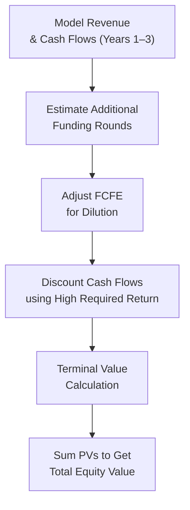

## Overview

Valuing a startup is an adventure—kind of like standing atop a rickety diving board, peering over the edge, and thinking, “Huh, I’m not sure how deep that water is!” In the land of established companies, it often feels somewhat safer. You’ve got stable earnings, well-known multiples, and big piles of historical data. But with startups, especially the early-stage variety, it’s often uncharted territory. Maybe they have minimal sales, or their net income is buried deep in the negative. Traditional discounted cash flow or price multiples? They can feel awkward, even misleading, when dealing with fast-changing, raw, uncertain business models.

Still, we have to do our best to determine the value of these fledgling ventures, because capital-raising decisions, ownership structures, and strategic plans hinge on that magic number. In this section, we’ll walk through common frameworks used to value startups, focusing on (a) the Venture Capital Method, (b) scenario analysis, (c) probability-weighted outcomes, and (d) adjustments to free cash flow (FCFE). We’ll also share some personal experiences, best practices, and pitfalls to avoid, so you can feel a bit more confident about that “dive” when your next valuation scenario arrives.

## Understanding the Challenges in Valuing Startups

Let’s be real: it’s tricky to forecast an early-stage company’s future. You might see skyrocketing revenue potential, but all sorts of unknowns are swirling about—market acceptance, regulatory transitions, or even changes in the founding team. Moreover, many of these companies are pumping dollars into growth rather than profitability, so standard earnings-based valuation approaches (like price-to-earnings or dividend discount models) are basically out the window.

There are also intangible assets—such as brand recognition, proprietary technology, or intangible “buzz”—that can heavily influence a startup’s trajectory. Under IFRS or US GAAP, intangible assets can be recognized if they’re acquired (like in a purchase), but self-developed intangibles are more complicated. This is one reason GAAP/IFRS-based book values or reported earnings aren’t always the best measure of a startup’s worth. Our job is to blend historical data with future potential—essentially, leaning on forward-looking analysis while acknowledging real risk.

## Common Valuation Methods

Despite the uncertainty, investors and analysts have crafted specialized methods for assessing early-stage companies. These approaches tend to place heavy emphasis on projected growth and the time and manner in which investors will eventually exit (e.g., through an IPO or acquisition). The most commonly used methods include:

• The Venture Capital Method  
• Scenario Analysis / Probability-Weighted Outcomes  
• Adjusted Free Cash Flow to Equity (FCFE) Models  

Let’s discuss each in more detail below.

## The Venture Capital Method

I remember being in a meeting with a venture capitalist, feeling both excited and a little intimidated. He opened a spreadsheet that basically predicted how many years until their exit and what that exit might look like—an IPO or a big corporate acquisition. Then he discounted everything back at a steep rate—like 50% per year—to account for the insane risk in such an early-stage company.

That, in a nutshell, is the Venture Capital (VC) Method. It zeroes in on the exit valuation: “If we sell the company or go public in, say, 5–7 years, how much would the company be worth then?” The steps are roughly as follows:

1. Forecast the company’s exit value using an Exit Multiple. This might be based on an anticipated P/E ratio or an EV/EBITDA multiple at the time of exit.  
2. Multiply the company’s projected net income or EBITDA in the exit year by the chosen multiple.  
3. Discount that expected exit value back to the present using a high target rate of return or required IRR (e.g., 40%–70% for seed-stage ventures).  
4. Divide by the ownership percentage that new investors will receive for their investment.  

Below is a simple Mermaid diagram that shows the conceptual process:


### Key Inputs in the VC Method

• Exit Multiple: This is derived from comparable companies or industry norms at the time of exit. If you’re near the frontier of technology, the multiple might be high (or volatile).  
• Target IRR: This is the annual rate of return VCs typically demand from the deal. Since young startups are riskier, target IRRs tend to be significant.  
• Time Horizon: For many venture funds, the typical window is 5–7 years for an exit. But some can be shorter (e.g., 3 years) or longer (10+ years).  

### Example

Imagine a biotech startup that’s projected to earn $10 million in net income five years from now. Suppose we assume an exit P/E multiple of 20×. Thus, the exit value (at year 5) is $200 million. If the investor wants a 40% annual return, the present value is:

V₀ = Exit Value / (1 + r)^t  
V₀ = 200 million / (1.40)^5 ≈ 200 / 5.378 = $37.18 million  

If the investor is contributing $10 million, and that $10 million is buying, say, 25% of the company post-money, then the pre-money valuation is $37.18 million − $10 million = $27.18 million (approximately). If it’s 30%, the math changes a bit, but the essence remains the same.

**Caution:** The high discount rate can drastically reduce the valuation, and every small tweak in either the exit multiple or time horizon can lead to big adjustments.

## Scenario Analysis and Probability-Weighted Outcomes

Another approach is to create different scenarios—like a “best case,” “medium case,” and “downside case”—then assign probabilities to each. If you’ve ever done scenario planning for a large corporation, you might be used to stable assumptions. For startups, though, the range of possible outcomes can be wider than you might guess.

1. Construct at least three scenarios:
   - **Best Case:** Everything works: product-market fit, strong adoption, minimal competition.  
   - **Base Case:** The startup grows decently, hits average market acceptance, faces moderate competition.  
   - **Worst Case:** Product flops, or a competitor dominates, or the startup’s technology is disrupted.  

2. Assign Probability Weights:
   - We might say 20% best, 50% base, and 30% worst, for example.  

3. Compute Valuations:
   - For each scenario, we can use any approach (like the VC method or a discounted FCFE approach with different growth assumptions) to compute a scenario-specific value.  

4. Weighted Average:
   - The final point estimate is the sum of each scenario’s valuation multiplied by its assigned probability.

This approach helps clarify—at least qualitatively— how uncertain the startup’s future might be. If large probabilities are assigned to dire outcomes, the average valuation obviously shrinks.

## Adjusted FCFE Projections

If the startup isn’t too early in its life cycle (i.e., maybe it has some revenue traction, or a path to profitability in a few years), an adjusted Free Cash Flow to Equity (FCFE) model can be useful. The steps align conceptually with traditional DCF, but the assumptions are more conservative, and you often stage the model:

• **Phase 1:** Highly uncertain early years, with negative cash flows, repeated capital raises, or major reinvestment.  
• **Phase 2:** Growth stabilizes, profitability emerges.  
• **Terminal Phase:** The company reaches a steady state (or is sold).

One caution: each new round of funding typically dilutes existing shareholders. So, the model needs to embed assumptions about if/when shares are issued and how that changes the proportion of ownership. 

Below is an outline of the typical process:



### Python Snippet Example

A quick taste of how you might do it in Python. You define a discount rate, project annual FCFE (including negative ones), and discount them:

```python
import numpy as np

cash_flows = np.array([-2_000_000, -1_000_000, 500_000, 2_000_000, 3_000_000])  # Some FCFE estimates
r = 0.35  # 35% discount rate (typical for early-stage)
years = np.arange(1, len(cash_flows)+1)

pv_cash_flows = [cf / ((1+r)**t) for cf, t in zip(cash_flows, years)]

terminal_value = 5_000_000  # Suppose we estimate a sale at end of 5th year
pv_terminal_value = terminal_value / ((1+r)**len(cash_flows))

startup_value = sum(pv_cash_flows) + pv_terminal_value
print(f"Estimated project value: ${startup_value:,.2f}")
```

This snippet, though simplistic, highlights how we discount each year’s cash flow at a high rate to reflect the risk. In real life, you’d incorporate more complex forecasts and different discount rates as the company matures.

## Multiple Funding Rounds and Dilution

Startups rarely raise just once. They often go through multiple rounds of financing—Seed, Series A, Series B, etc.—with each round ideally at a higher per-share price, reflecting the company’s progress.

• **Pre-Money vs. Post-Money**: Valuations are often quoted on a “pre-money” basis (the company’s value before new capital) versus “post-money” (after adding the new capital).  
• **Option Pools and Warrants**: Early investors often require the startup to set aside an option pool (for future employees) that effectively dilutes existing shareholders. Warrants and convertible notes introduce further complexity.  
• **Milestones**: Each round’s valuation is typically contingent on hitting certain product or sales milestones, or attracting key customers.

It’s common (and sometimes shocking for me the first time!) to see your ownership share shrinking with each new round. If you valued your stake at $1 million before the new money, you might see that same stake shrink to something smaller in percentage terms if you don’t participate in the new round.

## Practical Considerations and Best Practices

• **Sensitivity Analysis**: Always test how changes in discount rates, exit multiples, or growth assumptions affect the valuation. Startup valuations can be extremely sensitive.  
• **Comparable Analysis**: If possible, look at valuations of similar companies that had recent funding rounds. This can help you anchor your assumptions in real market data.  
• **Regulatory and Accounting Nuances**: IFRS and US GAAP treat intangible assets differently. For example, self-developed R&D is usually expensed, meaning it won’t appear as an asset on the balance sheet. Keep this in mind when analyzing the company’s net assets.  
• **Corporate Governance**: The structure of the board, voting rights, and protective provisions may significantly influence actual realized value. A strong investor might have liquidation preferences that trump common shareholders.  
• **Team Quality**: In early stages, the founding team’s track record can be a big driver of investor confidence, discount rates, and valuations.

## Exam Tips for CFA Level III Candidates

• On exam day, you may face scenario-based questions where you must choose which method to apply under conditions of negative earnings, uncertain prospects, or expectation of future financing rounds.  
• Be ready to justify a high discount rate for a startup, explain how it’s derived, and walk through the math—particularly the present value of an exit multiple.  
• Familiarize yourself with the difference between “best case” and “Base-Case” scenario analyses, especially when the question might ask you to compute a probability-weighted valuation.  
• You might also see constructed-response prompts that ask about the effect of share dilution or how a new capital raise might adjust a prior valuation.  
• Keep in mind the ethical and professional standards around valuations. Overstating or understating valuations knowingly is a clear violation of the CFA Institute Code and Standards.  
• Practice time management: these questions can be calculation-heavy, so it’s wise to know formulas by heart and be prepared to do quick scenario-based calculations.

## Reference List

• CFA Institute, “Private Equity,” Levels I & II Curriculum Readings  
• Feld, Brad and Jason Mendelson. Venture Deals: Be Smarter Than Your Lawyer and Venture Capitalist. Wiley.  
• CFA Institute Code of Ethics and Standards of Professional Conduct  
• International Financial Reporting Standards (IFRS) Publication on Intangible Assets  
• Global Investment Performance Standards (GIPS) for additional guidelines related to portfolio and performance measurement  

---

## Check Your Understanding: Startup Valuation for Early-Stage Companies



### In the venture capital method, which valuation input typically has the greatest impact on the computed valuation for an early-stage startup?

- [ ] The startup’s total expenses in Year 1  
- [x] The assumed exit multiple or terminal value  
- [ ] The current balance sheet cash position  
- [ ] The assumption of intangible asset recognition under IFRS  

> **Explanation:** The exit multiple (or terminal value) is frequently the largest driver of the final valuation because the entire forecast relies on substantial growth and a lucrative exit.

---

### When applying scenario analysis for a startup valuation, which of the following should be considered?

- [ ] Only a single revenue trajectory with zero chance of failure  
- [x] Multiple future states (e.g., best, base, worst) with assigned probabilities  
- [ ] Strict IFRS guidelines mandating intangible asset capitalization in each scenario  
- [ ] A guaranteed 50% discount rate for each scenario  

> **Explanation:** Scenario analysis requires defining several potential paths for the startup’s growth and assigning probabilities to each. This approach captures the wide range of possible outcomes.

---

### A company forecasts free cash flows to equity of -$1 million in the first year, $1 million in the second year, and then $3 million in the third year, at which point it expects to be sold for $15 million. Assuming a 30% required return, how would you compute its present value?

- [ ] Only discount the Year 3 value back; ignore the first two years as they are negative or small.  
- [x] Discount each yearly cash flow (even negative ones) and the Year 3 sale value at 30% and sum them.  
- [ ] Use a standard CAPM approach with a low beta to discount each flow.  
- [ ] Only rely on a best-case scenario to avoid underestimating the valuation.  

> **Explanation:** You should discount every projected cash flow (negative or positive) as well as the terminal value at the required discount rate, then sum them to determine the total present value.

---

### Which of the following is a key difference between using the FCFE approach for established firms versus early-stage startups?

- [ ] FCFE is never used for established firms.  
- [x] The startup version requires higher discount rates and often includes staged financing assumptions.  
- [ ] The startup version completely ignores intangible assets.  
- [ ] The established firm approach never accommodates negative cash flows.  

> **Explanation:** Early-stage startups demand higher discount rates reflecting elevated risk and often require explicit modeling of multiple financing rounds (i.e., staged financing).

---

### If new investors in a startup negotiate a 25% post-money stake for an infusion of $5 million, what is the implied post-money valuation?

- [ ] $5 million × 25% = $1.25 million  
- [ ] $25 million  
- [x] $20 million  
- [ ] $5 million  

> **Explanation:** The new investors’ $5 million buys them 25% ownership, implying that $5 million is 25% of the post-money valuation. Thus, the total post-money valuation is $5 million / 0.25 = $20 million.

---

### Which best describes dilution?

- [ ] An increase in the startup’s share price during subsequent funding rounds  
- [ ] A measure of intangible asset amortization  
- [ ] A discount rate adjustment for negative growth  
- [x] A reduction in ownership percentage because of new share issuance  

> **Explanation:** Dilution occurs when additional shares are issued, reducing existing investors’ ownership percentages.

---

### When using probability-weighted valuations, which is the correct approach to finalize the valuation?

- [ ] Multiply the maximum valuation by 100% to reflect optimism.  
- [ ] Disregard the worst-case scenario to avoid overly conservative results.  
- [ ] Use only a discount rate for the best scenario.  
- [x] Forecast a valuation for each scenario and apply the respective probabilities as weights.  

> **Explanation:** The concept behind probability-weighted valuations is to factor in each possible outcome, multiply by its likelihood, and then sum them for a weighted average value.

---

### What is the main reason analysts assign very high discount rates when valuing early-stage startups?

- [ ] Reduced intangible asset recognition under IFRS  
- [ ] Strict regulatory burdens related to new share issuance  
- [ ] Existence of large reserves of retained earnings  
- [x] Substantial uncertainty regarding long-term success and cash flows  

> **Explanation:** Because startups face high risk and volatile future prospects, analysts use a higher discount rate to offset the greater probability of failure or unremarkable outcomes.

---

### Which of the following is a key benefit of scenario analysis for startup valuation?

- [ ] Removes all speculation about future exit values  
- [x] Incorporates multiple future paths to capture a range of outcomes  
- [ ] Guarantees a lower discount rate than the venture capital method  
- [ ] Prevents any chance of mispricing a startup’s intangible assets  

> **Explanation:** Scenario analysis captures different potential futures (favorable, neutral, and adverse) and assigns probabilities to each, helping analysts consider the broad range of possible results.

---

### The Venture Capital Method typically focuses on:

- [x] An exit strategy and discounting that exit value at a high target IRR.  
- [ ] Measuring intangible goodwill recognized under IFRS.  
- [ ] Reducing short-term capital gains taxes during fundraising.  
- [ ] Applying earnings-based multiples for each annual projection.  

> **Explanation:** The Venture Capital Method centers on projecting an exit value (via an exit multiple) and bringing that value back to the present using a high discount rate, representing the venture capitalist’s required IRR.


