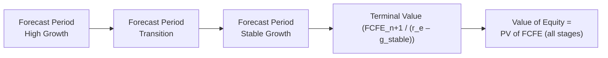

## Introduction

It seems like ages ago now, but I still remember that moment when I realized that valuing a company was about more than just plugging in numbers and hoping for the best. I’d been working on a project for a small research firm and was tasked with using a multi-stage Free Cash Flow to Equity (FCFE) model to evaluate a rapidly growing tech startup. At first, I thought, “Sure, just forecast out some cash flows and discount them back, right?” Well, let’s just say—it’s a bit more nuanced than that.

When it comes to stock valuation, especially for companies at different stages of growth, multi-stage FCFE models can be powerful tools. These models let you break down your analysis into distinct growth phases—like high-growth, transition, and stable—to better capture those shifting patterns in cash flows over time. The end result is a more accurate (hopefully) representation of a company’s underlying worth, especially compared to a single-stage approach that might oversimplify the complexities of a real business.

In this article, we’ll explore the core concepts and practicalities of multi-stage FCFE models with changing growth patterns. We’ll also look at how the discount rate can evolve, where to watch out for pitfalls, and how to handle the big, scary “terminal value” piece. Let’s go!

## Rationale Behind Multi-Stage FCFE Models

Before we jump full force into the mechanics, let’s take a step back and talk about why a multi-stage approach can make more sense than, say, a simple single-stage model. Companies don’t usually grow at one predictable rate over their whole life. This is obvious if you look at the typical path of a newly formed enterprise: it might see very rapid growth initially (high-growth phase), then a slower—but still healthy—expansion (transition phase), and eventually stabilize once it matures (stable phase).

Single-stage valuation models (like the Gordon Growth Model for dividends) assume a perpetual, constant growth rate. But that doesn’t really fit the real world unless you have a well-established, long-matured firm with stable cash flows. So, multi-stage FCFE helps you adapt the valuation to reflect:

• Rapid expansion or high capital expenditures initially.  
• Moderating growth and capital intensity as the company matures.  
• A stable final phase where growth aligns (roughly) with the overall economy or some modest rate.

By splitting the valuation into multiple stages, you stand a better chance of capturing these dynamic changes in the firm’s life cycle. That’s essentially the big rationale behind a multi-stage approach.

## Key Components of a Multi-Stage FCFE Model

A multi-stage FCFE model is built around a fairly straightforward concept: forecast FCFE for multiple periods (or stages) and discount each of those projected cash flows back to the present, using a discount rate (i.e., cost of equity). Let’s outline the core building blocks.

### Free Cash Flow to Equity (FCFE)

At its simplest, FCFE is the cash available to common shareholders after all operating expenses, interest payments, debt repayments, and reinvestment needs (like capital expenditures) have been covered. The standard formula for FCFE can vary slightly based on context, but one common expression is:

FCFE = Net Income  
       – (Capital Expenditures – Depreciation)  
       – Δ Working Capital  
       + (New Debt Issued – Debt Repayments)

You can also derive FCFE from Free Cash Flow to the Firm (FCFF) by subtracting after-tax interest expense and adjusting for net debt changes. 

### Growth Rates

A multi-stage model breaks the growth trajectory into segments:

• High-Growth Phase: Rapid expansion, often with aggressive reinvestment.  
• Transition Phase: Growth gradually slows; capital expenditures may still be somewhat elevated, but not as much as before.  
• Stable Phase: Growth converges to a conservative, steady rate (often close to the long-term GDP growth or the inflation-adjusted economic growth rate).

We can define separate assumptions for revenue growth, expense growth, reinvestment, and sometimes capital structure changes in each phase.

### Cost of Equity (Discount Rate)

The discount rate used to bring future FCFE back to the present is typically the required return on equity. Many practitioners use the Capital Asset Pricing Model (CAPM):

r_e = r_f + β × (E[R_m] – r_f)  

where r_f = risk-free rate, (E[R_m] – r_f) = equity risk premium, and β is the company’s sensitivity to the market.

In multi-stage models, you might keep r_e constant if you expect the firm’s risk profile to remain stable. Or, you could apply a higher discount rate in earlier years if you think the company is riskier at the onset of its life cycle. This can happen if the firm’s capital structure or competitive environment changes over time.

### Terminal Value

Eventually, we subject the company to a stable growth assumption, creating a terminal value that captures all future FCFE beyond the final forecast year. Typically, the terminal value (TV) at the beginning of the stable phase is:

TV = FCFE_n+1 / (r_e – g_stable)

where g_stable is that long-term, constant growth assumption. This terminal value then gets discounted back to the present, just like any other future cash flow.

## Implementation Steps

Let’s go step by step to see an outline of how you might build a multi-stage FCFE model from scratch.

- Project Revenues in Each Stage.  
  Maybe you assume 20% growth for the first five years (high-growth), then gradually step it down to 10% over the next three years (transition), and finally 4% once the company is stable.  

- Forecast Expenses, Depreciation, and Capital Expenditures.  
  If you’re in a high-growth stage, capital expenditures (CapEx) might grow more quickly, while in a stable phase, CapEx might be closer to sustaining levels.  

- Estimate Changes in Working Capital.  
  Younger, faster-growing companies often need more working capital (e.g., inventory, receivables, etc.).  

- Determine Net Borrowing.  
  If the firm is funding expansion through some mix of debt and equity, factor that into your FCFE.  

- Calculate FCFE for Each Year.  
  Remember the formula: FCFE = Net Income – (CapEx – Depreciation) – ΔWorking Capital + Net Borrowing.  

- Apply Appropriate Discount Rates to Each Stage’s Cash Flow.  
  Decide if your cost of equity remains stable or evolves.  

- Compute the Terminal Value for the Start of the Stable Phase.  
  Use a constant growth formula to capture all subsequent FCFE.  

- Discount the Terminal Value Back to the Present.  
  Sum it with the present value of FCFE from earlier years.  

- Arrive at Intrinsic Value per Share.  
  Divide the total net present value of FCFE by the number of outstanding shares if that’s your ultimate goal.

## Simple Analytical Example

Imagine you’re valuing a hypothetical company, GrowthMax Corp. Let’s do a quick run-through of a multi-stage FCFE model, just to get a feel for the calculations (we’ll keep it short and sweet):

• High-Growth Phase (Years 1–3):
  - Forecasted net income grows at 15%.
  - CapEx outpaces depreciation by 2 to 3 times.
  - The company uses some debt financing, so net borrowing is positive.  

• Transition Phase (Years 4–6):
  - Growth slows to 8%.
  - CapEx still exceeds depreciation, but the gap narrows.
  - Net borrowing moves closer to zero.  

• Stable Phase (After Year 6):
  - Growth is 4% indefinitely.
  - FCFE = net income minus stable reinvestment.

Let’s pretend the discount rate is constant at 10% (r_e = 0.10) for simplicity. We’d calculate each year’s FCFE for years 1 through 6, discount them back by (1 + 0.10)^t. Then, at the start of year 7, we estimate:

TV_6 = FCFE_7 / (r_e – g_stable)  
     = (FCFE Year 6 × 1.04) / (0.10 – 0.04)  

That terminal value is discounted back to time zero using (1 + 0.10)^6. Summing up all discounted annual FCFE plus the discounted TV_6 gives us the total present value of GrowthMax’s equity. And from there, we can divide by shares outstanding for an intrinsic share price estimate.

## Graphical Representation

Below is a simplified Mermaid diagram that illustrates the multi-stage FCFE process conceptually. (Yes, I sometimes doodle these out to visualize how the pieces all fit.)



The idea is that we treat the three growth phases separately, and then we project a terminal value beyond that final stage.

## Cost of Equity Considerations

A big question that often arises is: “Should I adjust the discount rate over time?” Maybe you do, maybe you don’t. Some analysts keep a constant required return on equity. But if you think the company will pay down debt or reduce business risk as it matures, you might slightly reduce β (and hence r_e) over time. Keep in mind this adds complexity. Perhaps ironically, adding complexity sometimes lessens clarity, so weigh the pros and cons before layering on additional changes.

## Common Pitfalls and Best Practices

I’ve had situations where I got so excited about projecting the future that I forgot a few (critical) details. Here are some things to watch for:

- Overly Optimistic Growth. We all want a breakout scenario. But if you assume that 30% growth will last for 20 years, you’re likely asking for trouble.  
- Ignoring Capital Expenditure Requirements. High growth usually demands high CapEx. Don’t just plug in a random number—forecast CapEx carefully.  
- Inconsistent Changes in Working Capital. If your growth assumptions are robust, you can’t ignore that you’ll also need to finance more inventory, receivables, etc.  
- Terminal Value Overdependence. In many valuations, more than half of the total value can come from that terminal value. Resist the urge to blow up your stable-growth assumption to something unrealistic—like 8%. That can dramatically inflate your valuation.  
- Discount Rate Mistakes. Make sure you’re consistent with timelines—don’t discount annual cash flows at a semiannual rate, etc. If you’re shifting discount rates, be transparent about your rationale.

## Integrating Behavioral Finance

Even though multi-stage FCFE modeling appears purely quantitative, I find it helpful to recall that biases can creep in. Overconfidence in your forecasting abilities or anchoring to a “famous analyst’s” hyper-aggressive growth rate can lead to flawed results. So, conduct a few sanity checks. If your final value seems ridiculously high or low, step back and question whether your assumptions pass the smell test.

## Python Code Snippet for a Quick Multi-Stage FCFE Model

If you ever want to get a rough sense of how implementing a multi-stage model might look in Python, here’s a short snippet. This is simplified, but it’ll give you an idea:

```python
import math

def present_value(future_value, rate, years):
    return future_value / ((1 + rate)**years)

def multi_stage_fcfe(fcfes, discount_rate):
    """
    fcfes is a list of (year, fcfe_value).
    discount_rate is decimal (e.g. 0.10 for 10%).
    Returns total present value.
    """
    pv = 0.0
    for (year, fcfe) in fcfes:
        pv += present_value(fcfe, discount_rate, year)
    return pv

# Suppose we have FCFE values for years 1 through 5, plus a terminal value in year 5
fcfes_input = [(1, 50), (2, 55), (3, 60), (4, 65), (5, 70), (5, 1000)]  # 70 FCFE + 1000 terminal at year 5
rate = 0.10

value_estimate = multi_stage_fcfe(fcfes_input, rate)
print(f"Estimated Equity Value: {value_estimate:.2f}")
```

In real life, you’d have a detailed forecast for each year and compute the terminal value carefully using the stable growth formula, but hopefully you see how it might come together computationally.

## Exam Mindset

For exams—especially in the CFA Program—be ready for both conceptual and calculation-based questions. They love to test your ability to handle changing growth assumptions, to compute terminal values correctly, and to interpret the results. Double-check your discounting approach, watch out for any mismatches between the growth assumption and the discount rate, and make sure you handle net borrowing or net debt changes if they provide that info.

If you see an essay question that asks for a multi-stage FCFE valuation, they might give you partial data: net income, CapEx, depreciation, changes in working capital, etc. You’ll need to piece it together carefully. Keep your time management in mind, and never forget to label your final answer with clarity (e.g., “The intrinsic value per share is $XX.XX”).

## Concluding Thoughts

Multi-stage FCFE models with changing growth patterns are a potent lens for examining companies that don’t fit neatly into a one-size-fits-all growth formula. They let you capture the nuance of expansion, the reality that growth eventually cools off, and the final stable period that so many mature businesses occupy. Keep your assumptions realistic, track capital requirements diligently, and be consistent in how you discount cash flows across each phase.

I’ll be honest: the more complicated your model becomes, the more you should sanity-check it. Sometimes, a simpler approach with well-justified assumptions can be more powerful (and less error-prone) than an overly ambitious multi-stage extravaganza. As usual with finance, it’s a balancing act: capturing enough detail to be accurate, but not so much that you drown in your own efforts.

## References for Further Exploration

• CFA Institute Program Curriculum, Equity Valuation (Multi-Stage Models)  
• Damodaran, A. (Various Articles/Blog Posts). Available at: http://pages.stern.nyu.edu/~adamodar/  
• Penman, S.H. Financial Statement Analysis and Security Valuation.  
• Koller, T., Goedhart, M., Wessels, D. Valuation: Measuring and Managing the Value of Companies.  

## Practical Exam Tips

• Keep an eye out for pitfalls in forecasting. The exam might give you contradictory items in the data set—be sure you’re consistent.  
• When you read a question prompt, identify the stage transitions (e.g., maybe they’ll say “the company expects 15% growth for two years, 10% for the next three years, and 5% thereafter”).  
• Practice discounting carefully. Many exam takers lose points on small details, like discounting the terminal value incorrectly or messing up the timeline.  
• Remember the difference between FCFE and FCFF. Be sure you know which one the problem is asking for.  

## Test Your Knowledge: Multi-Stage FCFE Models Quiz



### In a multi-stage FCFE valuation approach, an analyst forecasts:
- [x] Different growth rates for distinct periods of a firm’s lifecycle, then discounts FCFE at an appropriate cost of equity.
- [ ] A single growth rate for all periods of a firm’s lifecycle, along with a constant cost of capital.
- [ ] Growth rates only for the stable phase, ignoring earlier expansion phases.
- [ ] Zero growth for the high-growth phase to avoid overstating data.

> **Explanation:** Multi-stage FCFE valuation explicitly accommodates different growth rates (e.g., high-growth, transition, stable phases), reflecting a more realistic company lifecycle.  

### If a company’s discount rate is expected to decline as it transitions from high-growth to stable phase, the analyst should:
- [x] Reduce the cost of equity in later years to match the lower risk profile.
- [ ] Keep the cost of equity constant throughout the entire forecast period.
- [x] Justify each adjustment in discount rate assumptions clearly.
- [ ] Increase the cost of equity over time as the firm grows.

> **Explanation:** Some analysts adjust discount rates to reflect changes in business risk or capital structure. Providing a well-reasoned justification for changing the cost of equity is crucial to the model’s credibility.

### Which of the following factors is most likely to increase the terminal value in a multi-stage FCFE model?
- [ ] A sudden spike in disposable income during the high-growth phase.
- [ ] A reduction in the company’s net borrowing in the transition phase.
- [x] A higher assumed stable growth rate (g_stable) in the terminal period.
- [ ] A sudden depreciation expense spike in the final year of the transition phase.

> **Explanation:** Terminal value (in a perpetuity model) is heavily sensitive to the assumed stable growth rate, making changes in g_stable a direct driver of the terminal value.  

### An analyst is projecting FCFE for a firm in its “transition phase.” Which assumption would be consistent with this phase?
- [x] A moderate decrease in growth rate each year, with CapEx starting to align more closely with depreciation.
- [ ] Growth rate remains fixed at the high-growth level indefinitely.
- [ ] CapEx is zero because the firm no longer invests in its business.
- [ ] The firm will go bankrupt.

> **Explanation:** The transition phase indicates growth is easing off from high-growth levels but hasn’t quite reached the stable, mature phase. Usually, firms still invest, but at a diminishing rate.

### Why might an analyst keep the discount rate constant through all stages?
- [x] Belief that the firm’s risk profile will remain relatively stable.
- [ ] Inability to project any changes in market risk premium with any certainty.
- [x] Simplification to avoid complex risk structure adjustments across phases.
- [ ] They must comply with IFRS rules.

> **Explanation:** Analysts often choose a single required return on equity if they view the firm’s systematic risk as fairly steady or if they want to keep the model straightforward. IFRS doesn’t mandate a single discount rate for valuations.

### What is a key disadvantage of multi-stage FCFE models?
- [x] Valuation heavily depends on the accuracy of multiple growth assumptions, which can be challenging to predict.
- [ ] They ignore the concept of time value of money.
- [ ] They cannot handle cyclical changes in a company’s operations.
- [ ] They are forbidden by most regulatory bodies.

> **Explanation:** Because these models rely on several growth rate forecasts, any error in assumptions about growth, CapEx, or discount rates can significantly change the end valuation.

### When calculating terminal value using the perpetuity growth model, the standard formula is:
- [x] FCFE_(n+1) / (r_e – g).
- [ ] FCFE_n × (r_f – g).
- [x] FCFF_(n+1) / (g).
- [ ] FCFF_n × (r_e + g).

> **Explanation:** The standard terminal value formula for perpetuities is the next period’s cash flow divided by the difference between the discount rate and the perpetuity growth rate. For FCFE valuations, it’s often stated as FCFE_(n+1) / (r_e – g).

### Which statement describes a “transition phase” in a multi-stage FCFE model?
- [x] A period between high-growth and stable growth, where the growth rate declines gradually.
- [ ] A sudden jump from negative free cash flows to high positive free cash flows overnight.
- [ ] A period in which the firm’s growth becomes greater than the economy’s infinite horizon growth rate.
- [ ] A perpetual constant growth phase.

> **Explanation:** The transition phase is precisely that gray area where growth starts to moderate from the rapid, early phase toward a more sustainable, end-stage rate.

### If 80% of your calculated firm value is driven by the terminal value, one recommended practice is to:
- [x] Carefully recheck all terminal assumptions, especially the stable growth rate and discount rate.
- [ ] Increase the stable growth rate to reduce the portion contributed by terminal value.
- [ ] Eliminate the terminal value altogether.
- [ ] Use a short-term discount rate for the entire projection horizon.

> **Explanation:** When the terminal value forms the bulk of the valuation, it’s critical to ensure the stable growth and discount rate assumptions are solid. A small tweak there can cause a big change in the final answer.

### True or False: Multi-stage FCFE models are never appropriate for mature firms with very stable cash flows.
- [x] True
- [ ] False

> **Explanation:** Actually, for a stable, mature firm where growth is essentially constant, a single-stage model might work just fine. Multi-stage approaches can be used, but they’re not typically “never appropriate.” They can be overkill for extremely stable companies that do not exhibit multiple, distinct growth phases. However, in some cases, you might still want to examine different phases of cyclical expansions or if the firm is nearing an inflection point.


