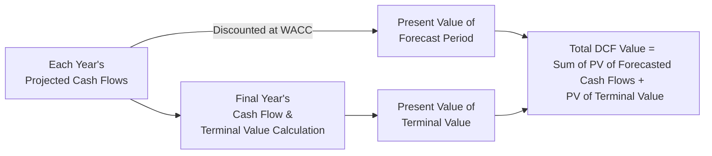

## Overview

Have you ever worked late into the night on a financial model, only to realize that so much of your valuation hinges on those final calculations called the “terminal value”? Well, if you haven’t yet, you probably will someday—because terminal value (TV) often ends up making up a big chunk of the total equity valuation in a discounted cash flow (DCF) model. In plain terms, it tries to capture the value of all future cash flows that occur after your explicit forecast period (e.g., 5 or 10 years). 

But let's face it: predicting the indefinite future is tricky. What we do instead is apply structured methods—most commonly, the Gordon Growth Model or an Exit Multiple Approach—to approximate what a company’s cash flows will be worth once our explicit periodic forecasts have ended. In this section, we will walk through the main methods, share some personal takes on where people run into roadblocks, highlight best practices, and provide a few examples to illustrate the math (and the potential pitfalls).

## Importance of Terminal Value in Equity Valuation

Many analysts joke that “terminal value is where we hide all our forecasting sins,” because if your terminal value assumptions are off, your entire valuation can become wildly inaccurate. No matter how precise you are about next year’s sales, it often pales in comparison to the effect of poor assumptions about perpetuity growth rates or exit multiples. In well-established businesses, the TV can represent anywhere from 50% to 80% (or more) of total firm value in a multi-stage DCF. Understanding how to compute it reliably—and test its sensitivity to your assumptions—can greatly improve the integrity of your valuation outcomes.

## Methods for Estimating Terminal Value

### The Gordon Growth Model (Perpetual Growth Method)

The Gordon Growth Model (also known as the Perpetuity Growth Model) assumes that, after the final projected year, the firm’s cash flows continue to grow at a constant annual rate forever. Let’s say you see a stable electric utility, and you figure it’ll grow at roughly the pace of the economy indefinitely. Then the Gordon Growth Model can be elegantly applied.

In formula form, if you denote:

- \\( \text{FCF}_{n+1} \\) as the free cash flow one period after your last projected year (year \\(n\\)),  
- \\( r \\) as the discount rate (often the Weighted Average Cost of Capital, or WACC, for the firm),  
- \\( g \\) as the perpetual growth rate (annual),  

then the terminal value at the end of year \\( n \\) is:


\text{TV}_{n} = \frac{\text{FCF}_{n+1}}{(r - g)}


This formula also applies if you prefer to use dividends, residual income, or other consistent cash flow measures. The key idea is that the growth rate (\\(g\\)) remains constant indefinitely.

#### Key Assumptions in Gordon Growth

1. The growth rate \\( g \\) does not exceed \\( r \\). Obviously, if \\( g \geq r \\), the formula breaks down or suggests an infinite valuation. That’s a quick sign that your assumptions might need a reality check.  
2. The firm’s long-term sustainable growth \\((g)\\) should align with (or be lower than) the economy’s long-term growth rate. It’s unrealistic to assume a company will outgrow the overall economy forever.  
3. The firm’s business model must be stable enough that perpetual growth is a reasonable assumption. For early-stage, volatile, or cyclical companies, it might be too simplistic to assume a constant growth rate beyond year \\(n\\).

### Exit Multiple Approach

Where the Gordon Growth Model uses a theoretical perpetuity, the Exit Multiple Approach attempts to anchor the valuation in current market realities. Typically, you take the company’s terminal-year financial metric (e.g., EBITDA, EBIT, or net income) and apply a valuation multiple observed in the market for comparable firms. The formula might look like:


\text{TV}_{n} = \text{Metric}_{n} \times \text{Exit Multiple}


For example, if your forecasted EBITDA in year 5 is \$100 million and comparable firms trade at 8× EBITDA, then the terminal value at the end of year 5 could be:


\text{TV}_{5} = \$100 \text{ million} \times 8 = \$800 \text{ million}.


Of course, you then discount that \$800 million back to the present. The key challenge is determining the correct (“fair”) multiple. We usually look to:  
- Comparable publicly traded companies (“trading comps”),  
- Recent transactions in the market (“deal comps” or “precedent transactions”),  
- Historical average multiples for the company itself if appropriate.

#### Key Assumptions in Exit Multiples

1. The concluding multiple in the final forecast year is representative of long-term market sentiment or conditions.  
2. An appropriate peer set or transactions exists, so you can get a meaningful range for the multiple.  
3. The metric used (EBIT, EBITDA, or net income) is a sustainable, normal measure and not inflated/deflated by one-time events.

### Deciding Between Models

Choosing between a perpetuity-based method or an exit multiple approach usually comes down to the nature of the firm and the availability of market data. For large, stable, dividend-paying firms, the Gordon Growth Model might be straightforward. For more dynamic industries—say, a tech startup that has recently become profitable—analysts often rely on exit multiples that reflect the market’s perspective on forward valuations. Sometimes analysts even use both methods, glean insight from each, and then reconcile the results.

## Visualizing Terminal Value in a Discounted Cash Flow Timeline

Below is a simple Mermaid flow diagram to help you visualize where terminal value fits in a typical DCF timeline.



In this diagram, we sum up the present values of the explicitly forecasted cash flows (usually years 1 through \\( n \\)) plus the present value of the terminal value. That terminal value typically accounts for everything that happens from year \\( n+1 \\) to infinity—i.e., the indefinite horizon.

## Key Assumptions and Considerations

### Perpetual Growth Rate Feasibility

If your perpetual growth rate is 5% but the underlying economy is only expected to grow at 2.5%, it implies the company will eventually outgrow the entire planet. Such an assumption is typically unsustainable. Regulatory changes, competition, and industry maturity often erode high growth over the long run.

### Accuracy of Comparable Multiples

A big pitfall in the exit multiple method is over-reliance on the “hot” multiple in the market. If valuations are cyclical or subject to fads (remember various tech bubbles?), you could be embedding unsustainable assumptions about the firm’s long-term multiple. It’s a good idea to look at a normalized or cyclically adjusted multiple or a historical average, rather than a possibly overheated real-time multiple.

### Integration with the Rest of the DCF

Terminal value is only as good as the forecast preceding it. If your entire five-year or 10-year forecast is suspect—maybe it shows unrealistic margins and capital structure—then your terminal value calculation might be built on shaky foundations. Also, ensure that capital expenditures (CAPEX), depreciation, and working capital are forecast consistently with your growth assumptions.

### Currency, Inflation, and Macroeconomic Backdrop

If you’re projecting a multi-national or a firm with global operations, changes in exchange rates and local inflation can drastically alter growth prospects. A singled-out perpetual growth rate might miss complexities in multi-currency forecasts and inflation differentials. Similarly, keep an eye on central bank rates, as they affect the discount rate you use in your DCF.

## Common Pitfalls

1. **Excessive Growth Assumptions**: Analysts who assume that the company’s growth remains at 7% forever often overlook the possibility of industry saturation or new competitors.  
2. **Mismatch in Metrics**: Using an exit multiple based on EBITDA but discounting after-tax FCFE can lead to inconsistent calculations. Always ensure the discount rate and cash flow measure align (e.g., WACC for FCFF or cost of equity for FCFE).  
3. **Ignoring Capital Structure Shifts**: If your terminal value approach is based on a stable capital structure, but in reality, the firm’s leverage changes over time, your calculation may miss the mark.  
4. **Unrealistic Comparables**: If you pick only the highest multiples in your comp set, you might over-inflate the exit multiple.  

## Best Practices

- **Cross-Check Methods**: Compute terminal value using both the Gordon Growth approach and an exit multiple, then compare. Material discrepancies often highlight where major assumptions might diverge.  
- **Sensitivity Analysis**: Test how your valuation changes if the growth rate is half a percentage point lower or higher, or if the multiple changes from 8× to 7× or 9×. This helps gauge the valuation’s robustness to changes in assumptions.  
- **Match the Cash Flow and Discount Elements**: When using free cash flow to the firm (FCFF), discount at the WACC. If using free cash flow to equity (FCFE), discount at the cost of equity.  
- **Document Assumptions**: For exam purposes and real-world best practices, keep track of your main assumptions about growth, margins, reinvestment needs, etc. Transparency is crucial—both ethically and for stakeholder trust.

## Numerical Examples

### Example 1: Gordon Growth Model

Imagine you’ve forecasted free cash flow to equity for a company through year 5 (i.e., next five years). By the end of year 5, FCFE is \$20 million, and you expect it to grow at 3% per year indefinitely. The cost of equity (\\(r\\)) is 8%.

- The year 6 expected FCFE = \\( \$20 \times (1 + 0.03) = \$20.6 \\) million.  
- Terminal value (end of year 5) = \\(\frac{\$20.6}{(0.08 - 0.03)} = \frac{\$20.6}{0.05} = \$412 \\) million.  
- Discount it back to the present: if year 5 discount factor is \\( (1+0.08)^5 \approx 1.4699 \\), you get \\(\frac{\$412}{1.4699} \approx \$280 \\) million in present value terms.

### Example 2: Exit Multiple Approach

Let’s say the company’s EBITDA in year 5 is projected at \$50 million. You determine, based on comparable companies, that an 8× EV/EBITDA multiple is appropriate. You also figure that at year 5, the company should have \$30 million in net debt. Therefore:

- Enterprise value at end of year 5 = \$50 million × 8 = \$400 million.  
- Equity value at end of year 5 = \$400 million – \$30 million = \$370 million.  

Then discount \$370 million back to the present using your chosen discount rate. 

As seen above, it’s crucial to consistently incorporate capital structure if you move from enterprise value to equity value. Missing that step can lead to overestimating or underestimating the final figure.

## Small Python Snippet for Illustrative Calculation

You could easily run a quick calculation (especially handy in a test-driven environment or Excel alternatives):

```python
def calculate_terminal_value_gordon(fcf_n, g, r, discount_factor):
    # fcf_n is the free cash flow in the final forecast year
    # g is perpetual growth
    # r is discount rate (e.g., WACC or cost of equity)
    
    fcf_n_plus_1 = fcf_n * (1 + g)
    tv_n = fcf_n_plus_1 / (r - g)
    pv_tv = tv_n / discount_factor
    return pv_tv

final_year_fcf = 20.0       # in millions
growth_rate = 0.03
discount_rate = 0.08
fifth_year_discount_factor = (1 + discount_rate)**5

present_value_of_terminal = calculate_terminal_value_gordon(
    final_year_fcf,
    growth_rate,
    discount_rate,
    fifth_year_discount_factor
)

print(f"Present Value of Terminal Value (in millions): {present_value_of_terminal:.2f}")
```

If you run that snippet, it should provide you with the present value of your terminal value based on the Gordon Growth Model. (Of course, always validate your inputs carefully!)

## Final Exam Tips

1. **Stay Grounded in Reasonable Growth**: It’s better to slightly underestimate the growth rate than to exceed the economy’s growth rate indefinitely.  
2. **Reconcile the Approaches**: Show your examiner or potential employer that you’ve considered both the Gordon Growth and Exit Multiple approaches.  
3. **Present Your Assumptions**: On the CFA exam, clarity can earn partial credit. If you assume an 8× multiple, state why. If you assume a 2% growth, mention parallels to the economy’s inflation or GDP growth.  
4. **Look Out for Mismatches**: If your problem states a cost of equity for discounting FCFE but provides an enterprise-level multiple for the terminal value, make sure you handle the transition from enterprise value to equity value correctly.  
5. **Time Management**: On the real exam, it’s easy to get lost in the details. Focus on the crucial steps first—especially making sure your method and formula usage are correct. Then refine the details if time permits.

## References

- CFA Institute Program Curriculum (Corporate Finance and Equity Valuation)  
- Damodaran, A., “Investment Valuation,” 3rd ed., Wiley, 2012.  
- CFA Institute Code of Ethics and Standards of Professional Conduct  

## Test Your Knowledge: Terminal Value Estimation Methods



### Which of the following statements best describes terminal value?

- [x] It is an estimate capturing the value of all future cash flows beyond the explicitly forecasted period.
- [ ] It is the value of the company’s assets minus liabilities at a specific point in time.
- [ ] It is the sum of discounted cash flows from the first five years of projections only.
- [ ] It is always determined using the Gordon Growth Model.

> **Explanation:** Terminal value reflects the continuing value of a business beyond the candidates' explicit forecast horizon.  

### The Gordon Growth Model for calculating terminal value is most appropriate under which condition?

- [x] It is a firm with stable operations and a long-term sustainable growth rate that does not exceed the discount rate.
- [ ] It is a new technology startup growing at a fast varying rate.
- [ ] It is a mature firm operating in a cyclical industry with volatile earnings.
- [ ] It is only used for distressed companies.

> **Explanation:** The Gordon Growth Model assumes a stable firm with perpetual, constant growth that is less than the discount rate.  

### In applying an exit multiple approach, which of the following would be the primary metric used for a capital-intensive manufacturing company?

- [ ] A ratio of intangible assets to total assets.
- [x] An EV/EBITDA multiple derived from comparable companies.
- [ ] A market-to-book ratio based on intangible value.
- [ ] A dividend yield ratio from municipal bond data.

> **Explanation:** EV/EBITDA is a common multiple for capital-intensive industries, as it normalizes for differences in capital structure and depreciation.  

### If your exit multiple is based on the final year’s enterprise value, but you need the equity value, what must you do?

- [ ] Add total debt to the enterprise value.
- [x] Subtract net debt (or add net cash) from the enterprise value.
- [ ] Multiply the enterprise value by the cost of equity.
- [ ] Multiply the enterprise value by the dividend payout ratio.

> **Explanation:** To go from enterprise value to equity value, subtract net debt.  

### Which of the following is most likely a red flag when selecting a perpetual growth rate?

- [x] The growth rate selected is higher than the expected long-term GDP growth of the economy.
- [ ] The growth rate is 50 basis points below the risk-free rate.
- [x] The growth rate is slightly above the long-term average inflation rate.
- [ ] The growth rate mimics the average trend of the past 20 years.

> **Explanation:** When the perpetual growth rate exceeds the long-term GDP growth, it suggests the firm will exceed the entire economy, an unrealistic assumption in perpetuity.  

### When using the Gordon Growth Model, which of the following statements is correct?

- [x] The firm’s cost of capital (denominator) must be greater than the perpetual growth rate.
- [ ] Firms with negative earnings are easily valued this way.
- [ ] It is specifically designed for technology startups with sporadic revenue growth.
- [ ] You should always calibrate the perpetual growth rate to 1%.

> **Explanation:** If the discount rate is not above the growth rate, the formula implies an infinite or negative value.  

### Which is the best approach to mitigate the risk of an inappropriate exit multiple?

- [x] Conduct thorough research on comparable transactions and consider a range of multiples, including a normalized historical average.
- [ ] Use the highest observed multiple from the past 12 months.
- [x] Use the book value of equity to derive your multiple.
- [ ] Avoid any numeric approach and rely on qualitative valuation.

> **Explanation:** A robust analysis of comparable transactions over a meaningful period and a sensitivity analysis around an average multiple is often more reliable than picking a single high data point.  

### If a company significantly changes its capital structure before the terminal year, how might it affect the use of an exit multiple approach?

- [x] You may need to adjust the multiple to reflect the new capital structure or use comparables with similar leverage.
- [ ] It only affects the Gordon Growth Model, not the exit multiple approach.
- [ ] Changing the capital structure does not impact the exit multiple approach at all.
- [ ] The approach becomes invalid and cannot be used.

> **Explanation:** Changes in leverage can alter comparables or the underlying metrics used in the exit multiple. Adjustments or rethinking the multiple may be required.  

### If you calculate a terminal value using both a Gordon Growth Model and an Exit Multiple Approach, and they yield significantly different values, what is a prudent next step?

- [x] Revisit assumptions and investigate why the two results differ, possibly averaging the outcomes or choosing the more justified approach.
- [ ] Immediately discard the lower value.
- [ ] Average the two values without further analysis.
- [ ] Switch to an asset-based valuation only.

> **Explanation:** Wide discrepancies often suggest differences in underlying assumptions about growth, discount rates, or comparables. Further investigation is key.  

### True or False: Terminal value represents the single most uncertain component of most DCF analyses.

- [x] True
- [ ] False

> **Explanation:** Because it projects beyond the forecast horizon into perpetuity (or indefinite future), terminal value is indeed often the most sensitive and uncertain part of the valuation.  


