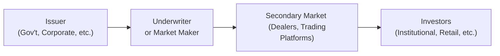

## Introduction

I still remember the first time I looked at a bond price quote. I thought, “Um, why does it say 102.50 when the face value is 100?” It felt confusing—until I realized that bonds, like stocks, trade in a market where price can deviate from face value. In a nutshell, fixed-income securities represent an issuer’s promise to pay coupon interest and repay principal at maturity. While that might sound straightforward—after all, a bond can be seen as an IOU—there’s a surprising richness to the types and features of these instruments.

Unlike equity markets, fixed-income markets can be more opaque and fragmented, often dealing over-the-counter (OTC) rather than on a central exchange. In this section, we’ll explore the essentials of bonds, from the different types of issuers (governments, corporates, and more) to the risks and rewards. We’ll also chat about how interest rates and macroeconomic conditions shape bond prices, plus a few personal tips I’ve gleaned. Let’s dive in.

## Key Characteristics of Fixed-Income Securities

Fixed-income (or debt) securities revolve around a few key concepts that define the contractual relationship between issuer and investor:

• Coupon Payment: The periodic interest payment made to bondholders. Some bonds pay a fixed coupon, such as 5% per year, while others pay a floating rate tied to reference rates like SOFR or EURIBOR. There are even zero-coupon bonds that offer no interim payments, instead issuing a lump sum at maturity.  
• Principal (Face Value): This is the amount on which the coupon is calculated and that must be paid back at maturity. Often referred to as par or face amount, it can vary (usually 1,000 or 100 per bond in many jurisdictions).  
• Maturity: On the bond’s maturity date, the issuer’s debt obligations end. Bonds can be short-term (up to one year), medium-term (one to 10 years), or long-term (10+ years). Certain bonds, like perpetuities, have no maturity date.  
• Yield: Typically measured as yield-to-maturity (YTM), it’s the expected rate of return for an investor who purchases the bond at today’s price and holds it until maturity, assuming no default. Yield includes coupon income and any capital gain or loss if the bond is purchased at a discount or premium.  
• Default Risk (Credit Risk): The possibility that the issuer will be unable or unwilling to make timely interest and principal payments. Credit risk is often measured by credit ratings agencies.  
• Interest Rate Risk: The risk that bond prices will fall if prevailing interest rates rise (and vice versa). Longer duration bonds tend to be more sensitive to rate changes.  
• Liquidity: The ease with which a bond can be bought or sold at fair value in the market. Some government bonds trade heavily every day, whereas certain corporate or municipal bonds may be more thinly traded.

Understanding these features is fundamental. In practice, they all weave together: interest rate movements affect prices, credit conditions impact yields, and investor appetite for liquidity shapes spreads.

## Major Types of Issuers

One of the joys (and sometimes headaches) of fixed income is the sheer variety of issuers. Each issuer type has its own characteristics when it comes to creditworthiness, coupons, maturity ranges, and liquidity.

• Government Bonds: These are issued by national treasuries (like U.S. Treasuries or UK Gilts) and typically have the highest liquidity. They often serve as benchmarks for risk-free rates.  
• Municipal Bonds (Munis): Issued by local or regional governments. In certain jurisdictions, such as the United States, coupon payments may be tax-exempt at federal or state levels, which can lead to complex yield calculations.  
• Corporate Bonds: Issued by public or private companies to finance operations, expansions, or acquisitions. Corporate bonds range from investment-grade (relatively low default risk) to high-yield (or junk) bonds with higher default risk but potentially higher returns.  
• Supranational Bonds: Issued by entities like the World Bank or the European Investment Bank. These typically carry strong creditworthiness due to multilateral backing.  
• Quasi-Government (Agency) Bonds: Often partially guaranteed by national governments—examples include bonds from government-sponsored enterprises (GSEs). Their credit quality can be high, but liquidity might vary.  

The diversity of issuers means that the global fixed-income market is actually larger than the equity market in terms of notional value. It also implies that different sectors can react differently to macroeconomic shifts like interest rate changes or economic slowdowns.

## Comparing Fixed-Income and Equity Markets

Investors often find bond markets less transparent and more fragmented than equity markets. Equities generally trade on centralized exchanges (think NYSE, LSE, HKEX), which publish real-time prices and volumes. By contrast, many bonds trade over-the-counter, with transactions negotiated between broker-dealers and institutional investors.

• Trading Conventions: In equity markets, you can usually see bids and asks in real time. Bond prices might not be quoted publicly; instead, you’ll often rely on dealer quotes or third-party platforms.  
• Pricing: Bond prices tend to revolve around yield metrics, whereas stocks are more about price-to-earnings ratios or other equity valuation metrics. Bond valuations heavily depend on interest rate levels and credit conditions.  
• Risk-Return Profile: Stocks can provide unlimited upside (in theory), while bonds typically offer stable interest payments and principal repayment. In exchange, bond returns are often capped relative to equities.  
• Market Participants: Retail traders are typically more prominent in stock markets, while institutional investors (like pension funds, mutual funds, insurance companies) dominate fixed income. Nonetheless, there is growing demand for retail participation in bond ETFs and other vehicles that provide bond exposure.

From a portfolio management perspective, bonds typically serve as a diversifier against equity volatility. Their lower correlation with stocks can help smooth out portfolio returns. That said, credit spreads can widen during financial crises, leading to price drops for even historically “safe” bonds.

## Market Size, Liquidity, and Regional Differences

If you’ve ever tried to sell a specific corporate bond on a Thursday morning, only to get lackluster quotes from dealers, well, welcome to the liquidity puzzle. The global bond market differs significantly by region, issuer type, and credit quality:

• Government vs. Corporate: Government bonds in major markets (e.g., U.S. Treasuries, Japanese Government Bonds) generally feature high liquidity and tight bid-ask spreads. Corporate and municipal bonds might have wider spreads and less frequent trading.  
• Developed vs. Emerging: Developed markets typically have deeper bond liquidity compared to emerging markets, where bond markets might be smaller, less liquid, and more susceptible to volatility.  
• Credit Quality: High-yield (junk) bonds can be less liquid during market stress, reflecting increased credit and liquidity risk. In contrast, top-rated bonds (e.g., AAA-rated) can maintain more stable liquidity.  

The size of the global bond market is enormous, with estimates often exceeding USD 100 trillion. That said, liquidity can vary drastically. Some segments, like short-term T-bills, are highly liquid, while specialized or lower-rated segments might be hard to trade without large price concessions.

## Role of Interest Rates and Macroeconomic Conditions

When interest rates go up, bond prices typically go down. That inverse relationship is central to understanding bond market dynamics. If new bonds are being issued at higher coupons, older ones with lower coupons become less attractive unless their price drops to compensate.

• Central Bank Policies: Central bank decisions—such as changing benchmark rates or starting/stopping quantitative easing—can cause ripple effects across yield curves.  
• Inflation Expectations: Higher inflation typically pushes yields upward (and bond prices downward), as fixed coupons lose purchasing power. Inflation-linked bonds (like TIPS in the U.S.) attempt to address this issue by tying payments to inflation indices.  
• Economic Growth: Strong economic growth might lead to higher rates, while recessions can prompt central banks to lower rates.  
• Global Factors: In a highly interconnected world, capital flows across borders in pursuit of yield. This can compress spreads in some markets and widen them in others.

In short, the macro environment—interest rates, inflation, economic growth, and even monetary policy in other countries—affects how bond prices move, often more so than in equity markets.

## Common Investor Objectives in Fixed Income

Why invest in bonds? Fixed income can offer several compelling advantages:

• Income Generation: Coupons provide a steady cash flow. Some retirees or pension funds rely on bond interest for predictable income.  
• Capital Preservation: High-quality bonds, especially government bonds in stable countries, are considered lower risk for preserving principal.  
• Diversification Benefits: Bonds usually do not move in strict lockstep with equities. They can reduce portfolio volatility when included as part of a broader asset allocation strategy.  
• Liability Matching: Institutional investors (like pension funds or insurance companies) often hold long-duration bonds to hedge long-term liability cash flows.

However, the quest for higher yields inevitably leads to trade-offs, such as higher credit or duration risk. That interplay is a big part of the charm (and challenge) of bond investing.

## Core Risks in Fixed-Income Markets

Investors face multiple risks, each of which can significantly impact bond valuations and returns.

• Credit Risk (Default Risk): Will the issuer make scheduled payments on time? The higher the risk, the higher the potential yield—but also the greater the chance of default. Credit ratings from agencies (e.g., Moody’s, S&P, Fitch) provide a starting point, though they are not infallible.  
• Interest Rate Risk: If interest rates rise, bond prices generally fall. This risk is captured by duration and convexity measures. Longer-maturity bonds usually have higher duration, hence higher interest rate sensitivity.  
• Liquidity Risk: During volatile markets, even theoretically “safe” bonds may see prices drop if liquidity dries up. Wide bid-ask spreads can hurt total returns if you need to sell quickly.  
• Inflation Risk: For fixed-coupon bonds, rising inflation can eat into real returns. Inflation-linked securities help mitigate this but often trade at different yield levels compared to nominal bonds.  
• Reinvestment Risk: As coupons or principal repayments come in, there’s no guarantee that you can reinvest them at the same yield, especially if rates have dropped.

Managing these risks typically involves diversification, careful duration targeting, and ongoing credit analysis.

## Diagram: Bond Market Flow

Below is a simple diagram illustrating how a bond moves from issuer to investor through the primary and secondary markets:

In the primary market, underwriters (often investment banks or syndicates) help the issuer sell new bonds to institutional or retail investors. After issuance, the bond typically trades among various participants via dealer networks or electronic platforms in the secondary market.

## Real-World Example: Corporate Bond Issuance

Let’s consider a hypothetical scenario: GroWell Inc., a mid-sized agricultural technology company, issues a 5-year corporate bond at a 6% coupon, with an investment-grade rating (let’s say BBB). Suppose the yield on comparable bonds is 5.8%. GroWell’s bond initially prices around par (close to 100). 

A year later, if interest rates rise by 1%, newly issued 4-year bonds might have coupons of around 7%. Investors holding GroWell’s bond may now see its market price drop below par, say to 97, to match the new yield environment. If, in the meantime, GroWell’s credit outlook improves, that could partially offset interest rate effects by reducing its spread. So there’s a constant tug-of-war between interest rate shifts and credit risk changes.

## IFRS vs. US GAAP Note

Although we discuss these securities primarily from an investor perspective, be aware that accounting rules under IFRS and US GAAP can differ slightly in how bonds are classified on financial statements—(e.g., Held-to-Maturity vs. Fair Value through Profit or Loss). As a CFA candidate, you should recognize how these classifications impact reported earnings and balance sheet figures, but the core bond valuation principles remain consistent across reporting regimes.

## Linking to the CFA Exam

In the CFA curriculum (including Level III), you’ll encounter plenty of scenario-based questions where you need to evaluate the impact of changing interest rates, credit spreads, or economic conditions on bond portfolios. You might also see essay questions requiring you to propose strategic or tactical allocation shifts, especially in unpredictable markets. The exam often tests your ability to analyze risk and return trade-offs, demonstrate knowledge of yield measures, and articulate how bond strategies fit into broader portfolio objectives.

• Practice summarizing key risk factors and how they affect bond valuation.  
• Be ready to compare and contrast different types of fixed-income securities or to propose hedging strategies for interest rate risk.  
• Understand that real-world constraints (like liquidity or regulatory capital requirements) can shape how much fixed-income exposure a portfolio takes on.

Anyway, if you’re like me, you’ll eventually come to appreciate how bonds can be both dependable income generators and complex instruments of financial engineering.

## Final Thoughts and Exam Tips

• Watch Duration and Convexity: These are your go-to measures for interest rate risk. Expect them heavily in the exam.  
• Keep an Eye on Credit Trends: Credit cycles can turn quickly. Understand how rating changes or spread movements can affect bond portfolios.  
• Don’t Overlook Liquidity: In a crisis, liquidity evaporates. Be mindful of how easily you can exit positions.  
• Master Yield Measures: Yield-to-maturity, current yield, yield-to-call—all matter. The exam might probe your understanding in problem sets.  
• Practice With Real Data: Try analyzing bond quotes and yields from market data. This real-world perspective helps you answer those scenario-based items with confidence.  

As you head into the exam, remember that fixed-income can be both a risk management tool and a source of returns. Balancing these perspectives is key in mastering the material.

## References

- Fabozzi, F. J. “Bond Markets, Analysis, and Strategies.” Pearson.  
- Choudhry, M. “The Bond and Money Markets: Strategy, Trading, Analysis.” Butterworth-Heinemann.  
- CFA Institute: Fixed-Income Educational Resources, https://www.cfainstitute.org/
- CFA Institute Code and Standards, https://www.cfainstitute.org/en/ethics-standards

## Test Your Knowledge: Overview of Fixed-Income Securities and Markets Quiz



### Which of the following best describes a bond’s coupon payment?

- [ ] It is the amount repaid to bondholders at maturity.  
- [ ] It is the expected rate of return for an investor who holds the bond to maturity.  
- [x] It is the periodic interest payment made to bondholders.  
- [ ] It is the dollar price at which a bond trades in the secondary market.

> **Explanation:** A coupon is the periodic interest payment, usually expressed as a percentage of the bond’s face value.

### Investors in fixed-income securities generally experience capital preservation and predictable income. Which key risk most directly threatens this stability?

- [ ] Foreign exchange risk.  
- [ ] Reinvestment risk.  
- [ ] Prepayment risk.  
- [x] Default (credit) risk.

> **Explanation:** While bonds involve multiple risks, default (credit) risk most directly threatens the security of income and principal.

### Which of the following statements regarding interest rate risk is most accurate?

- [x] When market interest rates rise, existing bond prices typically fall.  
- [ ] When market interest rates rise, bond prices remain unchanged.  
- [ ] Price changes are unrelated to market interest rates.  
- [ ] Higher interest rates always mean higher bond prices.

> **Explanation:** The price and yield of a bond move inversely. As market interest rates rise, newly issued bonds become more attractive, pushing down the prices of existing ones.

### What is the primary role of government bonds in the fixed-income market?

- [ ] To offer the highest possible yields in the market.  
- [x] To provide a benchmark for risk-free rates and high liquidity.  
- [ ] To serve only as short-term financing instruments.  
- [ ] To mimic equity returns but with higher volatility.

> **Explanation:** Government bonds are often used as a risk-free benchmark; they usually have high liquidity and lower default risk compared to other bonds.

### In comparing fixed-income to equity markets, which of the following statements is most accurate?

- [x] Bond markets are often more fragmented and less transparent than equity markets.  
- [ ] Equities always carry lower risk compared to bonds.  
- [x] Institutional investors dominate bond markets more than equity markets.  
- [ ] Bond markets have higher daily trading volume than equities in all sectors.

> **Explanation:** Contrary to centralized equity exchanges, many bond trades occur OTC. Institutions are major players, and liquidity can vary widely by sector.

### If interest rates decline after you purchase a bond, which risk is most relevant for the future cash flows you receive from the bond’s coupon payments?

- [ ] Credit risk.  
- [ ] Liquidity risk.  
- [x] Reinvestment risk.  
- [ ] Tax risk.

> **Explanation:** If interest rates drop, you may only be able to reinvest coupon payments at lower yields, reducing your overall return.

### A large global bank issues a 3-year bond at par with a 4% coupon. If market interest rates for similar bonds are 3.5%, what happens to the price of the 4% bond right after issuance?

- [x] It will likely trade slightly above par.  
- [ ] It will remain fixed at par until maturity.  
- [ ] It will trade significantly below par.  
- [ ] It will have no secondary market quote until maturity.

> **Explanation:** If the bond’s coupon is higher than the market yield for similar instruments, the bond becomes slightly more attractive, prompting a higher price in the secondary market.

### Which factor primarily sets government bond yields apart from corporate bond yields?

- [ ] Government bonds never face liquidity risk.  
- [x] Government bonds typically reflect minimal default risk and serve as a benchmark.  
- [ ] Corporate bonds are always longer maturity than government bonds.  
- [ ] Corporate bonds have no credit risk component.

> **Explanation:** Governments are often assumed to have lower default risk, providing a baseline yield curve that corporate bond markets build upon through credit spreads.

### In the context of bond valuation, what does the term “yield to maturity” represent?

- [x] The discount rate that, when applied to all future cash flows, equates the bond’s price to its present value.  
- [ ] The bond’s annual real interest after inflation.  
- [ ] A measure of annual coupon payments without considering bond price fluctuations.  
- [ ] The price at which the bond will trade on the secondary market.

> **Explanation:** Yield to maturity (YTM) is the internal rate of return on a bond if held to maturity, considering all coupon payments and repayment of face value.

### Bonds can be an effective diversifier in a portfolio because:

- [x] True  
- [ ] False  

> **Explanation:** Bonds often exhibit lower correlation with stocks, so holding bonds alongside equities can help reduce overall portfolio volatility and enhance risk-adjusted returns.


