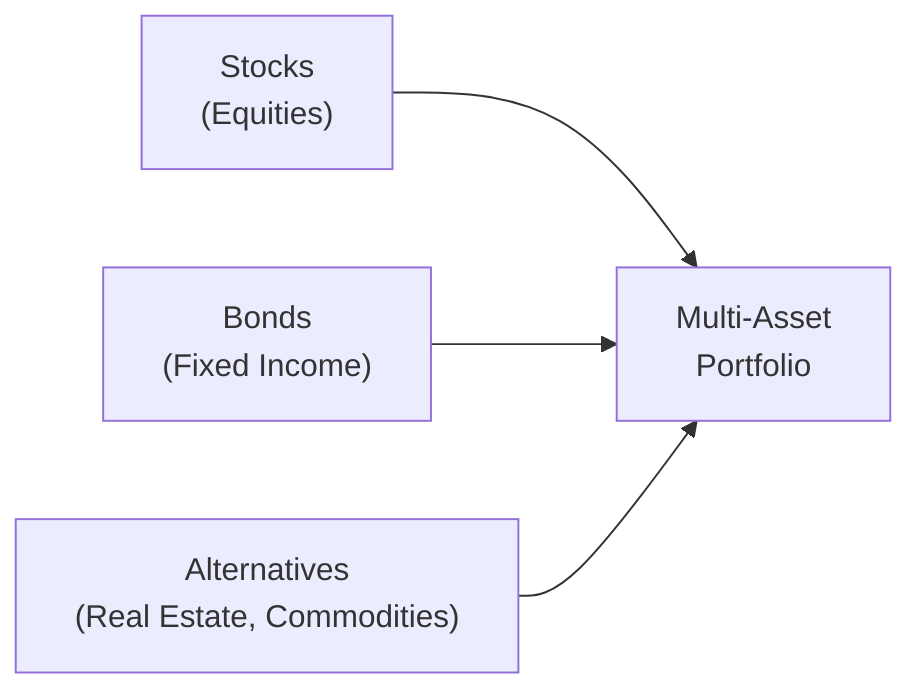

## Introduction and Context

If you’ve ever found yourself staring at simultaneous streams of equities, fixed income, and alternative funds on your screen—kind of wondering, “Um, how in the world do I actually combine all these into one cohesive portfolio?”—you’re not alone. One of the key pillars, particularly if you’re building a multi-asset portfolio, is understanding the role of bonds (or fixed-income securities). They do more than just produce interest payments. They reduce volatility, provide diversification, and can be used to manage liabilities. And sometimes, they keep you sane when equity markets are losing their minds.

In this section, we’ll explore how bonds fit into multi-asset portfolios, how correlations shift over market cycles, and how bond characteristics—like duration, credit quality, and yield—impact overall portfolio outcomes. We’ll also cover certain strategic angles, such as using sovereign bonds for liquidity, corporate and high-yield bonds for income potential, TIPS for inflation protection, and liability-driven investing (LDI) for matching assets with future obligations.

## Rationale for Bonds in Multi-Asset Portfolios

### Stabilizing Influences

Fixed-income instruments often serve as a ballast when equities become volatile. When I first started building hybrid portfolios, a mentor told me, “Bonds are your grown-ups in the room.” And, honestly, that’s probably the simplest example of their role. They offer a relatively predictable cash flow (coupons), a set maturity date (for many issues), and a par value that creditors are obligated to repay—though that obligation’s strength depends on the issuer’s creditworthiness.

Equities can swing wildly from day to day, but well-chosen investment-grade bonds tend to have smaller price fluctuations. This stable income stream and lower volatility are essential for investors looking to minimize the stress that large equity drawdowns can cause. Granted, we’ve seen periods—such as the global financial crisis—where correlations converge and “everything goes down together.” But in general, high-quality bonds can help smooth your total returns over time.

### Diversification and Correlation

One of the big draws of combining bonds with equities or other assets is the typical negative—or at least lower—correlation that bonds historically demonstrate relative to stocks. Correlation, after all, measures how two assets move in relation to each other. Here’s a familiar formula for correlation ρ of assets X and Y:


\rho_{X,Y} = \frac{\text{Cov}(X, Y)}{\sigma_X \sigma_Y}


The lower (or more negative) ρ_{X,Y} is, the greater the diversification benefit. But you should know that correlation structures are dynamic. We can’t expect a stable correlation in all market conditions. During crises, correlations often spike, which can reduce the protective effect of bonds. Still, in most normal markets, bonds and equities are not perfectly correlated—meaning you can enjoy some cushion or offset when stock prices fluctuate.

## Key Bond Characteristics in a Broader Asset Mix

### Duration and Interest Rate Sensitivity

Duration is essentially a measure of a bond’s sensitivity to interest rate changes. A longer duration usually means higher price sensitivity to interest rate shifts. Within a multi-asset context, you decide on your duration posture based on:
- Your view on future interest rates (rising, falling, or stable).  
- Your need for stable cash flows (longer-duration bonds can provide this but can be more volatile).  
- Your target for overall portfolio volatility.

If you expect rising rates, shorter-duration bonds or floating-rate notes become more appealing since they’re less sensitive to price declines. Conversely, in an environment where you think rates might fall, longer-duration holdings can capture greater capital appreciation.

### Credit Quality

Stable income, or “the grown-ups in the room,” isn’t free from risk, though. Credit risk is the possibility that an issuer might default on interest or principal. Investment-grade bonds (rated BBB–/Baa3 or higher) generally have lower yields but also lower credit risk. High-yield bonds (below BBB–/Baa3) offer higher coupon rates but come with higher risk, especially during economic downturns. That’s why you’ll see many multi-asset portfolios blend treasury bonds (or other sovereign bonds) for safety and liquidity with select high-yield issues to boost overall yield.

### Yield Curve Positioning

Another dimension is yield curve positioning—where on the maturity spectrum you choose to invest. Strategically, if you anticipate a steepening yield curve, you might hold shorter maturities to avoid the underperforming segments. If a flattening curve is expected, maybe you look at longer maturities or specific key rate durations to capture potential price gains.

## Incorporating Different Bond Types

### Sovereign Bonds (Safety and Liquidity)

Sovereign bonds (like U.S. Treasuries, German Bunds, or Japanese Government Bonds) are typically seen as the safest assets in their respective currencies (assuming stable governments). Along with maturity and coupon protections, they often provide liquidity during extreme market events. They may not yield as much as other bonds, but in a crisis, they can help preserve value when riskier assets are in freefall.

### Corporate and High-Yield Bonds (Greater Yield Potential)

The corporate bond market offers opportunities for higher coupons, especially if you go down the credit quality ladder (e.g., BB, B, or even CCC). When included in multi-asset portfolios, high-yield bonds often behave more like equities—they can do better in economic expansions but suffer during recessions. If you have a strong macro view that the economy is in a growth phase, it might be appropriate to lean more heavily into high yield. But watch out: correlation between high yield and equities tends to be higher than that of Treasuries and equities, so you might lose some diversification benefit.

### Inflation-Linked Bonds (TIPS)

Inflation going up? Inflation-Linked Bonds (commonly known as TIPS in the U.S.) can help offset inflation risk by adjusting the principal based on a specified inflation index (such as CPI). If you suspect rising inflation—especially unanticipated inflation—this category can lend stability to real returns in your portfolio. For instance, TIPS behave differently from nominal bonds, so they can reduce the overall volatility of your multi-asset portfolio when you’re worried about erosion of purchasing power.

## Balancing Rate Risk and Rebalancing

One crucial consideration is that interest rates do not remain static. Rising interest rates often reduce bond prices. If your portfolio has a large allocation of longer-duration bonds going into a rising-rate environment, well, that can be painful. Active portfolio management, rebalancing, or hedging (e.g., using interest rate futures or swaps) can help you navigate these changes.

Dynamic rebalancing ensures that if bonds sell off, they stay within your targeted allocation, keeping risk exposures consistent with your objectives. Some investors also use derivatives to manage duration more precisely without having to buy or sell the underlying bonds.

## Liability-Driven Investing (LDI) Strategies

It might sound fancy, but liability-driven investing is basically a strategy that focuses on matching future cash flows from bonds to the timing and magnitude of known liabilities. Picture a pension fund that knows it needs to pay retirees a certain amount over the next 20 years. They want to lock in a dependable return that aligns with those payouts. By choosing bonds with durations closely matched to those liabilities (sometimes called duration matching), the fund reduces the risk that changes in interest rates will hurt the ability to meet obligations.

LDI is also popular in insurance, endowments, or any environment where projected cash outflows are relatively predictable. If you’re an individual planning for retirement, a simpler version might involve buying long-duration bonds or bond ladders to ensure you have stable income for future expenses.

## Factor-Based Approaches in Fixed Income

In multi-asset portfolios, factor investing was initially popularized in equities (think value, momentum, size, etc.). But it has gained traction in fixed income as well, with factors like:
- Value (bonds that appear cheap relative to fundamentals).  
- Momentum (bonds or sectors showing recent positive price trends).  
- Carry (higher-yielding bonds are more attractive if default risks are within tolerance).

In practice, many institutional investors incorporate bond factors in tandem with equity factors for a more holistic multi-asset factor approach. For example, they might hold a “carry and momentum” tilt in fixed income while simultaneously running a “value” tilt in equities—depending on which risk premiums they see as most attractive at the time.

## Practical Example: Balancing Equities and Fixed Income

Let’s illustrate a basic multi-asset portfolio:

1. 60% Equities (Domestic & International)  
2. 35% Fixed Income (Mix of Treasuries, Investment-Grade Corporate, and TIPS)  
3. 5% Cash or Equivalents  

Within that 35% fixed-income slice:
- 15% short-term Treasury bonds for liquidity.  
- 10% investment-grade corporate bonds for additional yield.  
- 5% TIPS to hedge inflation.  
- 5% international or emerging market sovereign debt for diversification (albeit with currency considerations).

You might tweak these allocations if you have a different outlook on inflation, interest rates, or corporate spreads. The point is that you’re layering various bond segments to get unique risk and return characteristics that complement your equities and provide a cushion in volatile markets.

It often helps to visualize how various asset classes come together to form a single portfolio:

In real-life scenarios, you’ll continuously monitor how these allocations perform, especially if major events—like a central bank shifting its policy rate significantly—change the landscape.

## Best Practices and Potential Pitfalls

• Keep a close eye on credit spreads. When credit spreads widen significantly, it means the market is pricing in more risk. This can also create opportunities to buy depressed bonds cheaply—bearing in mind the heightened default risk.

• Don’t rely on historical correlations blindly. Correlation patterns can shift dramatically during crisis periods. Make sure your scenario analysis includes stress scenarios where typical correlation assumptions break down.

• Overconcentration in long-duration bonds can be dangerous in a rapidly rising interest rate environment. Hedging or adopting a barbell strategy (mix of short- and long-term maturities) can alleviate some rate risk.

• Maintaining adequate liquidity is crucial. Even if your bond positions are “safe,” you need to be able to meet short-term cash flow requirements without having to sell assets at disadvantageous times.

## Exam Tips and Strategies

• Be prepared to illustrate how changes in interest rates affect the bond portion of a multi-asset portfolio. You might see essay questions requiring a demonstration of rebalancing or hedging interest rate exposure.

• Understand how to apply LDI concepts: plausible exam scenarios describe pension fund liabilities and ask you to select or justify appropriate bond durations.

• Practice scenario analysis: Rate hikes, credit spread widens, or changes in inflation data. The CFA exam might present you with a short narrative about macro conditions to test your ability to adjust a multi-asset portfolio’s bond allocation.

• Familiarize yourself with factor-based approaches in fixed income. The exam can present a table with factor exposures, and you’ll have to identify or interpret the best factor tilt scenario.

• Watch for question prompts on TIPS and inflation considerations—these are commonly tested. They often tie into a scenario about expected inflation or unexpected inflation.

## References and Further Reading

- “Fixed Income Strategy” by Tamara Mast Henderson.  
- “Global Asset Allocation” by Gary Brinson et al.—explores the theoretical and practical role of bonds in a multi-asset context.  
- PIMCO and BlackRock research materials on multi-asset strategies (available on their respective websites).  

## Glossary Highlights

• Asset Allocation: The process of dividing investments among different asset classes—stocks, bonds, cash, etc.—to meet goals.  
• Correlation: A measure of how two assets move relative to each other.  
• Duration Matching: Aligning bond durations to meet specific liabilities or target dates.  
• Credit Quality: The rating of an issuer’s ability to meet debt obligations, crucial for risk/return.  
• Inflation-Linked Bonds (TIPS): Bonds that adjust principal and coupons for inflation.  
• Liquidity Management: Ensuring enough cash or easily sold assets to meet short-term needs.  
• LDI (Liability-Driven Investing): A strategy to match bond characteristics (cash flows, durations) with expected liabilities.  
• Factor-Based Investing: Identifying specific drivers (value, momentum, carry) in both equity and fixed-income markets.

---

## Test Your Knowledge: The Role of Fixed Income in Multi-Asset Portfolio Construction



### A portfolio manager wants to reduce overall portfolio volatility. Which bond characteristic most directly helps achieve that goal?

- [ ] Higher duration
- [ ] Lower credit quality
- [x] Higher credit quality
- [ ] Zero-coupon structure

> **Explanation:** Higher credit quality typically implies lower default risk and more stable valuations, reducing volatility in the overall portfolio.

### Which of the following is the best rationale for adding Sovereign Bonds to a multi-asset portfolio?

- [ ] They offer the highest coupon among all bond types.  
- [ ] They are more correlated to equities than corporate bonds.  
- [x] They can provide liquidity and a hedge in periods of market stress.  
- [ ] They have no interest rate risk.  

> **Explanation:** Sovereign bonds (particularly from stable governments) often serve as a safe haven and provide liquidity in times of market stress. Their correlation to equities is typically lower than corporate bonds, helping with diversification.

### An investor believes interest rates will rise sharply over the next year. Which bond strategy is most appropriate?

- [ ] Increase exposure to long-duration government bonds.  
- [x] Increase exposure to short-duration or floating-rate bonds.  
- [ ] Switch entirely to high-yield corporate bonds.  
- [ ] Maintain current bond positioning without adjustment.  

> **Explanation:** When rates rise, longer-duration bond prices fall more. Short-duration or floating-rate bonds have lower interest rate risk, making them more suitable in a rising-rate environment.

### What is a primary benefit of adding TIPS to a multi-asset portfolio?

- [x] They provide partial protection against unexpected inflation.  
- [ ] They increase the portfolio’s overall credit risk.  
- [ ] They remove all interest rate exposure.  
- [ ] They are negatively correlated to nominal bonds.  

> **Explanation:** TIPS’ principal is indexed to inflation, thereby offering a hedge against rising inflation. They still carry interest rate exposure, but they protect purchasing power better than nominal bonds if inflation increases.

### When constructing an LDI strategy for a pension fund:

- [x] Matching bond durations to the timing of retirement payouts is crucial.  
- [ ] Achieving the highest possible coupon is the primary goal.  
- [x] Reducing the risk that interest rate changes upset liability funding is crucial.  
- [ ] Always keep a 100% allocation to high-yield bonds.  

> **Explanation:** Liability-driven investing focuses on matching bond durations/cash flows to expected liabilities. One key objective is to reduce interest rate risk that could cause mismatches in funding the pension plan’s future obligations.

### In a multi-asset portfolio, which statement is most accurate regarding correlations?

- [x] Bond correlations with equities can change during market crises.  
- [ ] Bond correlations with equities always remain strictly negative.  
- [ ] High-yield bonds are always inversely correlated with equities.  
- [ ] Only government bonds exhibit stable correlations over time.  

> **Explanation:** Correlations are not static. In a crisis, correlations can spike unexpectedly, reducing the diversification benefit of bonds relative to equities. High-yield bonds, in particular, can behave similarly to equities in stress scenarios.

### A portfolio manager uses a barbell strategy: holding short-duration and long-duration bonds but avoiding the intermediate segment. This approach is likely aiming to:

- [x] Benefit from potential flattening or steepening of the yield curve.  
- [ ] Eliminate all credit risk.  
- [x] Flexibly respond to interest rate volatility.  
- [ ] Maximize coupon payments at every maturity.  

> **Explanation:** A barbell strategy is often used to take advantage of anticipated yield curve changes or manage volatility. By holding short-dated bonds (improved liquidity and lower interest rate risk) and long-dated bonds (potential for higher yields if rates drop further), the manager can respond flexibly to rate movements.

### Which statement best characterizes the role of credit spreads in bond selection?

- [x] Wider spreads may indicate higher perceived default risk but could offer greater returns if defaults do not materialize.  
- [ ] Tighter spreads always guarantee higher returns.  
- [ ] Credit spreads remain constant across different maturities.  
- [ ] Credit spreads only affect government bonds.  

> **Explanation:** Credit spreads reflect the extra yield demanded by the market for issuer default risk. Wider spreads may offer an opportunity to earn higher returns but come with greater risk.

### An investor wants a fixed-income approach to benefit from stable or falling interest rates but also to lock in a higher yield than government bonds. Which option is most suitable?

- [x] Investment-grade corporate bonds with moderate durations  
- [ ] High-yield bonds with a near-zero maturity  
- [ ] TIPS with a 3-month duration  
- [ ] Only short-term Treasury bills  

> **Explanation:** Investment-grade corporate bonds provide yields higher than government bonds, while moderate durations allow for price appreciation if interest rates fall. Short-term T-bills and TIPS offer different risk/return profiles.

### In factor-based investing for fixed income, which statement is correct?

- [x] True
- [ ] False

> **Explanation:** True. Factor-based investing in fixed income often includes value, momentum, and carry factors, similar to equities, but adapted to bond markets.


