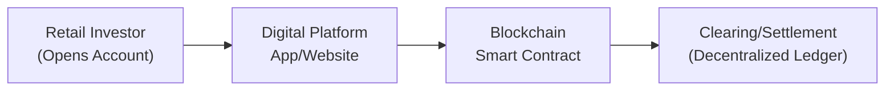

## Introduction and Background

The traditional bond market—once dominated by institutional players—has been steadily evolving with digital innovation. Retail investors today can access online platforms and mobile apps that offer bond transactions with greater transparency, often lower fees, and real-time analytics. This democratization is quite a contrast from the old days, when you basically had to phone a broker (remember those times?) just to get a quote.  

Retail investors frequently discover that digital platforms offer features like fractional ownership and straightforward onboarding. Although these flexible solutions can drastically reduce barriers to entry, they also bring fresh considerations such as platform reliability, best execution, and compliance demands. Let’s dig in deeper and explore how digital platforms are reshaping this space.

## Key Drivers Transforming Retail Bond Markets

### Technological Innovation and Lower Costs
Traditional bond trading typically involved wide bid-ask spreads and limited public data. However, technology now allows real-time price feeds across multiple trading venues. With a few taps on a smartphone, a retail investor can see multiple bond offerings, check price transparency metrics, and confidently hit “Buy.”  

But here’s a small personal anecdote: The first time I tried buying a corporate bond through an online broker, I was (surprisingly) nervous. Some part of me still believed that bond trades had to be complicated and, well, done through a phone call. Hitting that “Confirm Trade” button felt strange, but it was so convenient and, to my relief, the trade settled smoothly without the usual rigmarole. This convenience is often accompanied by lower fees because of reduced overhead from automation and digital workflows.

### Fractional Ownership for Greater Accessibility
Fractional ownership has truly pushed open the door for smaller portfolios to access previously off-limits securities. Instead of needing thousands of dollars to buy a single bond lot, retail investors can own a fraction of high-priced or institutional-grade bonds. This is especially significant for younger investors looking to diversify their portfolios without tying up vast sums in a single fixed-income instrument.

On many modern apps, you might see a “Buy $100 worth of Corporate Bond X.” This effectively captures the principle behind fractional ownership. The platform aggregates all these smaller orders, so each investor can hold a proportionate share of the bond’s coupon and principal repayments.

## Digital Onboarding: KYC and AML Streamlined

### The Onboarding Process
Before any trades occur, it’s essential that investors go through KYC (Know Your Customer) protocols. If you’ve opened a digital brokerage account, you’re probably familiar with uploading scans of your ID, passing identity checks, and answering background questions. The entire process has become faster and more user-friendly, thanks to advanced data recognition and AI-driven solutions.  

### AML Safeguards
Simultaneously, AML (Anti–Money Laundering) requirements must be followed to ensure no illicit funds enter the capital markets. Many digital platforms automate these checks, using algorithms to monitor unusual deposit patterns or suspicious transactions. The net effect is that compliance staff can handle more accounts efficiently, while still—you know—preventing illegal activities.  

So, ironically, even though technology might seem to blur boundaries and speed things up, the overall system remains more secure than the archaic paper-based approach.

## Settlement Innovations: Blockchain and Beyond

### Legacy Settlement Challenges
In traditional bond transactions, settlement can take several days, typically referred to as T+2 or T+3 (trade date plus two or three business days). Operational friction—like manual documentation or multiple clearing intermediaries—can lead to settlement fails and potential counterparty risks.

### Blockchain-Based Settlement
Enter distributed ledger technology (DLT). There’s growing interest in using blockchain to facilitate near-instant settlement. Imagine you buy a bond on a blockchain-based trading platform: ownership records update in real time, and the corresponding cash leg might be transferred automatically using smart contracts. If (and we must emphasize “if”) the entire ecosystem is in place, settlement could happen in minutes rather than days.  

Below is a simple diagram illustrating a blockchain-enabled flow for a retail bond transaction:

Such approaches can reduce operational risk, lower settlement costs, and mitigate the chance of unsettled trades. It’s still early days for wide-scale adoption, but many pilot programs are exploring how blockchain can handle bond issuance, trading, and custodial services.  

### E-Wallets, Stablecoins, and CBDCs
In some corners of the market, stablecoins (cryptocurrencies pegged to fiat currency) are also being tested for bond settlement. For example, an investor’s digital wallet might automatically exchange stablecoin for bond tokens once a transaction is executed, compressing the entire settlement cycle into a single event.  

And with central banks exploring digital currencies (CBDCs), we might see direct integration with official currency tokens. The promise is seamless finality of payment—no intermediate steps, no cross-border friction. Imagine a scenario where you buy a U.S. Treasury bond, pay with a CBDC, and settlement is finalized in, say, under five minutes. That’s the potential synergy with these new payment rails.

## Ensuring Liquidity and Best Execution

### Liquidity Challenges
Retail-focused digital platforms sometimes face liquidity constraints. On large institutional marketplaces, daily bond volumes can be enormous, ensuring tight spreads and quick execution. But a retail-first platform, especially if it’s relatively new, may not have enough participants or robust inventory to guarantee the best price.  

When an investor tries to buy or sell a less-active bond, that lack of liquidity can result in higher transaction costs, or worse, no immediate matching orders. This means that while digital platforms open up access, they still must address the fundamental market structure issues of supply, demand, and market-making.

### Best Execution Obligations
Many jurisdictions impose a “best execution” duty on brokers. This requires them to seek the best possible outcome for client orders, factoring in not just price but also speed, likelihood of execution, and settlement. In digital-only environments, best execution policies hinge on sophisticated routing technology to connect the investor’s order with various trading venues or market-making entities.  

For example, the platform might run a query: “Which liquidity provider is quoting the best price for Bond ABC?” The algorithm aggregates quotes from multiple sources to fill the order at the best price. This ensures the retail investor isn’t taken advantage of in a thinly traded environment.

## Investor Education and Regulatory Safeguards

### Education for Retail Participants
It’s not enough to simply hand investors a fancy app; they need to understand how coupon payments, bond durations, yield-to-maturity calculations, and different credit ratings work. Some digital platforms offer built-in educational modules or risk disclosure pop-ups.  
   
In my opinion, these educational tools are crucial because, let’s face it, not everyone is reading IFRS or GAAP guidelines over coffee. Transparent information about potential bond defaults, interest rate risk, and liquidity constraints helps new investors make more informed decisions.

### Regulatory Protection
Regulators around the world—like the SEC in the United States or the FCA in the U.K.—are keen on ensuring that the shift toward digital bond trading does not come at the expense of investor safeguards. Platforms generally must register as broker-dealers and comply with quarterly or annual reporting. Many jurisdictions apply special rules that require additional disclaimers for complex products, such as high-yield bonds or structured notes.  

In some fruitful developments, we now see “regulatory sandboxes” that let FinTech startups test innovative solutions under mindful supervision. This fosters a balance between encouraging new technology and upholding robust consumer protection.

## Practical Examples and Case Studies

### Case Study: Tokenized Corporate Bonds
Recently, certain financial institutions have piloted tokenized corporate bonds. Issuers create a digital representation (“token”) of the bond, and retail investors buy shares of that token on an online platform. Settlement occurs on a private (or public) blockchain, drastically reducing clearing times. Early results show reduced overhead costs, though scaling to mainstream usage remains an ongoing challenge.

### Example: Mobile Brokerage App with Fractional Treasury Bonds
Some mobile brokerage apps now allow users to purchase fractional U.S. Treasury securities for as little as $5. The entire transaction—from ordering to confirmation—happens in under a minute. Investors see real-time yields, historical yield curves, and maturity timelines. Meanwhile, the platform handles the underlying aggregation, invests in Treasury bonds, and then “allocates” fractional units to each user account.

## Potential Future Developments

### Wider Integration with Payment Systems
Many platforms are exploring integrating e-wallets: you could maintain a digital cash balance, possibly denominated in stablecoins or even a future CBDC. By bridging the gap between your digital cash reserve and the bond marketplace, buy orders and subsequent dividend receipts become near-instant.  

### Global Accessibility and Cross-Border Investing
One of the most exciting prospects is giving a retail investor in, say, Brazil direct access to Euro-denominated bonds through a digital platform, while automatically handling currency conversion via stablecoins. This globalization of fixed income could drastically expand investor choice and reduce currency friction.

### Tokenization of Secondary Market Activities
Down the line, we might see robust tokenized secondary markets that combine automation with advanced analytics. Smart contracts could automatically pay coupons or handle call and put features. Fractional ownership might be extended to entire bond portfolios. It’s possible we’ll see aggregator apps that integrate with multiple blockchain-based exchanges, letting investors quickly compare yields across a curated list of 20 or more global bond offerings.

## Challenges and Best Practices

- Platform Reliability: Ensure back-end systems can handle spikes in trading volume without lag or outages.
- Cybersecurity: Digital platforms, especially those involving tokenization and e-wallets, must have top-tier encryption, multi-factor authentication, and constant monitoring.
- Transparent Fee Structure: Even if per-trade commissions are reduced, watch out for hidden spreads or platform “premium” fees.
- Cross-Border Compliance: If a platform serves customers in multiple countries, it must juggle different regulatory environments for KYC, AML, and securities laws.
- Continuous Education: Offer a library of content, webinars, and practice simulations so retail participants can build knowledge at their own pace.

## Exam Tips for CFA Candidates

1. Connect Concepts to Real-World Platforms: When discussing bond liquidity or settlement risk, try linking them to the practical innovations in digital platforms (e.g., T+0 settlement with a blockchain).
2. Understand Fractional Ownership: You might see a scenario-based question about calibrating the minimum capital needed for bond investment if fractional shares are available.
3. KYC/AML Compliance Nuances: Be aware that these regulations affect cost structure and operational workflows for any financial entity, including digital disruptors.
4. Potential Exam Question Formats: 
   • Item sets describing a new digital bond platform and how it manages best execution.  
   • Constructed-response questions requiring you to evaluate the risks of using stablecoins for settlement.
5. Compare and Contrast Tokenization vs. Traditional Settlement: Focus on benefits, but don’t overlook the regulatory and reputational risks.  

## References

• FinTech in Bond Markets: Innovations and Implications — World Economic Forum (<https://www.weforum.org/>)  
• Security Tokens and the Future of Capital Markets — Deloitte Insights (<https://www2.deloitte.com/>)  
• SIFMA (Securities Industry and Financial Markets Association) on Bond Trading and Settlement (<https://www.sifma.org/>)  

-----

## Test Your Knowledge: Digital Platforms and Retail Bond Settlement



### 1. Which of the following best describes how fractional ownership expands accessibility to bond markets?

- [ ] By requiring a minimum of $10,000 for each bond purchase.
- [x] By allowing investors to own a smaller share of a bond’s principal and coupon payments.
- [ ] By offering zero-coupon bonds only.
- [ ] By lobbying for the elimination of taxes on bond transactions.

> **Explanation:** Fractional ownership enables investors to purchase portions of a bond, making higher-priced issues more accessible.

### 2. A retail investor using a digital bond platform inputs an order. Which factor is most likely part of the broker’s “best execution” process?

- [ ] Ensuring the investor pays the highest possible price.
- [x] Aggregating quotes from multiple venues to secure competitive pricing.
- [ ] Redirecting the order to the slowest exchange possible.
- [ ] Denying access to real-time price feeds.

> **Explanation:** Best execution involves obtaining the most favorable price and terms for the client, often by comparing multiple liquidity sources.

### 3. Digital onboarding aids in KYC/AML compliance primarily by:

- [x] Facilitating automatic identity checks and suspicious activity flags.
- [ ] Declining all new account applications from abroad.
- [ ] Allowing purely anonymous transactions without ID documents.
- [ ] Eliminating the need to verify client credentials.

> **Explanation:** Digital onboarding uses automated systems to verify identities, handle document uploads, and flag abnormal activity quickly.

### 4. A significant advantage of blockchain-based settlement for bond transactions is:

- [ ] Longer settlement time of T+5.
- [x] Near-instant transaction finality with reduced operational risk.
- [ ] Complete elimination of all regulations.
- [ ] Hiding ownership records from participants.

> **Explanation:** Blockchain technology can streamline settlement, shifting the timeline from days to near-instant. However, regulations still generally apply.

### 5. E-wallets and stablecoins in retail bond transactions potentially offer:

- [x] Rapid settlement without waiting for bank transfers.
- [ ] Guaranteed indefinite liquidity for all bonds.
- [x] The ability to trade across borders more easily.
- [ ] Elimination of investor protection requirements.

> **Explanation:** Using e-wallets and stablecoins can speed up cross-border payments and settlement, but liquidity and regulatory oversight still matter.

### 6. Which of the following describes a real challenge digital bond platforms face in providing liquidity?

- [x] Limited number of participants can lead to wider bid-ask spreads.
- [ ] Bond markets are always fully liquid regardless of volume.
- [ ] All digital-only platforms guarantee infinite inventory.
- [ ] Retail investor orders must always execute at official “par” value.

> **Explanation:** Liquidity remains a potential issue because fewer participants can lead to bigger price disparities and potentially higher execution costs.

### 7. In a fractional retail bond platform, which party often handles the aggregation of numerous smaller investor orders?

- [x] The platform or broker itself.
- [ ] Individual retail investors.
- [x] An automated order management system.
- [ ] Central banks without any regulatory oversight.

> **Explanation:** The platform or broker uses its back-end systems to bundle fractional orders into a single consolidated trade, often executed at an exchange or via an interdealer broker.

### 8. To fulfill AML requirements, digital platforms often:

- [x] Use algorithms to detect large or unusual transactions.
- [ ] Grant all requests for anonymous accounts.
- [ ] Skip identity verification if an investor is well-known on social media.
- [ ] Only check institutional investors, not individuals.

> **Explanation:** Automated screening helps identify suspicious activities that may violate AML regulations, improving compliance and security.

### 9. A blockchain-based approach to bond settlement might involve tokenized bonds. Which is a core benefit?

- [x] Immediate or near-real-time updates to ownership records.
- [ ] Guaranteed 0% yield on all holdings.
- [ ] Mandatory investment exclusively in high-yield bonds.
- [ ] Significantly increased settlement delays.

> **Explanation:** Tokenization on blockchain provides faster settlement and updated ownership records in a secure, decentralized ledger.

### 10. True or False: Global regulators are completely hands-off with digital bond platforms, allowing them to operate without any oversight.

- [x] False
- [ ] True

> **Explanation:** Regulators still require platforms to meet standards related to disclosure, investor protection, and market integrity, even in digital environments.


