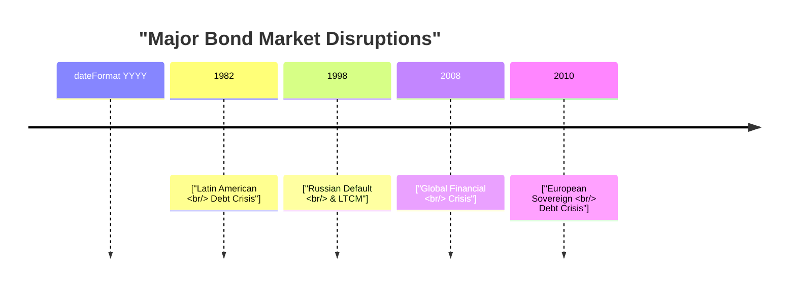

## Introduction

It might seem like the bond market is all about steady, predictable income—so why in the world do we keep seeing monumental disruptions? Well, in my opinion, it often comes down to misjudged credit risks, shaky global economic conditions, and, you know, that ever-present risk of contagion. Bond markets, after all, reflect the basic confidence investors have in issuers—be they corporations, governments, or structured finance products. When that confidence wavers, we sometimes see a big exodus of capital, known as a flight to quality, that can hit every corner of fixed-income markets.

Below, we’ll look at some of the most important historical disruptions in bond markets—the Latin American debt crisis of the 1980s, the Russian default in 1998, the 2008 financial meltdown, and the European sovereign debt crisis of the early 2010s. We’ll also explore the common threads linking these events, like excessive leverage and poor risk management. Finally, we’ll talk about how these episodes led to changes in regulations and the way practitioners approach stress testing, diversification, and capital buffers.

## Key Historical Bond Market Disruptions

### The Latin American Debt Crisis (1980s)

Most folks point to the Latin American debt crisis (sometimes called the LDC crisis) as one of the major cautionary tales in sovereign lending. During the 1970s, many Latin American countries, lured by low global interest rates, borrowed heavily in U.S. dollars to finance development projects. The combination of soaring oil prices, rising interest rates in the U.S., and widespread macroeconomic mismanagement converged in the early 1980s. Mexico famously announced in 1982 that it could no longer service its external debt—like, talk about a panic moment!

• Excessive Leverage: Latin American sovereigns had large U.S.-dollar-denominated borrowings and very limited capacity to adjust their foreign exchange rates without fueling inflation or stifling growth.  
• Underestimation of Default Probabilities: Global banks assumed that sovereign defaults were unlikely because, well, countries presumably couldn’t “go out of business.” That assumption proved dangerously simplistic.  
• Contagion Risk: Mexico’s default raised concerns about other emerging markets, triggering a wave of capital outflows and a broader loss of confidence in the region.  

Outcomes:  
• Restructuring Programs: The crisis led to multilateral interventions, such as the Brady Plan, which involved debt restructuring and the issuance of “Brady Bonds.”  
• Enduring Lesson: The fiasco showed that even sovereign issuers can default, which altered risk assessment models used by global banks.  

### The Russian Default (1998)

Russia’s default in 1998 was another jolt to global fixed-income investors. After the Soviet collapse (early 1990s), the Russian Federation accumulated significant debt while struggling to transition to a market economy. Falling oil prices, an overvalued ruble, and persistent fiscal deficits culminated in August 1998, when Russia declared it would default on its domestic GKO treasury bills. This event not only hammered emerging markets but also set off major volatility in more developed bond markets.

• Macroeconomic Imbalances: Russia was heavily dependent on rising oil revenues to service its debt; once oil prices tanked, so did government income.  
• Currency Overhang: The ruble’s pegged exchange rate ate away at the country’s foreign reserves, making it impossible for the government to support both the currency and debt payments.  
• Global Contagion: Large investors worldwide, including some famous hedge funds, had Russian bond exposures. The flight from riskier assets to safer ones (like U.S. Treasuries) amplified volatility and spilled over into other emerging markets.  

Outcome:  
• Risk Management Overhaul: Major financial institutions realized that “emerging market” risk can spread quickly to “developed” markets because of cross-border holdings, derivatives exposures, and leveraged strategies.  
• Long-Term Capital Management (LTCM): Although LTCM’s crisis was not solely triggered by the Russian default, the stress from Russian debt holdings contributed significantly to the fund’s implosion, prompting a Federal Reserve–organized bailout.

### The 2008 Global Financial Crisis

Ah yes, the fabled 2008 meltdown—arguably the biggest financial crisis since the Great Depression. In the bond market context, the fire was largely fueled by structured credit products like mortgage-backed securities (MBS), collateralized debt obligations (CDOs), and a slew of complex derivatives. The U.S. housing market, inflated by subprime lending and speculative fever, began to unravel around 2006. By 2007 and 2008, that unraveling turned into a full-blown liquidity crisis hitting banks, insurers, and global financial institutions.

• Structured Credit & Leverage: Investors, including big institutions, used these instruments to chase higher yields without fully appreciating the embedded credit risk. Many banks held insufficient capital buffers against these exposures.  
• Systemic Leverage: The overuse of short-term funding and heavy reliance on Repo markets created severe liquidity mismatches: a run was triggered the moment doubts about mortgage paper values surfaced.  
• Regulatory Blind Spots: Capital rules and credit rating methodologies often severely underestimated tail risks.  
• Flight to Quality: Investors flocked to U.S. Treasuries and other safe-haven assets, pushing yields down to historically low levels.  

Outcome:  
• Dodd-Frank Act (U.S.) and Basel III (global): These reforms introduced stricter capital requirements, stress tests, and living wills for large financial institutions.  
• Shift in Investor Behavior: Heightened risk aversion and new compliance considerations impacted how institutions structure investment portfolios and measure liquidity risk.  

### The European Sovereign Debt Crisis (2010–2012)

Following the shockwaves of 2008, Europe experienced its own version of a sovereign crisis, where countries like Greece, Portugal, Ireland, and others found themselves teetering under massive debt loads. This crisis was partly the result of a currency union (the euro) without a fully integrated fiscal union, meaning that economies like Greece or Spain couldn’t devalue their own currencies to cope with crises as they might have done in the past.

• Excessive Public Borrowing: Several European nations ran chronic budget deficits during boom years, ignoring looming sustainability issues.  
• Interconnected Bond Markets: The eurozone’s unified currency and banking systems meant a default in one country could seriously impact other members (contagion risk), especially since banks across Europe held each other’s bonds.  
• Policy-Induced Yield Convergence: Before the crisis, Greek or Italian bonds often traded with yields only slightly above German Bunds—super low spreads that did not accurately reflect their very different underlying fiscal conditions.  

Outcome:  
• Troika Bailouts & Austerity: Emergency loans and austerity packages were introduced by the European Central Bank (ECB), the International Monetary Fund (IMF), and the European Commission.  
• Structural Reforms: Steps were taken toward more centralized supervision, including what became the Banking Union with the Single Supervisory Mechanism.  
• Highlight on Contagion: Investors saw how quickly fear spreads among interconnected markets—an important lesson in global bond portfolio management.  

## Common Threads and Root Causes

When you piece these crises together, a few recurring themes become quite clear:

1. Excessive Leverage: Many crises have a “borrow now, worry later” mindset. Sovereigns, corporations, and even households can be vulnerable when credit expands too quickly relative to income or GDP.  
2. Underestimation of Credit and Default Risk: Investors repeatedly believe that certain structures (e.g., sovereign backing, securitization) eliminate or drastically reduce default risk. Time and again, this assumption proves incorrect.  
3. Liquidity Mismatch: Overreliance on short-term funding to finance long-term, illiquid assets heightens vulnerability to “runs.”  
4. Macroeconomic Shifts: Changes in interest rates, currency risks, or commodity prices have a multiplied effect on highly leveraged issuers.  
5. Contagion and Confidence: When trouble emerges in one corner, investors often flee to safety—pushing yields up for riskier bonds.  

## Flight to Quality and Market Reactions

In every case, there’s typically a flight to quality phenomenon. Investors rush into more stable government bonds—like U.S. Treasuries or German Bunds—to avoid further losses. This capital flight:

• Drives up prices of safe-haven bonds, lowering their yields significantly.  
• Starves riskier markets of liquidity, exacerbating price drops for perceived higher-risk bonds.  
• Often leads to wide-scale repricing of credit spreads as participants reevaluate default probabilities and risk premiums.  

The cyclical pattern of bond markets suggests that periods of extreme optimism (tight spreads, relaxed lending standards) can be followed by severe corrections (wide spreads, strict underwriting). 

## Regulatory Reforms and Best Practices

One silver lining of a major crisis is that it usually forces policymakers, regulators, and market participants to confront systemic weaknesses:

• Post-2008: Dodd-Frank in the U.S. restricted certain proprietary trading activities (Volcker Rule), enhanced derivatives regulation, and mandated more frequent stress testing. Basel III standardized higher capital reserves and introduced liquidity coverage ratios for banks.  
• European Crisis Reactions: The EU introduced stricter rules on national budgets, established the European Stability Mechanism (ESM), and created a single supervisory mechanism under the ECB for major banks.  
• Risk Management Tools: Market players now pay more attention to stress testing, scenario analysis, and diversification across regions and maturities.  

At this point, you might be thinking: “Wait, do these reforms entirely prevent future crises?” Probably not. But they do raise the bar for how institutions manage leverage, capital, and liquidity, hopefully mitigating the severity of future disruptions.

## Lessons for Modern Risk Management

The repeated pattern of disruptions underscores the need for ongoing vigilance among portfolio managers and analysts. Key takeaways include:

• Stress Testing: Model scenarios that simulate extreme movements in interest rates, exchange rates, or default rates.  
• Diversification: Spread exposure across multiple regions, industries, and maturities to limit contagion from a single crisis event.  
• Monitoring Macroeconomic Indicators: Pay close attention to interest rate cycles, global commodity prices, and policy shifts.  
• Capital Buffers: Encourage institutions to maintain an extra margin of capital to absorb unexpected losses.  
• Continuous Regulatory Adaptation: Regulators must keep pace with financial innovation to ensure new products—like tokenized bonds or digital repos—don’t reintroduce hidden forms of leverage or liquidity risk.  

## Visual Timeline of Major Disruptions

Below is a simple Mermaid diagram illustrating some major bond market disruptions. It’s by no means exhaustive, but it gives a high-level timeline:

## Putting It All Together

Bond markets, while seemingly stable at times, can be profoundly shaken by a mix of excessive leverage, poor risk assessments, and macroeconomic shocks. Historical crises underscore the possibility of mispricing sovereign risk, significant default events, and the potent force of contagion when investors panic. For us, the big lesson is that a prudent investor (or an institution) must incorporate robust risk management frameworks, keep healthy capital buffers, and maintain a vigilant eye on potential signs of market overheating.

Anyway, if there’s one overarching theme here, it’s that crises never quite vanish. They morph and reappear in different shapes. But by learning from what came before—Latin American defaults, Russian blowouts, housing busts, or fiscal meltdowns in Europe—we can better prepare for whatever the bond market throws at us next.

## Exam Tips and Strategies

• Familiarize yourself thoroughly with the reasons and triggers behind each major crisis discussed here, since exam questions often test causal linkages: how macroeconomic or structural factors lead to disruptions.  
• Practice scenario analysis where you apply hypothetical interest rate changes or default events to a bond portfolio—this approach is common in exam item sets, especially those focusing on risk measurement and stress testing.  
• Understand the structural changes brought by regulations like Dodd-Frank and Basel III—examiners typically expect you to articulate the rationale behind these rules and how they aim to prevent or mitigate future bond market turmoil.  
• Keep in mind the difference between a short-term liquidity crisis and a solvency crisis—students sometimes conflate these, but exam questions typically test your ability to distinguish them.  

## References

• Reinhart, C. M., & Rogoff, K. S. (2009). This Time Is Different: Eight Centuries of Financial Folly. Princeton University Press.  
• Sorkin, A. R. (2009). Too Big to Fail. Viking.  
• Bank for International Settlements (BIS). (n.d.). Historical Default Data. https://www.bis.org/  

## Practice Questions: Major Bond Market Disruptions and Lessons



### Which of the following factors contributed most significantly to the Latin American debt crisis of the 1980s?

- [ ] Low levels of U.S. interest rates that remained stable.  
- [x] Rapidly rising U.S. interest rates on foreign currency debt.  
- [ ] Full transparency in government finances.  
- [ ] Complete hedging of foreign exchange exposure.  

> **Explanation:** Many Latin American countries borrowed heavily at low interest rates. When rates rose and economic growth declined, debt costs became unmanageable, triggering the crisis.

### The Russian default in 1998 highlighted:

- [ ] That sovereign defaults can only occur in developed countries.  
- [x] How a localized event could lead to global contagion in bond markets.  
- [ ] That oil prices had no impact on a country's borrowing capacity.  
- [ ] That currency exchange rates are irrelevant to debt sustainability.  

> **Explanation:** Russia’s default demonstrated how a seemingly contained sovereign crisis can quickly spread across global markets, impacting investor confidence worldwide.

### In the 2008 global financial crisis, which feature of structured credit products often masked the true level of default risk?

- [ ] High coupon payouts.  
- [x] Tranching and complex risk-shifting mechanisms.  
- [ ] Strict regulatory oversight and capital requirements.  
- [ ] Unbiased and transparent credit ratings.  

> **Explanation:** Structured credit instruments were designed with multiple tranches offering different levels of risk and return. Many investors underestimated the correlation of default risk across tranches.

### One major outcome of the 2008 financial crisis was:

- [ ] A complete absence of new regulations.  
- [ ] A permanent drop in global bond trading activities.  
- [x] The enactment of Dodd-Frank and stricter capital requirements.  
- [ ] No systemic changes in rating agency oversight.  

> **Explanation:** The crisis led to major reforms, including Dodd-Frank in the U.S. and revised global standards under Basel III.

### The flight-to-quality effect typically occurs because:

- [x] Investors flee to safe-haven assets during market turmoil.  
- [ ] Riskier assets become more attractive as yields decline.  
- [x] Investors are trying to protect principal rather than capture higher returns.  
- [ ] Speculative-grade bonds are viewed as more stable.  

> **Explanation:** When a crisis hits and uncertainty spikes, investors shift capital into assets with minimal credit risk, such as U.S. Treasuries or German Bunds, often accepting lower yields.

### In the European sovereign debt crisis (2010–2012), speculators became concerned that:

- [x] Fiscal imbalances in some eurozone nations could lead to defaults.  
- [ ] National governments had no control of policy decisions.  
- [ ] Greece had the strongest budget surplus in Europe.  
- [ ] The euro was pegged to the U.S. dollar directly.  

> **Explanation:** Some eurozone members, especially Greece, faced massive debt levels and deficits that raised investors’ fears of default, even within a currency union.

### A key lesson from repeated bond market disruptions is:

- [x] Monitoring macroeconomic shifts and early warning signals is crucial.  
- [ ] Market confidence is determined solely by local politics.  
- [x] Maintaining capital buffers helps institutions absorb unexpected losses.  
- [ ] Contagion is impossible in modern, digitized markets.  

> **Explanation:** Crises teach us the importance of being proactive, holding adequate capital, and recognizing how quickly contagion can spread when confidence plummets.

### Post–2008 financial reforms (e.g., Dodd-Frank, Basel III) primarily aim to:

- [x] Increase transparency, capital requirements, and oversight.  
- [ ] Abolish the use of credit ratings.  
- [ ] Encourage banks to use more leverage for higher returns.  
- [ ] Deter cross-border trading activity.  

> **Explanation:** These reforms tighten regulatory supervision, raise capital thresholds, and aim to reduce systemic risk.

### Which of the following is a direct liquidity risk factor commonly seen during bond market disruptions?

- [x] Mismatch between short-term funding and long-term assets.  
- [ ] Excess short positions in AAA-rated government bonds.  
- [ ] Zero reliance on repurchase (repo) markets.  
- [ ] Over-hedging with currency swaps.  

> **Explanation:** A classic driver of liquidity crises is funding long-term assets with short-term borrowing, which can create sudden liquidity shortfalls if lenders pull back or if interest rates rise.

### True or False: “Contagion Risk” is the probability that financial distress in one country or market impacts stability elsewhere.

- [x] True  
- [ ] False  

> **Explanation:** By definition, contagion risk is all about the spread of financial stress from one market or region to another, fueled by global interconnectedness.


