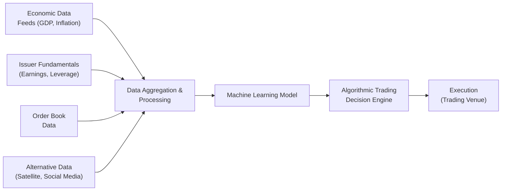

## Introduction  
Big data isn’t just some buzzword that investment professionals toss around to sound tech-savvy. In fixed-income markets, it’s transforming how we capture, analyze, and use information to make better-informed trading decisions. If you’ve ever seen how quickly professionals can react to an important economic number—like non-farm payrolls or inflation data—you know how real-time insights rule the roost. Now, imagine having hundreds of these data feeds (including some you might not even think of as “financial”), all streaming into sophisticated models that spit out buy or sell ideas at lightning speed. That’s the reality of big data and algorithmic trading in the modern bond market.

But it’s not just about speed. High-frequency trading (HFT) often gets the spotlight, but advanced analytics, machine learning, and alternative data sets also enable more gradual strategies that detect mispriced bonds, unearth relative value across thousands of issuers, and predict liquidity flows. And with regulatory scrutiny on the rise, it’s vital for fixed-income pros—and especially future CFA charterholders—to grasp both the potential of these innovations and the inherent risks.

## The Role of Large Datasets in Fixed-Income  
At the heart of this revolution is the sheer amount of data now available. Traditionally, bond analysis revolved around well-established metrics: interest rates, credit spreads, central bank announcements, and rating agency reports. Today, major fixed-income players (think large hedge funds, investment banks, and asset managers) buy or license huge data feeds that include:  
• Economic indicators (both official statistics and real-time sentiment trackers).  
• Issuer fundamentals (corporate earnings, leverage ratios, news sentiment).  
• Order book data (depth of market, bid-ask spreads, trading volumes).  
• Alternative data (consumer transactions, shipping data, satellite imagery showing foot traffic in shopping centers, weather patterns, and more).  

Some of the data might sound borderline sci-fi. It’s actually not unusual anymore to hear about cutting-edge quant teams using social media scraping to detect big shifts in consumer sentiment long before official data is published. You might be thinking, “Ok, that makes sense for equities, but does it matter if we’re just analyzing a plain-vanilla 5-year corporate bond?” Absolutely. Bond markets move on forward-looking signals of credit quality, default risk, and interest rate expectations—and those signals can come from unconventional clues.  

Let me share a quick anecdote: many years ago, I was part of a team that considered combining shipping data (which told us the direction of global trade flows) with real-time foreign exchange volumes to spot potential changes in credit conditions in emerging-market economies. At first, some colleagues were skeptical. But you know what? By analyzing shipping patterns, we sometimes caught early warnings that a country’s exports were declining, which presaged stress on certain local issuers. Nowadays, that approach is fairly standard in the big data era.

## Algorithmic Trading Strategies  
Algorithmic trading—at its simplest—means using computer programs to execute trades. In reality, algorithms can be quite sophisticated, pulling from vast data sets, factoring in multiple yield curves, and balancing risk exposures at the portfolio level.  

### Real-Time Arbitrage and Supply-Demand Imbalances  
One of the biggest draws of algorithmic strategies is how quickly they can respond to supply-demand mismatches in the bond market. If, for instance, a large institutional investor suddenly needs to unload a massive block of corporate bonds, an algorithm might detect the sudden price dislocation and step in to buy—provided it sees immediate opportunities to hedge or resell elsewhere for a small profit.  

If you’re picturing an algorithm scanning dozens of venues to find the best price, you’re on the right track. Modern bond trading is more fragmented than you might guess, with multiple electronic platforms and over-the-counter (OTC) broker-dealers all quoting different prices. Algorithms can sift through these quotes in fractions of a second, identifying tiny discrepancies before human traders can blink. That’s essentially “arbitrage,” in the sense of locking in a nearly riskless profit by exploiting small pricing differentials (e.g., between related bonds or between a bond and derivatives on the same issuer).

### Machine Learning Models  
Machine learning is the core engine powering these advanced algorithms. Think of it this way: classic financial models rely on explicitly coded assumptions, such as:  
(1) If credit spreads widen by X, then bond price goes down by Y.  
(2) If a central bank changes interest rates, yields shift in a certain predictable way.

Machine learning changes the game by letting computers “learn” the relationships themselves from historical data—often data sets with hundreds of inputs and millions of observations. For example:  
• A random forest model might help forecast the probability that an emerging-market issuer will default within the next 12 months, based on dozens of macroeconomic, financial, and alternative data inputs.  
• A gradient boosting machine might detect subtle patterns in bond liquidity conditions across time, helping a portfolio manager plan trades more efficiently.  
• Deep neural networks might discover multi-dimensional relationships that traditional regressions simply can’t capture, such as how currency fluctuations, interest rate volatility, and commodity prices together affect high-yield energy bonds.

The possibilities are staggering. And while machine learning is not a crystal ball—algorithms do fail sometimes—it can certainly unearth pricing inefficiencies and spot liquidity squeezes early.

## Complexity in Bond Trading  
In equities, you might compare the price of one stock on two different exchanges. In fixed income, you could be looking at thousands of bonds from numerous issuers, each with different maturities, coupons, embedded options, and credit ratings. On top of that are complicated interest rate curves: a sovereign might have a short-term curve for treasury bills, a medium-term curve for notes, and a longer curve for bonds, plus inflation-linked curves.  

It’s no surprise, then, that algorithmic trading in fixed-income markets can get complicated fast. For instance, if you see a bond from Issuer A that looks cheap relative to an interest rate swap or a bond from Issuer B with a similar credit rating and maturity, you still need algorithms to figure out how interest rate volatility affects that trade, how to hedge credit risk, and how to factor in RBC or IFRS/US GAAP accounting rules about bond revaluation.  

## Big Data Infrastructure and Latency  
Bond market participants who embrace algorithmic trading typically invest heavily in technology. Low-latency networks, advanced servers colocated in major exchange data centers, and robust data storage systems are standard. The cost can be huge. But the payoff from being milliseconds faster than the competition (either for capturing a fleeting arbitrage or reacting to a news release) can be significant.  

### Example of a Data Flow  
To visualize how data might feed into an algorithm, consider the diagram below:



In this simplified model:  
1. Multiple data feeds (economic, issuer fundamentals, order book, alternative data) flow into a central aggregator.  
2. Data is cleaned, normalized, and time-stamped.  
3. A machine learning engine processes the data to forecast yields, identify mispriced bonds, or gauge liquidity conditions.  
4. A decision engine combines these forecasts with a risk management overlay.  
5. Actual trades get routed to electronic platforms or broker-dealers for execution.

The entire chain can happen in real time, with latencies of mere microseconds or milliseconds in high-frequency contexts.

## Emerging Market Debt and Alternative Data  
While large, liquid markets like U.S. Treasuries or European sovereign debt often get the most attention, we shouldn’t overlook how big data has revolutionized trading in emerging market (EM) debt. EM bonds can be more prone to liquidity dry-ups and extreme price moves, often triggered by local events or macro shifts in global risk appetite.  

Quantitative hedge funds and large asset managers incorporate real-time social media sentiment data from key countries, satellite imagery of port activity, or geospatial data on infrastructure developments to forecast credit trends and potential defaults. It’s not unheard of for bond managers to integrate local-language news sentiment (scraped and machine-translated) to detect early signs of political unrest or economic underperformance. The same approach can be used to gauge currency conditions or domestic consumption trends, which directly impact issuer performance.

## Regulatory Considerations and Ethical Issues  
Regulators around the world (the SEC in the U.S., ESMA in Europe, and others) keep an eye on algorithmic and high-frequency trading practices in fixed income, just as they do in equities. The main concerns revolve around:  
- Fair access to data feeds: If certain players can pay for advanced data faster than everyone else, is that an unfair advantage?  
- Potential for market manipulation: Algorithms can engage in spoofing or layering, artificially placing and canceling huge orders to move bond prices.  
- Systemic risk: If many algorithms follow similar rules or signals, they might all try to exit positions simultaneously, exacerbating market volatility.  

Market participants must remain vigilant. If your strategy relies on fleeting price anomalies, you must verify the data used is credible, that latency isn’t artificially exploited to cause or amplify market disruptions, and that you comply with all relevant rules around order entry and transparency. A thorough risk-control process—including circuit breakers, kill switches, and robust compliance monitoring—has become a standard best practice.

## Popularity of Quantitative Trading Funds  
Over the past decade, an explosion of quantitative funds has changed the market dynamics for fixed income. These funds often employ advanced analytics to manage large bond portfolios, providing real-time tracking of portfolio durations, spreads, and convexities across thousands of positions. Their machines can:  
• Rapidly identify relative-value trades across corporate, sovereign, and quasi-governmental issuers.  
• Optimize hedges using interest rate futures, interest rate swaps, or credit default swaps (CDS).  
• Rebalance portfolios to meet duration or yield targets based on real-time data updates.

And as these techniques have become more widely adopted, some of the less “obvious” trades have become crowded, pushing quants to keep finding new data sets and refining their models to stay a step ahead.

## An Example: Forecasting Yield Curve Changes with Machine Learning  
To bring this closer to home, let’s consider a simple Python snippet that shows how someone might use historical treasury yields to train a machine learning model predicting short-term yield movements. (Keep in mind this code is just for illustration.)

```python
import pandas as pd
import numpy as np
from sklearn.ensemble import RandomForestRegressor

# 'yield_1m', 'yield_3m', 'yield_1y', 'yield_5y', 'yield_10y' and many others

features = df[['yield_3m', 'yield_1y', 'yield_5y', 'yield_10y']]
target = df['yield_1m'].shift(-1)  # Predict tomorrow's 1-month yield

data = pd.concat([features, target], axis=1).dropna()
X = data[features.columns]
y = data[data.columns[-1]]

split_index = int(len(X)*0.8)
X_train, X_test = X[:split_index], X[split_index:]
y_train, y_test = y[:split_index], y[split_index:]

model = RandomForestRegressor(n_estimators=100, random_state=42)
model.fit(X_train, y_train)
y_pred = model.predict(X_test)

print("Model R^2:", model.score(X_test, y_test))
```

In a real-world setting, you might incorporate dozens, if not hundreds, of variables. The outputs from these models could feed directly into your trading system, which then executes (or refrains from executing) trades based on yield predictions.

## Challenges and Pitfalls  
While the upside can be impressive, there are also real challenges:  
- Data Quality: Dirty or inaccurate data can lead to misguided trades.  
- Overfitting: Models that look amazing in historical backtests can fail in live markets when conditions change.  
- Human Oversight: Relying solely on algorithms can be dangerous if no one checks the outputs for reasonableness.  
- Latency Arms Race: Constantly upgrading hardware and network connections can be expensive.  

## Best Practices for Implementation  
1. Robust Risk Management: Always include circuit breakers and limit orders to avoid runaway trades.  
2. Regular Backtesting and Validation: Keep refining your models, and test them on out-of-sample data.  
3. Stress Testing in Extreme Markets: Simulate how your algorithm behaves in a liquidity crisis or if interest rates spike unexpectedly.  
4. Ongoing Monitoring: Have human traders or risk managers watch for anomalies in real time.  
5. Compliance From Day One: Ensure your system can log and audit trades to satisfy regulator requests.

## Glossary  
• Algorithmic Trading: Automated strategies that execute trades via computer algorithms, often at speeds impossible for manual intervention.  
• Big Data: Extremely large data sets that reveal new insights when analyzed computationally.  
• Machine Learning: Algorithms that learn from data, adapting their parameters without explicit manually coded instructions.  
• Latency: The delay between an action (e.g., data release) and a system’s response. Lower latency can provide a trading edge.  
• Alternative Data: Non-traditional sources (social media, satellite images, consumer transactions) used for investment signals.  
• High-Frequency Trading (HFT): An algorithmic trading form that executes a large volume of orders at very high speeds.  
• Market Manipulation: Illegitimate strategies (like spoofing) designed to cheat or artificially impact trading prices.  
• Arbitrage: The practice of taking advantage of price discrepancies for a (theoretically) risk-free profit.

## Exam Tips and Real-World Guidance  
• For a typical CFA Level III essay question scenario, you might be asked how big data insights can refine a bond portfolio’s risk characterization. Emphasize how alternative metrics (like shipping data or social media sentiment) can highlight gaps in conventional credit risk analyses.  
• Know the difference between theoretical implementations of algorithmic trading and practical constraints (e.g., data latency, illiquidity in certain bonds).  
• Don’t forget the compliance angle. Market manipulation concerns and regulatory guidelines can appear in scenario-based questions.  
• Show you understand how to integrate algorithmic outputs into an overall portfolio management strategy—especially in multi-asset contexts that combine fixed income with equity or derivative overlays.  

In real practice, it’s crucial to keep your eyes open for ethical and compliance pitfalls. Regulators increasingly expect you to have robust security protocols, so that your data usage remains fair and not predatory.  

## References and Further Reading  
• Johnson, Barry. “Algorithmic Trading and DMA.” (2010)  
• CFA Institute Research Foundation, “Big Data and Machine Learning in Financial Markets.”  
• Journal of Finance, Journal of Financial Data Science, and other academic journals for empirical papers.  

Below is a short list of additional valuable resources:  
• “Machine Learning in Asset Management—Part 1 & Part 2” (CFA Institute Publications).  
• “Artificial Intelligence in Finance” by Yves Hilpisch.  
• Commodity Futures Trading Commission (CFTC) guidelines on automated trading systems.  

## Test Your Knowledge: Big Data and Algorithmic Trading in Fixed-Income



### Which of the following is a common concern regulators have with algorithmic trading in bond markets?

- [ ] Lack of innovation
- [x] Market manipulation and fair access to data
- [ ] Decreased reliability of data
- [ ] Overreliance on technical analysis

> **Explanation:** Regulators worry that algorithmic trading can be used for manipulation (like spoofing) and want to ensure a fair market for all participants.

### In the context of fixed-income markets, how does machine learning typically add value to algorithmic trading?

- [ ] By eliminating the need for backtesting strategies
- [x] By identifying complex patterns that traditional models may miss
- [ ] By guaranteeing no trading losses under any market conditions
- [ ] By removing all credit risk from portfolios

> **Explanation:** Machine learning models excel at spotting nonlinear and multi-dimensional patterns that go beyond classical regression or linear factor models.

### Which of the following best describes “arbitrage” in fixed-income markets?

- [ ] Buying and holding to maturity to earn coupons
- [ ] Diversifying a portfolio using multiple asset classes
- [ ] Paying a high commission to secure large bond trades
- [x] Profiting from price discrepancies between related instruments

> **Explanation:** Arbitrage involves exploiting short-lived price differences in related bonds or between a bond and a derivative for a near-riskless profit.

### Which data source would most likely be considered “alternative data” for bond valuation?

- [ ] Timely yield curve releases from the central bank
- [ ] Credit rating changes announced by rating agencies
- [ ] Official inflation reports from government statistics offices
- [x] Satellite images of shipping activity at international ports

> **Explanation:** Satellite imagery is not a traditional financial data source but can provide insights into economic activity relevant to bond valuations.

### What is a key reason why big data analytics face greater complexity in fixed-income trading compared to equities?

- [x] Multiple issuers, maturities, and credit qualities create layers of complexity
- [ ] There are fewer trading platforms for fixed income than for equities
- [ ] Data regulations do not apply to fixed-income instruments
- [ ] Algorithmic models cannot handle interest rate movements

> **Explanation:** Bonds exist across varying maturities, coupon structures, and credit qualities, adding significant complexity relative to equity markets.

### How might a high-frequency trading (HFT) algorithm detect and exploit a supply-demand imbalance in the bond market?

- [ ] By ignoring order book information and focusing on GDP data alone
- [x] By scanning multiple order books in real time for large blocks offered below fair value
- [ ] By relying on the rating agencies to update credit scores instantly
- [ ] By only trading after the monthly inflation data is released

> **Explanation:** HFT systems can compare quotes across multiple venues quickly, capitalizing on sudden imbalances or blocks in the market.

### Which of the following best illustrates a potential pitfall of relying on machine learning in bond trading?

- [x] Overfitting historical data and failing in new market conditions
- [ ] Ignoring advanced computing resources for data storage
- [ ] Eliminating the possibility of real-time strategy updates
- [ ] Guaranteeing improved trade fills and zero slippage

> **Explanation:** Overfitting occurs when a model tailors itself too closely to historical data, reducing its predictive power in future, unseen scenarios.

### When creating a machine learning model to predict changes in corporate bond spreads, which factor would likely be critical to include?

- [x] Issuer fundamentals (e.g., leverage, earnings)
- [ ] Federal Reserve’s website layout
- [ ] Weekly movie box-office reports
- [ ] The color scheme of the trading interface

> **Explanation:** Issuer fundamentals are closely tied to default risk and hence can be predictive of corporate bond spreads.

### Which statement about alternative data usage is correct in the context of fixed-income trading?

- [ ] It is always more reliable than official economic data
- [x] It can provide early signals or insights not yet reflected in traditional metrics
- [ ] It is typically more transparent and regulated than government data
- [ ] It replaces the need for fundamental analysis

> **Explanation:** Alternative data can provide unique early indicators of issuer or macro conditions, but it doesn’t replace standard financial or economic analysis.

### High-frequency traders often invest heavily in low-latency technology because:

- [x] Being milliseconds faster can help them capture fleeting price opportunities
- [ ] Bond market execution times are regulated to 5 seconds
- [ ] Long execution latency always reduces fixed-income volatility
- [ ] High-latency networks are more cost-effective

> **Explanation:** Cloud hosting in proximity to exchanges or data centers can provide speed advantages. Even split-second differences can determine if an arbitrage opportunity is profitable.


