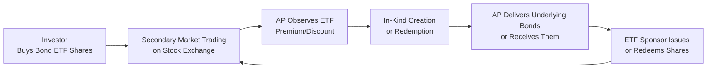

## Introduction
Back when I first heard about Bond ETFs, I thought, “Wait, aren’t bonds supposed to be these illiquid, over-the-counter instruments that trade in large institutional chunks?” Perhaps you’ve had that same puzzling reaction. Truth is, the introduction of Bond Exchange-Traded Funds has opened the door for real-time tradability in a space where daily price updates were once a luxury. Bond ETFs provide a fresh view on fixed-income assets, letting you buy or sell shares on an exchange just like a stock. This ability to “trade bonds” in smaller increments—without wandering into the more opaque world of over-the-counter (OTC) bond dealing—has revolutionized accessibility and liquidity.

Still, there’s some debate—particularly during market stress—about whether Bond ETFs really improve overall liquidity or just create a sort of “liquidity mirage.” Let’s walk through how Bond ETFs work in practice, how they maintain alignment with their underlying baskets of bonds, and why all this matters for the broader fixed-income market.

## The Basics of Bond ETFs
A Bond ETF is simply a vehicle that packages bonds—corporate, government, high-yield, or any other flavor—and sells shares representing proportional ownership in that bundle. If you want exposure to a large swath of investment-grade corporate debt, for instance, you can buy an investment-grade corporate Bond ETF that tracks a relevant index. ETFs are listed on exchanges, so you can purchase shares like you’d buy Apple or Tesla stock, except that behind the scenes, you’re getting a diversified basket of bonds.

### Why Does This Matter for Liquidity?  
• Real-Time Trading: Traditional bond funds (like open-end mutual funds) are priced once at the end of the day. With an ETF, you get an intraday price, which reflects real-time market sentiment.  
• Smaller Lot Sizes: If you want to invest, say, $1,000 in a broad corporate bond portfolio, you can do so through an ETF. By contrast, many individual bond trades in the OTC market require significantly higher minimums.  

In everyday language, Bond ETFs allow you to dip your toe into the bond universe without needing to buy an entire bond, which might cost $100,000 or more for an institutional lot. That’s a pretty big deal if you’re a retail investor or liquidity-minded institutional trader looking for smaller incremental positions.

## The Creation/Redemption Mechanism
Bond ETFs operate with a creation/redemption mechanism that helps keep their market price close to the Net Asset Value (NAV) of the underlying bonds. Here’s the gist:

• Creation: Authorized participants (APs)—often large broker-dealers—can deliver a specified basket of bonds (or cash) to the ETF sponsor. In exchange, they receive newly created ETF shares, which they can then sell in the secondary market.  
• Redemption: APs do the reverse. They buy ETF shares in the open market and deliver them to the ETF sponsor, receiving the corresponding basket of bonds (or cash) in return.  

Because of this in-kind exchange, there’s an arbitrage mechanism that generally prevents the ETF shares from straying too far from the underlying value. If the ETF trades at a premium, APs can create more shares, push supply higher, and bring the price back down relative to NAV. Conversely, if the ETF trades at a discount, APs can redeem shares and shrink supply, helping the ETF price move back up.  

This process is crucial in times of market stress. The idea is that, in theory, an AP can step in, buy cheap ETF shares, and redeem them for the underlying bonds (or vice versa) to realize a near riskless profit if the discount or premium grows enough. This arbitrage is meant to keep the ETF’s market price and NAV closely aligned.

## Understanding Liquidity in Bond ETFs
When people talk about Bond ETFs improving market liquidity, they’re usually referring to the fact that the ETF itself trades on an exchange with robust volume and transparent pricing. Even if the underlying bonds are relatively illiquid (like some high-yield corporate issues that trade only sporadically), you might still see tight bid/ask spreads and substantial trading volumes in the ETF.  

Essentially, the ETF adds an extra layer of liquidity on top of the underlying bonds. You have two levels of liquidity:  
1) Secondary market liquidity: The buying and selling of ETF shares among various investors.  
2) Primary market liquidity (creation/redemption): Institutional APs transferring bonds to the ETF sponsor (or vice versa).  

And yep, that’s a bit of a mouthful, but it’s key to see how the “two-tier” liquidity can allow an ETF to maintain trading volume even when some underlying individual bonds might be difficult to buy or sell directly.

## Premiums and Discounts During Stress
One hot topic is that Bond ETFs can sometimes trade at notable premiums or discounts to their NAV. Why? Let’s say it’s a volatile day in the market, and the underlying bond dealers have widened bid/ask spreads or stepped away from trading certain bonds. The real-time ETF price may deviate from the “stale” or model-based price of the underlying basket.  

As a result, you might see the ETF “price” lead the market, effectively providing continuous price discovery for the underlying bonds. Some folks argue that bond ETFs become a kind of price beacon when normal bond quotes become fuzzy. Others claim that if the discounts get too large, the ETF might misrepresent actual market liquidity, creating confusion or even panic.  

Ultimately, the creation/redemption mechanism is designed to keep deviations in check, but in extreme stress events—like March 2020 in the early days of the COVID-19 pandemic—liquidity can freeze up. The difference between where the ETF is trading and where the “fair value” of the basket might be can widen. On normal days, that difference usually remains quite small.

## Bond ETFs in Action
Imagine you’re an institutional asset manager responsible for a multi-asset portfolio. You might use Bond ETFs for:

• Tactical Allocation: Suppose you think corporate spreads are too high relative to Treasuries and will narrow soon. You can quickly load up on a corporate Bond ETF, capturing the beta exposure without trying to piece together dozens of individual bonds.  
• Liquidity Buffer: Instead of holding large cash positions, you might maintain a short-term Bond ETF or a government bond ETF that you can quickly convert to cash if you see an investment opportunity in equities or need to meet redemptions.  
• Hedging: You can short an investment-grade corporate Bond ETF if you think credit spreads will widen. That’s much simpler than shorting a basket of individual bonds, which might be operationally cumbersome or expensive in the OTC market.

And if you’re a retail investor, you can instantly gain exposure to a diversified bond portfolio with minimal transaction costs. Perhaps you only have $5,000 to invest—the bond ETF route allows you to spread risk across hundreds of underlying securities at once.

## Market Stress and the Debate Over Real Liquidity
But do Bond ETFs actually add real liquidity to the market, or do they just repackage the same old underlying liquidity constraints? Critics point to episodes of market stress—like the 2008 Global Financial Crisis or the 2020 pandemic turmoil—where bond ETFs sometimes traded at big discounts. They claim that while ETF share turnover may remain high, it doesn’t necessarily guarantee that the underlying bonds can be traded at or near the ETF’s implied price.

On the flip side, proponents say the robust trading volumes in bond ETFs, along with their price transparency, help the market discover the true clearing price of bonds, especially when the OTC market becomes hesitant. In other words, an actively traded ETF can reveal that bond valuations have changed faster than the underlying dealers might have anticipated.  

In practice, both views have some merit. Bond ETFs certainly add a new dimension to liquidity but also can reflect short-term dislocations between the “last known quote” in the bond market and the real equilibrium price. 

## Best Practices and Common Pitfalls
• Pay Attention to Premiums/Discounts: In times of stress, keep an eye on the gap between the ETF market price and the NAV. A persistent discount might suggest trouble if you need immediate liquidity, or it can be an opportunity if you trust that arbitrage will soon close the gap.  
• Understand Your Underlying Basket: Just because an ETF trades actively doesn’t mean all of its bonds do, especially in specialized markets (e.g., high-yield or emerging market debt).  
• Watch for Tracking Error: ETFs aim to replicate index performance, but bond indexes can be large and difficult to track—especially if the index is rebalanced frequently.  
• Use Limit Orders: If you’re trading Bond ETFs during volatile sessions, consider using limit orders to avoid getting filled at a price far from intrinsic value.  
• Beware of Market Closures: If the bond markets in certain regions are closed while the ETF is still trading on your exchange, premiums or discounts might widen due to incomplete price discovery.

## Visualizing the Creation/Redemption Mechanism

In the diagram, you can see how the authorized participant (AP) steps in whenever significant premiums or discounts appear. The AP either creates shares (if the ETF is trading at a premium) or redeems shares (if it’s trading at a discount), bringing the market price and NAV back in line.

## Regulatory and Accounting Considerations
From a financial reporting standpoint, IFRS and US GAAP generally treat an ETF as an investment company. The underlying bonds are carried at fair value on the fund’s books. Any differences in IFRS vs. US GAAP typically revolve around specific classifications or disclosures—but for our purposes, the main point is that the ETF must transparently report its holdings, track valuations with recognized market prices (or fair value estimates if no direct quote is available), and publish the ETF NAV at least daily. This transparency fosters investor confidence and helps keep ETF prices anchored around an official valuation even if it’s just once a day.

## Practical Examples and Case Studies
• High-Yield Bond ETF in a Volatile Market: During a sharp equity sell-off, high-yield bonds can see liquidity dry up. ETF trading volumes might surge, and you’d see the ETF price move more in lockstep with equities than with reported bond prices. Over a few days, the discount might shrink as market fear subsides, with creation/redemption arbitrage stepping in to restore alignment.  
• Government Bond ETF During a Treasury Auction: Suppose a new U.S. Treasury issue is heavily oversubscribed. The yields come in lower than anticipated, suggesting higher bond prices. An ETF that holds equivalent maturities might see its shares jump in the secondary market ahead of the updated reference yield. APs could redeem the ETF shares if a discount emerges, or create new shares if a premium develops.

## Tips for Exam and Real-World Application
As you address exam-style questions—especially scenario-based ones—keep in mind the nuanced role of Bond ETFs. The exam might give you a hypothetical crisis scenario where a corporate bond ETF trades at a discount to NAV and ask you to explain the mechanism by which that might be corrected. Or it could present a question about how institutions use Bond ETFs to achieve quick tactical exposures. Here are a few strategies to keep in mind:

• Highlight the Creation/Redemption Mechanism: It’s often a central point in exam questions about how ETF prices stay close to NAV.  
• Emphasize Two-Tier Liquidity: Secondary market (ETF shares) and primary market (in-kind bond transactions) are distinct but closely interconnected.  
• Discuss Tracking Error and Index Construction: Knowing how an ETF tries to replicate a wide index is important, especially in fixed income where indexes can be massive and illiquid.  
• Mention Market Stress: The exam often references historical issues (e.g., 2008 crisis, 2020 COVID shock) to test your understanding of how Bond ETFs behaved under duress.

It’s possible an exam question might show you a partial set of bond quotes, plus an ETF price that deviates from its theoretical NAV, and ask you to explain arbitrage steps or potential reasons for the discrepancy.

## Glossary
• Bond ETF: An exchange-traded fund composed of bonds, often tracking an index.  
• NAV (Net Asset Value): The total value of an ETF’s underlying securities divided by the number of shares outstanding.  
• Premium/Discount: When the ETF’s price is above/below the ETF’s NAV.  
• Creation/Redemption Mechanism: The in-kind process that keeps ETF share prices close to the value of the underlying basket of bonds.  
• Liquidity Management: Managing portfolio inflows, outflows, and short-term cash needs to ensure uninterrupted operations and meet investment objectives.  
• Tactical Positioning: Short-term adjustments in asset allocation to capitalize on market opportunities.  
• Secondary Market: The market where investors buy and sell existing ETF shares.  
• Underlying Basket: The actual bonds that constitute the ETF’s investment portfolio.

## References
• Carrel, L. “ETFs for the Long Run.” (For a detailed discussion of how ETFs fit into the broader investment landscape.)  
• BlackRock iShares, Vanguard ETF Product Sites (Mechanics of ETF creation/redemption and product education).  
• CFA Institute: “ETFs vs. Mutual Funds—A Comprehensive Guide,” <https://www.cfainstitute.org/>  

## Test Your Knowledge: Bond ETF Liquidity Insights



### Which mechanism best explains why Bond ETFs generally trade near their net asset value?

- [ ] Market demand and supply of ETF shares alone
- [ ] Regulatory price caps imposed by exchanges
- [x] The creation/redemption process maintained by authorized participants
- [ ] The overnight adjusting function of bond indices

> **Explanation:** The creation/redemption mechanism is the critical driver that keeps the ETF’s market price in line with its NAV, by allowing authorized participants to create or redeem shares in-kind when premiums or discounts appear.

### During a market stress event, a Bond ETF starts trading at a discount to its NAV. Which of the following is a likely cause?

- [x] Underlying bonds are illiquid, and the ETF price reflects more current market conditions.
- [ ] The ETF sponsor chooses to permanently reduce the net asset value.
- [ ] A regulatory requirement forces the ETF to pay higher dividend yields.
- [ ] The ETF has entered an exchange-mandated “quiet period.”

> **Explanation:** If the underlying bonds are illiquid, the ETF’s market price may drop faster than the stale bond quotes. This scenario often leads to the ETF trading below its last reported NAV until the bond market’s quotes catch up, or arbitrage closes the gap.

### How might a Bond ETF facilitate tactical asset allocation within a portfolio?

- [x] It offers quick, diversified exposure to a certain market segment without acquiring individual bonds.
- [ ] It eliminates all market risk by holding only risk-free bonds.
- [ ] It allows the manager to avoid all transaction costs.
- [ ] It provides infinite leverage without collateral.

> **Explanation:** Bond ETFs allow swift entry and exit into a particular bond market segment (e.g., high-yield corporates) with just one trade, making them valuable for short-term tactical shifts within a broader portfolio.

### Which of the following is a valid argument in favor of Bond ETFs adding to the price discovery process?

- [ ] Bond ETF trading volumes rarely surpass those of underlying bonds.
- [x] Bond ETFs continue trading, capturing real-time sentiment even when individual bond quotes lag.
- [ ] Bond ETFs’ prices are permanently higher than any fair value estimate.
- [ ] Bond ETFs do not rely on any arbitrage mechanism to maintain fair price levels.

> **Explanation:** Because bond quotes can sometimes be stale or infrequent, an ETF’s continuous trading can provide updated insights into the real market value of the underlying bonds, thus aiding price discovery.

### Which statement about premiums and discounts is correct?

- [x] Persistent large discounts or premiums may occur when APs are reluctant to engage in arbitrage during high volatility.
- [ ] ETFs are prohibited by law from trading at a discount.
- [x] Premiums or discounts are always zero under stable market conditions.
- [ ] Premiums/discounts exist only in equity ETFs, not in bond ETFs.

> **Explanation:** While the creation/redemption process often narrows premiums or discounts, extreme market volatility can deter authorized participants from stepping in due to high risk or wide bid/ask spreads in the underlying bonds.

### Why might institutions use Bond ETFs as a substitute for holding individual bonds?

- [x] Bond ETFs enable rapid rebalancing and easier liquidity management.
- [ ] Bond ETFs have no expense ratios, reducing costs to zero.
- [ ] Individual bond trading is risk-free, so there is no need to hedge.
- [ ] ETFs are guaranteed to outperform their underlying indexes by design.

> **Explanation:** Large institutions often favor Bond ETFs for the ability to quickly enter or exit positions, especially if they need broad market exposure or short-term liquidity. The cost efficiencies also can be attractive compared to assembling and rebalancing a large bond portfolio.

### In what scenario might a Bond ETF’s market price lag behind a change in the underlying bond market?

- [x] If the bond market is closed in certain regions while the ETF’s exchange is still open.
- [ ] When authorized participants instantaneously execute creation/redemption exactly at NAV.
- [ ] Whenever the Fed changes interest rates intra-day.
- [ ] When corporate bonds are traded on-exchange with high frequency.

> **Explanation:** Time-zone mismatches or limited bond market operating hours can cause the ETF’s price to deviate from bond quotes not yet updated in real time.

### Which best describes the primary role of authorized participants (APs) in the Bond ETF ecosystem?

- [x] They create or redeem ETF shares in-kind to maintain price alignment with NAV.
- [ ] They limit daily ETF trading volume to stabilize bond markets.
- [ ] They serve as rating agencies for the bonds in the underlying portfolio.
- [ ] They provide a guaranteed minimum yield for Bond ETF shares.

> **Explanation:** APs ensure that any sustained premiums or discounts to NAV are arbitraged away by delivering or receiving the underlying bonds in exchange for ETF shares.  

### Which of the following is most likely an advantage of Bond ETFs for retail investors?

- [x] Ability to access a diversified basket of bonds with a relatively small investment
- [ ] Guaranteed capital protection by the ETF sponsor
- [ ] Zero market risk due to continuous intraday pricing
- [ ] Access to exotic derivatives within the ETF without disclosure

> **Explanation:** Bond ETFs simplify market participation by reducing minimum size requirements and offering broad diversification.

### Bond ETFs typically maintain alignment with their NAV through:

- [x] True
- [ ] False

> **Explanation:** Bond ETFs rely on the creation/redemption process. APs can profit by arbitraging any price discrepancies, which helps keep the ETF price close to the net asset value.


