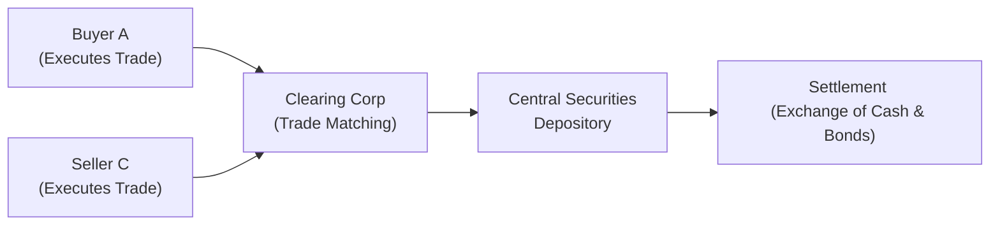

## Introduction and The Big Picture

Clearing and settlement processes are the hidden gears that keep the fixed-income market machinery running smoothly. Picture this: you, as the buyer, just locked in a deal to purchase a bond, and the seller is waiting to give it up—maybe they want the cash to reinvest in another opportunity. Well, how do both sides ensure that they actually receive what was promised—bonds for you, cash for them—without undue risk? That’s where efficient clearing and settlement systems come into play. They serve to minimize counterparty, operational, and systemic risk in fixed-income transactions.

Sometimes, people lump “clearing” and “settlement” together as one big step. But let’s be clear: these are two distinct phases. Clearing involves reconciling trade details—essentially ensuring we agree on how many bonds you bought at what price, plus the exact date that we plan to settle. Settlement is the actual exchange of securities for cash, the day your money travels to the seller and the bond rights transfer to you. The faster and more reliably this happens, the lower the chance that something goes off the rails. That’s why strong, well-managed systems—like the Depository Trust & Clearing Corporation (DTCC) in the US, or Euroclear and Clearstream in Europe—are pivotal to a healthy financial ecosystem worldwide.

## Why Clearing and Settlement Matter

Imagine if you conducted a large cross-border bond transaction with a far-flung counterparty—somebody you don’t know personally. Without a mechanism to guarantee timely payment and bond delivery, you risk losing track of your security positions, or worse: losing your money. Clearing and settlement processes:

• Reduce counterparty risk by verifying trade details and requiring sufficient collateral where necessary.  
• Minimize operational and systemic risk because everything is tracked meticulously.  
• Provide standardization that fosters confidence in bond trading.  

I like to think of it this way: clearing and settlement systems are the supervisors that double-check everyone’s homework. If you make a mistake, they’re the ones who spot it. That oversight is invaluable in markets with enormous daily transaction volumes, especially in cross-border deals where legal frameworks and currencies can differ drastically.

## Key Entities: Local vs. International CSDs

A Central Securities Depository (CSD) is an organization that holds securities in electronic form, facilitating easy, secure, and standardized transfers. There are plenty of local CSDs that handle specific domestic markets. For instance, the DTCC serves the US market by clearing and settling equities, municipal bonds, corporate bonds, and other instruments. Meanwhile, many countries have their own local CSDs that handle government bond trading.

But cross-border trading can get trickier because you may be dealing with multiple regulatory environments, currencies, and clearing and settlement conventions. That’s where international CSDs (ICSDs) step in—most notably Euroclear (headquartered in Belgium) and Clearstream (based in Luxembourg). These ICSDs make it easier to hold bonds denominated in multiple currencies, manage settlement schedules spanning multiple time zones, and reduce the complexity that used to plague international bond trades.

### Comparison Table: Local CSD vs. International CSD
| Feature                           | Local CSD                       | International CSD (ICSD)       |
|-----------------------------------|---------------------------------|--------------------------------|
| Primary Jurisdiction              | Typically one country           | Multiple (cross-border)        |
| Currencies Handled                | Mostly domestic currency        | Multi-currency                 |
| Applicable Regulatory Frameworks  | Local/national regulations      | Multiple jurisdictions         |
| Settlement Complexity             | Usually lower                   | Higher, due to cross-border    |
| Examples                          | DTCC (US), CDSL (India)         | Euroclear, Clearstream         |

## The Clearing Process in Brief

So, how does the clearing process actually unfold in fixed-income? After a trade is executed, counterparties send their trade details to the clearing system. The system matches both sides’ details—date, price, quantity, and so forth. Once everything lines up, the clearing system calculates how much each party owes or is owed. In some cases, a central counterparty (CCP) will interpose itself between the buyer and seller, becoming the buyer to every seller and the seller to every buyer, thereby reducing counterparty risk for all participants.

Here’s a visual snapshot to see how it fits together:

• The buyer and seller both report the trade to the clearing entity.  
• The clearing entity confirms trade terms (like number of bonds, price, etc.).  
• Next, settlement instructions are sent to the CSD or ICSD.  
• Finally, once the settlement date arrives (e.g., T+2), the actual exchange of bonds and cash happens.  

## Real-Time Gross Settlement (RTGS) vs. Net Settlement

### Net Settlement

Under net settlement, the clearinghouse nets all buy and sell positions among participants over a certain period (often the course of a day). At the end of the netting period, each participant has one net obligation—either to deliver a certain amount of cash or a certain quantity of securities (or both). This is extremely liquidity-efficient because the amount of money that changes hands is less than it would be if everyone settled every trade on a one-by-one basis. The trade-off? There’s more intraday credit exposure—if a participant defaults before the final net settlement, it can create a ripple effect.

### RTGS

Now, consider real-time gross settlement (RTGS). Under RTGS, every transaction is settled immediately, in real time, one by one. If buyer A purchases a bond from seller B, the settlement system instantly debits buyer A’s cash account and credits seller B’s cash account—simultaneously transferring bond ownership. That’s wonderful for reducing counterparty risk; there’s basically no time gap in which a big default can happen. However, the drawback is that participants must keep ample intraday liquidity on hand. That can be expensive and can reduce the capital efficiency of the financial system.

## Settlement Cycles: T+2, T+3, or T+?

Historically, many bond and equity markets operated on a T+3 cycle, meaning that settlement took place three business days after the trade date (T). Many markets have since shortened this to T+2. We’ve even heard talk in some markets—including the US—about moving to T+1 or potentially T+0 to further reduce risk. Shorter settlement cycles provide less time for trades to unravel or for counterparties to default, but they also intensify back-office operations. If you have to settle your trades one day earlier, you better keep your back-office staff on their toes verifying all the details instantly.

An anecdote: I recall a frantic time a few years ago when a large fund manager overlooked a major corporate bond settlement. They simply forgot to move the required cash into the correct account by T+2. That small glitch caused a fail in settlement, marking them as temporarily in default. Clearinghouses don’t take that lightly. So, you can bet that after that fiasco, they refined their operational process to ensure no trade was left behind.

## Automation, Distributed Ledger Technology, and the Future

We live in an age of near-constant technological flux, and the clearing and settlement space is no exception. Could blockchain-based or other distributed ledger solutions eventually replace or augment today’s clearinghouses and depositories? Possibly. Proponents say that a blockchain-based system can automatically match and settle trades, practically in real time, while maintaining a perfect record of ownership. That might trim the multi-step, multi-entity architecture in traditional systems.

Market participants remain cautious, though, because the existing clearing and settlement infrastructure has proven very stable (warts and all). Any new technology would need to guarantee the same bulletproof reliability, all while satisfying regulatory and legal requirements across the globe.

## Best Practices for Global Clearing and Settlement

1. Reconciliation:  
   Always reconcile your internal trade records with those of the clearinghouse or CSD. Discrepancies caught early are far easier (and cheaper) to fix.

2. Collateral Management:  
   When you’re dealing with margin or secured lending (like repos), your collateral must be high-quality and easily valued. International CSDs often provide collateral management services to help you track and optimize your posted collateral.

3. Fail Management:  
   A settlement fail happens if you don’t deliver either the security or the cash on time. You might face penalty interest or other fees. Systems like settlement discipline regimes (e.g., mandatory buy-ins in Europe) encourage on-time settlement.

4. Know Your Regulations:  
   Keep an eye on the local, regional, and global regulatory environment (Basel for banks, EU rules for settlement discipline, etc.). Since fixed-income markets are global, you’re dealing with multiple regulators.

5. Maintain Operational Flexibility:  
   With cross-border trades, you might face local holiday schedules, currency differences, short timelines, or varying documentation. Your back-office operations must handle these smoothly.

## Risk Management: Counterparty, Operational, and Systemic

### Counterparty Risk

In the simplest terms, you never want to be left holding the bag if your counterparty fails to pay for the bond. The use of well-rated CCPs and robust netting processes helps to mitigate this. For large trades, ensure you know your counterparty’s risk profile—particularly if you’re transacting in over-the-counter (OTC) bond markets.

### Operational Risk

Human error or system breakdowns can cause trades to fail or settle incorrectly. Automated matching and reconciliation tools help, but they’re only as good as the data you input.

### Systemic Risk

In times of crisis—think 2008 or the sudden market closures in 2020—if major clearing institutions fail or come under extreme stress, the entire financial system could freeze. This is why regulators subject clearing entities to stringent oversight. They’re recognized as systemically important financial market infrastructures (FMIs).

## Putting It All Together: A Practical Example

Let’s walk through a cross-border bond trade:

• A US-based pension fund decides to buy a euro-denominated corporate bond from a European broker-dealer.  
• The trade is executed on a T+2 basis.  
• Both parties send trade details to the clearing corporation—let’s say it’s cleared through a CCP.  
• Instructions are relayed to Euroclear (an ICSD) for settlement.  
• The buyer makes sure they have enough EUR in their account at the ICSD by the start of day T+2.  
• Euroclear matches the settlement instructions, sees that the buyer’s EUR balances are sufficient, and that the seller has the relevant bond in its securities account.  
• On settlement date, in real time, Euroclear debits the buyer’s cash account and credits the seller’s. Then it transfers the corresponding bond from the seller’s account to the buyer’s.  
• The transaction is now considered settled, and both parties are free to use their newly acquired cash or securities.  

## Exam Tips: What CFA Candidates Should Keep in Mind

• Terminology matters. Know the definitions of clearing, settlement, netting, RTGS, and so on.  
• Understand how central counterparties (CCPs) reduce risk but also create new forms of systemic risk if the CCP itself defaults.  
• Be aware of how settlement cycles (T+2 vs. T+3 or T+1) might come up in item sets or essay questions that address operational challenges or liquidity management.  
• Realize that shorter settlement cycles reduce risk but can demand more from your back office—possible essay question focusing on pros and cons, or a scenario analysis.  
• Don’t forget about the evolving role of technology: a question might ask how distributed ledger technology (DLT) could disrupt or enhance current systems.  
• If you see a question about cross-border trades, be ready to discuss the role of ICSDs, differences in currencies, and how you’d perform risk mitigation (like hedging currency exposure).  

## References and Further Reading

• Michael Simmons, “Securities Operations: A Guide to Trade and Position Management.”  
• European Central Bank (ECB) on Target2-Securities (T2S):  
  <https://www.ecb.europa.eu/>  
• DTCC Learning Center:  
  <https://www.dtcc.com/>  

## Fixed Income Clearing & Settlement Quiz: 10 Practice Questions



### Which process specifically involves matching trade details and confirming obligations of each party to a trade?

- [x] Clearing
- [ ] Settlement
- [ ] Execution
- [ ] Allocation

> **Explanation:** Clearing ensures that counterparties have compatible trade details (quantity, price, etc.) and identifies the net obligations before final settlement occurs.

### In a real-time gross settlement (RTGS) system, which of the following is a primary drawback?

- [ ] Higher counterparty default risk
- [ ] Longer settlement times
- [x] The need for substantial intraday liquidity
- [ ] The necessity of netting multiple trades

> **Explanation:** RTGS settles each transaction individually and immediately, requiring participants to hold sufficient liquidity for each trade in real time.

### What is the main advantage of net settlement over real-time gross settlement?

- [x] Participants can conserve liquidity until the end-of-day netting cycle
- [ ] Trades are completed faster than in RTGS
- [ ] Settlement is guaranteed instantly
- [ ] It eliminates operational risk

> **Explanation:** Net settlement aggregates each participant’s buy and sell obligations, reducing the total cash (and securities) that must move. However, it does not settle trades individually in real time.

### Which international central securities depository (ICSD) is headquartered in Belgium?

- [x] Euroclear
- [ ] Clearstream
- [ ] DTCC
- [ ] CDSL

> **Explanation:** Euroclear is headquartered in Belgium, while Clearstream is in Luxembourg. DTCC is a US clearing corporation, and CDSL is India’s central depository.

### Which is NOT typically listed as a best practice in settlement procedures?

- [x] Deliberately extending the settlement cycle to reduce daily workload
- [ ] Timely reconciliation of accounts
- [ ] Effective collateral management
- [ ] Prompt fail management procedures

> **Explanation:** Shorter settlement cycles are generally favored for reducing risk, not deliberately extending them. Proper reconciliation, collateral management, and fail management are regarded as best practices.

### A settlement fail occurs when:

- [ ] Both parties cannot agree on a trade price
- [x] One party does not deliver the proper security or cash on the settlement date
- [ ] The clearinghouse fails to match trades
- [ ] Regulatory authorities suspend the bond market

> **Explanation:** Settlement fails happen when the agreed-upon exchange of securities and cash does not occur on the designated settlement date.

### One major reason for adopting a T+2 settlement cycle in many markets is:

- [ ] To allow more time for foreign exchange transactions
- [x] To reduce counterparty and operational risk relative to T+3
- [ ] To synchronize with cryptocurrency-based settlement
- [ ] Because T+2 doesn’t require a clearinghouse

> **Explanation:** Shortening the cycle from T+3 to T+2 reduces the time window in which counterparties can default, lowering overall market risk.

### The key role of a central counterparty (CCP) in fixed-income markets is:

- [ ] Issuing new corporate bonds
- [x] Interposing itself between buyers and sellers to reduce default risk
- [ ] Setting benchmark interest rates
- [ ] Printing government securities

> **Explanation:** A CCP stands between the trading parties, effectively becoming the buyer to each seller and the seller to each buyer, reducing default risk and improving market confidence.

### Which of the following is a potential advantage of blockchain-based settlement systems?

- [x] Near-instant matching and settlement
- [ ] Elimination of all regulatory oversight
- [ ] Removal of the need for counterparties
- [ ] Simplified cross-border tax compliance

> **Explanation:** Proponents argue that blockchain facilitates near-instant (or at least rapid) settlement and helps maintain an accurate, tamper-evident ledger of ownership changes.

### True or False: A fail in bond settlement could lead to penalty fees or forced buy-ins in some jurisdictions.

- [x] True
- [ ] False

> **Explanation:** Under certain settlement discipline regimes, particularly in Europe, persistent settlement fails can trigger penalty fees or mandatory buy-ins to ensure timely settlement.


