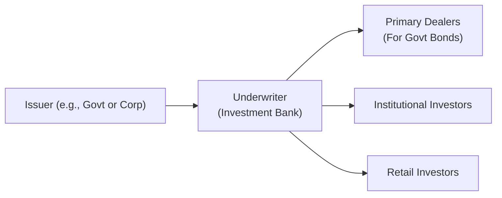

## Introduction
When I first started learning about bonds, I remember thinking, “Alright, they’re just IOUs from big institutions, right?” But as I dug deeper, I realized there’s a whole ecosystem of folks making sure the bond market runs smoothly, day in and day out. In this section, we’re going to explore the many different roles in the bond market—everyone from governments and corporations that issue bonds, to underwriters, brokers, dealers, regulators, rating agencies, and more. By the end, you’ll appreciate not just who these participants are, but why they matter so much for market stability, price discovery, and efficient capital allocation.

Before we jump in, remember that the bond market is often considered the backbone of the global financial system. Issuers depend on it to raise funds for everything from infrastructure projects to corporate expansions, and investors rely on it for stable income and risk management. Sound good? Let’s dive in.

## Key Issuers
Bond issuers are organizations or entities that sell bonds to investors in exchange for cash up front. In return, they promise to pay periodic interest (coupon) and repay the principal at maturity. Let’s look at who these issuers typically are:

### Governments
National governments issue sovereign bonds (like U.S. Treasuries or UK Gilts) to fund their public budgets—think everything from roads and schools to defense. An investor’s trust in these bonds often depends on the government’s stability and its power to tax or print money. Because of this, sovereign bonds are frequently viewed as “risk-free” reference points (particularly U.S. Treasuries), though certain governments do face default risk.

### Municipalities and Local Authorities
State and local governments issue municipal bonds to pay for regional projects, such as building new libraries, bridges, or water-treatment plants. In many countries, municipal bonds come with tax advantages for investors, making them popular among higher net-worth individuals looking to reduce their tax bills. However, as with any bond, a municipality’s creditworthiness matters—a local authority with budget problems may face higher yields to compensate investors for the added risk.

### Corporations
Corporations issue bonds to raise capital for expansions, acquisitions, or even to manage ongoing cash flow. Depending on the company’s financial health, these bonds can range from the safer, investment-grade category (e.g., large established firms with good credit ratings) to high-yield (junk) bonds for companies seen as riskier. A big advantage of corporate bonds is that they often pay higher coupons than government bonds, attracting investors willing to take on more credit risk.

### Supranationals
Entities like the World Bank, International Monetary Fund (IMF), or regional development banks can also issue bonds, often referred to as “supranational bonds.” These organizations typically aim to fund projects aligned with economic development, infrastructure, or humanitarian needs. Supranational debt is often considered secure because multiple government stakeholders stand behind it, but yields may be lower given the high credit quality.

## Underwriters and Investment Banks
Underwriters, often part of large investment banks, play a vital role in the bond issuance process. If you’ve ever heard of a “bond deal,” these are the folks running the show behind the scenes. Underwriters:

• Advise on terms and structure: They help the issuer decide on the ideal maturity, coupon rate, and any embedded features such as calls or puts.  
• Price the bond: Using market research and investor sentiment, underwriters recommend an offering price that balances issuer needs with investor appetite.  
• Market the issue: Together with the issuer, underwriters market the new bond to potential investors via roadshows or conference calls, generating demand.  
• Syndication: For large deals, multiple banks form a syndicate, sharing the risk and collaboratively distributing the bonds.  
• Risk absorption: Underwriters sometimes buy the entire bond issue from the issuer (firm commitment) and then resell to investors, assuming placement risk in the process.

Underwriters can earn fees from issuers, and occasionally profits from the spread (i.e., the difference between the price paid to the issuer and the price received from investors). In essence, they’re the matchmakers ensuring an issuer’s paper finds a suitable home in investor portfolios.

## Primary Dealers
If you’re dealing with government bonds, you’ll frequently hear about primary dealers. These are select banks or financial institutions chosen by a government’s central bank or finance ministry to:

• Purchase new government issues at auction, essentially ensuring that the government can reliably fund its debt requirements.  
• Provide consistent liquidity in the secondary market, quoting firm bid and ask prices to investors and other dealers.  
• Facilitate monetary policy: Primary dealers often interact directly with central banks, participating in open market operations.

The primary dealer system can vary considerably by country. In the U.S., primary dealers commit to active participation in Treasury auctions, while in other jurisdictions the arrangement might be less formal. Despite these variations, the main link remains the same: primary dealers keep the gears of government bond markets spinning.

## Institutional Investors
In the bond world, institutional investors typically dominate in terms of volume. These include:

• Pension Funds: Often have large, predictable cash flow needs, making them natural buyers of fixed-income products to match liabilities to future retirees.  
• Insurance Companies: Need stable, long-term instruments to match potential claims or life insurance payouts. Government and investment-grade corporate bonds often feature prominently in their portfolios.  
• Mutual Funds and ETFs: Serve retail and institutional investors by pooling money to buy diversified baskets of bonds. Fund managers aim to meet specific mandates—like short-term government-only strategies, or broad high-yield bond strategies.  
• Endowments and Foundations: Typically hold bonds to balance risk across their portfolios, with the goal of preserving capital while generating enough income to fund philanthropic activities.

Because these institutions move huge sums of money, their trading decisions and portfolio allocations can influence bond prices, especially in less liquid segments of the market. A few years ago, I was helping analyze trades for a mid-tier pension fund, and it was amazing to see how a seemingly small shift in their asset allocation (like from 20% bonds to 22% bonds) could ripple through the market. Buyers of that scale have outsized influence on liquidity and yields.

## Retail Investors
Although institutions dominate the market by volume, individual or retail investors still play a critical role—particularly through mutual funds, exchange-traded funds (ETFs), and direct purchases of bonds via online brokerages. Some retail investors might focus on municipal bonds for tax advantages, while others might seek stable monthly income from corporate or Treasury bond ETFs. Retail investors can also be quick to exit in times of market panic, which amplifies volatility, especially in high-yield or emerging market debt funds.

In recent years, technology has made it easier for individuals to trade bonds directly or through low-cost ETFs. This democratization of bond markets is a growing trend—so keep an eye on it because it may reshape liquidity and pricing structures in the years ahead.

## Regulating Bodies
Regulators establish the guidelines and enforce the rules that keep bond markets fair, transparent, and efficient. While specifics vary by jurisdiction, some key bodies include:

• U.S. Securities and Exchange Commission (SEC): In the U.S., enforces laws covering securities issuance, disclosures, and reporting.  
• European Securities and Markets Authority (ESMA): Oversees stable and orderly markets across the EU, proposing regulatory standards and ensuring compliance.  
• National Supervisory Authorities: Each country typically has its own agencies (like the Financial Conduct Authority in the UK) that handle licensing, monitoring, and enforcement within local markets.

Regulators levy penalties, mandate disclosures, and require compliance with capital adequacy rules. They also strive to protect retail investors from fraud or misrepresentation. In times of crisis—2008 being a prime example—strong regulatory frameworks (and sometimes emergency regulatory interventions) can help maintain confidence in debt markets.

## Rating Agencies
Rating agencies provide an assessment (often in the form of letter grades like AAA, BB-, etc.) of an issuer’s creditworthiness, or of a specific bond issue’s likelihood of default. The top global players are Moody’s, Standard & Poor’s (S&P), and Fitch.  

• Creditworthiness: Involves analyzing the issuer’s financial statements, competitive position, management quality, and macroeconomic factors.  
• Impact on Bond Pricing: A higher rating (e.g., AAA) usually means lower yield (the issuer can borrow at cheaper rates), while a lower rating (e.g., B or CCC) indicates higher credit risk and thus higher yield.  
• Ongoing Surveillance: Rating agencies continue monitoring issuers and can upgrade or downgrade as conditions evolve.

A downgrade can cause a bond’s price to drop sharply, reflecting the market’s new assessment of risk. Likewise, an upgrade can trigger a price rally. Rating agencies wield considerable influence—some say too much—and spurred debate about potential conflicts of interest, especially since issuers typically pay the agencies for ratings.

## Broker-Dealers and Market Makers
Sometimes, people lump these terms together, but there’s a subtle distinction:  
• Brokers: Execute trades on behalf of their clients in exchange for a fee or commission, without taking direct ownership of the bonds.  
• Dealers: Buy and sell bonds from their own inventory. They quote buy (bid) and sell (ask) prices in the market, facilitating liquidity.  

In reality, many financial firms act as both broker and dealer, hence the label “broker-dealer.” By making a market, they help investors find counterparties for trades, especially important in the corporate bond world where fresh liquidity can be scarce. A robust broker-dealer environment encourages tighter bid-ask spreads—great for everyone, right?

## Putting It All Together in a Diagram

Below is a simple flowchart illustrating the interactions among key participants during a typical bond issuance:

As you can see, the underwriter helps structure and distribute the new bonds, and the end buyers (institutional or retail) ultimately fund the issuer. For government bond markets, primary dealers are crucial in ensuring smooth auctions and robust secondary trading.

## Snapshot of Each Role: A Quick Table

Below is a reference table summarizing each participant's primary role and example activities:

| Participant             | Primary Role                                                    | Example Activity                                                          |
|-------------------------|-----------------------------------------------------------------|---------------------------------------------------------------------------|
| Government Issuer       | Raise funds for public sector spending                         | Issue Treasury bonds to finance infrastructure                            |
| Corporate Issuer        | Raise capital for expansions or refinancing                    | Issue corporate bonds in primary market                                  |
| Underwriter             | Advise on structure, price bond, and distribute to investors   | Arrange a bond offering for a multinational firm                         |
| Primary Dealer          | Participate in government auctions and ensure market liquidity | Buy from Treasury auctions and offer daily bid-ask quotes on government debt |
| Institutional Investor  | Invest large sums to meet liabilities or growth objectives     | Pension fund shifts allocation to long-duration Treasuries               |
| Retail Investor         | Purchase bonds or bond funds for personal portfolios           | Individually buy municipal bonds or invest in bond ETFs                  |
| Regulating Body         | Enforce rules and ensure fair market practices                 | SEC demanding transparent disclosures from corporate issuers             |
| Rating Agency           | Evaluate credit risk and issue ratings                         | Assign a BBB rating to a new corporate bond issuance                     |
| Broker-Dealer           | Provide liquidity through market making and trade execution    | Quote bid and ask prices for corporate bonds on an electronic platform   |

## Common Pitfalls and Best Practices
• Overreliance on Ratings: While credit ratings are critical, some investors rely on them blindly. Always dig deeper.  
• Illiquidity in Certain Markets: Not all bonds trade heavily—liquidity can vanish quickly, especially for high-yield or emerging market debt.  
• Regulatory Arbitrage: Different jurisdictions have slightly different rules. Bond issues can become complex cross-border instruments, so be alert to differences in disclosures and investor protections.  
• Conflicts of Interest: Rating agencies are paid by issuers, underwriters sometimes pressure for certain structures, etc. As an investor, be aware that these relationships can shape the final bond product.

## Exam Tips and Real-World Implications
1. In your exam, expect questions focusing on why different types of issuers prefer certain maturities or structures.  
2. Be ready to discuss how underwriters set bond prices and what happens in the event of an undersubscription.  
3. Understand the mechanics of primary dealers, especially for government debt, and how these affect monetary policy.  
4. Rating agencies: Recognize how a rating change influences bond prices, spreads, and portfolio risk.  
5. Regulatory influences often appear in ethics or risk management contexts—know the key guidelines.  
6. Pay attention to how large institutional trades can shift yield curves or sector spreads.  
7. Bond market liquidity is a favorite exam topic: broker-dealers, primary dealers, and central bank operations are often tested scenarios.  

When I studied for the exam, I remember spending extra time mapping how each participant’s actions can affect bond yields, especially during volatile markets. You might want to run hypothetical scenarios—like a rating agency downgrade or a sudden drop in underwriter demand—to see how the system reacts.

## References and Further Reading
• Bruce Tuckman and Angel Serrat, “Fixed Income Securities: Tools for Today’s Markets.”  
• U.S. SEC (https://www.sec.gov/) and European Securities and Markets Authority (https://www.esma.europa.eu/) for regulatory insights.  
• Credit rating agency portals (Moody’s, Fitch, Standard & Poor’s) for real-time market ratings and methodology updates.  

Remember, each of these participants has a distinct role, but they’re highly interconnected. A major move by one group—like underwriters pricing a massive bond deal or a primary dealer pulling back from auctions—can send ripple effects throughout the entire fixed-income market. Staying attuned to these interactions is key to mastering bond market dynamics.

## Quiz: Responsibilities and Interactions in the Bond Market



### Which of the following entities is typically responsible for purchasing newly issued government bonds at auction and ensuring continuous liquidity in the secondary market?

- [ ] Rating agency
- [x] Primary dealer
- [ ] Underwriter
- [ ] Retail investor

> **Explanation:** Primary dealers are selected by a government’s central bank or treasury to bid at sovereign bond auctions and maintain liquidity in the market.

### Which statement best characterizes institutional investors in the bond market?

- [x] They deploy large sums of capital, often aiming to match duration to long-term liabilities.
- [ ] They primarily transact in short-term instruments and rarely hold bonds to maturity.
- [ ] They only invest in government bonds.
- [ ] They are mostly high-net-worth individuals.

> **Explanation:** Institutional investors, such as pension funds and insurance companies, control significant pools of assets and tailor bond strategies to meet long-dated liabilities.

### Which of the following best describes the role of an underwriter in a bond issuance?

- [ ] Regulate market behavior and impose disclosure requirements.
- [x] Advise on structure, price the new bond, and distribute it to investors.
- [ ] Provide credit ratings on the bond issue.
- [ ] Buy and sell corporate bonds for its own inventory as a market maker.

> **Explanation:** Underwriters are investment banks that help issuers structure securities, determine pricing, and facilitate distribution, usually earning a fee (or spread) in the process.

### What is a key difference between a broker and a dealer in bond markets?

- [ ] Dealers are government-appointed; brokers must rely on a license from rating agencies.
- [x] Brokers execute trades on behalf of others, whereas dealers buy and sell from their own inventory.
- [ ] Brokers only handle initial bond offerings; dealers only handle secondary market trades.
- [ ] There is no meaningful difference; the two terms are interchangeable.

> **Explanation:** A broker executes client orders and charges commissions, while a dealer trades using its own balance sheet, quoting buy/sell prices from its inventory.

### How can rating agencies influence the cost of borrowing for issuers?

- [x] By assigning credit ratings that determine yield spreads over government benchmarks.
- [ ] By underwriting new bond issues at a discount or premium.
- [x] By downgrading or upgrading a bond, thus affecting investor demand.
- [ ] By restricting retail investor access to certain bonds.

> **Explanation:** Rating agencies assign credit ratings and issue upgrades/downgrades based on the issuer’s financial health, directly impacting investor perception of default risk and the cost of borrowing.

### Why might a municipality issue bonds?

- [x] To finance public projects like roads or schools.
- [ ] To meet daily operational expenses when tax revenues are delayed.
- [ ] To accumulate capital for high-yield trading initiatives.
- [ ] To gain direct oversight of local mutual fund investments.

> **Explanation:** Municipalities issue bonds to fund long-term capital projects for the public good. These bonds often come with tax advantages.

### Which statement most accurately captures the role of regulators in the bond market?

- [x] They supervise issuance, disclosure, and trading practices to maintain fair and efficient markets.
- [ ] They manage syndicate risk and determine the coupon rate for corporate issuances.
- [x] They impose mandatory credit ratings to protect retail investors.
- [ ] They are the only direct buyers of sovereign debt at issuance.

> **Explanation:** Regulators oversee the legal and structural framework of bond markets, mandating transparent disclosures and ethical conduct.

### Why could a sudden withdrawal of liquidity by large broker-dealers cause problems?

- [x] Bid-ask spreads may widen, making it more expensive to trade, and bond prices can become volatile.
- [ ] Retail investors might be forced to only buy government bonds.
- [ ] Credit rating agencies would have no data for their models.
- [ ] Underwriters would refuse to deal with certain smaller issuers.

> **Explanation:** Broker-dealers that act as market makers are key to providing liquidity. If they withdraw, transactions become harder to execute at stable prices, potentially sending shock waves through the market.

### What is the primary function of a supranational organization like the World Bank issuing bonds?

- [x] To fund global development projects and provide financing on favorable terms.
- [ ] To profit directly from underwriting high-yield instruments.
- [ ] To replace sovereign debt issuance entirely in emerging markets.
- [ ] To enable short selling of corporate bond ETFs.

> **Explanation:** Supranational organizations like the World Bank issue bonds to finance infrastructure and development projects across various countries, offering stable, high-quality debt.

### A new prospective bond investor believes retail participation is negligible. Is this accurate?

- [x] False
- [ ] True

> **Explanation:** Retail investors do participate in bond markets, often indirectly through mutual funds or ETFs. While institutional investors dominate in total volume, retail influence can be significant, especially during periods of market volatility.


