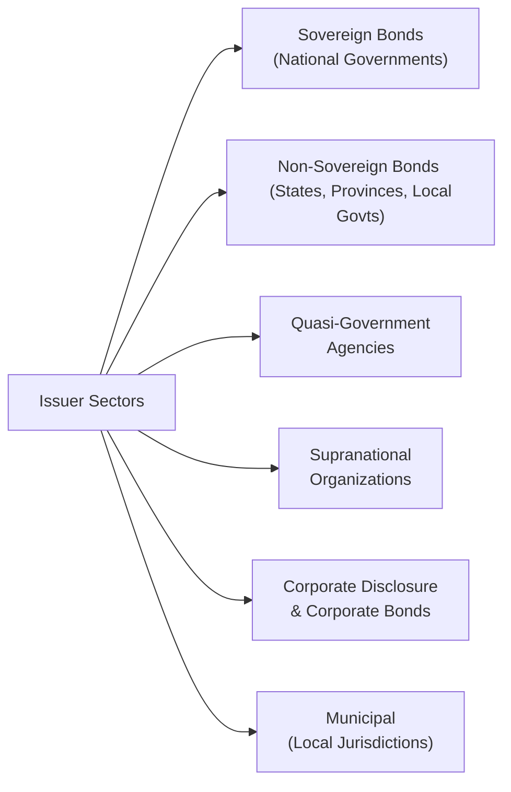

## Introduction

Have you ever wondered why governments, big corporations, and local city councils all borrow money in bond markets—yet each behaves so differently when it comes to risk, return, and investor protections? I remember the time I first saw a “sovereign bond” and thought: “Well, that’s gotta be the safest thing on earth, right?” Then I discovered countries can, in fact, default on their debt, and the entire concept of “issuer risk” suddenly became a lot bigger than I’d assumed. In the world of fixed income, understanding who the issuer is and how their obligations are structured can be just as important as analyzing the yield. So let’s dig in and see how each major issuer sector is classified and why it matters.

## Overview of Key Issuer Sectors

Fixed-income securities can be issued by a wide range of entities, each bringing its own financial strengths, regulatory contexts, and political or economic risk factors. Common issuer sectors include:

• Sovereign (national governments)  
• Non-sovereign (state or provincial governments)  
• Quasi-governmental agencies  
• Corporations  
• Supranational organizations  
• Municipalities (local entities, such as cities and counties)

Some sectors are perceived as safer due to stable revenue sources and regulatory backing, while others require closer scrutiny to understand credit quality, default risk, and political influences. Investors need to consider not only the standalone creditworthiness of the issuer but also the legal framework, tax implications, and any embedded guarantees or structural features.

Below is a simplified diagram illustrating the main fixed-income issuer sectors in relation to their typical backing and risk characteristics:

Don’t worry if this chart seems a bit like a family tree you’ve never seen before. We’ll walk through each segment next.

## Sovereign Issuers

Sovereign bonds are issued by national governments. You’ll sometimes see them referred to as “Treasuries” in the United States, “Gilts” in the United Kingdom, or “Bunds” in Germany. These instruments tend to be a reference point for risk-free rates in their respective domestic markets, although the phrase “risk-free” is more a theoretical convenience—countries can (and occasionally do) default.

Sovereign risk is typically measured by a combination of factors, including:
• Political stability and governance.  
• Strength of the economy (GDP growth, inflation).  
• Government revenue and debt levels.  
• Willingness to repay debts (historical default patterns).  

In practice, investors rely heavily on credit rating agencies to assess sovereign credit risk. These ratings can directly impact the cost of borrowing because a lower rating typically means investors demand higher yields.

## Non-Sovereign and Municipal Issuers

Next on the list are non-sovereign and municipal issuers. Non-sovereign typically refers to state, provincial, or regional governments (think: the state of California in the U.S. or the province of Ontario in Canada). Municipal bonds (often called “munis” in the U.S.) are issued by local governments, cities, counties, or public agencies (like school districts).

Here’s why they matter:
• Many municipal issuers in the U.S. offer “tax-exempt” interest payments, providing a big incentive for investors in higher tax brackets.  
• Revenue sources vary widely—some are funded by general tax revenues, while others rely on a specific project’s cash flows (e.g., toll roads or stadiums).  
• Credit risk can differ significantly from one region to another, depending on local economic conditions and fiscal management.

An important detail? The extent of legal recourse an investor has if the municipality or non-sovereign entity goes insolvent. The legal framework in each country or region dictates how bondholders are treated in a potential default or restructuring. 

## Quasi-Governmental Agencies

Quasi-governmental agencies (or government-sponsored enterprises, GSEs) occupy a fascinating middle ground. They’re typically created by governments to fulfill a public purpose (e.g., support housing markets or facilitate student loans), yet they often have a corporate-style structure.

• Some quasi-governmental agencies have explicit government guarantees of their debt (the government pledges to repay if the agency cannot).  
• Others have only an implicit or assumed backing, meaning everyone sort of “expects” the government to intervene if things go wrong, but there’s no legal obligation.  

Quasi-governmental debt can offer slightly higher yields than direct sovereign debt (to compensate for marginally higher risk), but it still trades at lower yields than comparable purely corporate bonds. A classic example includes U.S. agencies, such as “Fannie Mae” and “Freddie Mac” prior to government conservatorship in 2008.

## Supranational Organizations

Supranational organizations, such as the World Bank, International Monetary Fund (IMF), or the European Investment Bank (EIB), exist beyond the jurisdiction of any single nation. They’re formed by multiple governments aiming to address global or regional economic development and cooperation. Because they’re backed by multiple sovereign states—and often have priority creditor status—they can borrow at very attractive rates and maintain high credit ratings.

These entities:
• Fund global projects, such as infrastructure or poverty-reduction programs.  
• Provide loans and grants to member nations, often focusing on developing or emerging market economies.  
• Rely on capital contributions and guarantees from member countries.  

Many investors view supranational bonds as relatively safe (though not risk-free) because defaults by these organizations would imply a breakdown of international cooperation. Historically, such defaults are extremely rare.

## Corporate Issuers

Corporate bonds are issued by non-government entities—ranging from massive blue-chip multinational firms to small, privately held companies raising capital for expansion or acquisitions. Corporate issuers are typically sliced into two major credit classifications:

• Investment Grade (IG): Rated BBB–/Baa3 or above. These issuers are perceived to have a lower default risk, reflecting stronger balance sheets or more stable cash flows.  
• High Yield (also known as “junk bonds”): Rated below BBB–/Baa3. While they offer potentially higher returns, they carry greater risk of default and are more sensitive to economic downturns or changes in market sentiment.

Corporate bonds exhibit:
• Wide variation in credit spreads.  
• Sensitivity to company-specific events (e.g., product launches, legal battles).  
• Industry cyclical risks (e.g., commodity prices in energy-sector bonds).

When analyzing corporate issuers, it’s essential to look at cash flow stability, debt levels, interest coverage ratios, and the broader corporate governance framework. Also, keep an eye out for bond covenants—these can be either affirmative (“The company must maintain XYZ ratio”) or negative (“The issuer will not issue additional senior debt without bondholder approval”).

## Breaking Down Investment Grade vs. High Yield

Let’s do a quick rundown to clarify the difference between these two classifications:

1. Credit Ratings:  
   • Investment grade: Typically AAA, AA, A, or BBB from Standard & Poor’s (or the equivalents from Moody’s/Fitch).  
   • High yield: BB, B, CCC, or below.  

2. Risk and Return Profile:  
   • Investment grade: Lower default risk, generally narrower credit spreads, and lower yields.  
   • High yield: Higher default risk, wider credit spreads, and higher yields to compensate for elevated risk.  

3. Typical Issuers:  
   • Investment grade: Large, established companies with stable earnings (e.g., many big tech, healthcare, consumer staples).  
   • High yield: Firms with leveraged capital structures, cyclical industries, or those that had a recent downgrade.

4. Impact on Portfolio Construction:  
   • Investment grade bonds often serve as a core, stable portion of a fixed-income portfolio.  
   • High yield bonds are sometimes added to generate extra income—albeit with more volatility.

## Global and Non-Domestic Issuers

Issuers can also tap foreign bond markets for funding. For example, a U.S. corporation might issue a euro-denominated bond in Europe (commonly called a “Eurobond”) to diversify its investor base or to hedge against currency risk. Meanwhile, emerging market governments might issue U.S. dollar bonds to attract international capital at potentially lower rates.

Key considerations for non-domestic issuances:
• Foreign exchange risk: Even if the issuer hedges currency exposure, investors may or may not choose to take on foreign exchange risk.  
• Regulatory frameworks: Different listing requirements or disclosure standards.  
• Tax treatments: Withholding taxes on interest, varying tax treaties.  
• Political and economic stability where the bond is issued (if distinct from the issuer’s home jurisdiction).

Understanding these cross-border nuances is important: a bond might look attractive until you realize local currency depreciation or an unfavorable tax regime could erode your real return.

## Tax Considerations and Legal Frameworks

Taxes are often the unsung hero (or villain) in determining net returns. Municipal bonds in the U.S. typically pay interest that’s exempt from federal income tax—and sometimes exempt at the state or local level if you live in the municipality’s jurisdiction. However, municipal bonds are less commonly used outside the U.S., where local governments might use different financing mechanisms.

On the legal and regulatory front:
• Sovereign bonds often involve specialized collective action clauses to handle defaults.  
• Municipal bond defaults are governed by a patchwork of state or local laws, especially in the U.S.  
• Corporate bonds, especially those below investment grade, can contain elaborate covenants to protect investors or limit corporate actions.

Regulatory bodies (e.g., the SEC in the U.S.) impose filing and disclosure requirements. Agencies like the Municipal Securities Rulemaking Board (MSRB) oversee municipal bond activity, ensuring transparency for retail and institutional investors.

## Differences in Risk Profiles

Sovereign vs. corporate, investment grade vs. high yield—it’s not just about the static rating but also about revenue sources, political risk, and economic drivers. Government bonds rely on tax receipts or, in some cases, revenues from state-owned enterprises. Corporate debt is repaid from a company’s cash flow, subject to business cycles and competition. Supranationals draw from their member countries’ support structures. Each shape is unique.

We can break down these differences in a simplified table:

| Issuer Sector        | Primary Revenue        | Typical Credit Quality | Key Risks                |
|----------------------|------------------------|------------------------|--------------------------|
| Sovereign            | Tax revenues, borrowings | Ranges from AAA to defaults | Political instability, currency risk |
| Non-Sovereign & Municipal | Local tax revenues, project cash flows | Often mid- to high-quality, but can vary widely | Regional economic conditions, legal constraints |
| Quasi-Governmental   | Government support + agency revenues | Often close to sovereign if explicit guarantee; can be lower if implicit only | Government policy changes, political pressures |
| Supranational        | Member-state capital & guarantee | Generally high-grade (AAA/AA) | Rare but possible multi-country disputes |
| Corporate (IG)       | Business cash flows    | Typically BBB– or higher | Economic downturn, industry disruptions |
| Corporate (High Yield) | Leveraged business cash flows | Below BBB– & Baa3      | Higher chance of default, cyclical dependence |

## Real-World Example: Municipal vs. Corporate

Imagine you’re looking at two 10-year bonds with identical yields. One is a municipal bond from a rapidly growing city with a stable property tax base, and the other is a high-yield corporate bond from a leveraged telecommunications firm.

• The municipal bond might offer tax benefits, but if local real estate hits a slump, property taxes could take a dip, pressuring the municipality’s budget.  
• The high-yield corporate bond may resonate with big fans of juicy coupon rates, but it faces significant competition and might be forced to refinance at higher rates if business conditions worsen.

Which do you choose? It depends on your risk tolerance, your tax situation, and your view on each entity’s fundamentals. In practice, professional investors do deep credit analysis, comparing the likelihood of default, current yield, potential price appreciation, and any special covenant protections.

## Summary and Best Practices

Ultimately, the “perfect bond” for your portfolio depends on a mix of yield requirements, risk tolerance, tax considerations, and market outlook. To recap:

• Sovereigns are often stable but watch for political and currency risks.  
• Non-sovereigns and municipals can vary significantly by region, legal framework, and taxation.  
• Quasi-government agencies offer yields slightly higher than pure sovereigns but rely on implied or explicit guarantees.  
• Supranational issuers often have global mandates and strong credit support from multiple nations.  
• Corporate bonds, especially high yield, can deliver higher returns but require closer scrutiny of credit fundamentals.  

A robust due diligence process will incorporate macroeconomic analysis, issuer fundamentals, and an understanding of the myriad regulatory environments. Never rely solely on a rating—ratings change, and so do credit conditions.

## Final Exam Tips

• Be ready to compare and contrast issuer types under different economic scenarios.  
• Understand how political instability or policy changes can alter sovereign, municipal, or quasi-government debt’s risk profile.  
• Demonstrate knowledge of how tax considerations (e.g., municipal bond tax exemptions) can affect after-tax yield, especially in the U.S.  
• Expect scenario-based or item set questions testing your grasp of credit ratings, legal frameworks, and covenant restrictions.  
• Pay close attention to the embedded risks associated with non-domestic issuances.  

When tackling exam questions, structure your answers clearly: address the key credit factors, mention possible rating differences, and incorporate how yield might be impacted by risk. For instance, a question might ask how a shift in interest rates or a municipal budget deficit could affect bond prices and yields.

## References

• Municipal Securities Rulemaking Board (MSRB): https://www.msrb.org/  
• World Bank Treasury (Supranational Debt Information): https://treasury.worldbank.org/  
• Choudhry, Moorad. “The Handbook of Corporate Debt Instruments.” (Recommended for a deeper dive into corporate bond structures.)

--------------------------------------------------------------------------------

## Test Your Knowledge: Key Issuer Sectors and Classifications



### Which of the following best describes a quasi-governmental issuer?

- [ ] A corporation owned entirely by private equity with no government involvement  
- [x] An entity operating with some autonomy but supported by an explicit or implicit government guarantee  
- [ ] A fully sovereign issuer with the power to print money  
- [ ] A private-global partnership that funds local infrastructure projects  

> **Explanation:** Quasi-governmental agencies occupy a middle ground between a purely government entity and a private corporation, often enjoying some form of government support or guarantee.

### Which factor primarily differentiates high-yield bonds from investment-grade bonds?

- [ ] Bond maturity dates  
- [x] Credit ratings below BBB–/Baa3  
- [ ] Sovereign support  
- [ ] Collateral type  

> **Explanation:** High-yield (junk) bonds have ratings below BBB– or Baa3, indicating higher default risk and the need for higher yields to compensate investors.

### Which of the following is most likely an example of a supranational issuer?

- [ ] A municipal government that issues bonds primarily to build local schools  
- [ ] A corporate issuer that exports goods and services globally  
- [ ] A government-sponsored enterprise handling local farm subsidies  
- [x] The International Monetary Fund (IMF), issuing bonds supported by multiple countries  

> **Explanation:** Supranational organizations, such as the IMF or World Bank, are formed by multiple countries, with their bond issues typically backed by capital from member states.

### A municipal bond in the U.S. often attracts certain investors primarily because:

- [ ] It offers a guaranteed payment from the federal government.  
- [x] Its interest can be exempt from federal (and sometimes state) taxes.  
- [ ] Its yield is tied directly to corporate bond market trends.  
- [ ] It’s issued only for international development projects.  

> **Explanation:** Municipal bonds may provide tax-exempt interest income, which is especially appealing to individuals in higher tax brackets seeking tax-efficient investments.

### If a foreign corporate issuer wants to tap the U.S. market with a U.S. dollar-denominated bond, this is often referred to as:

- [ ] A Samurai bond  
- [x] A Yankee bond  
- [ ] A Eurobond  
- [ ] A Global bond  

> **Explanation:** Yankee bonds are issued in U.S. dollars by non-U.S. firms, allowing them to raise capital in the U.S. market under SEC regulations.

### Which characteristic often distinguishes sovereign bonds from non-sovereign government bonds?

- [ ] Only sovereign bonds can be issued with zero coupons.  
- [ ] Non-sovereign bonds always have the highest possible rating.  
- [x] Sovereign issuers generally rely on nationwide tax revenue, whereas non-sovereign issuers rely on regional/local revenues.  
- [ ] Sovereign bonds are typically riskier than non-sovereign bonds.  

> **Explanation:** Sovereign bonds are backed by the taxing power of the entire country, while local or state/provincial debt is backed by specific regional sources of income.

### Which statement best describes the credit risk profile of most supranational entities?

- [x] They are often rated high (e.g., AAA/AA) because of multi-government backing.  
- [ ] They are typically speculative grade due to political uncertainty among member countries.  
- [ ] They have no default risk because they issue equity, not debt.  
- [ ] They have no impact on global capital flows.  

> **Explanation:** Supranational entities like the World Bank are backed by multiple sovereign states and historically maintain strong credit profiles, reflected in high credit ratings.

### One authoritative source that regulates and provides guidelines specifically for U.S. municipal securities is:

- [ ] Securities and Exchange Commission (SEC)  
- [ ] Financial Industry Regulatory Authority (FINRA)  
- [x] Municipal Securities Rulemaking Board (MSRB)  
- [ ] Government Accountability Office (GAO)  

> **Explanation:** The MSRB sets rules and standards for municipal securities markets in the United States, protecting investors and municipal entities alike.

### Which statement is true for quasi-governmental agency debt relative to pure sovereign debt?

- [ ] It typically trades at a lower yield than sovereign debt due to higher liquidity.  
- [x] It often offers slightly higher yields than sovereign bonds, reflecting somewhat higher credit risk.  
- [ ] It cannot be purchased by institutional investors.  
- [ ] It is only issued by supranational organizations.  

> **Explanation:** Quasi-governmental agency debt usually yields somewhat more than sovereign bonds to compensate investors for weaker government support or an implicit (rather than explicit) guarantee.

### True or False: Government-sponsored enterprises (GSEs) always carry an explicit full-faith guarantee from the national government.

- [ ] False  
- [x] True (with caution!)  

> **Explanation:** While some GSEs do have explicit guarantees, many rely on implicit guarantees. Historically, markets have often assumed the government would rescue the entity in a crisis, but this is not always codified by law. Technically, caution is warranted: many GSEs do not have a legal, explicit guarantee. Nonetheless, for exam purposes, it is often taught that “full faith and credit” can be assumed for certain GSEs, though not for all, making the real-world picture more nuanced.


