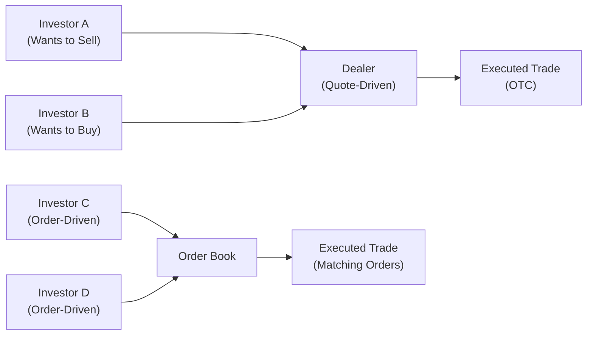

## Introduction

When we talk about the secondary trading of bonds, we’re referring to all those moments after the initial issuance when one investor decides, “Hey, I’d like to sell this bond,” and another investor says, “Sounds good, I’ll buy!” This seemingly straightforward process can be surprisingly complex, especially once we factor in liquidity considerations, OTC (over-the-counter) negotiation, different dealer systems, and regulatory frameworks designed to keep everything fair.

In equity markets, you might think of highly visible stock exchanges with real-time quotes plastered everywhere. But in fixed-income, it’s a bit different. The bond world is famously over-the-counter—meaning trades are mostly negotiated privately. Stumbling into bond trading can feel like a big labyrinth (at least it did for me when I was first learning!), but understanding the basics of secondary trading mechanics, liquidity drivers, and how regulators push for transparency is crucial for any aspiring fixed-income professional.

Below, we’ll walk through the structure of secondary bond trading, what liquidity really means (and how to spot a liquid vs. illiquid market), the distinction between quote-driven and order-driven systems, and the regulations that influence how bonds change hands. This ties closely with many of the ideas from earlier sections on bond market participants and the overarching structure of fixed-income markets.

## The Structure of Secondary Trading

The bond market is famously decentralized. Unlike a stock exchange—where you have a central order book that collects all buy and sell orders—a huge chunk of bond transactions takes place in the “OTC” realm.

• Over-the-Counter (OTC) Trading  
  OTC is simply a fancy way of saying that parties negotiate privately, often via dealers or electronic platforms, rather than matching trades on a centralized exchange. These dealers act somewhat like “market makers,” quoting bid and ask prices. So if you’re a large asset manager wanting to unload a big block of corporate bonds, you’ll usually contact a dealer (or several) to see what price they’re willing to offer. 

• Role of Dealers  
  Dealers hold an inventory of bonds and commit their capital to facilitate trades. If you’re trying to sell a bond, the dealer can buy it into their inventory—provided the price is right. Alternatively, the dealer might even match your “sell” with another client’s “buy.” Because of this negotiation-based setup, transaction prices may vary depending on your dealer relationship, the time of day, and the bond’s liquidity profile.

• Bilateral Negotiations and Technology  
  The good news? Electronic communication networks (ECNs) and alternative trading systems (ATS) are growing in popularity. These platforms aim to bring more transparency and efficiency by matching orders electronically. Think of them as mini stock-exchange-like venues for fixed income. They do not replace dealer networks entirely but offer an additional layer where participants can post quotes or negotiate trades in real time.

## Determinants of Market Liquidity

We often talk about “bond liquidity” like it’s a single number or rating, but in reality, liquidity is influenced by a broad range of factors. If you’ve ever tried selling a thinly traded bond in the middle of the day, you probably learned how big the “bid-ask” spread can get when liquidity is scarce.

• Issue Size and Outstanding Amount  
  Larger bond issues—sometimes referred to as “benchmark” or “on-the-run” issues—tend to be more actively traded. They have lower bid-ask spreads and deeper markets. A $1 billion bond issue from a well-known corporate name is likely easier to trade than a smaller, niche issue from a lesser-known corporation.

• Credit Quality  
  Higher-rated, more transparent issuers typically enjoy better liquidity. For instance, AAA and AA corporate bonds often trade in a more fluid market than a high-yield, lower-rated bond from a company with uncertain future cash flows. Market participants are more comfortable trading something that has less default uncertainty.

• Market Transparency  
  Transparency fosters trust—when investors have access to real-time or at least near-time trade data, liquidity improves. Conversely, opaque markets often see wide bid-ask spreads because dealers and investors price in the extra uncertainty.

• Market Volatility and Macroeconomic Factors  
  Calm market conditions generally translate to more robust trading. During times of stress—like a major recession or unexpected rate hike—investors may hoard liquidity, resulting in less willingness to buy or sell, especially if the bond’s credit outlook is murky.

• Dealer Inventory and Balance Sheet Constraints  
  Dealers match buyers and sellers, but they also hold inventory. Regulations and capital requirements can limit how much risk dealers are willing to carry. If dealers’ balance sheets are constrained, they might offer less-attractive prices, impacting overall liquidity.

## Market Structures: Quote-Driven vs. Order-Driven

While many bond trades occur OTC, there are still distinct “systems” or “models” for how trading is facilitated. Two common ones are quote-driven and order-driven.

• Quote-Driven Markets  
  In quote-driven systems, dealers post bid (buy) and ask (sell) quotes. They commit to trading at these prices for a specified amount. Investors looking to trade simply pick which dealer quote they want to transact on. This arrangement is typical in many corporate and municipal bond markets. A well-known example in the U.S. is the dealer-based municipal bond market—an investor might call up or electronically ping three different muni bond dealers to see who quotes the best price.

• Order-Driven Markets  
  In an order-driven market, all buy and sell orders are posted, typically in a central order book. When compatible orders meet (i.e., a limit buy at or above someone’s limit sell price), trades happen automatically. Electronic platforms can replicate some order-driven mechanisms for bonds, though pure order-driven structures are less common in fixed income than in equities. Government bonds in some countries adopt a semi-order-driven platform, but dealer intermediation still usually plays a big role.

Below is a simplified Mermaid diagram to depict how a quote-driven system might compare to an order-driven system in fixed income:

In the quote-driven part of the diagram, dealers are at the center. Investors rely on the dealer to provide a market. In the order-driven portion, we see direct matching of orders in a more centralized venue.

## Regulatory Oversight and the Push for Transparency

As you might guess, secondary bond markets aren’t the Wild West. Regulatory bodies worldwide (like FINRA in the U.S., ESMA in Europe, etc.) oversee bond trading to ensure fairness, curb misconduct, and promote transparency.

• TRACE in the United States  
  In the U.S., FINRA’s Trade Reporting and Compliance Engine (TRACE) system is a prime example of how regulators enhance post-trade transparency for corporate and certain agency bonds. Dealers are required to report the details of secondary market trades—price, volume, time of execution, etc.—shortly after the trade occurs. This data is made publicly available, letting market participants see actual trade prices, not just dealer quotes. When TRACE was introduced, it was a pretty big deal. Before that, corporate bond trades were notoriously opaque. Now, an investor can get a sense of recent trade prices and volumes, which fosters confidence and can compress bid-ask spreads.

• Impact of Regulation on Liquidity  
  By mandating transparency, regulators often help reduce information asymmetry. Sure, some folks worried back in the day that dealers might reduce liquidity if forced to reveal their trades. But over time, post-trade transparency is widely believed to have improved overall market functioning, as investors now have more information about recent transaction prices.

• Best Execution and Investor Protection  
  Many regulators require dealers and brokers to seek “best execution” for their clients. Essentially, brokers can’t just take your order and run it at a subpar price for their gain. They must show that they executed the order in a manner consistent with achieving the best possible outcome for you, the client. In practice, that means comparing quotes, or using advanced algorithms that hunt for the most favorable liquidity.

• Ongoing Regulatory Evolution  
  If there’s one thing that’s certain, it’s change. Over the past decade, capital requirements on banks and broker-dealers have evolved substantially (for instance, Basel III). This can affect dealers’ capacity to act as market makers. Meanwhile, new technologies and “fintech” solutions yield more direct investor interconnectivity, which the regulators must constantly keep up with. That’s a big reason we see frameworks evolving to accommodate trading on alternative platforms, tokenized securities experiments, and more.

## Electronic Communication Networks (ECNs) and Alternative Trading Systems (ATS)

If you want a more technology-driven environment, Electronic Communication Networks (ECNs) and Alternative Trading Systems (ATS) are where you’d look. These platforms can resemble mini stock exchanges for bonds, although they don’t always operate with a central limit order book in the same sense as a stock exchange.

• ECNs Improve Transparency  
  An ECN allows multiple market participants (dealers, asset managers, etc.) to post firm quotes, either anonymously or sometimes openly. It’s like having an online marketplace you can browse for the best deal. This fosters competition and can tighten spreads, especially for frequently traded names.

• Growth in Europe, Asia, and Beyond  
  While the U.S. is a mature market for these electronic platforms (think MarketAxess, Tradeweb, etc.), similar systems are popping up in Europe (e.g., MTS for government bonds) and Asia. Each region has unique dynamics: for instance, government bonds might trade quite transparently on an order-driven platform, while corporate bonds might remain predominantly dealer-based.

• Potential Pitfalls  
  But technology doesn’t automatically mean perfect liquidity. Some lightly traded or high-yield issues still see liquidity that’s spotty or concentrated with a few dealers, even on these platforms. Also, market fragmentation can occur if too many ECNs split the order flow across multiple venues.

## Transaction Reporting and Post-Trade Transparency

Post-trade transparency refers to the timely release of information—trade date and time, security identifier, price, and volume—to the public or at least to relevant market participants. This has been a focal point of regulators worldwide:

• Benefits of Post-Trade Data  
  – Investors can gauge if their prospective trade price is fair.  
  – Analysts can see actual trading activity, enhancing market research.  
  – Regulators can monitor for irregularities, such as insider trading or manipulation.  

• Challenges  
  – In some smaller bond issues, large trades can significantly impact prices. Disclosing the exact price and size might put a dealer or investor at a disadvantage. Certain markets thus have delayed reporting for particularly large trades to protect participants from undue risk.

• Global Initiatives  
  The U.S. was a pioneer with TRACE. Similar frameworks have emerged globally, each adapted to local market structures. Over time, we’re likely to see further standardization, especially since cross-border bond trading continues to grow.

## Best-Execution Requirements and Investor Protection

Market participants—particularly broker-dealers—often must adhere to best-execution rules. This is explicitly spelled out in some jurisdictions and implied in others:

• Core Principles  
  – Executing at the most favorable terms: price, speed, likelihood of execution, and settlement.  
  – Considering total costs, including commissions and fees.  
  – Evaluating various markets or platforms to find the best combination of price and liquidity.

• Challenges in Bond Markets  
  With less standardization compared to equity markets, “best execution” in bonds can be trickier to measure. Nonetheless, brokers must document and justify their execution procedures, showing they tried to offer or obtain the best terms available. 

• Investor Protection and Disclosures  
  Regulators often mandate that dealers provide risk disclosures, especially for complex or high-yielding securities. Retail investors, in particular, must be fully aware of what they’re buying (or selling). Educational resources and standard “bond facts” sheets are some attempts to address the knowledge gap.

## A Practical Perspective

Let’s imagine you manage a small investment fund specializing in municipal bonds. One day, your largest client wants to raise cash in a hurry. You need to sell a portion of your muni holdings—say $2 million worth. Because these are some smaller-city revenue bonds, trading might be infrequent. In a quote-driven environment:

1. You’d reach out (via phone, Bloomberg chat, or an ECN) to a handful of dealers who focus on municipal bonds.  
2. Each dealer might quote a different price depending on their inventory and their current risk appetite.  
3. You’d compare the quotes. Perhaps you also check real-time or recent trade data from a service similar to TRACE (for municipals, that might be MSRB’s EMMA platform in the U.S.).  
4. Finally, if Dealer A offers the best price, you’d likely sell to that dealer. If you’re unsure about their quote, you can keep haggling or check more dealers, mindful of any time constraints.  

Regulations come into play as well: the dealer has to ensure they aren’t marking up the bond’s price excessively. You could even ask for transaction cost analysis (TCA) to confirm you’re getting a fair deal. This entire process demonstrates how liquidity, regulation, and market structure all interrelate. 

## Common Pitfalls and Best Practices

• Pitfall 1: Over-Reliance on a Single Dealer  
  – If you rely on just one dealer, you might get sub-optimal pricing or limited liquidity. Best practice is to source multiple quotes.  

• Pitfall 2: Ignoring Post-Trade Data  
  – Not checking reported trades can cost you. Transparent post-trade data offers valuable context on where the market is.  

• Pitfall 3: Underestimating Settlement Risks  
  – Even if you find a buyer, remember that settlement for bonds can still be a multi-day process. Ensure you follow the relevant clearinghouse rules and beware of settlement fails.  

• Pitfall 4: Non-Compliance with Best-Execution Requirements  
  – If you’re on the dealer or broker side, regulators can penalize you for not documenting best execution processes.  

• Best Practice: Use ECNs and ATS for Price Discovery  
  – Even if final execution happens OTC, those electronic platforms help gauge market depth.  

• Best Practice: Stay Up to Date on Regulatory Changes  
  – Market rules shift. Being current on new capital requirements, reporting obligations, or trading system changes is essential for compliance and strategic decision-making.

## Conclusion and Key Takeaways

Secondary bond markets are dynamic, heavily influenced by the structure of OTC dealing, liquidity conditions, and regulatory oversight. By understanding how dealers provide liquidity, how quote-driven and order-driven systems differ, and how reporting frameworks like TRACE can increase transparency, an investor—or prospective CFA candidate—gains a crucial edge. 

Remember—liquidity isn’t guaranteed. Especially in times of stress, a bond that once traded tightly might suddenly take forever to sell. That’s where the interplay of regulation, market structure, and technology all come together to shape the real-world experience of bond traders and investors alike.

Ultimately, a solid command of these secondary market concepts sets the foundation for more advanced fixed-income analysis. Whether you’re studying for the CFA exam, trading bonds for a living, or just trying to understand your portfolio better, keep these fundamentals in mind: liquidity is multifaceted, market structure matters, and well-designed safeguards push for fair, transparent markets that benefit us all.

## References

• CFA Institute Market Integrity Insights: https://www.cfainstitute.org/research/market-integrity  
• “Securities Trading: Principles and Procedures” by Larry Harris  
• FINRA (Financial Industry Regulatory Authority) for TRACE details: https://www.finra.org  
• MSRB’s EMMA (Electronic Municipal Market Access) for municipal bond disclosures: https://emma.msrb.org  

---

## Test Your Knowledge of Secondary Trading, Liquidity, and Market Regulation



### Which of the following best describes an over-the-counter (OTC) bond transaction?

- [ ] A trade matched on a centralized exchange with transparent order books.  
- [ ] A real-time auction process similar to electronic stock markets.  
- [x] A private negotiation between parties, often facilitated by a dealer.  
- [ ] A transaction that requires no regulatory reporting.  

> **Explanation:** OTC typically refers to a decentralized market process where trades are negotiated privately rather than on a centralized exchange.

### Which factor often contributes the most to strong liquidity in a particular bond issue?

- [x] Large issue size and high credit quality.  
- [ ] High coupons combined with short maturities.  
- [ ] Presence of derivative overlays.  
- [ ] Strict local regulation with delayed trade reporting.  

> **Explanation:** Liquidity is closely tied to issue size, high credit quality, and market transparency. Larger issues of well-known issuers typically trade more frequently.

### Why is post-trade transparency generally considered beneficial in bond markets?

- [ ] It eliminates counterparty risk entirely.  
- [x] It helps investors assess fair value by providing trade prices and volumes.  
- [ ] It guarantees trades will settle within one day.  
- [ ] It locks in a fixed bid-ask spread for dealers.  

> **Explanation:** Post-trade transparency allows participants to see recent trade data, thus helping them gauge current market prices and improving overall confidence.

### In a quote-driven system, who typically provides the firm bid-ask quotes?

- [ ] Regulatory agencies.  
- [ ] Clearinghouses.  
- [x] Dealers or market makers.  
- [ ] Mutual funds.  

> **Explanation:** In quote-driven markets, dealers publish bid and ask prices at which they stand ready to trade, facilitating liquidity for investors.

### Which statement accurately characterizes the difference between quote-driven and order-driven markets?

- [x] Quote-driven markets rely on dealer quotes, while order-driven markets match investor orders directly.  
- [ ] Quote-driven markets are entirely unregulated, whereas order-driven markets must be regulated.  
- [x] Quote-driven markets traditionally dominate corporate bond trading, while order-driven structures are more common in equity markets.  
- [ ] In order-driven markets, no trade data is ever reported.  

> **Explanation:** Quote-driven and order-driven differ in how trades are formed, with dealers in the forefront of quote-driven environments and direct order matching in order-driven ones. Corporate bonds are typically traded with dealer intermediation, whereas equity trading often uses centralized order books.

### Which of the following is the primary role of TRACE in the U.S. corporate bond market?

- [x] To record and disseminate post-trade data of bond transactions, increasing transparency.  
- [ ] To set the official bond coupon rates across issuers.  
- [ ] To create centralized limit order books for municipal bonds.  
- [ ] To regulate the interest rates in the treasury market.  

> **Explanation:** TRACE is a FINRA system that reports OTC bond trades, helping investors understand actual transactions and improving market transparency.

### From a global perspective, which statement is true regarding bond market regulation?

- [x] Different jurisdictions have implemented variants of post-trade reporting, inspired by TRACE’s success.  
- [ ] Regulation is uniform worldwide, with a single global regulator overseeing bond trades.  
- [x] Potential differences in capital requirements can impact how dealers provide liquidity across different markets.  
- [ ] All bond markets must use an order-driven structure by law.  

> **Explanation:** While TRACE is a U.S. system, other regulators around the world have adopted or are exploring similar frameworks, and local capital requirement rules greatly affect dealers’ ability to make markets.

### What is one potential downside of post-trade transparency for large bond trades?

- [ ] It requires specialized technology that is too expensive for small investors.  
- [x] It may reveal sensitive information about the size of a large trade, potentially impacting the seller’s or buyer’s market position.  
- [ ] It prevents the buyer and seller from agreeing on a fair price.  
- [ ] It encourages insider trading.  

> **Explanation:** Revealing the exact trade size can place large institutional traders at a disadvantage by leaking information that could move the market.

### Why do many bond markets remain quote-driven rather than purely order-driven?

- [ ] Because regulators forbid order-driven structures for bonds.  
- [ ] Because technology is unavailable for matching bond orders.  
- [x] Because dealers often provide depth and liquidity in a fragmented OTC environment.  
- [ ] Because most bond markets are run by local governments.  

> **Explanation:** The dealer-based model, though potentially less transparent than an order-driven market, is an effective channel for liquidity provision in a fragmented bond world with millions of individual bond issues.

### With best-execution requirements, which of the following statements is correct?

- [x] True  
- [ ] False  

> **Explanation:** Best-execution rules mandate that brokers and dealers take reasonable steps to obtain the most advantageous terms for their clients, and documentation of the process is key to compliance.


