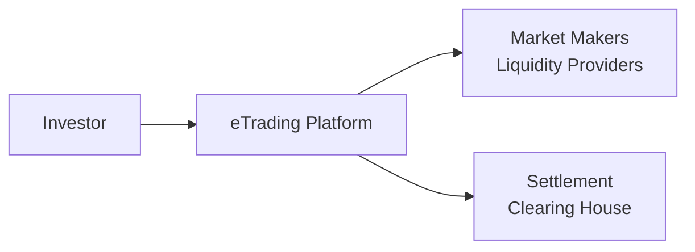

## Introduction and Context

I remember the days when bond trading often involved picking up the phone and calling a broker. It felt a bit like jumping into a busy street—lots of honking horns, shouting traders, maybe a little anxiety, and, well, some confusion. Over the past decade, however, electronic trading (eTrading) platforms and their associated innovations have really transformed the fixed-income landscape. In this section, we’ll explore how these platforms operate, why they're attractive to investors and issuers alike, and what new technologies—like distributed ledger technology (DLT) and advanced algorithms—are doing to reshape how we trade bonds.

We’ll build on the preceding sections that looked at the basics of market participants (see 1.2 Roles and Participants in the Bond Market) and classification of bonds (see 1.3 Key Issuer Sectors and Classifications). For now, our focus is on the technological aspect that has ushered in new ways of facilitating trades, connecting buyers and sellers, and analyzing market data.

## The Emergence of eTrading Platforms

It is not exactly news that technology has been revolutionizing financial markets. From equity markets to currencies, more and more trading has gone digital—and bonds are no exception. Yet the bond market has historically been more opaque and over-the-counter (OTC) in nature. By bringing this once voice-dependent environment into an electronic context, eTrading platforms are fundamentally changing transaction costs, transparency, and market access.

Unlike traditional voice-brokered trades, where you'd phone dealers (or brokers) to negotiate a price, electronic platforms allow orders to be posted, matched, and settled in near real time. Buy-side and sell-side participants often come together on the same marketplace, seeing (with some exceptions) a live or near-live feed of prices—this fosters more efficient price discovery and the potential for narrower bid–ask spreads.

## Key eTrading Models

### Request-for-Quote (RFQ)

You’ll hear RFQ mentioned a lot in the bond market. Essentially, an RFQ process allows you, as an investor, to request price quotes directly from multiple liquidity providers via an electronic platform. Suppose you want a price for a 10-year corporate bond. On an RFQ platform, you simply enter your trade size and see multiple dealers respond with competing quotes. This model is still quite popular because it neatly bridges the old and the new—participants still control who they ask for quotes, but they benefit from automation and speed.

### All-to-All Trading

All-to-all trading is a newer type of marketplace where any participant, such as a mutual fund, pension fund, or even hedge fund, can post a buy or sell order visible to other participants—irrespective of whether they are traditionally considered buy side or sell side. Instead of brokers exclusively quoting prices, you might see an asset manager on the other side of your trade. This is a big departure from the usual concept that only licensed dealers or broker-dealers could provide liquidity. By displaying trade interest widely, price discovery can be improved, but participants must carefully manage information leakage in such an open environment.

### Pure Electronic Order Matching

On some platforms, advanced algorithms automatically match orders based on best price, similar to how many equity markets work. These are central limit order books (CLOBs) for bonds, though less common outside of highly liquid government bond markets. In many government bond markets—particularly U.S. Treasuries—high-frequency trading (HFT) firms operate in these purely electronic environments.

## Algorithmic Trading in Bond Markets

Algorithmic trading refers to automated systems that place or route orders following programmed rules. Remember the days you might’ve set a price limit with a broker and hoped they’d fill your order if the market ticked up or down? Now, advanced algorithms can instantly scan multiple platforms, evaluate real-time bond quotes, and choose the most competitive price. They also dynamically update orders when market conditions change. Over time, these algorithms have grown more sophisticated, incorporating a range of signals, from fundamental credit data (see Chapter 9 on Credit Risk and Credit Analysis) to short-term technical indicators.

### Potential Advantages of Algorithmic Trading

• Reduced Transaction Costs: Automating the decision flow can minimize market impact and reduce bid–ask spreads.  
• Faster Reaction Times: Markets fluctuate quickly, and an algorithm can spot fleeting arbitrage opportunities or optimal entry points.  
• Consistency and Discipline: Algorithms remove human biases such as panic or greed.  

### Potential Drawbacks of Algorithmic Trading

• Flash Crash Susceptibility: Rapid, automated order cancellations or erroneous trades can spark sudden liquidity vacuums.  
• Over-Dependence on Technology: A system failure at a key brokerage or data provider can disrupt trading or cause erroneous fills.  

## Blockchain Innovations and the Bond Market

One of the more buzzworthy fintech developments is blockchain (a form of distributed ledger technology, or DLT). Imagine a decentralized record of all bond trades, issuance terms, and settlement instructions, verified by a network of computers. In principle, this can reduce settlement times, lessen manual reconciliation, and heighten transparency. Some governments and financial institutions have even tested tokenized bond issuance—essentially creating digital tokens that represent bond ownership on a blockchain.

Though blockchain applications are still in the experimental stage for many participants, the potential is large. Reduced operational costs, streamlined settlement processes, and new ways for investors to get immediate confirmation of trades are possible. That said, regulators worldwide are still hammering out how tokenized securities fit into existing laws.

## Benefits of eTrading for Market Participants

### Greater Transparency and Price Discovery

Electronic trading can offer real-time (or near real-time) market data feeds that provide a comprehensive view of quotes and recent transactions. This fosters more informed decision-making. In fact, with more data points visible, you might see narrower bid–ask spreads (though liquidity can still vary by bond, given the unique characteristics of many fixed-income instruments).

### Expanded Investor Access

Under traditional conventions, smaller funds or investors often had limited direct access to certain parts of the bond market—either due to large minimum trade sizes or simply because they had fewer personal connections with dealers. By lowering these barriers, eTrading platforms open the door for a wider array of market participants to compete and provide liquidity.

### Reduced Operational Costs

When you can electronically capture orders, confirm trades, and feed them automatically into the back-office workflow for settlement, errors drop significantly. Manual phone-based processes can get messy. Let’s face it—typos happen. By automating major steps in the trade lifecycle, you can reduce operational risk and enhance straight-through processing.

## Risks, Pitfalls, and the Potential for Flash Crashes

While eTrading is empowering, it also introduces system-level challenges. Consider the possibility of a "flash crash," triggered by algorithmic trades that snowball. In a purely electronic environment, trades can occur at lightning speed. If an algorithm goes haywire—whether because of a software glitch or an erroneous data input—it might issue large orders in quick succession, driving prices to extreme levels. Similarly, a market data feed outage can stall or confuse pricing in the marketplace, causing uncertainty and potentially encouraging predatory trading strategies by those with better information.

In practice, these risks underscore the importance of having robust “circuit breakers” and fail-safes—mechanisms that automatically pause or slow trading if prices move too quickly over a short timeframe. Regulators often push platform operators to incorporate these controls to avoid systemic disruptions.

## Regulatory Considerations and Responses

Across major financial jurisdictions, regulators are continuously adjusting their frameworks to ensure they adequately address the complexities of eTrading. This environment requires new rules—sometimes quite detailed—covering:

• Algorithmic Trade Oversight: Requiring algorithms to pass rigorous testing to ensure they don’t pose undue market risk.  
• Real-Time Reporting: Mandating near-real-time transaction reporting to boost transparency for participants.  
• Cybersecurity Protocols: Protecting eTrading platforms from external hacking attempts or data breaches.  

Regulators such as the U.S. SEC, FINRA, the European Securities and Markets Authority (ESMA), and others have all published guidance around eTrading best practices. The Bank for International Settlements (BIS) and international standard setters, such as IOSCO (International Organization of Securities Commissions), also offer frameworks that help align cross-border regulatory approaches. Overall, the intersection of advanced financial technology (fintech) and traditional regulation is still evolving.

## Example: How an RFQ Platform Increases Price Transparency

Let’s say you manage a mid-sized institutional portfolio and look to increase your allocation to a corporate bond. In the past, you might’ve phoned three or four dealers, hoping to get decent quotes, but you’d have limited real-time data about the broader market. On an electronic RFQ platform:

1. You input the International Securities Identification Number (ISIN) of the bond and specify your desired trade size.  
2. The platform sends a request for quote to five or six approved dealers simultaneously.  
3. Within seconds, you see multiple quotes appear on-screen in a consolidated format.  
4. You can choose the best quote and submit your order immediately.  

Through the same platform, you might receive instant transaction confirmations, a simplified process for settlement instructions, and integrated best execution reports. These speed and transparency enhancements are typical across leading eTrading venues.

## Visualizing eTrading Flows

Below is a simple diagram illustrating how key parties interact on an electronic bond trading platform. The platform acts as a hub, receiving orders from different investors and routing them to liquidity providers or matching them internally.

• The investor submits an order or RFQ to the eTrading platform.  
• The platform either matches the order with another market participant or routes it to market makers and liquidity providers.  
• Final trades then proceed to clearing and settlement.

## Real-World Anecdote: Lessons from a Partial Outage

A few years back, a major electronic bond trading platform suffered a temporary connectivity glitch, preventing participants from updating or cancelling orders for about 15 minutes. Those who had posted quotes earlier had to watch the market move without being able to adjust. Some participants lost money due to stale quotes. The short outage highlighted how reliance on continuous electronic access can backfire without robust fallback solutions. Regulators, noticing the potential for bigger disruptions, later required stronger backup channels and mandatory system stress testing. It’s a small but powerful reminder that technology, while beneficial, must be managed with care.

## Future Directions

Many experts predict further electronification, even in corners of the fixed-income market that remain mostly manual. Additionally, we can expect deeper integration of advanced analytics, perhaps leveraging artificial intelligence and machine learning, to help refine credit risk assessments quickly or spot anomalies in the market. Blockchain’s role remains uncertain—some believe it will restructure everything from issuance to settlement, while others see it as too disruptive to be widely adopted soon.

But hey, nobody truly knows which direction new technologies will take us. As we continue through this text, keep in mind that risk management, compliance with standards, and striving for best execution all remain at the forefront of fixed-income market integrity.

## Practical Exam Tips for CFA Candidates

• Understand eTrading Terminology: Be comfortable with terms like RFQ, all-to-all, algorithmic trading, and blockchain.  
• Link to Regulatory Concepts: The CFA exams often test whether candidates can connect broader market structure issues to regulatory frameworks.  
• Practice Scenario-Based Questions: Items might present you with a situation—like a potential flash crash or a technology outage—and ask how traders or regulators should respond based on best practices.  
• Recall the Operational Flow: Familiarity with the cycle from price quote to final settlement helps anchor your answers in real-world logic.  

## References and Further Reading

• Kim, K. (2007). Electronic and Algorithmic Trading Technology. Academic Press.  
• BIS (Bank for International Settlements). Various papers on market infrastructure and fintech. https://www.bis.org/  
• World Economic Forum. Research on DLT in capital markets. https://www.weforum.org/  

## Evaluate Your Knowledge: Electronic Trading Platforms and Market Innovations



### Which of the following best describes the Request-for-Quote (RFQ) model in bond markets?

- [ ] An open order book where all participants can see all posted bids and offers.
- [ ] A platform that only dealers can access and post prices.
- [x] A process where a buyer requests price quotes from multiple sellers before deciding on a trade.
- [ ] A model in which an algorithm matches trades directly without any human input.

> **Explanation:** RFQ systems allow an investor (buyer or seller) to request price quotes from multiple liquidity providers simultaneously, helping with efficient price discovery.

### What is a key benefit of eTrading platforms for smaller investors in bond markets?

- [ ] Mandatory hedging requirements.
- [x] Expanded market access and improved price transparency.
- [ ] Elimination of default risk.
- [ ] Guaranteed higher yields.

> **Explanation:** eTrading platforms widen participation and provide real-time data, thus supporting better access for smaller investors who might otherwise struggle to engage with multiple dealers.

### In an all-to-all bond trading platform:

- [ ] Only sell-side dealers can place quotes.
- [ ] Trades are settled bilaterally outside the platform.
- [ ] Investors are automatically matched with government entities for price discovery.
- [x] Any participant can post trades visible to all other participants.

> **Explanation:** In all-to-all trading, the platform does not differentiate between buy and sell sides; all participants can interact with all posted orders.

### One major advantage of algorithmic trading in bonds is:

- [ ] Guaranteed elimination of default and liquidity risk.
- [ ] Long settlement times to validate trades.
- [x] Reduced transaction costs through automated, fast order execution.
- [ ] A requirement that all trades be done via phone.

> **Explanation:** Algorithms can help traders react swiftly to market changes, reduce latency, and minimize the bid–ask spread, lowering overall transaction costs.

### Which of the following is a potential pitfall of increased electronification in bond markets?

- [x] Heightened susceptibility to flash crashes.
- [ ] Complete eradication of all operational risks.
- [ ] Instant regulatory approval for all new technology.
- [ ] Reduced transparency across trading venues.

> **Explanation:** While electronification often improves transparency, automated processes can lead to rapid market moves when trading algorithms malfunction or interpret market data incorrectly.

### How does blockchain potentially affect bond trading and settlement?

- [ ] It forces all trades onto an unregulated public ledger.
- [ ] It is not applicable to the bond market.
- [x] It provides a decentralized ledger that could streamline processes and reduce settlement times.
- [ ] It replaces electronic trading platforms entirely.

> **Explanation:** Blockchain, or distributed ledger technology, can reduce manual reconciliation, enhance transparency, and potentially speed up settlement times in the bond market.

### Which regulatory measure is often applied to mitigate the risk of flash crashes?

- [ ] Zero transaction cost policy.
- [x] Circuit breakers or automatic trading halts.
- [ ] Unlimited leverage allowances.
- [ ] Eliminating all forms of market oversight.

> **Explanation:** Circuit breakers pause trading when prices move too quickly, allowing participants time to gather information and preventing runaway market spirals.

### Why might the bond market experience unique eTrading challenges compared to stocks?

- [ ] Bond markets have lower nominal values per trade.
- [ ] Regulatory bodies do not require transparency in bond trading.
- [x] Bonds are often less liquid and more diverse in characteristics than stocks.
- [ ] Bonds have fixed coupons, so electronic systems cannot handle them.

> **Explanation:** Each bond issuance can have distinct maturity, coupon, and credit quality features, leading to fragments in liquidity and more complexity in executing trades electronically.

### An example of an all-to-all eTrading platform would allow:

- [ ] Only top-tier brokers to trade with each other.
- [ ] Investors to trade exclusively with the central bank.
- [x] Both buy-side and sell-side participants to post orders and trade with each other.
- [ ] Only algorithmic trading strategies.

> **Explanation:** All-to-all platforms break down traditional distinctions, letting any authorized participant trade with anyone else, thus expanding potential liquidity.

### True or False: eTrading in bonds completely removes the risk of a broker-dealer failing to deliver securities.

- [x] True
- [ ] False

> **Explanation:** This is false—electronic trading itself does not remove counterparty or operational risks. Settlement and clearing are still reliant on the financial stability of participants and market infrastructure.


