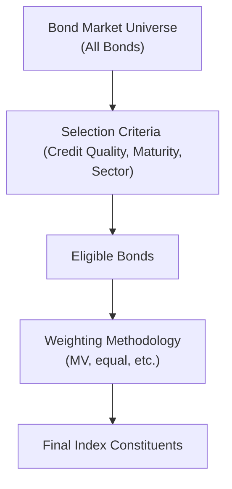

## Introduction
I remember the first time I tried to track a bond market index—let's just say I was more than a little confused! Um, I knew that equity indexes like the S&P 500 were widely used to gauge stock performance, but it was shocking how much more intricate the bond world can be. Anyway, bond indexes serve as vital benchmarks that represent the performance of specific segments of the fixed-income market or the market as a whole. These indexes help us measure how well a bond portfolio (or fund) is doing relative to others, so it's kind of like checking the speedometer on a long road trip—if you don’t know how fast you’re going, you could be in big trouble (or missing out on the fun).

Below we’ll walk through everything from how bond market indexes are constructed, to the challenges of replicating them in real portfolios, and even some real-world tips on how to use them to evaluate performance.

## The Purpose of Bond Market Indexes
A bond market index is basically a curated basket of bonds designed to represent and track the performance of a particular bond market or market segment, such as government bonds, corporate bonds, or emerging market debt. Think of it like an “average measure” of how a certain portion of the bond market is moving. If you’re an investment manager, you need to know whether your portfolio is outperforming or underperforming a representative slice of the market. That’s where indexes come in handy.

Dodging that confusion means understanding what an index is supposed to cover. Some indexes, for instance, only have government bonds. Others might include all investment-grade bonds, mixing government and corporate. More comprehensive indexes, often referred to as aggregate bond indexes, roll in government, corporate, mortgage-backed, and sometimes even short-term or asset-backed securities. This variety makes it possible for you to pick an index that best matches your investment mandate and risk appetite.

## Key Elements of Bond Index Construction
Constructing a bond index is, in a sense, both science and art. Let’s break down some of the building blocks.

### Selection Criteria
What counts as “in” the index depends on predefined inclusion rules. These usually revolve around:
• Credit quality or rating (e.g., only investment-grade bonds).  
• Maturity bracket (e.g., bonds with at least one year to maturity).  
• Currency denomination (e.g., only USD bonds).  
• Minimum outstanding issue size.  

You can think of these rules like gatekeepers ensuring that only bonds meeting certain liquidity or risk standards make the cut.

### Index Providers
Major providers like Bloomberg, ICE, FTSE Russell, and others meticulously craft large families of bond indexes covering many regions, sectors, and rating categories. Each provider has its own methodology documents that define how they admit new bonds, remove old ones, and rebalance the weighting of each bond in the index.

### Weighting Methodologies
Just as with equities, weighting can dramatically affect index behavior. Common weighting methods include:

• Market-Value Weighting: Bonds with a higher outstanding notional value have larger weight. This is the most common approach, but can lead to heavier concentration in highly indebted issuers.  
• Equal Weighting: All bonds receive the same weight, regardless of size. This allows smaller issues to have the same influence as mega issues, which can be risky if the smaller issues are illiquid.  
• Customized Weights: Sometimes indexes are built with constraints, such as weighting by fundamental measures (like an issuer’s revenues or “fundamentals”) or weighting by credit quality buckets.

## A Visual Guide to Index Construction
Below is a simple diagram to illustrate how a bond index is formed:

The process begins with the broad universe of fixed-income securities, narrows down through criteria (e.g., investment-grade only, minimum issuance of $300 million, at least one year left until maturity), and then applies the chosen weighting scheme to arrive at a set of index constituents and their respective weights.

## Types of Bond Market Indexes
• Government Bond Indexes: These focus on sovereign debt, often considered the benchmark for interest rate movements.  
• Corporate Bond Indexes: These capture the performance of investment-grade or high-yield corporate bonds.  
• Aggregate Bond Indexes: Typically a broad-based index that incorporates government, asset-backed, and corporate securities across multiple maturities and credit ratings.  
• Specialized Indexes: For example, municipal bond indexes, emerging market bond indexes, or sector-specific indexes like mortgage-backed securities (MBS) indexes.

Each of these segments operates under different risk and return dynamics. Government bond indexes, for instance, are heavily influenced by expectations of interest rates and central bank policy. High-yield corporate bond indexes, on the other hand, track credit risk more than interest rate risk.

## Rebalancing and Maintenance
Bond indexes aren’t static. Bonds mature, new bonds are issued, and credit ratings change. To stay relevant, indexes require periodic rebalancing (usually monthly) to add new qualifying bonds and remove ones that no longer meet criteria. During these rebalancing events, weights get recalculated based on the updated outstanding notional amounts, or however the methodology prescribes.

Frequent redemptions, calls, and new issuances mean that the composition of a bond index can shift pretty regularly. That’s one reason replicating the entire index exactly in a portfolio can be complicated. If you try to match every single transaction, you can quickly rack up hefty trading costs.

## Benchmarking and the Role of Bond Indexes
You might ask, “Why do we need these indexes?” Benchmarks give us a performance yardstick. If your bond fund’s returns dwarf the index returns over the same period, you’re doing great, right? Well, presumably yes. If you underperform, you might need to rethink your investment strategy or check if your credit or duration bets didn’t work out as planned.

Benchmarks also define the risk profile. Suppose you’re running a core bond strategy. You might pick the Bloomberg U.S. Aggregate Bond Index (often known as the “Agg” in the U.S.) as your benchmark. That means your returns, volatility, and sector exposures should at least be in the same ballpark as the “Agg” if you’re targeting a similar risk-return profile.

## Challenges of Bond Indexing
Illiquidity is probably the biggest stumbling block to a perfect replication of bond indexes. Many bonds—especially in certain corporate or emerging market niches—don’t trade very often, so their market prices can be stale. Furthermore, there’s a huge variety of bonds out there, each with different maturities, coupon structures, embedded options, and more. An index can contain thousands of issues, making it tough to hold every single one.

Also, bond markets can see wide bid-ask spreads compared to liquid equity markets, which makes frequent rebalancing or turnover a big cost burden. That’s why many managers opt for stratified sampling or other techniques—holding a representative subset of the index—to reduce transaction costs without totally abandoning the benchmark’s core characteristics.

## The Concept of Tracking Error
When we measure how well a portfolio tracks an index, we look at something called “tracking error.” Tracking error basically captures the volatility of the difference between your portfolio returns and the benchmark returns. It’s often calculated as:

$$
\text{Tracking Error} = 
\sqrt{\frac{1}{n-1} \sum_{i=1}^n \bigl(R_{p,i} - R_{b,i}\bigr)^2}
$$

Where:  
• \\( R_{p,i} \\) = return of the portfolio in period i  
• \\( R_{b,i} \\) = return of the benchmark in period i  
• \\( n \\) = number of periods  

If you’re trying to index passively, a low tracking error is good news—it means your returns are hugging the index tightly. Active managers might allow a higher tracking error on purpose, hoping to beat the index by making different bets.

## Minimizing Tracking Error
Bond portfolio managers who want to replicate an index closely often use one or more of the following techniques:

• Full Replication: Buy every bond in the index in weights that match the index. This is ideal in theory but can be super expensive, especially if the index is huge.  
• Stratified Sampling: Group index constituents by key risk factors (like duration, credit buckets, sector). Then sample from each group to mirror the overall risk profile without holding every bond.  
• Optimization: Mathematical models are used to minimize tracking error subject to constraints (e.g., maximum sector weight, transaction cost budgets, etc.).  

These approaches each have pros and cons. Full replication is the best for near-zero tracking error but is often unfeasible or too expensive. On the other hand, a sampling or optimization method might let you keep costs in check but could also open the door to a bit wider performance gap.

## Practical Anecdote
I once worked with a team that tried to replicate a segment of a corporate bond index for a new fund. We realized pretty quickly that the index was huge—thousands of individual bonds. Our first attempt at full replication was unbelievably costly. Commissions, bid-ask spreads, you name it. We eventually pivoted to a stratified sampling approach, which gave us a workable solution. Sure, we might have missed out on some tiny yield advantage from lesser-known issuers, but it was definitely worth the lower cost and simpler execution.

## Using Bond Indexes as Benchmarks
When selecting a benchmark, you want to ensure it matches your portfolio’s universe, average credit rating, duration, and sector composition. If you manage an emerging market bond fund, it doesn’t make sense to evaluate performance against a U.S. investment-grade index. That mismatch would lead to an “apples to oranges” comparison.

Benchmarks are also crucial for measuring risk. Many analytics systems will decompose your portfolio risk relative to the benchmark, identifying whether your difference in performance is coming from credit risk, short or long duration, or sector overweights.

## Key Takeaways and Best Practices
• Always pick an index that aligns closely with the type and risk level of your bond portfolio.  
• Understand the rules: The same bond can appear in one index but not in another due to different inclusion criteria.  
• Keep an eye out for rebalancing schedules—they can shift the weight or presence of individual bonds.  
• Be mindful of the cost of replicating the index. If transaction costs are too high, try sampling or optimization to keep your tracking error manageable.  
• Remember that benchmarks are there to provide insight into your risk exposures and performance, not to stifle creativity. If you’re taking an active approach, a bit of deviation might be exactly what you aim for.

## Exam Tips
• Know the difference between market-value weighting and alternative weighting schemes.  
• Be able to discuss the main pros and cons of full replication vs. sampling.  
• Understand how liquidity and bond issue size complicate index replication.  
• Practice calculating tracking error and be ready to interpret it in exam-style item sets.

## References
• Bloomberg Indices Methodology Guides:  
  <https://www.bloombergindices.com/>  
• ICE BofA Index Methodology Papers:  
  <https://indices.theice.com/>  
• Bernstein, Peter L., and Aswath Damodaran. “Investment Management.”  
• CFA Institute Level I 2025 Curriculum, Fixed Income Volume 6.

## Bond Market Indexes and Benchmark Construction Quiz



### Which of the following features distinguishes a bond market index from an equity market index?  
- [ ] They both track changes in daily exchange rates.  
- [ ] Equity indexes must be rebalanced monthly, while bond indexes are rebalanced annually.  
- [x] Bond indexes often face liquidity and maturity complexities, making replication harder.  
- [ ] Equity indexes lack weighting schemes, while bond indexes rely on them.  

> **Explanation:** Unlike most equity indexes, bond indexes face frequent maturities, redemptions, and new issuances. These liquidity and composition challenges make them more complex to replicate in practice.

### A typical broad-based aggregate bond index might include:  
- [x] Government bonds, corporate bonds, and mortgage-backed securities.  
- [ ] Only high-yield corporate bonds.  
- [ ] Only short-term Treasury bills.  
- [ ] Only inflation-linked bonds.  

> **Explanation:** Aggregate indexes usually aim to represent the entire investment-grade universe, including government, corporate, mortgage-backed, and sometimes asset-backed securities.

### What is one primary goal of bond index rebalancing?  
- [ ] Increasing the number of bonds to minimize prices.  
- [x] Removing bonds that no longer qualify and adding new ones that do.  
- [ ] Eliminating higher quality bonds to reduce overall interest rate sensitivity.  
- [ ] Aligning index performance strictly with equity market performance.  

> **Explanation:** Rebalancing is meant to maintain the integrity of the index’s inclusion rules by removing matured or downgraded bonds and adding newly issued or newly qualified bonds.

### In market-value weighting, an issuer with a large amount of debt outstanding will:  
- [x] Have a higher weight in the index than those with less debt outstanding.  
- [ ] Be excluded from the index if its credit rating is too high.  
- [ ] Have the same weight as issuers with small amounts of debt.  
- [ ] Always be replaced by equal-weighting adjustments.  

> **Explanation:** Market-value (or market-cap) weighting gives proportionally greater importance to issuers with larger outstanding issues.

### Which statement best describes the main challenge of full replication of a large bond index?  
- [ ] It simplifies bond selection, thus lowering transaction costs.  
- [ ] It guarantees zero tracking error because of frequent rebalancing.  
- [x] It can be prohibitively expensive due to high trading costs and illiquidity.  
- [ ] It is legally restricted in most jurisdictions.  

> **Explanation:** Buying every bond in the index often involves high bid-ask spreads, illiquid issues, and significant transaction costs, making it impractical.

### A benchmark for a high-yield bond portfolio should typically:  
- [x] Reflect the credit quality and risk profile of non-investment-grade bonds.  
- [ ] Be limited to government bonds for risk-free comparison.  
- [ ] Contain only AAA-rated securities to measure credit risk.  
- [ ] Include only short-term money market instruments.  

> **Explanation:** The benchmark should match the strategy’s investment universe. A high-yield bond manager would use a high-yield index to compare like with like.

### Which index type generally exhibits the lowest interest rate risk but possibly higher credit risk?  
- [ ] Treasury-only index  
- [x] High-yield corporate bond index  
- [ ] Inflation-protected bond index  
- [ ] Municipal bond index  

> **Explanation:** High-yield corporate bonds typically have shorter maturities on average than governments, but they carry higher credit risk. Their interest rate sensitivity is often lower than a long-term Treasury index, for example, though credit risk is significantly higher.

### When selecting an appropriate bond benchmark, the manager should ensure:  
- [x] The benchmark has a similar duration, credit quality, and sector exposure as the portfolio.  
- [ ] The benchmark is chosen arbitrarily for convenience.  
- [ ] The benchmark is rebalanced daily to shrink tracking error.  
- [ ] The benchmark only includes zero-coupon bonds.  

> **Explanation:** A benchmark should closely align with the portfolio’s characteristics so that performance comparisons are meaningful and risk exposures are similar.

### Tracking error is best described as:  
- [x] The standard deviation of the return difference between your portfolio and the benchmark.  
- [ ] The difference in average coupon rate between two portfolios.  
- [ ] The difference between a bond’s book value and market value.  
- [ ] The time-lag difference in calculating daily returns.  

> **Explanation:** Tracking error quantifies how closely a portfolio follows its benchmark by measuring the volatility of the return differential.

### True or False: A bond index with equal weighting treats smaller issues exactly the same as larger ones.  
- [x] True  
- [ ] False  

> **Explanation:** Equal weighting gives each bond an identical share of the index, regardless of the bond’s outstanding amount, maturity, or liquidity profile.




