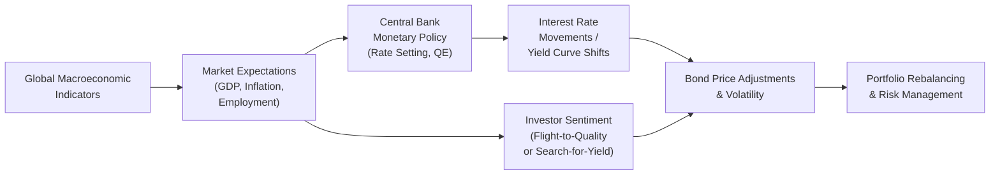

## Introduction

If you ever wondered why bond markets can sometimes feel like a roller coaster ride, well, global macroeconomic factors tend to be the hidden rails guiding the twists and turns. Whether it’s central banks announcing rate hikes, inflation data skyrocketing, or a sudden shift in employment numbers, these macro drivers directly impact bond prices and yields. I recall chatting with a colleague during one of those intense market weeks—when U.S. Federal Reserve remarks on a possible rate hike caused global bond yields to jump overnight. The excitement (and some anxiety!) in her voice was contagious. It’s precisely this interplay between the broader economy and fixed income that we’ll explore here.

## Macroeconomic Indicators and Their Influence on Bond Yields

Bond markets don’t exist in a vacuum. Every major economic indicator—GDP growth, inflation, employment, industrial production—can push yields up or down. Let’s break down some key ones:

GDP Growth. When gross domestic product (GDP) is on the rise, it often signals a strong economy. In turn, investors might anticipate higher interest rates down the line, because central banks tend to tighten monetary policy (raising rates) to keep overheating at bay. That anticipation alone can push bond prices down and yields up, as fixed-income investors demand higher returns for the perceived increased risk of inflation.

Employment Data. A surprising spike in non-farm payrolls or a drop in the unemployment rate can signal robust economic growth. In other words, markets may start pricing in a stronger economy and, consequently, higher future interest rates. As yields rise, bond prices typically fall. Conversely, weak employment data often triggers a flight toward “safer” assets like government bonds.

Inflation. Arguably one of the biggest drivers of bond prices and yields, inflation erodes the purchasing power of future bond cash flows. If inflation is expected to go up, nominal yields generally must move higher to compensate investors for that erosion. This dynamic is closely watched by all market participants, from large pension funds to individual fixed-income investors.

Trade Balances and Fiscal Health. Countries with substantial trade deficits or questionable fiscal positions must often offer higher yields to attract lenders. Moreover, as deficits climb, investors may worry about sovereign credit risk (i.e., the risk that a government may not meet its debt obligations), which increases required yield spreads.

## Central Bank Monetary Policy and Quantitative Easing

Central banks wield enormous influence over the bond market through policy rates, open market operations, and quantitative easing (QE). Let’s talk about them in plain language—no sense in overcomplicating it:

Policy Interest Rates. Central banks (like the Federal Reserve, European Central Bank, Bank of England, and others) set short-term interest rates that ripple across the entire yield curve. When rates go up, new investors can get higher yields on new issues, meaning older bonds with lower coupons become less attractive unless their prices drop.

Quantitative Easing (QE). Under QE, central banks purchase large amounts of securities—often government bonds but occasionally corporate debt or asset-backed securities—to inject liquidity into the economy. This pushes bond prices up (since the central bank is buying), and thus yields go down. When I think about the early 2010s, QE programs in the U.S. and abroad spurred notable bull runs in bond markets.

Yield Curve Dynamics. Monetary policy doesn’t just affect short-term rates. Long-term yields also shift in response to central bank guidance on future rate hikes or cuts. For a deeper discussion of yield curve theories and shapes, see the content in Chapter 7: The Term Structure of Interest Rates. Understanding yield curve movements is pivotal for effective portfolio positioning.

## Flight-to-Quality vs. Search-for-Yield

Investor sentiment can change on a dime. When the economy looks shaky—maybe due to geopolitical tensions or weak corporate earnings—investors flock to safer government bonds in a phenomenon known as “flight-to-quality.” Yields on these safer bonds tend to fall, reflecting higher demand. Think of 2008: a near-panic scenario had market participants piling into U.S. Treasuries, driving yields sharply lower.

The flip side is the “search-for-yield.” When interest rates are ultra-low, investors face severely diminished returns on traditionally safe investments (like prime government debt). This environment motivates them to explore higher yielding segments such as emerging market bonds, high-yield corporate debt, or structured products. But with higher yields come higher risks. This trade-off is something portfolio managers consider every day, especially when balancing risk and return objectives in multi-asset portfolios (see also Section 1.10: The Role of Fixed Income in Multi-Asset Portfolio Construction).

## Currency Fluctuations and Foreign Bond Attractiveness

Currencies can make or break your fixed-income strategy. A bond with an enticing 7% yield in another country is less enticing if the currency depreciates 10% against your home currency. When an investor buys foreign bonds, they also inherit that currency risk—unless they pay for hedges, like currency swaps or forward contracts.

Exchange Rate Drivers. Exchange rates are influenced by interest rate differentials among countries, inflation expectations, political stability, and overall economic health. High real interest rates (nominal rates minus inflation) can often attract foreign capital, leading to currency appreciation. By contrast, countries with sustained high inflation or political uncertainty may experience currency outflows, depressing bond prices as well.

Hedging Considerations. Professional managers often hedge currency exposure when investing in global fixed-income. However, hedging costs can vary dramatically, influenced by interest rate differentials. For instance, if you’re a U.S. investor buying euro-denominated bonds, you might set up a currency hedge that effectively “locks in” a forward exchange rate to mitigate currency risk. That hedge itself has a cost—or a benefit—depending on forward rate spreads.

## Trade Balances, Geopolitics, and Fiscal Policy

One can’t isolate bond markets from the bigger picture: trade wars, geopolitical tensions, and government fiscal expansions all shape sovereign credit risk assessments. When a government consistently runs large budget deficits, the debt load expands, and investors may demand higher yields to compensate for default or inflation risks down the road.

Geopolitical Shocks. Even rumors of political instability or a trade dispute can ignite volatility in bond markets. Market participants quickly reassess credit risk, particularly for countries with heavy reliance on foreign capital or those with precarious fiscal conditions.

Fiscal Policy. A government’s decisions on spending and taxation can be a wild card for bond investors. Large fiscal stimulus might stimulate economic growth but can also spark inflation or higher interest rates. On the other hand, austerity measures can reduce future debt levels but may also weaken short-term growth, thereby impacting bond yields.

## Inflation Expectations and Nominal Yields

When inflation expectations rise, nominal bond yields are forced to adjust because investors demand higher compensation. Let’s illustrate this idea with a simplified formula:

Let
rᵣ = real interest rate,  
πᵣ = expected inflation rate,

and the approximate nominal yield (i) can be expressed as:

i ≈ rᵣ + πᵣ

In many advanced markets, investors track breakeven inflation rates by comparing nominal Treasury yields to inflation-linked bonds (like TIPS in the U.S. or Linkers in the U.K.). If the breakeven rate spikes, it indicates rising inflation expectations, which can pressure nominal yields upward as well.

## Macroeconomic Analysis in Fixed-Income Strategy

In constructing a bond portfolio, the interplay of all these macro variables is critical. Portfolio managers often start with a top-down economic forecast: Where is the global economy headed over the next 6–12 months? That forecast guides decisions about:

• Yield Curve Positioning: Should the portfolio tilt toward short-duration bonds if interest rates are expected to rise? Or extend duration if the economy is weak and rates might fall?  
• Sector Allocation: If a central bank is easing monetary policy, corporate credit might look more attractive. But if the economy seems headed for a slowdown, maybe it’s time to overweight government bonds or defensive sectors.  
• Currency Allocation: Is the investor willing to hold unhedged foreign currency exposure, expecting potential appreciation? Or does it make sense to hedge that exposure given interest rate differentials?

The big idea is to combine macroeconomic signals with credit research and duration management into a coherent, risk-adjusted strategy. For more on credit aspects, see Chapter 9: Credit Risk and Credit Analysis, and for technical modeling, see Chapter 7 and Chapter 8: Interest Rate Risk and Return Analysis.

## Economic Releases and Bond Market Volatility

Regularly scheduled data releases—like monthly employment reports, Consumer Price Index (CPI) updates, or GDP announcements—can set off mini-earthquakes in bond markets. Traders often position themselves ahead of time, trying to guess whether the data will surprise positively or negatively.

Risk Management. More sophisticated investors hedge with interest rate futures, interest rate swaps, or options on Treasuries ahead of these releases. A surprising release can trigger large yield movements, so well-planned hedges can mitigate a portion of that volatility.

Practical Example. Picture a scenario where the market expects CPI to rise 0.2% MoM (month-over-month). If the actual figure comes in at 0.5%, that’s much higher inflation than expected, and yields might climb quickly. A short position in T-bond futures could offset potential losses in a long-only bond portfolio. Over time, these small decisions can significantly reduce overall portfolio volatility.

Below is a simple flowchart illustrating how macroeconomic factors feed into bond markets:



In this diagram, you can see how it all flows. Macroeconomic indicators drive market expectations, influencing central bank policy and investor sentiment, which then feed into yield curve positions and ultimate pricing for bonds.

## Additional Tools: A Brief Look at Simulation

While macro forecasting is more of an art than a science, quantitative approaches can help you model scenarios. For instance, you could run a Monte Carlo simulation (discussed further in Chapter 6: Bond Pricing and Valuation Basics) using Python to generate random paths for GDP growth and inflation, see how yields might evolve, and then apply a risk model to gauge the potential impact on your bond portfolio.

Below is a mini Python snippet that shows a simplistic approach to generating random inflation rates and seeing how they might affect nominal yields:

```python
import numpy as np

np.random.seed(42)  # for reproducibility

real_rate = 0.02  # 2% real rate
inflation_mean = 0.03  # average 3% inflation
inflation_std = 0.01   # std dev of 1%
num_scenarios = 5

for i in range(num_scenarios):
    inflation_scenario = np.random.normal(inflation_mean, inflation_std)
    nominal_yield = real_rate + inflation_scenario
    print(f"Scenario {i+1}: Inflation = {inflation_scenario:.2%}, Nominal Yield = {nominal_yield:.2%}")
```

While this example is simplistic (real-world models can be much more complex and use correlations among economic factors), it illustrates the process of combining real interest rates with random draws for inflation expectations.

## Exam Tips and Best Practices

For exam scenarios—whether for the CFA Program or other professional designations—you’ll often encounter item sets presenting you with macroeconomic data, central bank statements, and yield curve snapshots. Here are some best practices:

• Focus on Key Economic Indicators: They love to test your ability to interpret GDP, inflation, and employment data in the context of bond market implications.  
• Understand Transmission Mechanisms: Know how changes in policy rates filter through to bond yields and how currency fluctuations might alter investment decisions.  
• Practice Scenario Analysis: Be prepared to run through quick mental (or written) “if-then” statements—e.g., if inflation is higher than forecast, yields are likely to rise, and bond prices fall, unless... (flight-to-quality conditions, etc.).  
• Integrate Credit View: Sometimes the question will focus not just on interest rates but also on credit spreads or sovereign risk.  
• Time Management: In an exam, reading through macro data and swiftly identifying the relevant bond market impact is crucial. Don’t get bogged down with extraneous details.

## Glossary

Monetary Policy. Central bank actions (e.g., setting policy interest rates) to influence the cost and availability of money in the economy.  
Quantitative Easing (QE). A policy where central banks purchase securities (often government bonds) to inject liquidity, reduce yields, and stimulate economic activity.  
Flight-to-Quality. A phenomenon where investors move their capital from riskier assets to safer assets (e.g., government bonds) during periods of market turbulence.  
Search-for-Yield. A trend in which investors gravitate toward higher-yielding bonds—often riskier—when rates on safe assets are extremely low.  
Sovereign Credit Risk. The risk that a national government might default on its debt, influenced by its fiscal and political stability.  
Inflation Expectations. The market’s perception of future inflation, which significantly affects nominal bond yields.  
Economic Cycle. The fluctuation between periods of growth (expansion) and slowdown (recession) in an economy.  
Fiscal Policy. Government decisions regarding spending and taxation that shape economic growth and debt levels.

## References and Further Reading

• “Fixed Income Analysis” by Barbara S. Petitt (CFA Institute Investment Series).  
• International Monetary Fund (IMF) World Economic Outlook reports: <https://www.imf.org/>  
• “The Handbook of Global Fixed Income Calculations” by Dragomir Krgin.  

Also, remember to check out the relevant sections in this volume for deeper dives into yield curves (Chapter 7) and interest rate risk management (Chapter 8), as well as real-case scenarios in credit markets (Chapter 9).

## Test Your Knowledge: Macroeconomic Drivers of Fixed-Income Markets



### Which macroeconomic indicator typically has the most direct influence on nominal bond yields?

- [ ] GDP growth
- [ ] Employment data
- [x] Inflation expectations
- [ ] Trade balance

> **Explanation:** Although GDP growth, employment data, and trade balances are important, inflation expectations often have a direct impact on nominal yields since they reflect the expected real return and purchasing power of future cash flows.

### When a central bank embarks on a quantitative easing program, what is the usual immediate effect on bond prices and yields?

- [x] Bond prices typically increase, and yields decrease
- [ ] Bond prices typically decrease, and yields increase
- [ ] No effect on bond prices and yields
- [ ] Bond prices become more volatile, with no clear yield direction

> **Explanation:** In a QE program, the central bank buys large quantities of bonds, increasing demand and pushing bond prices up. Higher prices translate into lower yields.

### The term “flight-to-quality” describes which of the following market behaviors?

- [x] A shift of capital from riskier assets to safer assets
- [ ] A rise in capital flows into emerging markets
- [ ] Allocating more capital to high-yield bonds
- [ ] Moving funds into commodity-based derivatives

> **Explanation:** During times of uncertainty or crisis, investors tend to reduce exposure to risky assets and buy safer ones, like Treasury securities. This is known as flight-to-quality, often leading to lower yields on government bonds.

### If a country’s currency is expected to depreciate significantly, how might this affect the demand for its government bonds from international investors?

- [x] Demand would likely decrease due to expected foreign exchange losses
- [ ] Demand would increase due to higher coupon rates
- [ ] Demand would remain unchanged as currency risk is fully hedged
- [ ] It has no effect on government bond demand

> **Explanation:** Currency depreciation can erode the value of bond coupon payments for foreign investors, making the bonds less attractive unless hedged. Even with hedging, the additional cost may still discourage investment.

### Which statement is true regarding the impact of fiscal policy on sovereign bond yields?

- [x] Large budget deficits can increase sovereign yields due to higher perceived risk and supply
- [ ] Large budget deficits always reduce bond yields because of economic stimulus
- [x] Reduced government spending can sometimes lower yield spreads if default risk is perceived as lower
- [ ] Fiscal policy has minimal impact on bond yields

> **Explanation:** Large government deficits often require more borrowing, which can push yields higher if investors demand a premium for potential default/inflation risk. Conversely, if prudent measures reduce deficits, yields can drop.

### What is the likely outcome if a major economic report (e.g., employment data) significantly underperforms market expectations?

- [x] Investors may bid up the prices of safe-haven bonds, pushing yields lower
- [ ] Investors may sell safe-haven bonds, pushing yields higher
- [ ] Corporate bond prices will automatically fall
- [ ] Central banks always hike interest rates immediately

> **Explanation:** Weak economic data often prompts a flight-to-safety that boosts demand for government bonds, lowering their yields. Other outcomes depend on policy actions, which are not always immediate or guaranteed.

### How does an unexpected rise in inflation typically affect existing fixed-coupon bond prices?

- [x] Prices fall because the fixed coupon becomes less attractive in real terms
- [ ] Prices rise because yields must adjust
- [x] Prices remain unchanged due to bond indenture agreements
- [ ] Prices rise because investors prefer the certainty of fixed coupons

> **Explanation:** If inflation rises beyond expectations, the real value of fixed coupon payments declines, causing existing bonds to be less attractive unless their prices adjust downward.

### Why might an investor choose to hedge currency exposure when investing in foreign bonds?

- [x] To reduce the risk of exchange rate fluctuations
- [ ] To maximize foreign-currency gains
- [ ] To avoid changes in sovereign credit risk
- [ ] To eliminate all interest rate risk

> **Explanation:** Currency hedging is primarily geared toward mitigating foreign exchange fluctuations rather than eliminating sovereign or interest rate risk.

### Which of the following best describes the “search-for-yield” phenomenon?

- [x] Investors move into higher-yielding, often riskier bond segments when interest rates are very low
- [ ] Investors purchase only inflation-protected bonds
- [ ] Central banks intervene heavily to buy high-yield issues
- [ ] Investors avoid corporate credit entirely in favor of government debt

> **Explanation:** In low-interest-rate environments, investors seek to improve returns by venturing into riskier or higher-yielding fixed-income segments.

### True or False: A steepening yield curve generally indicates that investors expect lower future interest rates.

- [x] True
- [ ] False

> **Explanation:** A steepening yield curve can result from shorter-term rates dropping or long-term rates rising, often reflecting an expectation of weaker economic conditions ahead and the anticipation that central banks might cut rates.


