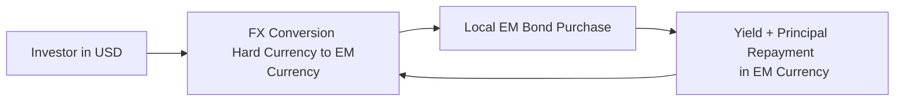

## Overview

Emerging markets (EMs) can seem quite appealing if you’re looking for higher yields. I remember the first time I seriously considered investing in EM bonds: the yields were so much higher than those of developed-market Treasuries that I actually got a little suspicious. Turns out, those higher coupons often come bundled with heightened credit risk, currency volatility, and the possibility of unexpected political events.

Despite that extra layer of uncertainty, EM bonds have become a popular fixture in many global portfolios—especially among those willing to tolerate more risk in exchange for potentially higher returns. These securities typically come from jurisdictions that are still on their way to becoming fully developed, but they can offer a layer of diversification since their economic cycles aren’t always closely synced with, say, the U.S. or European markets. Let’s walk through how EM sovereign and corporate bonds work, how currency exposure can affect your bottom line, and what it really means when we talk about liquidity issues in these markets.

## Sovereign vs. Corporate Emerging Market Debt

One key distinction in emerging market debt is whether you’re looking at sovereign bonds—those issued by governments—or corporate bonds, issued by companies based in these markets.

### Growth of EM Corporate Issuance
There’s been a notable shift over the past decade: EM corporate issuance has grown pretty fast. Historically, most investors focusing on EM debt only considered sovereign issuers, partly because corporate markets were less developed. But now, many EM corporations have sought funding on global capital markets. While this offers a richer set of opportunities, it also means analyzing both corporate and country-level risks (e.g., the sovereign ceiling, which suggests a corporate entity is typically rated no higher than its home-country government).

### Unique Risks
• Sovereign Debt: Often influenced by national politics, central bank policy, and international relationships. When you invest in, say, a Brazilian or Indonesian government bond, you’re wagering that the national government will manage its finances responsibly and avoid a default.  
• Corporate Debt: You layer typical corporate risks on top of the innate risks of the host country. This can include weaker corporate governance standards, less transparency, and difficulties in legal recourse when companies run into trouble.

## Hard Currency vs. Local Currency Bonds

A second key classification in emerging market debt is whether you’re holding bonds denominated in a “hard” (or external) currency, such as U.S. dollars or euros, or whether the bonds are in the issuer’s local currency. Both categories have some interesting pros and cons.

| Feature                              | Hard Currency (External) Debt                           | Local Currency Debt                            |
|--------------------------------------|----------------------------------------------------------|------------------------------------------------|
| Currency Exposure                    | Minimal FX exposure if your base currency matches hard currency, though still subject to broader default risk. | Significant FX exposure; if your base currency differs from the issuer’s, you face exchange rate fluctuations. |
| Yield Levels                         | Typically lower relative to local currency bonds, but still higher than developed-market sovereigns. | Often higher yields to compensate for added currency risk.              |
| Liquidity                            | Often more liquid because U.S. dollar- or euro-denominated bonds can trade widely among global investors. | May be less liquid; depends on local market sophistication and capital controls. |
| Credit Risk                          | Sovereign or corporate credit risk remains, but currency mismatch can be less of a concern for the issuer if they have stable foreign cash flows. | Issuers with local revenues may reduce mismatch risk, but foreign investors are fully exposed to exchange rate swings. |
| Availability of Hedging             | More common derivatives markets for USD/EUR hedging.     | Less developed, though some local currency futures/swaps exist in major EMs.      |

### Currency Risk Calculation Example

If you’re calculating total returns, you need to account for both the bond’s yield and the exchange rate movement of the EM currency relative to your home currency. A simple approximation of an investment’s total return (R_total) can be expressed as:

$$
R_\text{total} = \bigl(1 + r_\text{bond}\bigr)\times \bigl(1 + r_\text{fx}\bigr) - 1
$$

Where:
• \\( r_\text{bond} \\) = the bond’s return in its local currency terms (coupon plus price appreciation/depreciation).  
• \\( r_\text{fx} \\) = the percentage change in the local currency against your home currency.

If the local currency depreciates, it can significantly reduce (or even negate) your bond returns in your base currency—so that’s a big reason why some investors prefer USD- or EUR-denominated EM debt.

## Risk Drivers in EM Debt

### Credit Risk
Emerging market governments and firms often exhibit higher credit risk. Sovereign credit analysis typically focuses on:
• Fiscal discipline and budget balance.  
• Adequacy of foreign exchange reserves.  
• Overall growth forecasts.  
• Political stability.

When analyzing corporate debt, you have to consider traditional credit metrics (e.g., leverage, coverage ratios), but also whether the government’s credit rating might put a ceiling on the corporate’s rating. If a country is approaching a crisis, it’s rare for a firm to maintain a much higher rating than its sovereign.

### Political and Regulatory Risk
EMs may experience abrupt policy changes—like imposing capital controls or altering corporate tax rules—that can directly affect bondholders. Political transitions sometimes happen more abruptly compared to developed markets. I still remember the jolt the markets had when a certain EM country suddenly changed leadership a few years ago, and new policies spooked foreign investors practically overnight.

### Currency Volatility
One hallmark of EM investing is that their central banks often have more limited tools to stabilize their currencies, or face big domestic political pressures that hamper monetary policy. Result: sharp moves in exchange rates, which can dominate your bond returns. 

### Liquidity Constraints
EM debt often becomes less liquid in times of global stress—the so-called “risk-off” environment. Foreign investors may rush to exit the market, local banks might not have enough capacity to absorb the selling, and you can see huge price swings. Bid-ask spreads widen, too. So if you think you might need to sell on short notice, you should keep an eye on these liquidity dynamics.

## Mermaid Diagram of EM Bond Investment Flow

Below is a simplified illustration of how foreign investors might purchase local currency debt, expose themselves to FX risk, and then receive payments in that local currency.

In reality, this process can get more complicated, especially if you layer on forward FX contracts, cross-currency swaps, or other hedging tools.

## Evaluating EM Sovereigns

Sovereign bond analysis requires a top-down approach:

• Macroeconomic Indicators: GDP growth, inflation trends, current account, and fiscal deficits.  
• External Vulnerability: Volume of foreign exchange reserves relative to short-term external debt.  
• Political Environment: Government stability, likelihood of policy continuity, and track record with external creditors.  
• Timing of Issuance: Some EMs might issue more debt when global rates are low, only to face burdensome refinancing risks later.

The IMF and World Bank often publish research on debt sustainability. Their frameworks can be a great resource if you’re analyzing a sovereign issuer, particularly if you’re uncertain about currency exposures or the size of the country’s import bills.

## Capital Controls and Repatriation Issues

Don’t forget about capital controls. Some EM governments set restrictions on capital inflows, outflows, or both. These measures:
• Can reduce liquidity and make it harder for foreign investors to pull out.  
• Sometimes aim to protect local currency stability.  
• May create operational complexities in repatriating proceeds or coupons.  

If a government is short on foreign currency reserves, they might delay or limit repatriation of capital, effectively trapping your proceeds in local currency for an extended period.

## Currency Hedging and Diversification

Managing FX exposure is a major part of investing in local currency EM bonds. You can try:
• Currency Forwards or Futures: Contracts that lock in your exchange rate for a future date.  
• Cross-Currency Swaps: Swapping principal and interest payments in one currency for another.  
• Natural Hedges: Diversifying across multiple EM currencies that hopefully aren’t all correlated.

Of course, hedging introduces its own costs and complexities, often eating into yield advantages. But in cases of a severe currency drop, a well-thought-out hedge can provide a lifeline.

## Market Liquidity and Valuation

EM bond pricing can vary widely. Some markets use fewer transparent benchmarks. Index providers—like J.P. Morgan with their Emerging Market Bond Index (EMBI)—publish how they weight certain bonds, and many global Asset Managers track these indexes. Yet the same bond might trade at different prices across different venues, meaning you can see some price fragmentation, especially in onshore vs. offshore markets.

## Practical Example: Frontier Market vs. Established EM

Let’s say you have two countries:

• Country A (established EM) with decent global integration, small fiscal deficit, and inflation under control. You might see moderate yields and better liquidity there.  
• Country B (frontier market) newly issuing international bonds, limited foreign reserves, and some capital controls in place. Potential yields are double-digit, but liquidity is poor and political tensions are on the rise.

The choice between these markets depends on your portfolio’s risk appetite and how comfortable you are analyzing local conditions. Selling the bond from Country B could get tricky if the market starts to panic, even though the yield is tempting.

## Concluding Remarks and Exam Tips

Emerging market debt remains an exciting corner of fixed income but can be quite challenging when global conditions turn sour. Always keep your eyes open for currency movements, political risk, and regulatory uncertainties. Maybe you can’t predict every twist and turn, but thorough credit analysis and an understanding of local markets go a long way. 

From an exam standpoint, remember to:
• Differentiate the risk-return trade-offs between sovereign vs. corporate EM debt.  
• Understand the mechanics and implications of hard vs. local currency debt and how to quantify FX effects.  
• Incorporate capital controls and illiquidity into your valuation or scenario analysis.  
• Review how central bank policies (or the lack thereof) can amplify market volatility.  

These topics often come up in scenario-based exam questions: expect to see vignettes describing, for example, an EM sovereign, its macro environment, currency management strategy, or a corporate issuer tapping international markets. Be comfortable explaining how a disruption in currency markets or fresh capital controls might affect bond valuations.

## Glossary

• **Emerging Market (EM):** Economies in the process of rapid industrialization and growth but not yet classified as developed.  
• **Hard Currency Debt:** Bonds issued in stable, major currencies (e.g., USD, EUR) that may reduce currency risk for international investors.  
• **Local Currency Debt:** Bonds denominated in the issuer’s own currency, exposing international investors to FX fluctuations.  
• **FX Risk (Currency Risk):** The potential for investment returns to be affected by changes in exchange rates.  
• **Capital Controls:** Restrictions imposed by governments on the flow of capital in and out of a country.  
• **Political Risk:** The risk of unexpected changes in policy, leadership, or stability that adversely affect investments.  
• **Sovereign Ceiling:** The idea that a corporate or other issuer generally cannot have a credit rating higher than its home-country government.  
• **Reserves:** Foreign currency holdings by a central bank to help stabilize its currency and provide liquidity in times of stress.

## References

• J.P. Morgan Emerging Market Bond Index methodology guides:  
  <https://www.jpmorgan.com/>  
• Booth, Jerome. “Emerging Markets in an Upside Down World.” Palgrave Macmillan, 2014.  
• IMF and World Bank research papers on EM debt sustainability:  
  <https://www.worldbank.org/>  

## Test Your Knowledge: Emerging Market Debt & Currency Risk Quiz



### Which of the following best explains why local-currency EM bonds generally offer higher yields than hard-currency EM bonds?

- [ ] Local-currency debt is always safer than hard-currency debt.
- [x] Local-currency debt exposes foreign investors to additional FX risk.
- [ ] Hard-currency debt is subject to higher tax obligations, increasing costs.
- [ ] FX fluctuations in hard-currency debt are typically more severe.

> **Explanation:** Local-currency bonds add currency exposure for international investors, so yields tend to be higher to compensate for that extra risk.

---

### An EM corporate bond typically cannot have a credit rating exceeding the rating of its sovereign. What is this concept called?

- [ ] FX Risk
- [ ] Leverage Cap
- [ ] Capital Control
- [x] Sovereign Ceiling

> **Explanation:** The sovereign ceiling means that a corporate entity usually cannot be rated above the government’s rating, reflecting the view that the government’s credit risk underpins the overall environment in which corporates operate.

---

### A foreign investor buys a local currency EM bond offering 8% yield. During the holding period, the EM currency depreciates by 5% against the investor’s base currency. Approximate total return in the investor’s base currency is:

- [ ] 8%
- [ ] -5%
- [x] 2.6%
- [ ] 13%

> **Explanation:** Using the rough formula R_total ≈ (1 + 0.08)(1 – 0.05) – 1 = 1.08 × 0.95 – 1 ≈ 0.026, or 2.6%.

---

### Which of the following factors can significantly affect the liquidity of EM bonds during a global market sell-off?

- [x] Risk aversion driving foreign investors to exit quickly.
- [ ] Increased frequency of coupon payments.
- [ ] Enhanced transparency in EM bond markets.
- [ ] Bond maturity extension by foreign regulators.

> **Explanation:** In a risk-off environment, foreign investors may rapidly exit EM positions, leading to a lack of local buyers and reduced overall liquidity.

---

### Which statement is most accurate regarding EM sovereign vs. EM corporate debt?

- [x] Corporate debt involves both corporate credit risk and the sovereign’s macroeconomic environment.
- [ ] Sovereign bonds are always riskier than corporate bonds in EMs.
- [ ] Corporate bonds typically have no exposure to political risk.
- [ ] Sovereign rating downgrades never affect corporate bonds in EMs.

> **Explanation:** EM corporate bondholders face the company’s credit risk plus the broader sovereign environment (e.g., sovereign rating could act as a ceiling).

---

### An EM central bank with limited foreign currency reserves is more likely to:

- [x] Impose capital controls under severe currency pressure.
- [ ] Provide unlimited liquidity in hard currency to local banks.
- [ ] Have no impact on bond prices or yields.
- [ ] Maintain a permanently fixed exchange rate.

> **Explanation:** A shortage of reserves can prompt restrictive measures, such as capital controls, to protect the local currency.

---

### What is a key consideration for investors analyzing local currency EM bonds?

- [x] The volatility of the currency relative to their home currency.
- [ ] Guaranteed hedging from the issuer.
- [x] Availability of cross-currency swaps.
- [ ] No difference in total returns compared to hard-currency bonds.

> **Explanation:** Investors should watch the exchange rate volatility and explore whether hedging instruments, such as cross-currency swaps, are available and cost-effective.

---

### Which of the following statements about capital controls is correct?

- [ ] They have no impact on foreign investors.
- [ ] They are universally prohibited by global regulators.
- [x] They may restrict the repatriation of investment proceeds.
- [ ] They entirely eliminate FX risk.

> **Explanation:** Capital controls can limit the ability of foreign investors to withdraw or reinvest funds, influencing liquidity and investment strategy.

---

### In analyzing an EM sovereign issuer, which factor would most likely NOT be a primary focus?

- [ ] Political stability.
- [ ] Size and composition of foreign reserves.
- [ ] Growth forecast and fiscal discipline.
- [x] Issuer’s product pipeline of new commercial products.

> **Explanation:** While a product pipeline might be relevant to corporate analysis, sovereign analysis centers on macro-level indicators such as reserves, deficits, and governance.

---

### True or False: Emerging market debt can help diversify a global portfolio, but currency and political risks can significantly impact realized returns.

- [x] True
- [ ] False

> **Explanation:** EM debt often has a low correlation with certain developed markets, aiding diversification. However, investors face currency volatility, political instability, and regulatory changes that can materially affect performance.




