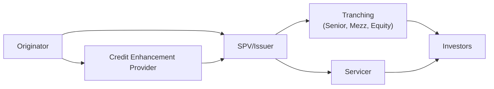

## Overview

I remember the first time I heard the word “securitization.” I was sitting in a conference room feeling, well, a bit dazzled. The instructor rattled off terms like “bankruptcy remote,” “SPV,” and “credit enhancements.” At first, it honestly felt like a wave of complicated jargon that was probably best left to mega-sized banks and rocket-scientist financiers. Then, as I dug a little deeper, I realized securitization is essentially the process of transforming a bunch of loans or receivables—like mortgages, auto loans, or credit card debts—into marketable securities. In other words, it’s about turning piles of cash-flow-producing assets into tradable bonds.

Securitization remains a core topic in fixed-income markets, and indeed it is central to the CFA® Program. For Level III candidates, understanding how securitization works—and why it can dramatically shift the risk/return profiles of an investment portfolio—becomes increasingly important. This section provides a structured look at those mechanics, the key players involved, and the typical financial flows. You’ll also encounter common pitfalls, best practices in analysis, and real-world examples that can help you lock down the essentials when preparing for the exam.

## Key Concepts in Securitization

Before we jump into each participant and the more advanced intricacies, let’s outline the high-level goals and motivations behind securitization:

• Liquidity Improvement: Banks and finance companies (collectively known as “originators”) can convert relatively illiquid assets (like mortgage loans) into tradable securities. This frees up capital for new lending, thus stimulating broader credit availability in economies.

• Risk Distribution: By packaging and selling securitized instruments to investors across the globe, originators effectively spread the underlying credit (and sometimes interest rate) risk. This can reduce the concentration risk traditionally borne by banks.

• Investor Choice: Securitizations often feature multiple “tranches,” each sporting a unique combination of risk, maturity profile, and yield. Investors can thus pick the slice that matches their risk appetite, from a senior (lower risk, lower yield) tranche to an equity (higher risk, higher yield) tranche.

• Bankruptcy Remoteness: Typically, assets are moved into a separate legal entity—a special purpose vehicle (SPV)—to protect them from an originator’s bankruptcy. If the originator defaults or goes bankrupt, the assets in the SPV remain separate and continue paying principal and interest to investors.

## Typical Securitization Flow

To visualize the securitization process, let’s take a quick look at a standard diagram. The following Mermaid.js chart shows how assets move from the originator into the SPV, how various participants come into play, and how money flows to investors:

• The Originator identifies a pool of assets (e.g., residential mortgages).  
• The SPV/issuer purchases those assets and issues securities backed by the asset cash flows.  
• The Servicer collects payments and manages day-to-day details.  
• Credit Enhancement Providers may offer guarantees, reserve funds, or other forms of support.  
• The SPV issues hyper-structured tranches that get sold to Investors, each tranche carrying distinct risk/return features.

## Parties Involved in a Securitization

### Originator

The originator is typically a bank, financial institution, or other entity that creates or “owns” the underlying assets, such as mortgage loans, auto loans, credit card receivables, or business loans. Let’s say you walk into a bank, sign up for a mortgage, and start making monthly payments. Your bank could “pool” your mortgage with hundreds or thousands of others and sell the entire pool to the SPV. Doing so generates immediate cash proceeds for the bank.  

• Motivation: Often, originators use securitization to free up their balance sheets, reduce capital requirements, and gain liquidity.  
• Risks: If the securitization is poorly structured, or if representations and warranties provided by the originator are insufficient, the risk can come back to haunt them (e.g., potential lawsuits from investors if underlying asset quality is misstated).

### Special Purpose Vehicle (SPV) or Issuer

The SPV—sometimes called a special purpose entity (SPE)—is created just for this deal. It is “bankruptcy remote,” meaning its assets are legally separated from the originator’s general business operations. This structure ensures that if the originator goes bankrupt, creditors of the originator cannot easily claw back the assets that have already been transferred to the SPV.

• Legal Protection: The SPV typically has its own governance, minimal employees, or is managed by a trustee.  
• Issuing Securities: The SPV or trust issues multiple classes (tranches) of securities to investors, each differentiated by creditworthiness, repayment priority, and maturity.

### Servicer

Even though the SPV legally owns the assets, someone still needs to manage them. Here’s where the servicer steps in.

• Responsibilities: Collect monthly payments (e.g., mortgage principal and interest), track delinquencies, handle foreclosures when necessary, and disburse collected funds to the SPV.  
• Relationship to Originator: Often, the originator continues to service the loans (especially in mortgage-backed securities) because it has the infrastructure in place to handle billing and collections.

### Credit Enhancement Provider

Securitizations often rely on various forms of credit enhancement to make their securities look more attractive to investors. The main categories of credit enhancement are:

• Internal Credit Enhancement: Tranching (subordination structure), overcollateralization, excess spread, etc.  
• External Credit Enhancement: Insurance or guarantees from monoline insurers (historically), letters of credit, or third-party wraps.  

A typical example might involve a senior/subordinated structure in which the subordinated tranche absorbs credit losses first, thus protecting the senior tranche from default risk up to a certain limit. Alternatively, a specialized insurance provider might step in with a partial guarantee, covering specific losses.

### Trustees

The trustee acts on behalf of investors to ensure that the securitization documents are followed to the letter. If the servicer or other parties fail to meet obligations, the trustee can step in to enforce remedies. While the trustee’s role may seem passive, it is critical, especially in times of stress or when there are potential conflicts of interest.

### Rating Agencies

The rating agencies (e.g., Moody’s, S&P, Fitch) evaluate the risk of the securitization structure, particularly the likelihood of timely principal and interest payments for each tranche. They focus on the underlying collateral quality, the proposed credit enhancements, the track record and reputation of the originator, and the legal structure.  

• Impact on Investor Demand: Higher-rated tranches attract more conservative investors (such as pension funds or insurance companies), while lower-rated tranches may suit hedge funds or other risk-tolerant investors.  
• Methodology: Agencies examine not just credit metrics but also legal aspects and operational features. They might also stress-test the portfolio under adverse scenarios (like spikes in default rates).

## Bankruptcy Remoteness Explained

One of the central reasons for the SPV is to insulate the asset pool from the credit risk posed by the originator. If the originator winds up in bankruptcy court, the pool of assets in the SPV should, in theory, keep churning out cash flows to investors without being frozen or seized. This concept hinges on the “true sale” of assets to the SPV. In many jurisdictions, that requires specific legal opinions and structuring to ensure that courts view the transfer of assets as final and absolute, rather than as a mere pledge.

• Legal True Sale Tests: Typically revolve around whether the transfer meets all “true sale” requirements under relevant contract law.  
• Investor Confidence: Bankruptcy remoteness is pivotal for maintaining investor confidence. Without it, the bonds’ ratings could be significantly downgraded.

## Cash Flow Allocation and the “Waterfall”

Once assets are in the SPV, the servicer collects principal and interest, which is then distributed to investors according to payment priority rules, often referred to as the “waterfall.” The waterfall usually proceeds from senior tranches down to mezzanine and then equity tranches:

• Senior Tranche: Gets paid first, before any other class. Usually has the highest credit rating and the lowest yield.  
• Mezzanine Tranche: Sits in the middle. This tranche typically only receives payments after senior obligations have been fully met.  
• Equity (or Residual) Tranche: Absorbs losses first if defaults occur, but often receives any remaining excess spread or residual cash flows if everything goes smoothly.

## Role of Representations and Warranties

In many securitization deals, the originator provides representations and warranties to the SPV (and, by extension, to investors) about the quality of the pooled assets. For instance, a mortgage originator might guarantee that no loan in the pool has any undisclosed delinquencies or misrepresentations. If these representations turn out to be false, the originator may be required to repurchase or “make whole” the defective asset. This repurchase requirement serves as an additional layer of quality control.

## Evaluating Securitized Instruments

From a CFA Level III standpoint—especially in advanced fixed-income portfolio management—analysis of securitized products frequently involves:

• Collateral Analysis: Loan-level data, such as borrower credit scores, loan-to-value (LTV) ratios, seasoning (how long loans have been outstanding), etc.  
• Structural Analysis: How is the deal organized in terms of tranches, waterfalls, triggers, and early amortization provisions?  
• Legal/Regulatory Framework: Are there any differences under IFRS vs. US GAAP that might impact how the assets are carried on the balance sheet? Is there any region-specific legislation that alters the redemption, taxation, or investor protection aspects?  
• Market Liquidity: Some securitized products, like prime mortgage-backed securities in the United States, tend to be liquid. Others, such as certain tranches of collateralized loan obligations (CLOs), might be less liquid and thus carry higher trading costs.

## Practical Example

Imagine you run a small finance company that originates auto loans. Over the past year, you have $100 million worth of auto loans earning an average interest rate of 8%. You might securitize these loans by transferring them to an SPV. The SPV issues three tranches:

• Senior AAA Tranche: 70% of total deal, offered at a yield of 5%.  
• Mezzanine BBB Tranche: 20% of total deal, offered at a yield of 7%.  
• Equity Tranche: 10% of total deal, offered with no fixed coupon but with potential for higher returns if loan defaults remain below a certain threshold.

Investors buy these tranches because they each get a different risk/return profile. Meanwhile, your finance company receives the $100 million proceeds (minus transaction costs) to fund new auto loans or meet other needs. As borrowers make their monthly payments, the cash flows first satisfy the senior tranche interest and principal, then the mezzanine, and finally the equity portion.

## Real-World Applications and Lessons

• Mortgages: Residential mortgage-backed securities (RMBS) and commercial mortgage-backed securities (CMBS) remain some of the largest securitization markets.  
• Consumer Finance: Credit card receivables, auto loans, and student loans are frequently securitized.  
• Future Flow Transactions: Emerging markets sometimes use future flow securitizations (e.g., future credit card receipts, oil shipments) to secure funding at relatively attractive rates.  
• Green Securitizations: Recent years have seen a rise in environmentally oriented securitizations—where the underlying collateral or project is sustainability-related. These structures can attract ESG-focused investors and possibly benefit from certain regulatory incentives.

## Common Pitfalls

1. Overreliance on Ratings: A big lesson from the 2008 financial crisis was that investors relying solely on external ratings can be blindsided if the underlying collateral performs worse than rating agencies assumed.  
2. Complexity Risk: The more complex the waterfall, the harder it is to predict exactly how changes in default rates, prepayments, or recoveries flow through to each tranche.  
3. Legal Uncertainties: If the asset transfer to the SPV is not a “true sale,” or if there is some question about the originator’s solvency, then bankruptcy remoteness might fail.  
4. Servicer Performance: A poor servicer can harm the quality of cash flow collection and ultimately degrade returns to investors.

## Best Practices for Analysis

• Stress Testing: Conduct robust scenario analyses, modeling a variety of default rates, prepayment speeds, and recovery assumptions.  
• Collateral Stratification: Break out loan pools into sub-segments by borrower FICO scores, geographic location, or LTV ratios. This deeper look can provide early clues about potential problem areas.  
• Monitor Ongoing Performance: Even after investing, track monthly or quarterly servicer reports, watch for changes in the underlying collateral, and keep an eye on macroeconomic variables (like unemployment, property values, or interest rates).  
• Understand the Legal Framework: Distinctions in IFRS vs. US GAAP can influence how these securities appear on corporate balance sheets, which in turn can affect capital ratios and pricing.

## Exam Relevance

Candidates at Level III are expected to understand how securitized products fit into a broader portfolio context, including asset allocation decisions, risk budgeting, and scenario analysis. Exam questions often require:

• Calculating and interpreting various metrics, such as yield, duration, or projected cash flows under different prepayment assumptions.  
• Integrating securitized products into liability-driven investing strategies or assessing them in the context of immunizing certain liability streams.  
• Evaluating the effect of credit enhancements, tranching, and the legal structure on final investor returns.  
• Identifying potential red flags in offer documents, especially in terms of representation and warranty clauses.

So, if the exam question offers a scenario of two similar MBS tranches with different seasoning, you may have to evaluate prepayment risk or credit performance to figure out which provides the stronger risk-adjusted return.

## Conclusion

Securitization has become an essential part of modern capital markets, offering a blend of liquidity benefits, risk distribution, and targeted investing opportunities. Originators gain alternative funding and offload credit risk, while investors pick tranches that match their appetite. Understanding each participant’s role—especially the originator, SPV, servicer, and credit enhancement provider—helps you analyze potential risks and rewards more thoroughly.

If there’s one key takeaway, it’s that securitization isn’t inherently good or bad; it’s simply a powerful financial tool. Properly structured deals can add value to both originators and investors. Improperly designed ones, however, can lead to hidden risks that reveal themselves only under stress. Why does this matter for Level III candidates? Because whether you’re constructing advanced fixed-income portfolios or evaluating risk exposures in a multi-asset context, securitized debt instruments can play a crucial role in yield enhancement, diversification, and risk management.

## References

• Fabozzi, F. J. (Ed.). (2012). The Handbook of Mortgage-Backed Securities. New York: Oxford University Press.  
• CFA Institute. (2023). “Fixed-Income Securitization” in CFA Program Curriculum, Level I.  
• Jobst, A. (2008). “What is Securitization?” IMF Publication. https://www.imf.org/external/pubs/ft/fandd/2008/09/jobst.htm  

--------------------------------------------------------------------------------

## Securitization Mechanics Mastery Quiz



### Which of the following statements best describes securitization?

- [ ] It is the process by which bonds are transformed into equities.
- [x] It is the process of pooling and repackaging illiquid assets into marketable securities.
- [ ] It is the direct issuance of shares through a public offering.
- [ ] It is the technique of leveraging derivatives to hedge exchange rate risk.

> **Explanation:** Securitization involves pooling a set of assets (like loans) and issuing tradable bonds backed by their cash flows.

### Which participant is primarily responsible for collecting loan payments and managing delinquencies in a securitization?

- [ ] The originator
- [ ] The special purpose vehicle
- [x] The servicer
- [ ] The rating agency

> **Explanation:** The servicer collects the monthly payments, deals with delinquent accounts, and efficiently channels funds to investors.

### In a typical securitization, what is the main motivation behind creating a special purpose vehicle (SPV)?

- [x] To isolate the pool of assets from the originator’s bankruptcy risk.
- [ ] To raise the credit rating of the entire transaction artificially.
- [ ] To ensure that no tranches are offered to institutional investors.
- [ ] To expedite early repayment of the securities if defaults rise.

> **Explanation:** The SPV is a bankruptcy-remote entity, ensuring that potential bankruptcy by the originator does not impair the assets sold to the vehicle.

### What is meant by the term “waterfall” in securitization?

- [ ] The government-level screening process for evaluating securitized transactions.
- [x] The hierarchical order in which available cash flows are applied to different tranches.
- [ ] The subscription period in which investors sign up for bonds.
- [ ] The process of disposing of loan collateral in foreclosure events.

> **Explanation:** A waterfall outlines how interest and principal payments are allocated among tranches in different priority levels.

### In internal credit enhancement, which method specifically involves issuing multiple tranches of bonds—such as senior, mezzanine, and equity?

- [ ] Excess spread
- [x] Subordination
- [ ] Letter of credit
- [ ] Overcollateralization

> **Explanation:** Subordination is achieved through tranching, where losses are allocated from the bottom tranche up.

### If an economic downturn causes defaults in the underlying assets, which tranche typically absorbs the first losses?

- [ ] The senior AAA-rated tranche
- [x] The equity or first-loss piece
- [ ] The mezzanine BBB-rated tranche
- [ ] All tranches share losses equally

> **Explanation:** The equity or first-loss tranche takes the initial hit, preserving principal for more senior tranches.

### When rating agencies evaluate securitized instruments, which factor do they most closely scrutinize?

- [x] The collateral quality and the historical performance of similar asset pools
- [ ] The marketing tactics used to sell the tranches
- [ ] The personal credit history of the originator’s CEO
- [ ] The bondholders’ equity positions in any external companies

> **Explanation:** Ratings hinge on analyzing underlying collateral performance, structure, and track record—rather than extraneous factors like personal credit of executives.

### Which of the following is a potential risk if the “true sale” of assets to the SPV is not properly established?

- [x] The assets might be deemed part of the originator’s estate if it declares bankruptcy.
- [ ] The SPV would automatically convert the securitization back into a direct lending program.
- [ ] Investors would be entitled to unlimited claims on the originator’s assets.
- [ ] The rating agency would waive all evaluation fees.

> **Explanation:** Without legal certainty that the assets have been validly transferred, they could be tied up in the originator’s bankruptcy proceedings.

### What is a common lesson learned from the 2008 financial crisis about securitization?

- [ ] Securitization is always beneficial and carries no systemic risks.
- [ ] Private-label RMBS are generally safer than government-backed securities.
- [x] Overreliance on external ratings can be misleading if underlying collateral quality deteriorates.
- [ ] Equity tranches have no exposure to default in an economic downturn.

> **Explanation:** Many investors discovered that AAA-rated tranches could underperform significantly when the housing market collapsed; overreliance on ratings was a key vulnerability.

### True or False: Credible third-party credit enhancements fully eliminate all default risk for investors.

- [ ] False
- [x] True (See explanation below.)

> **Explanation:** This is intentionally tricky. Certain forms of credit enhancement (e.g., full wraps by monoline insurers pre-crisis) were marketed as effectively eliminating default risk. In theory, a robust insurance guarantee can cover principal and interest, making default risk negligible for the investors of that tranche. However, if the insurer itself is impaired or fails, the risk resurfaces. For exam purposes, it’s often taught that strong external guarantees can make the trance practically default-remote, although real-world counterparty risk always exists.


