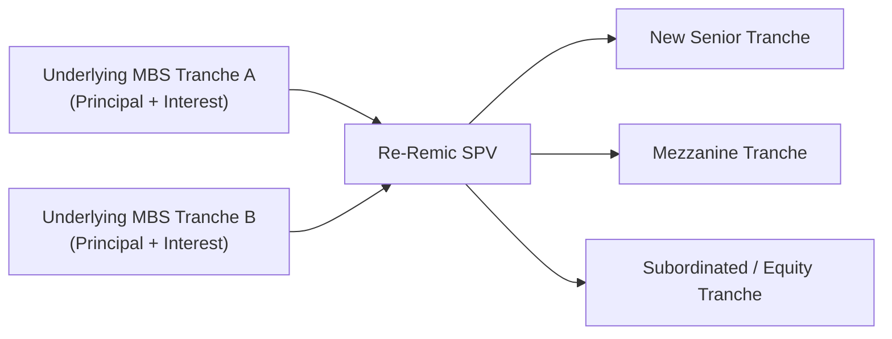

## Introduction

Re-securitizations—often called “Re-Remics”—take previously issued mortgage-backed securities (MBS) or other structured tranches and package them into a brand-new structured product. If you’ve ever rearranged leftover food into a fancy new dish (yes, I’m definitely guilty of that), you’ve experienced a small-scale analogy of what financial engineers sometimes do with legacy bonds!

But in finance, this “leftover meal” analogy comes with more complexity and risk assessment. Why do investors or originators go to the trouble of slicing, dicing, and re-layering existing securities? Primarily, Re-Remics can offer the possibility of new credit ratings, more predictable cash flows, or capital relief for institutions who want to tidy up their balance sheets. On the other hand, they can also introduce new layers of complexity and potential pitfalls for unsuspecting investors.

This article explores why re-securitizations exist, how they’re structured, and what factors analysts should consider when deciding whether to invest in or structure one. We’ll wrap up with real-world insights, risk management tips, and even a few exam pointers.

## Why Re-Remics?

Re-Remics often emerge out of a simple quest: “How can we improve or stabilize the credit profile (and possibly the market perception) of older securities?” Recall that many mortgage-backed securities were issued in “vintage” years—like 2006 or 2007—when lending standards varied significantly from what you’d see today. By repackaging these existing MBS tranches, the goal might be to build tranches with different risk-return profiles that better match current investor appetite. Sometimes, market participants restructure these instruments to:

• Enhance credit ratings by separating out higher-risk cash flows.  
• Isolate certain maturities or prepayment characteristics for better cash flow alignment.  
• Diversify or reduce exposure to legacy credit risk.  
• Achieve capital relief under certain regulatory frameworks by creating more senior claims.  
• Unlock liquidity in older (and sometimes less liquid) structured deals.

I once chatted with a mortgage fund manager who described it like “putting a new roof on your house and redoing the floors” so that you can resell it at a better price—or simply live more comfortably with fewer leaks.

## Re-Remic Mechanics and Waterfall Restructuring

At their core, Re-Remics form by aggregating the cash flows from one or more existing asset-backed securities (ABS) or mortgage-backed securities. The newly formed securitization creates new senior, mezzanine, or subordinated layers that define how interest and principal payments are distributed. Since each underlying security already has its own waterfall arrangement, re-securitizing them means you’re effectively stacking multiple layers of distribution rules. That can get complicated.

Below is a simplified Mermaid.js diagram that illustrates how a Re-Remic might be structured:

1. Existing tranches (A, C) provide their respective cash flows (principal and interest) into a special purpose vehicle (SPV).  
2. The SPV issues newly created Re-Remic tranches (D, E, F).  
3. The new “senior” bond often receives repayments first. The mezzanine layer (E) only receives payments after the senior tranche is fully paid, and so on.

### Credit Subordination

Subordination is key in re-securitization. The senior tranches benefit from the existence of subordinated tranches, which absorb losses first. By structuring the deal so that some bondholders absorb the majority of the risk, the senior note can (often) carry a higher credit rating. 

In re-securitizations, the newly created structure might separate the original MBS into:

• Senior A1: Typically the highest-rated or “investment-grade” portion.  
• Mezzanine A2: A medium-risk layer to attract yield-seeking investors.  
• Subordinated/Equity: The first to take losses and sometimes used by the arranger or a specialized risk investor.

This distribution aims to provide stable cash flows to the top-tier tranches, making them more appealing to institutions that desire lower risk. 

## Regulatory and Disclosure Considerations

Post-2008, re-securitizations faced increased scrutiny from regulators who worried about layering more risk onto existing complexity. In many jurisdictions (e.g., the U.S. under the SEC or Europe under ESMA regulations), deal issuers have to disclose:

• Collateral details of each underlying bond (e.g., credit scores, mortgage documentation).  
• The structure of new waterfalls and triggers.  
• Historical performance data, especially if the original MBS vintage is from periods of higher default risk.  
• Detailed stress test scenarios showing how each new tranche might perform under adversarial conditions.  

For any prospective investor or CFO, reading these disclosures carefully is almost a sacred rule. Overlapping triggers or conflicting priority rules could lead to big surprises if the underlying collateral doesn’t perform as expected.

## Credit Ratings and “Notching”

Ratings agencies are well aware that re-securitization can significantly alter risk. In response, they apply various stress tests to see how well the new structure can handle defaults in the underlying collateral. Some agencies “notch up” or “notch down” from the original rating to arrive at a new rating for the re-securitized tranches. In other words, if the underlying MBS is rated BBB, the new re-remic senior piece might be rated A or even AA, assuming enough subordination is in place. Meanwhile, the mezzanine or subordinated slice could be notched down to reflect taking on more risk.

Because rating agencies often publish updated criteria specifically for Re-Remics, it’s wise to consult these guidelines. The analyses can get highly granular, considering loan-level data, historical prepayment speeds, and potential balloon payment risk if the mortgages are set up that way.

## Evaluating Older Vintages

There’s a bright side to older collateral: By the time an MBS has been outstanding for, say, 10 or 15 years, you actually have years of payment history. It’s like buying a used car that’s proven itself over a certain number of miles—any initial engine kinks might already be behind you, or at least you know they exist. In securitization terms, loans that weathered the best and worst of the credit cycles might be more predictable. Prepayment patterns could be well-established, and default risk might be clearer.

But that doesn’t guarantee safety. If the underlying mortgages are from notoriously problematic vintages (as many 2006-2008 ones were), you’d better check whether they had suspect underwriting guidelines or are geographically concentrated in weaker real estate markets.

## Legal Complexities

If you thought the original MBS documentation was long, try layering a second set of legal documents on top! Re-Remics require:

• Legal opinions on “true sale” status if new collateral is being transferred into the re-securitization vehicle.  
• Accurate descriptions of how the new waterfall interacts with old triggers—some triggers might remain in effect for the original deal.  
• Provisions clarifying the responsibilities of the trustee, servicer, and other parties under the new deal.

A mismatch in triggers can lead to odd results. For instance, an MBS might have a performance-based trigger that diverts payments to senior noteholders if losses exceed a threshold. The re-securitization might have its own rules. In a stress scenario, it might not be 100% obvious how the final distribution is executed. Lawyers, structured finance analysts, and rating agencies spend a lot of time ensuring these puzzle pieces fit the way they’re supposed to.

## Practical Example of “Tranche Carving”

Let’s say you have a legacy RMBS (Residential Mortgage-Backed Security) with a total outstanding principal of $200 million. The original senior bond is still considered investment rating (A), but the market is uncertain about the underlying collateral. The security trades at a discount because investors fear potential defaults.

An investment bank or collateral manager might pool that bond with a few similarly rated bonds from other RMBS pools, creating a new Re-Remic worth $300 million total. They issue:

• Senior A1 Bond ($150 million): Garners a credit enhancement from the existence of subordinated layers. Might achieve an AA rating.  
• Mezzanine A2 Bond ($100 million): Pays higher interest but is rated BBB.  
• Subordinated/Equity Tranche ($50 million): First-loss piece with no rating or a low speculative rating.

Some investors love that new senior piece for its stable cash flows and “cleaner” rating. Others might chase the mezzanine or subordinated bonds to capture higher yields. And voila, you’ve restructured the risk to align with each investor’s preferences—at least in theory.

## Risks and Pitfalls

Re-Remics certainly aren’t a magic wand that transforms questionable mortgages into bulletproof debt. Potential pitfalls include:

• Overconfidence in new ratings. Some re-securitizations rely on subordination levels that might be insufficient if underlying defaults skyrocket.  
• Opaque waterfalls. Complex or conflicting triggers can create uncertainty in times of stress.  
• Liquidity concerns. If the underlying bonds are illiquid, the re-securitized product might not trade frequently.  
• Regulatory changes. New rules, such as risk retention requirements, might alter the profitability or feasibility of re-securitization.  
• Greenwashing or ESG concerns. In some re-securitizations labeled as “sustainability oriented,” verifying the collateral’s actual ESG profile can be tricky.

Even after the 2008 crisis, I personally saw a few re-securitized deals that collapsed because the rating agencies had misjudged either the prepayment environment or the scale of defaults. So, while re-securitizations can be a great tool, it’s crucial to do your homework.

## IFRS vs. US GAAP Accounting

Under both IFRS and US GAAP, structured financial instruments can have distinct treatment regarding off-balance-sheet classification, the recognition of consolidation, and impairment. For instance:

• IFRS 9 (Financial Instruments) focuses on how financial assets are classified, measured, and derecognized. In a re-securitization scenario, you’d look closely at whether the transfer meets derecognition criteria. The presence of continuing involvement can keep the assets on the originator’s books.  
• US GAAP uses the Accounting Standards Codification (ASC) 860 for transfers of financial assets, and it sets strict criteria for a “true sale.” If you don’t meet all criteria, the original holder might have to keep the underlying assets on the balance sheet.  

For financial institutions eager to achieve capital relief or reduce reported leverage, it’s essential to ensure a valid sale or partial derecognition. Auditors and regulators often scrutinize re-securitization deals, especially if they suspect that the main goal is to “window dress” the balance sheet.

## Market Use Cases

Re-Remics can serve a variety of objectives:

• Banks might want to carve out their exposures to riskier subprime mortgages and create safer, senior positions that attract more conservative investors.  
• Insurance companies or pension funds might invest in re-structured senior tranches to lock in stable, longer-duration cash flows matching their liabilities.  
• Hedge funds often trade the subordinated or mezzanine layers, looking for higher yields or special-situation investment opportunities.

These uses highlight how different investor classes can find a fit in re-securitized deals, depending on their tolerance for volatility, default risk, or regulatory constraints.

## Best Practices for Analysis

If you’re evaluating a Re-Remic, consider:

• Collateral review: Don’t just rely on the rating. Delve into the underlying mortgages, their geographic distribution, and vintage.  
• Waterfall mechanics: Understand exactly how revenue flows in different scenarios and whether triggers might trip up your expected cash flows.  
• Scenario testing: Perform stress tests on default rates, prepayment speeds, and housing price declines.  
• Legal compliance: Confirm that the legal structure aligns with IFRS/US GAAP guidelines and relevant securities laws.  
• Watch for correlation risk: Even if the pool looks diversified, certain macro events (like a severe recession) could cause correlated defaults.  

It helps to build a thorough spreadsheet model that simulates monthly or quarterly cash flows under various scenarios. Many professional structured finance shops have proprietary models, but you can still attempt a simplified approach in a typical financial modeling tool.

## Exam Tips

• The CFA exam might present you with a structured finance item set describing a re-securitization and ask you to identify how risk is redistributed among the new tranches. Focus on subordination, triggers, and rating mechanics.  
• You could see a question testing your understanding of how re-securitizations might affect a bank’s balance sheet under IFRS or US GAAP, especially regarding derecognition criteria.  
• Macroeconomic factors, such as rising interest rates or falling home prices, affect the underlying mortgage collateral and thus the performance of re-Remics. Be prepared to discuss these factors.  
• Remember that re-securitizations may not “improve” credit quality out of thin air. They merely redirect risk in a more or less transparent way.  

On exam day, read each question carefully to see if it addresses structural nuances, rating changes, or regulatory disclosures. If short on time, focus on the fundamentals of credit enhancement, underlying collateral, and the overall distribution of cash flows.

## Conclusion

Re-Remics and other secondary securitizations exemplify how creative financial structures can reshape existing deals’ risk and reward profiles. When done prudently, they allow investors to access newly segmented tranches, potentially unlocking improved liquidity or matching specific risk objectives. When executed poorly, they can hide or amplify risks behind layers of legal and structural complexity.

Your best defense? Ask: What’s in the box? Understand the original collateral, the restructured waterfall, the legal agreements, and how the new securities fit within your (or your fund’s) risk appetite. As with any structured product, knowledge and technical due diligence are your greatest allies.

## References

• SEC Filings on Re-Remic transactions (particularly from 2009–2012)  
• Standard & Poor’s Re-Remic Criteria for RMBS (most recent version)  
• The Journal of Structured Finance – various articles covering the evolution of Re-Remic deals  
• IFRS 9 (Financial Instruments)  
• US GAAP ASC 860 (Transfers and Servicing)

---

## Test Your Understanding of Re-Remics and Repackaged Securities



### Which of the following is the most common reason for creating a Re-Remic?

- [x] To carve out riskier portions of an existing MBS and improve ratings on the new senior tranche
- [ ] To avoid legal documentation requirements in new issuances
- [ ] To combine multiple defaulted MBS tranches into a single zero-risk instrument
- [ ] To make older securities appear newer to unsuspecting investors

> **Explanation:** Re-Remics typically involve pooling or carving out parts of existing MBS to create a new structure with potentially higher-rated senior tranches, not to completely remove risk or bypass legal documents.

### When analyzing a Re-Remic, which factor is most critical in evaluating the creditworthiness of the new senior tranche?

- [x] The amount of subordination or credit enhancement from the lower tranches
- [ ] The length of time since issuance of the original MBS
- [ ] The marketing materials provided by the issuer
- [ ] The identity of the underwriter only

> **Explanation:** A new senior tranche’s strength heavily depends on how much risk the subordinated layers absorb before the senior tranche takes a loss.

### What is one potential regulatory concern when structuring Re-Remics?

- [x] Overlapping triggers or conflicting waterfall provisions that create uncertainty
- [ ] Eliminating all disclosures about collateral quality
- [ ] Forcing rating agencies to rate new issues as AAA
- [ ] Failing to have enough lawyers involved in drafting documents

> **Explanation:** Regulators worry about confusion or opacity in complex deals with multiple triggers, which can be magnified in a Re-Remic.

### Which of the following describes the process of “notching” in Re-Remics?

- [x] Adjusting credit ratings for the newly created tranches based on their risk profile relative to the underlying collateral
- [ ] Removing the highest-rated tranche to create uniform risk across the structure
- [ ] Eliminating the credit rating entirely due to complex waterfalls
- [ ] Stacking multiple senior tranches on top of each other

> **Explanation:** Rating agencies may “notch” new tranches up or down depending on how structural enhancements compare to the underlying MBS ratings.

### In a Re-Remic transaction, which tranche typically absorbs losses first?

- [x] Subordinated or equity tranche
- [ ] Senior tranche
- [ ] Mezzanine tranche
- [ ] The originating bank’s tranche

> **Explanation:** The subordinated or equity tranche is designed to bear the first level of losses, providing protection to more senior notes.

### How does IFRS 9 primarily impact Re-Remic transactions?

- [x] It sets guidelines for the classification, measurement, or derecognition of financial assets involved in the transaction
- [ ] It mandates that all Re-Remic tranches be reported as liabilities
- [ ] It removes the requirement for stress testing new tranches
- [ ] It abolishes the use of subordinated tranches

> **Explanation:** IFRS 9 addresses how financial instruments are recognized, measured, and de-recognized, which is critical for entities looking to remove or retain Re-Remic assets on their balance sheet.

### Why might a bank or financial institution create a Re-Remic from older MBS tranches?

- [x] To achieve capital relief and potentially free up regulatory capital
- [ ] To deliberately mislead regulators about the quality of assets
- [ ] To bypass IFRS 9 requirements
- [ ] To give the underwriting staff more paperwork to do

> **Explanation:** A key reason is capital relief: by creating a highly rated senior tranche, the bank can potentially reduce capital requirements against the lower-risk piece.

### Which of the following is least likely to be a scenario in which an investor would buy a subordinated tranche in a Re-Remic?

- [x] The investor wants guaranteed principal protection and minimal risk
- [ ] The investor seeks higher yields and can tolerate greater risk
- [ ] The investor is a hedge fund specializing in distressed securities
- [ ] The investor expects to trade volatility in the mortgage market

> **Explanation:** The subordinated tranche has much higher risk, so it’s generally not suitable for those demanding near-zero risk.

### What aspect of a Re-Remic deal can make it more attractive than just holding the original MBS?

- [x] Potential to isolate certain maturities and urate cash flows more precisely
- [ ] Complete removal of default risk from the underlying mortgages
- [ ] Elimination of legal documentation altogether
- [ ] Guaranteed premium pricing in all market conditions

> **Explanation:** Re-Remics allow for more precise tailoring of maturities, prepayment profiles, or credit exposures, offering flexibility that may not exist in the original MBS.

### True or False: Re-Remics completely eliminate the risk of default within the underlying collateral.

- [x] True
- [ ] False

> **Explanation:** This is a trick question: it’s false. Re-Remics don’t eliminate default risk; they merely rearrange it among different tranches.


