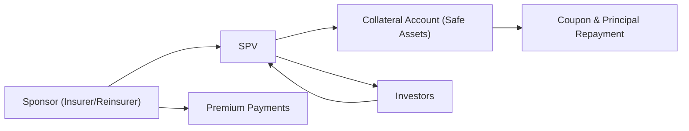

## Introduction
Let’s say you’ve got a friend who invests in all these niche debt instruments, and one day they mention they’re buying bonds that protect insurers against hurricanes. You might first think, “Wait, you can invest in something like that?” Well, that’s exactly what Insurance-Linked Securities (ILS) and Catastrophe Bonds (Cat Bonds) do. These instruments allow investors to earn a return in exchange for taking on a slice of the risk that an insurer (or reinsurer) faces if a big catastrophic event—like a hurricane or earthquake—actually happens.

For many portfolios, the appeal of ILS and Cat Bonds lies in their diversification benefits. These instruments generally have low correlation with broader financial markets (for example, an earthquake doesn’t necessarily care about whether stock prices are up or down). In this section, we’ll talk about how these instruments are structured, their triggers, how risk modeling works, and why they can be so attractive—yet also tricky—to incorporate into an investment portfolio.

## Key Mechanics of Insurance-Linked Securities
An Insurance-Linked Security is any financial instrument whose performance depends primarily on an insurance-related event. The big idea is that the insurer (or reinsurer) offloads some of its potential losses to investors in the capital markets. If no covered event occurs, investors usually earn a coupon (often higher than typical bond yields). But if that event does happen, part (or all) of their principal can be used to pay the insurer’s claims.

### Why Transfer Insurance Risk to Capital Markets?
Historically, insurers and reinsurers have shared risk among themselves to manage large potential payouts. However, mega-catastrophes—like a direct-hit hurricane on a major coastal region or a massive earthquake—can create extremely high losses, potentially threatening insurers’ solvency. Spreading that tail risk to the broader capital markets via securities (like Cat Bonds) helps insurers reduce “worst-case scenario” exposures. Investors, in return, get a yield that (in theory) compensates them for that unlikely but severe event.

### Catastrophe Bonds (Cat Bonds)
Catastrophe Bonds are currently the most recognizable form of ILS. In a traditional Cat Bond structure, a special purpose vehicle (SPV) is set up to issue bonds to investors. The SPV takes in the bond proceeds and invests them in relatively safe assets (like short-term Treasury securities) as collateral. Meanwhile, the insurer pays premiums to the SPV. If no catastrophe triggers the bond, the SPV returns the principal to investors at maturity, plus coupons along the way. However, if the defined catastrophic event occurs—meeting the specific trigger conditions—the SPV uses some or all of the collateral to satisfy the insurer’s claims, and that portion of the investor’s principal is lost.

Below is a simple mermaid diagram illustrating the flow:

1. The sponsor (insurer/reinsurer) pays premiums into the SPV.  
2. Investors buy the Cat Bond, and their principal is held as collateral.  
3. As long as no catastrophe event triggers the bond, the sponsor pays coupons and eventually redeems the bond at maturity.  
4. If the catastrophic event happens, part (or all) of the investor principal is used to pay insurance losses, and investors face a reduction or complete loss of principal.

## Trigger Mechanisms
Cat Bonds often detail what exactly sets off that dreaded loss of principal. We can split it broadly into:

• Indemnity Triggers: Tied to the actual losses the insurer experiences. If those losses exceed a stated threshold, the sponsor uses a portion of the collateral to cover claims. Indemnity triggers reduce “basis risk” for the insurer because the bond triggers right where the insurer’s claims are. However, indemnity triggers create more “moral hazard” and potentially more complexity, as one must wait to see the actual claims before determining if a trigger is activated.

• Parametric Triggers: Based on measurable physical parameters of an event—like earthquake magnitude or maximum wind speeds—rather than on actual losses. Parametric triggers make payouts swift and transparent but can introduce “basis risk” if the catastrophic event meets the measured threshold but the insurer experiences only minor losses, or vice versa.

Having once encountered a parametric wind-based Cat Bond that triggered on wind speeds above a certain threshold, I recall hearing from a reinsurance contact that a near-miss hurricane still caused real damage because of flooding, yet no “wind speed” trigger was met. This is exactly how basis risk can materialize: the event was destructive in reality, but not in the parameter used to determine the bond’s payout.

## Diversification and Portfolio Appeal
One big reason investors love Cat Bonds is that the occurrence of an earthquake or major hurricane is generally not correlated with, say, interest rates or stock prices. Because of this, Cat Bonds can deliver strong diversification benefits—assuming a region-specific catastrophe doesn’t happen to coincide with a broader market crash for unrelated reasons (which can happen, but it’s statistically less likely). Larger institutional investors might hold a slice of Cat Bonds in a multi-asset portfolio to stabilize returns, especially in the face of equity or credit downturns.

### Potential Return Profile
Investors typically receive a higher coupon than they would from comparable credit instruments. That’s compensation for the possibility of losing principal if a covered event strikes. In a benign year with no triggers, Cat Bond investors can see attractive, uncorrelated returns, facilitating better portfolio diversification metrics.  

**Quick Example:**

• Suppose an SPV issues a $100 million 3-year Cat Bond paying a floating rate of LIBOR + 600 bps (6 percentage points above LIBOR).  
• If no covered event occurs, the investor collects these relatively high coupons each year.  
• At the end of the three years, the investor gets $100 million principal back (assuming LIBOR remains stable, total return is typically quite high).  
• If a covered event occurs (e.g., a Category 5 hurricane hits a specific region and surpasses certain loss thresholds), the investor could lose a portion (or all) of that $100 million principal.  

In an exam context, you might see a question about how Cat Bond “payoffs” differ from typical corporate bonds. The key difference is that Cat Bonds tie their principal risk to “catastrophic events” rather than to the borrower’s creditworthiness.  

## Risk Considerations

### Model Risk
Some folks walk into this market feeling overly confident in what a modeling firm says about the 1-in-100 year probability of a Category 5 hurricane. But Mother Nature can surprise us. Catastrophe models rely on assumptions, historical data, and scientific predictions about event frequencies. Model risk becomes substantial if those assumptions underestimate how frequently catastrophic events occur or how large the damages might get.

### Basis Risk
Basis risk is, quite frankly, that moment you realize the Cat Bond triggers at different times than your actual losses. Parametric triggers can lead to a mismatch where the insurer’s real losses aren’t perfectly captured by the event’s measured intensity or location. Conversely, with indemnity triggers, the sponsor might face less basis risk but more time lag for claim assessment.

### Liquidity Risk
Compared to many corporate bonds or Treasuries, the Cat Bond market tends to be more specialized and less liquid. Secondary trading can involve wider bid-ask spreads. In stressful market conditions (or prior to a big approaching natural disaster), liquidity can dry up, meaning you might be stuck with your position or forced to sell at a significant discount.

### Structural and Regulatory Risks
Special Purpose Vehicles must comply with insurance regulations, securities regulations, and sometimes cross-border rules if the sponsor or investors come from different jurisdictions. A good chunk of the impetus behind Cat Bonds comes from regulators encouraging risk transfer for large-scale disasters, but in some cases, an unexpected shift in regulations (e.g., changes in taxation or permissible assets in the collateral account) can create additional complexities.

## Practical Uses and Example Scenarios
• **Large Insurer Wanting Extra Protection**: A major Florida insurer might sponsor a Cat Bond to protect against extreme hurricane seasons.  
• **Municipal Sponsor**: Governmental entities or agencies in quake-prone areas issue Cat Bonds to shift budgetary risk from natural disasters onto the capital markets.  
• **Diversifier for a Pension Fund**: If a pension fund wants an asset class that has minimal correlation to equities and bonds, it might allocate a small percentage of total assets to Cat Bonds, hoping for stable returns during times of market volatility.

## Structural Overview
A typical Cat Bond transaction often looks like this:

1. Sponsor (Insurer/Reinsurer) identifies the risk it wants to transfer.  
2. SPV is created to issue bonds to investors.  
3. Investors’ money goes into the SPV’s collateral account, often invested in money market funds or short-duration Treasuries.  
4. Sponsor pays a premium to the SPV for the risk coverage.  
5. Investors receive coupons funded by the sponsor’s premium plus interest from the collateral.  
6. If no catastrophe event occurs by maturity, investors get back principal plus coupon.  
7. If the event happens, part or all of the collateral is untouchable by investors; it pays the sponsor’s claims.

## Incorporation into Multi-Asset Portfolios
From a CFA Level III perspective, you might evaluate Cat Bonds in an Asset Allocation or Portfolio Construction question. The biggest advantage is the potential diversification effect, since event risk is often uncorrelated with broader market factors. However, absolute returns can vary depending on the perceived risk of the underlying exposure, the frequency/severity of actual disasters, and the reliability of modeling assumptions.

You may see an exam item set describing how a consultant recommends diversifying with ILS to reduce downside risk in a standard 60/40 equity-bond portfolio. In that scenario, pay close attention to the correlation assumptions and any mention of risk floors (e.g., if a big event occurs but the portfolio is simultaneously hammered by an equity crash). On the exam, you might be asked to discuss stress scenarios—like a major global crisis that includes weather disruptions—leading to potential correlations that deviate from historical norms.

## Best Practices and Challenges
• **Understanding the Trigger Mechanism**: Indemnity vs. parametric triggers can drastically affect the risk profile for both the sponsor and investors.  
• **In-Depth Model Analysis**: Before investing, carefully scrutinize the catastrophe model’s assumptions. Are they up to date? Do they incorporate climate change patterns?  
• **Regulatory Environment**: Ensure compliance with local guidelines on ILS issuance and cross-border risk transfer.  
• **Portfolio Concentration**: Even though these instruments add diversification, you certainly don’t want to bet all your chips on a single region or event type.  
• **Exit Strategy**: Liquidity can be limited, so plan for a buy-and-hold approach unless you’re confident about your ability to exit quickly.

## Exam Relevance
• **Constructed Response (Essay) Questions**: You might be asked to evaluate whether Cat Bonds are suitable for an LDI (Liability-Driven Investing) strategy or how to integrate them into a scenario-based asset allocation.  
• **Item Sets**: Expect diversification or correlation data that you may need to interpret. They might show you a table of returns for Cat Bonds during hurricanes or hypothetical parametric triggers, then ask about the effect on a sponsor’s claims.  
• **Calculation of Returns**: The exam could also feature a simplified illustration—like the earlier $100 million issuance—requiring you to determine investor yield if no event occurs, or the breakeven yield if an event triggers partial principal loss.  
• **Ethics and Standards**: If the sponsor’s reporting of losses is questionable (in an indemnity trigger), could this raise concerns about misrepresentation?

## Conclusion
In short, Catastrophe Bonds and other Insurance-Linked Securities can be a compelling addition to a well-diversified portfolio—offering uncorrelated returns and relatively high coupons. But you have to be comfortable with real-world uncertainties like the path of hurricanes, the structure of triggers, and the potential for terrifying (and often misunderstood) tail risk. It’s definitely worth learning the ins and outs of how these securities are modeled and regulated. When integrated wisely, they can enhance a portfolio’s risk-return profile, but if misused or misunderstood, they can introduce more vulnerability than you might expect.

## References
• Lane Financial LLC’s Cat Bond Market Reports  
• ARTEMIS.bm: A leading platform for ILS and reinsurance news  
• Cummins, J. D., & Trainar, P. (2009). “Securitization, Insurance, and Reinsurance.” Journal of Risk and Insurance  

-----

## Test Your Knowledge: Insurance-Linked Securities and Catastrophe Bonds



### Which of the following best describes Catastrophe Bonds?
- [ ] A type of bond that always guarantees full principal repayment.  
- [x] A security whose principal may be reduced or forfeited upon a defined catastrophic event.  
- [ ] A government-regulated bond that pays coupons only in negative interest rate environments.  
- [ ] A structured note tied exclusively to interest rate fluctuations.  

> **Explanation:** Catastrophe Bonds involve the risk of losing principal if a specified catastrophic event occurs (e.g., a severe hurricane).

### An advantage of investing in Catastrophe Bonds in a diversified portfolio is that:
- [ ] They are always more liquid than Treasury bonds.  
- [x] Their returns often exhibit low correlation with stock and bond markets.  
- [ ] They guarantee a higher coupon than all corporate bonds.  
- [ ] Their performance aligns perfectly with economic cycles.  

> **Explanation:** The main appeal is diversification: Cat Bonds typically have low correlation with traditional market risks like equity or interest rate movements.

### Indemnity triggers are based on:
- [ ] A measured earthquake magnitude.  
- [ ] The total rainfall in a month.  
- [x] The actual losses the insurer incurs.  
- [ ] Volatility in equity markets.  

> **Explanation:** Indemnity triggers are activated by an insurer’s actual reported losses exceeding a certain threshold, as opposed to parametric triggers based on event parameters.

### Parametric triggers may increase:
- [ ] Moral hazard for the insurer.  
- [ ] The time delay in payouts.  
- [ ] Premium payments by the insurer.  
- [x] Basis risk if the measured parameter doesn’t align with actual losses.  

> **Explanation:** Parametric triggers can create gaps between the measured event metrics (e.g., wind speeds) and the actual economic losses, leading to basis risk.

### Which of the following is a key reason for the creation of Insurance-Linked Securities?
- [ ] Avoiding regulation by hiding risk exposures off balance sheets  
- [x] Spreading large-scale catastrophe risks beyond traditional reinsurance markets  
- [ ] Collecting government subsidies tied to disaster financing  
- [ ] Eliminating underwriting costs entirely  

> **Explanation:** ILS are designed to shift some of the potentially massive catastrophe risk from insurers to the capital markets, easing the burden on traditional reinsurance.

### A major danger of excessive reliance on modeled probabilities for Cat Bonds is:
- [ ] Reduced yield spread for investors.  
- [x] Model risk, where realized events deviate significantly from modeled assumptions.  
- [ ] Arbitrage opportunities that reduce return.  
- [ ] Complete elimination of liquidity risk.  

> **Explanation:** Catastrophe models, while thorough, are still imperfect and can underestimate the frequency or severity of real-world catastrophic events.

### A well-known benefit of Catastrophe Bonds to insurers is that:
- [ ] They can avoid paying coupons under any circumstances.  
- [x] They reduce the insurer’s exposure to high-severity, low-frequency events.  
- [ ] They remove all basis risk for the insurer.  
- [ ] They provide indefinite coverage beyond bond maturity.  

> **Explanation:** The insurer effectively transfers some of the tail event risk to investors, mitigating the financial impact of extreme catastrophes.

### Liquidity risk in Cat Bond markets primarily refers to:
- [x] The difficulty in rapidly selling or exiting positions at reasonable prices.  
- [ ] The risk that coupon payments are suspended if the insurer faces losses.  
- [ ] The risk that parametric triggers might be abused by insurers.  
- [ ] The inability to invest in government bonds using Cat Bond proceeds.  

> **Explanation:** Cat Bonds are often thinly traded and can have wide bid-ask spreads, especially during times of potential catastrophe.

### From an exam perspective, Cat Bonds could be tested under:
- [x] Asset allocation and portfolio diversification scenarios.  
- [ ] Purely ethical dilemmas unrelated to finance.  
- [ ] Government bond issuance pricing alone.  
- [ ] Monetary policy implementation questions by central banks.  

> **Explanation:** Cat Bonds typically surface in discussions about diversification, risk management, and portfolio construction, making them relevant in multi-asset allocations and scenario-based exam questions.

### In evaluating whether to include Cat Bonds in a portfolio, a major concern is:
- [x] Determining how basis risk or model uncertainty might affect actual returns.  
- [ ] Eliminating indulgence in parametric triggers altogether.  
- [ ] Ensuring principal is always repaid in full.  
- [ ] Synchronizing them with daily stock price movements.  

> **Explanation:** Investors must carefully evaluate model risk and basis risk to understand how triggers might differ from real losses and how that impacts expected return.


