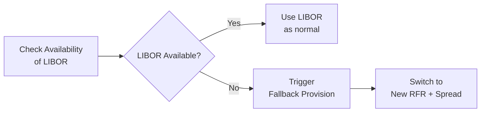

## Introduction

It’s funny how we sometimes get comfortable with a single benchmark, right? For years, LIBOR (the London Interbank Offered Rate) was the standard reference rate for floating-rate debt. I remember once hearing a friend in structured finance say, “If it doesn’t reference LIBOR, is it even a real floating-rate note?” And, for a while, that seemed true. But all that changed when several reforms and scandals led regulators across the globe to phase out LIBOR and push for more robust and transparent benchmarks. 

The transition away from LIBOR is no small matter in the world of structured products. Mortgage-backed securities, collateralized loan obligations (CLOs), asset-backed securities—many of these instruments historically relied on LIBOR. Now, if you’re an issuer or an investor, you need to understand what happens if your transaction documents were silent or ambiguous about what to do after LIBOR disappears. That’s where fallback provisions come into play. 

Below, we’ll walk through the core concepts behind the LIBOR transition, highlight new reference rates such as SOFR (Secured Overnight Financing Rate) in the US and SONIA (Sterling Overnight Index Average) in the UK, dig into the legal complexities of fallback language, and explore some best practices for ensuring your portfolio is well-positioned. We’ll also check out how rating agencies, regulators, and industry working groups are guiding this process. 

## Understanding the Phasing Out of LIBOR

For decades, financial markets worldwide relied on LIBOR to price everything from interest rate swaps to mortgage loans. However, the 2008 financial crisis and subsequent rate-fixing scandals revealed that LIBOR, being survey-based and lightly regulated, was vulnerable to manipulation. Regulators decided that a more transparent and transaction-based benchmark was needed. 

• In the US, the Alternative Reference Rates Committee (ARRC) recommended SOFR as the replacement for USD LIBOR.  
• In the UK, SONIA replaced GBP LIBOR for sterling-denominated instruments.  
• Other jurisdictions followed suit, adopting new rates or enhancing existing ones (e.g., €STR for Euro, SARON for Swiss Franc).  

Naturally, structured finance participants face complex considerations because the transition can affect each deal’s coupon calculation, investor returns, and cash flow waterfalls. 

## Choosing New Benchmark Rates

Selecting a robust successor to LIBOR is essential. Most structured products that formerly referenced one-month or three-month USD LIBOR are now leaning toward SOFR. Yet, this shift isn’t automatically seamless. SOFR is an overnight, risk-free rate (RFR), whereas LIBOR was a term rate with embedded credit risk. Hence:

• SOFR-based instruments often require term SOFR or daily compounding to mimic a forward-looking term structure.  
• SONIA-based instruments similarly may use a compounding in arrears structure for sterling financing.  

Transitioning from a credit-risky to a risk-free rate calls for a “spread adjustment.” This spread is intended to address the credit component that LIBOR possessed but SOFR does not. Right away, that can create the possibility for gains or losses for certain parties if the spread is miscalculated or if fallback language is incomplete.

## Key Elements of Fallback Provisions

Fallback provisions are effectively the “plan B” if a reference rate is unavailable. Historically, many fallback clauses in structured product documentation were triggered only if LIBOR became temporarily unavailable. Such language might say something like “if LIBOR is not published on a given day, use the last available publication.” That was fine for a day or two—but not for a permanent cessation.

Modern fallback provisions must be clearer and more robust. They address:

• Trigger events: Specific points in time when the fallback must take effect (e.g., “LIBOR cessation announcement,” “regulatory declaration,” or “pre-cessation trigger”).  
• Replacement benchmark: The new rate to be used (e.g., SOFR for USD transactions, SONIA for GBP).  
• Spread adjustments: The methodology to retain the economic equivalence if possible. For instance, some deals specify a fixed calculated spread (e.g., the five-year historical median between LIBOR and SOFR).  
• Administrative processes: Steps for notifying the bond trustee, obtaining necessary consents from noteholders, or having the issuer re-calculate the coupon.  
• Litigation or dispute resolution: How to handle disagreements regarding calculation agents or data sources.  

Market participants rely heavily on standardized fallback language advised by bodies such as the ARRC and the International Swaps and Derivatives Association (ISDA). It’s generally considered a best practice to adopt these consensus-based fallbacks, especially if the original deal documents did not anticipate permanent LIBOR discontinuation.

## Legacy Documentation Considerations

If you dig deep into older prospectuses or indentures, you’ll sometimes find ambiguous or incomplete fallback provisions that assume LIBOR would be around forever. As you might imagine, that can cause a ton of confusion. Issuers are thus forced to either:

• Amend documentation: This could involve rewriting the calculation agent’s responsibilities to incorporate a new benchmark.  
• Launch a consent solicitation: Formal requests for bondholders to agree to new terms. Sometimes, a supermajority is required for changes to be effective.  
• Rely on trustee determinations or interpretative guidance: In some deals, the trustee or issuer can unilaterally replace the benchmark if a recognized authority deems LIBOR permanently unavailable.  

Though these processes sound straightforward, they can get messy, especially when multiple tranches of securities are involved, each with its own investor class. It’s also possible that not all investors are aligned in wanting the same fallback approach—leading to potential disputes or value transfers among classes.

## Spread Adjustments

The biggest question for many participants is: “How do we replicate the economic value of LIBOR with a new rate?” Because SOFR is fundamentally different (risk-free vs. LIBOR’s bank credit component), structured product documentation often includes a spread adjustment. 

This spread might be:

• Fixed: A one-time addition to SOFR, typically calculated using the historical difference between SOFR and LIBOR over a look-back period (e.g., 5-year median).  
• Dynamic: Periodically recalculated based on ongoing differences in market rates.  

In practice, a fixed spread is more common for simplicity’s sake. However, no matter the method chosen, the aim is to prevent undue windfall gains to the issuer or investors. A poorly calibrated spread can artificially inflate or deflate the interest payments, harming one side.

## Operational Preparedness

Something we often forget—until it’s too late—is the operational side of switching benchmarks. Updating servicing platforms, reworking accounting systems, adjusting investor reporting, and training staff are all critical steps. For example:

• Servicing and reporting: Loan servicers that once keyed “LIBOR + 200 bps” into their systems might need new software to automatically compute SOFR + spread.  
• Data acquisition: Many of these new reference rates are published on different platforms or at different times. The calculation agent must ensure data integrity and timely updates.  
• Administrative tasks: If the fallback triggers halfway through a coupon period, how do you handle accrual calculations?  

Regulators and standard-setters have emphasized “operational readiness” because confusion or errors in rate calculations can lead to disputes, reputational damage, or potential legal liability.

## Rating Agency Perspectives and Regulatory Guidance

Credit rating agencies pay close attention to fallback mechanics, especially if inadequate fallback provisions could generate cash flow volatility or legal uncertainty. Securitizations that have smooth, standardized fallback language often face fewer rating challenges compared to those with ambiguous triggers. Some key areas rating agencies examine:

• Clarity of triggers: Are they well-defined (e.g., official announcements from regulators), or do they rely on subjective measures?  
• Conformance with industry guidelines: Deals that follow ARRC or ISDA protocols typically raise fewer red flags.  
• Potential valuation changes: If a poorly set spread adjustment drastically alters expected noteholder returns, the rating might be revised.  
• Litigation risk: Ambiguous language can spark legal battles over who profits or loses from the transition. Rating agencies assess how likely these disputes are to arise.  

Meanwhile, regulatory bodies such as the Federal Reserve (in the US) and the Financial Conduct Authority (in the UK) have encouraged smooth transitions through continued guidance. They’ve also provided safe harbor provisions in some jurisdictions, which may limit legal liability if the recommended fallback language is implemented in good faith.

## Real-World Example: Mortgage-Backed Security Fallback

Imagine you hold a pass-through certificate tied to a pool of adjustable-rate mortgages (ARMs). Historically, those ARMs reset every six months to the six-month USD LIBOR plus a margin. Once six-month LIBOR is no longer published, the trustee is required to choose an alternative index. 

Because the MBS trust documents adopted standardized fallback language, the trustee might automatically shift to Term SOFR, plus a spread adjustment derived from a five-year historical look-back of the six-month LIBOR-SOFR basis. Investor distributions from the trust would use that new benchmark from the next reset date onward, and monthly reports would highlight the rate’s composition to avoid confusion.

But if the trust documents lacked clarity, the trustee might need to approach certificate holders for a consent solicitation, potentially requiring a majority or supermajority to approve the new index. If one large investor blocked the change, it could lead to a standstill, with the trustee forced to interpret vague language or even petition a court for guidance.

## Best Practices and Pitfalls

When dealing with structured products transitioning from LIBOR, a few common themes emerge:

Best Practices  
• Perform a thorough inventory of affected deals. You can’t fix or adjust what you don’t know about.  
• Embrace standardized fallback language. Rely on established guidelines from ARRC, ISDA, or other relevant industry groups to reduce confusion and litigation risk.  
• Engage stakeholders early. Don’t wait until the final possible day to launch a consent solicitation. Opening a line of communication with investors, trustees, and servicers fosters buy-in and reduces future disputes.  
• Test operational changes. Switch your internal systems to the new reference rate and run a parallel, hypothetical coupon period to confirm the calculations match expectations.

Pitfalls  
• Overlooking older or “silent” fallback clauses can lead to nasty disputes if there’s no blueprint for a permanent LIBOR cessation.  
• Improper or nonexistent spread adjustments might lead to significant economic distortions—one side might experience substantial gains while the other suffers.  
• Failing to coordinate across multiple tranches or investor classes can create internal conflicts within a single securitization.  
• Underestimating rating agency scrutiny might hurt future issuance capacity and erode investor confidence.

## Conclusion and Exam Focus

Now that LIBOR is all but extinct, structured product professionals must thoroughly understand fallback provisions and how they factor into deal valuations, rating assessments, and ongoing operations. From an exam standpoint, you can expect questions testing your knowledge of:

• The mechanics of adopting a new benchmark rate (e.g., SOFR + fixed spread).  
• How fallback provisions trigger.  
• The role of legal documentation in ensuring a smooth transition.  
• Potential pitfalls in legacy deals, including litigation, economic mismatches, and operational challenges.

Remember that exam questions might also broaden to incorporate credit analysts’ perspectives, rating implications, or how an investment manager might hedge interest rate risk in a post-LIBOR environment. Stay alert for scenario-based prompts describing a specific structured deal with incomplete fallback language, requiring you to recommend an approach aligned with industry best practices.

If you’re feeling overwhelmed, don’t worry—you’re not alone. I’ve had countless conversations with market participants on fallback mechanics, and most folks are still learning new wrinkles each day. The key is to remain flexible, keep up with guidance from regulators and industry groups, and ensure you’re well-versed in both the technical and operational details. That way, you and your team can manage these changes with confidence.

Above is a simple high-level diagram. Real deals can be far more involved, but having a visual overview helps emphasize the importance of fallback triggers and the ultimate move to a new risk-free rate.

## References and Further Reading

• Alternative Reference Rates Committee (ARRC). See:  
  https://www.newyorkfed.org/arrc  

• International Swaps and Derivatives Association (ISDA), “IBOR Fallbacks” Documentation.  

• Deloitte, EY, KPMG, PwC Industry Reports on LIBOR Transition and Implementation.  

• For additional details on interest rate risk and yield curve models, refer to Chapter 7: The Term Structure of Interest Rates and Chapter 8: Interest Rate Risk and Return Analysis in this volume.  

• For clarity on broad regulatory views, see the Financial Conduct Authority’s official communications on coordinate cessation deadlines.  

• The Bank for International Settlements (BIS) has also published frameworks on benchmark transitions and global market implications.

## Test Your Knowledge: LIBOR Transition and Fallback Provisions Quiz



### Which term best describes a legally binding clause detailing what happens if the specified reference rate (e.g., LIBOR) is discontinued?

- [ ] Benchmark shift
- [x] Fallback provision
- [ ] Consent solicitation
- [ ] Rate disruption notice

> **Explanation:** A fallback provision specifies how a transaction should proceed if the primary reference rate ceases to exist or becomes unavailable.

### In a US market context, which of the following risk-free rates is widely recognized as the recommended replacement for USD LIBOR?

- [ ] SONIA
- [x] SOFR
- [ ] EURIBOR
- [ ] SARON

> **Explanation:** The Alternative Reference Rates Committee (ARRC) has endorsed SOFR (Secured Overnight Financing Rate) as the primary replacement for USD LIBOR.

### What is the primary purpose of a spread adjustment in a LIBOR fallback provision?

- [x] To compensate for the credit risk differential between LIBOR and the new risk-free rate
- [ ] To ensure the new rate includes the same bank credit component as LIBOR
- [ ] To allow issuers to lock in lower interest expenses
- [ ] To reduce coupon volatility in negative rate environments

> **Explanation:** Because LIBOR historically included a bank credit premium that risk-free rates like SOFR lack, a spread adjustment is needed to preserve the note’s original economics.

### What is the main operational challenge confronting administrators of structured products when LIBOR ceases to exist?

- [ ] The need to contact the borrower to reset the legal terms of the loan
- [x] Updating systems and processes to calculate and report upon the new reference rate
- [ ] Halting all coupon payments until a replacement rate is found
- [ ] Immediate reissuance of the security under new terms

> **Explanation:** Servicing and reporting systems often require extensive changes to incorporate new rates and spread adjustments. This can be a labor-intensive process that touches every aspect of deal administration.

### In most older securitization documents, fallback provisions were originally intended:

- [ ] To permanently replace LIBOR with SOFR in the event of a cessation
- [x] For temporary disruptions, such as a day or two when LIBOR was not published
- [ ] To address foreign exchange risk
- [ ] To resolve rating agency disputes

> **Explanation:** Many legacy transactions only anticipated short-term unavailability of LIBOR, so their fallback clauses rarely addressed a permanent cessation scenario.

### If a transaction’s documents are silent on LIBOR cessation, what might issuers need to do to legally implement a new benchmark?

- [ ] Nothing—no legal change is required
- [ ] Immediately terminate the notes
- [ ] Stop interest payments until new documentation is drafted
- [x] Amend the documentation or initiate a consent solicitation

> **Explanation:** In cases where there is no permanent fallback language, an amendment or a formal consent solicitation process is usually undertaken to incorporate the new reference rate properly.

### Which factor do credit rating agencies consider critical when assessing fallback provisions in a structured product prospectus?

- [ ] The length of time the reference rate has existed
- [x] The clarity and enforceability of fallback triggers and mechanics
- [ ] The number of legal counsel involved in drafting
- [ ] Whether the issuer is a bank or a non-bank entity

> **Explanation:** Rating agencies closely examine whether fallback triggers are clearly defined (e.g., official announcements) and how effectively these triggers can be enforced to mitigate confusion or legal disputes.

### A “consent solicitation” in the context of LIBOR transition is best described as:

- [ ] A way for issuers to unilaterally impose new rates
- [ ] A mandatory disclosure document offered before any bond issuance
- [x] A formal request for bondholder approval to change certain terms or provisions
- [ ] A bank’s approval mechanism for new credit lines

> **Explanation:** A consent solicitation is typically needed if material changes to the bond’s terms are required, such as switching from LIBOR to a new benchmark.

### Which of the following is a potential outcome if no agreement can be reached among bondholders on a suitable fallback for an existing securitization?

- [ ] The security is automatically converted to an equity instrument
- [ ] The issuer’s board of directors can select any new rate without restriction
- [x] Litigation or court involvement may be required to settle the dispute
- [ ] Rating agencies immediately downgrade the instrument to default status

> **Explanation:** Disagreements about fallback changes can lead to potential legal disputes if no clear solution or majority consent is achievable.

### True or False: One of the primary goals of spread adjustments is to ensure neither the issuer nor the investor experiences a significant windfall gain or loss as a result of the reference rate change.

- [x] True
- [ ] False

> **Explanation:** Spread adjustments are intended to replicate as closely as possible the original economic position, mitigating unusual gains or losses caused by switching from LIBOR to the chosen RFR.


