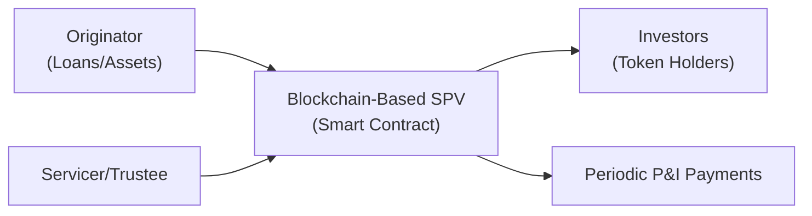

## Introduction

So, imagine you’re sipping coffee one morning, and you overhear colleagues chatting about this fancy concept called “blockchain-based securitization.” At first, you might feel like you’re eavesdropping on rocket scientists. But trust me, it’s not quite rocket science (though it can feel that way). Blockchain essentially provides a shared ledger of transactions across multiple parties. In securitization, that means improved transparency, potential cost savings, and quicker settlement of payments. It’s almost like having a giant spreadsheet that everyone can see at once—except it’s designed so no one can tamper with it without everyone noticing.

In this section, we’ll talk about how the traditional securitization process—bundling assets like mortgages, auto loans, or trade receivables—can evolve using blockchain technology. We’ll dig into data tracking, automated payment flows through smart contracts, and the benefits (and challenges) of tokenizing assets on distributed ledgers. And yes, we’ll bring up the friction points, too, such as legal uncertainties or cybersecurity headaches. By the end of this, you’ll be able to speak confidently about “blockchain-based securitization,” maybe even more confidently than that group you overheard at the coffee machine.

## Foundational Concepts of Blockchain in Securitization

Before we get into how blockchain can shake up securitization, let’s quickly define a few core ideas, because half the battle is understanding the jargon. Some of these might sound familiar:

• **Blockchain**: A distributed ledger technology that records transactions across a peer-to-peer network. Essentially, transactions are grouped in “blocks,” with each block cryptographically linked to the one before it. This design aims to make the ledger tamper-resistant.

• **Smart Contract**: A self-executing program where the terms of the contract are embedded in its code. When specified conditions are met (like a payment date or interest-rate reset), the contract executes the required actions—no human involvement needed.

• **Asset Tokenization**: The representation on a blockchain of ownership interests in real-world or financial assets. For securitization, that means turning mortgage-backed securities, auto loans, or other collateralized assets into digital tokens, making it easier to trade fractional interests.

• **Permissioned Blockchain**: A private or semi-private version of a blockchain, where only approved participants can read or write data. In finance, permissioned blockchains help address confidentiality, compliance, and governance demands.

• **AML/KYC**: Anti-Money Laundering and Know Your Customer—critical regulatory frameworks to prevent financial crime. When you’re dealing with a blockchain environment, it’s crucial to ensure that only fully cleared participants can do business (especially in securitized debt).

These concepts set the stage. In essence, the great appeal is that blockchain streamlines admissions, operations, and record-keeping. If you can harness its power in securitization, a number of tedious (and error-prone) tasks could become automated and transparent.

## Asset Tokenization in Securitized Products

One of the headline attractions of blockchain in securitization is the notion of asset tokenization. Rather than selling old-school bond certificates (or electronic entries that mimic them), issuers can mint digital tokens that represent fractional ownership in a securitized pool.

Picture a mortgage-backed security (MBS) with thousands of underlying loans. With tokenization:

• Investors can hold “digital MBS tokens” that represent claims on interest and principal payments from that loan pool.  
• These tokens might be traded on a blockchain-based secondary market, potentially allowing for near-instant settlement.  
• Instead of waiting T+2 or T+3 (two or three business days) for trades to settle, token transactions might settle in minutes or hours—or even in real time.

You might be thinking: “That’s cool and all, but is this actually happening?” We do see early pilots, such as tokenized auto loans and certain mortgage deals on private blockchains. Financial institutions experiment with smaller pools first—like a pilot batch of auto loans—so if something goes sideways, they can fix it without sinking a million-dollar securitization in chaos.

Because these tokens exist on a distributed ledger, they bring an intrinsic association to real-time data tracking. Suppose there is a delinquency in an underlying mortgage. The servicer can update this in the ledger, and every token holder (investor) sees the updated information. That might reduce the risk of fraud or misreporting, because driving changes on the ledger requires consensus and is recorded in real time. This level of transparency can ultimately improve market trust.

## Smart Contracts for Payment Flows

Perhaps the real game-changer here is the use of **smart contracts**. In a typical securitization, a trustee or servicer collects monthly payments (principal plus interest) from borrowers, aggregates them, and then distributes the cash to investors in accordance with a complex set of waterfall rules. For instance, if you’re a senior note holder, you might get paid before junior note holders. Usually, a trustee manually executes or supervises these payments. It works—well enough—but it’s definitely not the fastest or cheapest approach.

Enter the smart contract. A smart contract can hold the securitization’s payment algorithm in code. Every month (or day, or hour if you want to get fancy), the contract checks for incoming payments. When funds arrive:

1. It references the built-in priority of payments (senior, mezzanine, junior, equity) to figure out who gets paid first.  
2. It auto-distributes the correct amount of principal and interest to each class of token holders.  
3. It records the transaction on the ledger so any investor or regulator can verify the payment flow.

Below is a simple high-level diagram showing how a blockchain-based securitization might look. The “smart contract” in the middle is essentially the special-purpose vehicle (SPV) function, but automated:

Using a coded process can reduce reliance on manual calculations, minimize clerical errors, and let investors see right away how payments are allocated. That said, a truly robust process might still require a back-up manual override if something unforeseen happens (like if the data feed is wrong or a smart contract bug arises). In practice, you’d likely see a combination of automated and manual oversight—at least in these early days.

## Potential Benefits

I have to say, it’s an exciting time when banks explore blockchain-based structures, because it’s not just theoretical. There are very real benefits, including:

• **Reduced Settlement Times**: Traditional settlements can take days; blockchain-based settlement might be nearly instantaneous or T+0. That frees up capital and increases market liquidity.  
• **Real-Time Data Tracking**: The ledger can include up-to-date information on each underlying asset’s performance. You no longer rely on monthly or quarterly servicing reports to get a sense of delinquency or prepayment trends.  
• **Fraud Prevention and Transparency**: Because blockchain records are tamper-resistant, it’s much harder to fabricate underlying collateral or doctor the transaction history. Any attempt to alter data is flagged for everyone to see.  
• **Efficiency Gains**: By automating the payment waterfalls and distributing data in real time, it may cut down on administrative overhead. Some large financial institutions are excited about slashing operational costs.  
• **Broader Investor Access**: Tokenized structures mean that even smaller investors can potentially buy a fractional piece of the securitization. This democratizes access, bringing a deeper pool of capital to the table—at least in theory.

If you ask me, the possibility of near real-time data analytics is the most mind-blowing. Investors could track a security’s underlying collateral performance, say, daily or weekly. That’s a big leap from the days of flipping through pages and pages of PDF reports each month, hoping you spot the latest changes.

## Key Challenges and Regulatory Considerations

Now, we can’t talk about the upside without acknowledging the difficulties. It’s not like you can just plug in a blockchain solution and call it a day. Some of the biggest obstacles are:

• **Legal Uncertainties**: In many jurisdictions, the legal framework for “digital securities” remains murky. Who legally owns the asset tokens? How enforceable is the blockchain record if there’s a default or dispute? Courts aren’t always sure.  
• **Regulatory Acceptance**: Regulators want to ensure investor protections, market stability, and compliance with AML/KYC laws. They may be cautious about endorsing a brand-new digital process for securitization transactions.  
• **Cybersecurity Risks**: The potential for hacking or loss of private keys is real. If someone gains unauthorized access to the blockchain or participants’ wallets, it could undermine trust.  
• **Interoperability with Legacy Systems**: Financial institutions don’t want to uproot everything overnight. So any blockchain-based securitization structure needs to work seamlessly with existing back-office, settlement, and compliance systems.  
• **Governance of the Ledger**: Permissioned blockchains typically have a governing body controlling who is allowed to join. Determining who holds the ultimate “veto power” or who can fix errors is tricky.

That said, you’ll see many large banks exploring “private” or permissioned blockchains so they can maintain control over participants and data. This approach helps them meet regulatory demands (like verifying each investor is legit) and maintain confidentiality of sensitive loan-level details.

## Real-World Examples and Pilot Projects

If you’re still skeptical, consider a couple of early pilots:

**Mortgage-Backed Securitizations**: A few smaller lenders have digitized mortgage notes and put them on a private blockchain. The idea is that you can verify each mortgage’s payment status in real time. Smart contracts handle the distribution of monthly repayments.  

**Tokenized Auto Loans**: Auto finance companies have tested tokenizing entire loan portfolios. Investors get tokens representing pro-rata shares of the portfolio. Delinquency data, repossessions, and principal paydowns are updated on the chain.

**Trade Finance**: In trade receivables securitization, companies like R3 and Hyperledger have worked on solutions that allow multiple institutions to verify corporate invoice data, shipping documents, and credit insurance. In one pilot, a global bank used a blockchain-based platform to package trade finance receivables into an asset-backed security.

It’s still early days. These projects are typically small in scale and happen in well-defined regulatory sandboxes. However, pilot successes are feeding into bigger deals, so we may see more mainstream adoption in the next few years.

## Implementation Strategies and Future Outlook

The big question we often hear in the classroom is “So, how do you actually roll this out?” In practice, institutions often take a step-by-step approach:

• **Phase 1**: Digitize the underlying documentation—e.g., store mortgages, auto loans, etc., on an internal ledger that’s not fully blockchain.  
• **Phase 2**: Introduce a permissioned blockchain among key participants (originators, servicers, underwriters, rating agencies). Use this chain to record payment flows and relevant loan data every month.  
• **Phase 3**: Tokenize the security and open it up to a broader set of investors, potentially even retail.  
• **Phase 4**: Explore interoperability with other blockchains or even cross-border settlement if the securitization is sold internationally.

One day, we may have a future where entire supply chains of digital assets are tokenized, and you can bundle them at will to create new structured products—deals that settle in nearly real time. But that’s probably still years out. For now, the bigger leaps tend to be behind closed doors at large institutions or consortia, with everything highly monitored and tested.

## Best Practices and Potential Pitfalls

When institutions consider blockchain-based securitization, there are some tips and traps:

**Best Practices**  
• Ensure robust governance rules in the permissioned ledger—decide who can validate blocks and who can fix any coding errors.  
• Incorporate thorough AML/KYC processes to meet regulatory obligations. No one wants to see illicit actors sneaking onto the ledger.  
• Use external audits of smart contracts. This ensures your payment waterfall logic is free of bugs.  
• Retain manual override guidelines. If for some reason the auto-payment goes off track, you want a quick way to intervene.

**Common Pitfalls**  
• Relying on incomplete or incorrect data feeds: A smart contract is only as good as the input data. Garbage in, garbage out.  
• Overlooking local regulations. Securitization rules vary by jurisdiction, and not all countries are friendly toward digital securities.  
• Underestimating complexity. Real securitization deals can have multiple tranches with complicated triggers. Coding those rules can be tricky.  
• Ignoring a well-defined legal structure. If the tokens’ legal enforceability is questionable, you may not have a fully recognized security in the eyes of the courts.

## Personal Reflections and Anecdotes

I remember a conversation with a friend who works at a bank experimenting with blockchain in mortgage securitizations. She described how their internal project drastically cut down the manual tasks around compliance reporting each month. Instead of 10 analysts crunching numbers in Excel and emailing reports, the blockchain generated real-time performance data. She did say it felt a bit weird at first—like handing over the entire process to an invisible force. But after a few months, they realized they saved thousands of staff hours. Of course, this was a small pilot, but it gave them a peek into what a scaled-up version might look like.

Another colleague once joked that the biggest hurdle for blockchain-based securitization wasn’t the technology, but the “blockheads” who were allergic to any new process. Changes to old routines can be tough, especially in a strict environment involving multiple parties, lawyers, and regulators. That’s why it’s slow going, but the momentum is there.

## Conclusion

Blockchain technology holds enormous promise for making securitization more transparent, efficient, and accessible. By leveraging smart contracts and asset tokenization, originators can reduce settlement times, cut operational costs, and expand the investor base. Meanwhile, investors benefit from real-time insight into collateral performance and potentially reduced risk of fraud.

But we’re still in the early innings. Keep in mind the regulatory, legal, and interoperability challenges that must be clarified before widespread adoption. If you’re venturing into this space, it pays to do plenty of due diligence—make sure your blockchain project has strong governance, robust security measures, and the blessing of relevant regulators. If those conditions are in place, you can start reaping the potential benefits of speed, transparency, and trust that blockchain can bring to structured finance.

## References and Further Reading

• World Economic Forum: “Blockchain in Financial Services”  
• R3 Consortium Website (https://www.r3.com)  
• Hyperledger Project (https://www.hyperledger.org)  
• Deloitte “Blockchain in Structured Finance” Whitepaper  

---

## Test Your Knowledge: Blockchain in Securitization Quiz



### Which of the following best describes asset tokenization in the context of securitization?

- [ ] A process ensuring each loan is guaranteed by a central authority  
- [ ] A method to create tranches of payments manually  
- [x] The representation of underlying asset ownership as digital tokens  
- [ ] A form of guaranteed certificate insurance  

> **Explanation:** Tokenization is about converting ownership interests in real-world or financial assets into digital tokens on a blockchain, thus enabling more efficient trading and settlement.

### What is one primary advantage of using smart contracts in securitization payment waterfalls?

- [x] They can automatically distribute payments to different tranches.  
- [ ] They always require manual oversight by trustees.  
- [ ] They invalidate any form of credit enhancement.  
- [ ] They eliminate the need for AML compliance.  

> **Explanation:** Smart contracts can be coded to automate payout priorities for different tranches (senior, mezzanine, junior), simplifying the distribution process.

### Which of the following is a key regulatory concern when implementing blockchain-based securitizations?

- [ ] Reducing the number of required compliance officers  
- [x] Ensuring proper AML and KYC standards are upheld  
- [ ] Increasing settlement times  
- [ ] Forcing the complete removal of a servicer/trustee  

> **Explanation:** Regulators focus on enforcing AML/KYC laws and ensuring that blockchain participants meet these compliance standards.

### Which of these challenges is most commonly associated with blockchain adoption in securitization?

- [ ] Instant global acceptance  
- [x] Cybersecurity and legal uncertainties  
- [ ] Decreased reliance on data feeds  
- [ ] Unlimited token issuance by investors  

> **Explanation:** Blockchain adoption faces hurdles such as cybersecurity threats and a lack of clear legal frameworks in certain jurisdictions.

### In a permissioned blockchain setup for securitization, which of the following is the primary benefit?

- [x] Only approved participants can validate, ensuring controlled data access  
- [ ] All nodes are always anonymous  
- [ ] No oversight is required from a central authority  
- [ ] No need for KYC processes  

> **Explanation:** Permissioned blockchains restrict network access to validated members, which helps control data flow, ensure compliance, and maintain privacy.

### What does real-time data tracking imply in a blockchain-based securitization platform?

- [ ] Data is updated only once every quarter  
- [x] Collateral performance and payments are visible on a near-instant basis  
- [ ] Borrowers can change their loan terms on the ledger anytime  
- [ ] No transparency is necessary for investors  

> **Explanation:** Real-time data tracking means collateral performance, payments, and other critical info are recorded and made visible on the ledger as soon as they occur.

### One potential benefit of blockchain-based securitization is:

- [x] Reduced settlement times due to near-instantaneous transactions  
- [ ] Increased complexity in payment waterfalls  
- [ ] Slower AML/KYC processes  
- [ ] Fragmented investor communication channels  

> **Explanation:** By removing many manual and intermediary steps, blockchain transactions can settle much faster, freeing up capital and improving liquidity.

### Which statement best describes the role of a smart contract in this context?

- [ ] A piece of code that replaces legal contracts entirely  
- [ ] A marketing tool that inflates valuations  
- [x] Self-executing code that automates payment flows when certain conditions are met  
- [ ] An online advertisement platform for structured products  

> **Explanation:** Smart contracts automatically execute pre-programmed instructions (e.g., loan payment distributions) once certain triggers (like receipt of funds) occur.

### Why might institutions prefer permissioned blockchains over public ones for structured finance?

- [ ] They want multiple anonymous users creating consensus  
- [ ] Public blockchains are always cheaper  
- [ ] They prefer that anyone can alter the ledger  
- [x] They desire control over participant access and data confidentiality  

> **Explanation:** Institutions use permissioned blockchains to ensure regulatory compliance, data privacy, and participant vetting (KYC/AML).

### True or False: In blockchain-based securitization, there is no need for any form of governance to address errors or disputes on the ledger.

- [ ] True  
- [x] False  

> **Explanation:** Governance remains crucial in blockchain-based securitization. Permissions, dispute resolution, corrections for coding errors, and regulatory compliance all require a robust governance framework.


