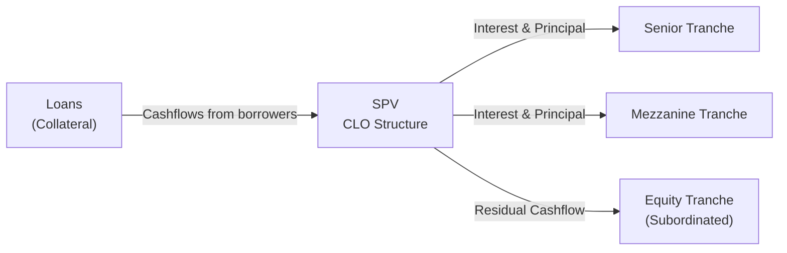

## Introduction

Collateralized Loan Obligations (CLOs) might sound super fancy, but—believe it or not—they’re often more straightforward than other types of securitizations once you get the basic idea. If you’ve ever heard someone talk about “bundling loans together and turning them into new securities,” you’ve basically brushed up against the concept. CLOs pool leveraged (higher-yield) corporate loans, slice them into tranches with varying priorities, and then sell these slices (or tranches) to investors who want different risk-return profiles.

Frankly, the day I first encountered a CLO, I felt both intrigued and bewildered. You’d see all these moving parts—an active manager, complicated legal docs, coverage tests, and a bunch of credit ratings. Still, it’s an essential topic if you’re learning about fixed-income markets. So, let’s walk through the main features, step by step.

## CLO Fundamentals

A CLO is typically made up of a portfolio of syndicated bank loans sitting in a special purpose vehicle (SPV). Unlike a static pool of assets where you just put them on autopilot, CLOs are actively managed by a CLO manager. The manager can buy and sell loans within certain guidelines to maintain or improve overall credit stability and keep the portfolio in compliance with coverage tests.

CLOs primarily invest in leveraged loans—these are loans issued to firms with below-investment-grade credit ratings, often used for acquisitions, refinancings, or other leverage activities. They come with higher yields but also higher default risk. Because these loans are syndicated, they’re broadly distributed among multiple banks and investors, which helps spread the risk. Yet the CLO’s function is to re-package these already syndicated loans into new debt and equity tranches.

## CLO Structure

Even though there are loads of detail in the legal docs, the general structure of a CLO is commonly segmented into the following tranches:

• Senior Tranche (Typically AAA)  
• Mezzanine Tranches (Ranging from AA down to BB)  
• Equity (Subordinated) Tranche  

Let’s see how these slices fit together visually.

• Senior Tranche: This has first priority on cash flows and is usually rated AAA (or close to AAA). Investors here expect lower yields compared to the other tranches, because they are taking far less risk.  
• Mezzanine Tranches: These get whatever’s left after the senior tranche is paid. They’re often divided into multiple sub-levels (AA, A, BBB, BB). The lower you roll down the credit rating, the higher the yield but the bigger the inherent risk.  
• Equity/ Subordinated Tranche: This is last in line for interest and principal payments. If all the more senior tranches have been paid in full, the leftover (a.k.a. residual cash flow) flows to the equity tranche. Equity investors carry the highest default risk, but they can enjoy significant upside if the underlying loans perform well.

## Key CLO Participants

A CLO is not just about reading a fancy legal document and calling it a day. There are multiple parties involved:

• CLO Manager: The hired gun who chooses loans, monitors them, and decides whether to buy or sell them in the secondary market. Legendary managers develop a track record for stable performance—or for occasionally selecting questionable loans when markets get chaotic.  
• Trustee: The entity making sure all cash flow waterfalls get followed exactly. They handle payments to investors according to the predetermined priority of payments.  
• Arranger/Underwriter: Usually an investment bank that helps structure and distribute the CLO notes to investors in the capital markets.  
• Rating Agencies: They rate the different tranches based on their forecast of credit enhancement, coverage tests, and the overall portfolio’s risk.  

It’s a team effort, but ultimately, as an investor, you’re relying heavily on the manager’s skill in picking loans and on the thoroughness of the structure’s legal protections.

## Cash Flow Waterfalls

The term “waterfall” might sound weird, but imagine literally pouring water from the top of a multi-level fountain. The folks at the top level (the senior tranche) get water first. Only once they’ve taken their share can the water (cash flow) trickle down to the next level, the mezzanine tranches. At the very bottom, the equity class only gets a share if there’s still water left.

However, CLOs also run coverage tests—such as overcollateralization (OC) tests and interest coverage (IC) tests—to ensure that the value of the collateral and the interest coverage remain above specific thresholds. If these tests fail, well, you have what’s often called a “diversion of cash.” In other words, the CLO manager must redirect the cash that would have gone to the equity holders or lower tranches back up to pay down higher-rated tranches until the tests are in compliance again. This is the dreaded “deleveraging” scenario for equity holders, but it’s meant to keep the structure stable.

### Overcollateralization Test (OC)

The OC test is basically a way of counting how many par dollars of collateral are pledged to each tranche. If you have, let’s say, $100 million in loans but only $80 million in notes outstanding for the senior tranche, that’s quite comfortable. If the loans default and start bleeding away, that cushion (the difference between $100 million and $80 million) shrinks. If it shrinks below the ratio required by the deal documents (like 125% or 130% for the senior), then the CLO must redirect cash flows from junior levels to pay down the higher tranches.

### Interest Coverage Test (IC)

The IC test checks whether the interest the CLO receives from the loan portfolio is sufficient to cover interest that the CLO owes to the senior tranches. If the coverage ratio breaks certain floors—say it dips below 105%—the CLO must allocate future payments to fix that problem first.

## CLO Lifecycle

In practice, a CLO has three phases:

• Ramp-Up (Warehousing) Period: The CLO manager accumulates loans that will form the starting asset pool. Typically, the manager funds these initial purchases with a combination of short-term financing in a “warehouse” arrangement and equity capital. Once the target par is reached, the CLO closes (i.e., it issues the debt and equity tranches to investors).  
• Reinvestment Period: This is where the manager reinvests principal proceeds from maturing or prepaid loans. The manager can replace them with new loans that (hopefully) maintain or improve the asset quality. This period typically lasts a couple of years—sometimes up to five. During this phase, the structure is actively managed, which is one reason CLOs differ from static securitizations.  
• Amortization Period (or Wind-Down): As the reinvestment period concludes, principal received from loan repayments is no longer reinvested. Instead, it’s used to repay the CLO’s outstanding notes. Eventually, the CLO winds down as tranches are fully paid off in order of seniority. Equity investors receive whatever is left after all the more senior tranches have been repaid.

## Risk Considerations

### Credit Risk

Because CLOs invest in leveraged loans, the underlying issuers (borrowers) also tend to have higher debt loads. During economic downturns, default rates in this segment can spike, placing downward pressure on the performance of the CLO. However, historical data has shown that CLO senior tranches typically hold up well due to robust structural protections. Equity investors, on the other hand, can experience losses faster when defaults rise.

### Manager Performance Risk

The manager’s skill is a huge factor in a CLO’s performance. If the manager picks strong credits, trades them well, and navigates sector downturns, the CLO can generate stellar returns for all tranches. However, if the manager performs poorly—maybe failing to comply with coverage tests or not anticipating macroeconomic shifts—things can get dicey quickly. This is somewhat analogous to having a good or bad driver behind the wheel.

### Structural Complexity

CLOs may have multiple triggers, performance tests, and complicated legal provisions. Investors must understand these triggers—including what can force the CLO to divert cash flows or deleverage. If you’re investing in a CLO, carefully read the collateral management agreement, note indenture, and any relevant amendments.

### Economic Sensitivity

CLOs are sensitive to cycles in the leveraged loan market. If we see an uptick in corporate defaults, you can guess that CLO equity holders might feel the heat as their cash flows get diverted. However, CLO structures include certain stabilizing features (like coverage tests), and managers can proactively trade out deteriorating credits if they see trouble coming.

## Example of a Simplified CLO Scenario

Let’s say a CLO invests in leveraged loans with a total par value of $500 million. They structure the notes like this:

• $300 million AAA tranche  
• $100 million A tranche  
• $50 million BBB tranche  
• $50 million equity (subordinated note)  

During the reinvestment period, the CLO gets $20 million in principal repayments every quarter. The manager can reinvest those proceeds into new loans with similar (or slightly better) yields while meeting quality tests. If a few borrowers default, the par coverage might decline, and if it breaches an overcollateralization threshold, the CFO might re-direct future principal and interest from the equity and mezzanine tranches to pay down the AAA and A tranches. That means less or no cash to the equity holders, but it helps keep the senior tranches from taking a big hit.

It might seem like a lot to track, but it’s all about making sure that higher-priority investors have protective cushions in case defaults rise.

## Stress Analysis and Rating Agency Perspectives

Rating agencies like Moody’s, S&P, and Fitch subject a CLO to rigorous stress scenarios: rising default rates, lower recoveries, manager underperformance, or general market downturns. They examine factors like:

• Credit diversity: The pool shouldn’t have excessive exposure to any single borrower or industry.  
• Manager track record: Has the manager navigated past downturns effectively?  
• Coverage tests: How quickly can a CLO self-correct if defaults spike?  

These analyses determine the ratings assigned to each tranche.

## Additional Manager Considerations

• Covenant-Lite Loans: In recent years, a lot of leveraged loans have fewer maintenance covenants. That can reduce the early-warning signals of credit deterioration.  
• Regulatory Implications: Some CLO structures had to adapt to “risk retention” rules in certain jurisdictions, requiring managers to hold a piece of the equity.  
• Reinvestment in Distressed Loans: Managers may occasionally invest in distressed credits that can yield high returns if the companies recover.

## Practical Tips and Common Pitfalls

• Dive into the manager’s track record. Don’t just pick a CLO because it carries a AAA rating on the senior note. A strong manager is crucial to stable performance.  
• Read the coverage tests carefully. You can get a sense of how easy or hard it is to breach them.  
• Watch out for re-investment periods that fall in a severely volatile market environment (like, say, in a big financial crisis). The manager might have few good options to reinvest principal.  
• Understand that equity tranches are a leveraged bet on leveraged loans—double the fun, or double the trouble, depending on how the market is moving.

## Conclusion

All in all, CLOs offer a compelling combination of structured layers (senior, mezzanine, and equity) backed by a portfolio of leveraged loans. Their design aims to provide credit enhancement and stable cash flows for senior investors, while giving mezzanine and equity investors an opportunity for higher yields. Yet, as with any investment in higher-yield instruments, it’s crucial to understand the underlying credit risk, the manager’s skill, and the complexities of those all-important coverage tests.

If you can keep those core ideas in mind—and aren’t too intimidated by the legal complexities—a CLO can be a valuable addition to a diversified fixed-income portfolio. Even so, informal or not, do your homework. You don’t want to be caught off-guard when coverage tests start failing, or when macro conditions turn sour.

## References

• Collateralized Loan Obligation Primer by S&P and Fitch  
• “Leveraged Finance and CLO” research from Credit Suisse and JPMorgan  
• Moody’s CLO Rating Methodology and Global Structured Finance Outlook  
• For more insights, check out relevant chapters in the CFA Institute curriculum on structured products  

## Test Your Knowledge: Collateralized Loan Obligations and Structuring Mechanics



### Which of the following statements best describes a key characteristic of CLOs?

- [ ] CLOs are backed by mortgage assets exclusively.
- [x] CLOs invest primarily in syndicated leveraged loans.
- [ ] CLOs invest only in high-quality corporate bonds.
- [ ] CLOs avoid the use of tranching in their capital structure.

> **Explanation:** CLOs typically pool leveraged (often below investment-grade) corporate loans into a SPV. The entire structure is then tranched into securities with different risk-return profiles.

### What is the primary function of a CLO's overcollateralization test?

- [ ] To ensure the manager trades loans only within each industry sector. 
- [x] To check whether the par value of the collateral exceeds the principal amount of the notes. 
- [ ] To verify the manager is fully hedging against interest rate risk. 
- [ ] To ensure the principal due on the senior tranche never exceeds half of the equity tranche.

> **Explanation:** Overcollateralization (OC) tests measure whether the loan collateral exceeds the debt outstanding of senior (or mezzanine) tranches. Failure triggers cash diversion to repay higher-priority tranches.

### In a CLO, which of the following tranches receives the highest priority in the cash flow waterfall?

- [x] Senior (AAA) tranche.
- [ ] Mezzanine tranche.
- [ ] Equity tranche.
- [ ] All tranches share the same priority.

> **Explanation:** The highest-rated senior tranche gets paid first, creating a lower credit risk profile for those investors.

### When a CLO fails an overcollateralization or interest coverage test, which of the following typically occurs?

- [ ] The CLO posts collateral to a margin account.
- [ ] The CLO manager liquidates the entire loan portfolio.
- [x] Cash flows are diverted from junior tranches to pay down senior tranches.
- [ ] The CLO manager is replaced automatically by the trustee.

> **Explanation:** Once a coverage test is breached, the CLO must redirect cash flows from junior tranches (including equity) to repay more senior tranches until the tests are back in compliance.

### Which phase of the CLO lifecycle is characterized by the manager reinvesting principal proceeds into new loans?

- [x] Reinvestment period
- [ ] Warehousing period
- [ ] Wind-down period
- [ ] Workout period

> **Explanation:** During the reinvestment period, principal proceeds from loan repayments or prepayments can be reinvested into new collateral so long as the CLO meets its eligibility and coverage criteria.

### What is the main reason investors consider CLOs less risky than outright investing in a portfolio of leveraged loans?

- [x] Structural protections like tranching and coverage tests.
- [ ] They only invest in AAA-rated corporate loans.
- [ ] CLO managers avoid all cyclical industries.
- [ ] CLOs focus exclusively on short-term loans.

> **Explanation:** CLOs employ features—such as tranching, coverage tests, and cash flow waterfalls—that provide credit enhancement and help shield senior lenders from loan defaults.

### Which of the following is a key risk unique to CLO equity investors?

- [ ] They receive payment ahead of the senior tranche.
- [x] They are the first to be cut off from cash flows if coverage tests are triggered.
- [ ] They are guaranteed a fixed coupon regardless of loan performance.
- [ ] They have a contractual obligation for constant principal repayment.

> **Explanation:** Equity tranches are at the bottom of the payment waterfall. When coverage tests fail, equity is the first to lose cash flow.

### How does the CLO manager's performance directly influence the CLO's success?

- [x] By selecting and trading loans to maintain or improve asset quality.
- [ ] By altering the credit ratings assigned by rating agencies.
- [ ] By choosing whether the CLO should invest in government bonds.
- [ ] By suspending the CLO’s waterfall payments when coverage tests fail.

> **Explanation:** The CLO manager actively buys, sells, and monitors loans in the portfolio. Good credit selections and loan management can significantly enhance performance and minimize defaults.

### Which of the following best describes the key focus of rating agencies when evaluating a CLO?

- [ ] The manager’s ability to hedge interest rate risk with complex derivatives.
- [ ] Whether the CLO invests at least 50% of assets in government bonds.
- [x] Credit diversity, manager track record, and performance triggers.
- [ ] The speed at which the CLO can prepay all tranches without default.

> **Explanation:** Rating agencies focus on whether the CLO has sufficient diversity in the underlying portfolio, a reliable manager, and robust coverage tests to mitigate default risk.

### True or False: The reinvestment period in a CLO typically lasts for up to 20 years, allowing long-term reinvestment opportunities for the manager.

- [x] True
- [ ] False

> **Explanation:** While structures vary, many CLO reinvestment periods extend for more than just a few years, though 20 years is unusual. In some structures, it can go up to 10 years or longer, depending on the deal terms. Still, multi-year periods are common, giving the manager ample time to optimize the collateral pool.


