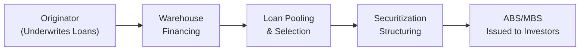
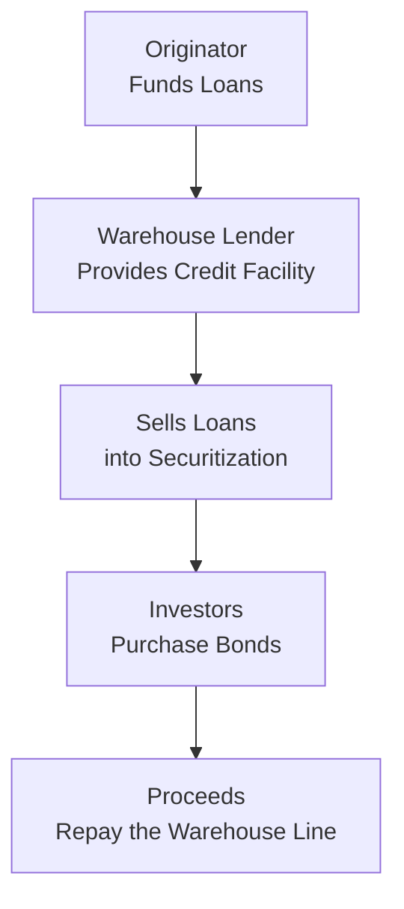

## Introduction  
Warehouse lines play a pivotal role in facilitating the securitization of loans by offering short-term financing to loan originators. If you’ve ever talked to a mortgage lender who mentioned how they “hold” mortgages before bundling them into mortgage-backed securities (MBS), you were hearing about the wholesale engine behind securitization. The entire process hinges on the ability of an originator to temporarily finance these loans—say, residential mortgages or auto loans—until they can be packaged into asset-backed securities or other structured instruments. This moment in the capital markets supply chain is usually invisible to end borrowers, but it's vital to ensuring a smooth flow of credit, especially in consumer-centric segments like mortgages and auto finance.

## Understanding the Securitization Pipeline  
It may feel a bit abstract at first, but visualizing the securitization pipeline helps clarify how warehouse lines fit into the broader chain of events. Let’s walk through the key steps in the pipeline:

• Origination: A lender (the originator) underwrites and funds new loans (e.g., mortgages).  
• Warehousing: The lender finances these loans, typically through a warehouse line, accumulating a sufficient pool to justify securitization.  
• Pool Selection: Once the originator has enough loans with similar characteristics (e.g., interest rates, borrower FICO scores), they group them into a final pool.  
• Structuring and Issuance: The pool is “wrapped” into a structured deal and sold to investors in the capital markets, typically in the form of bonds.  

The pipeline is crucial: it ensures that credit flows from the initial lender all the way to market participants seeking exposure to specific asset classes. The diagram below summarizes these steps.

## Key Concepts of Warehouse Lines  
Warehouse lines are typically revolving credit facilities—meaning the originator can draw funds as loans are created and repay them when the loans are sold or securitized. The facility is collateralized by the loans themselves, and a little safety margin (known as a “haircut”) ensures that if the market value of the collateral declines, the lender doesn’t lose money.

Haircuts vary depending on the type of collateral. For certain mortgages with dependable cash flows and moderate loan-to-value (LTV) ratios, the haircut might be more generous—10% or so. But for riskier or lightly documented loans, the haircut might grow substantially. If the cushion proves insufficient and the originator can’t offload those loans as planned, the lender with the warehouse line can step in.

## Pipeline Risk and Why It Matters  
One big concern for lenders and originators is what many call “pipeline risk.” In short, it means that between the time you originate the loans and the time you sell them—or wrap them up in a securitization—market interest rates or credit spreads could move against you. If rates shoot up or if investor appetite for your particular type of bond weakens, you might find yourself holding loans that are far less profitable or even under water compared to your expected sale price. And that can produce margin compression: your costs to fund the loans rise, but you can’t recoup as much revenue from selling them.

I can recall a situation—back before the Great Financial Crisis—when many originators were so confident about the uninterrupted flow of securitizations. They rarely worried about interest rates jumping or spreads blowing out. Well, eventually, that changed in a hurry, and folks who were unhedged (or underhedged) got hit with big losses.

## Managing Pipeline Risk  
So how do originators protect themselves? A common tactic is to use instruments like forward sales (including TBA, or “to-be-announced,” markets for mortgage-backed securities). These act as a hedge by letting you lock in a future sale price for your loans. Another approach is to use interest rate swaps: if your concern is that rising rates will kill the economics of your pipeline, you can enter a swap as a fixed-rate payer to offset some of that risk.

This approach does come with its own complexities—like basis risk (the mismatch between the rate on your loans and the rate on your hedging instrument) or the possibility that your hedge might not perform as planned because of changes in borrower prepayments. But in general, implementing a well-thought-out hedging strategy on warehouse lines is standard practice.

## Eligibility Criteria and Collateral Requirements  
Warehouse lenders set a range of guidelines to manage their own risk. For instance, there might be explicit collateral eligibility criteria—only loans above a certain credit score or with a particular maximum loan-to-value. The aim is to ensure that the facilities contain loans that are:

• Relatively liquid in the secondary market.  
• Aligned with the lender’s risk appetite.  
• Likely to retain stable valuations before securitization.  

Different lenders also impose different caps, such as a maximum conversion period. This ensures that loans aren’t sitting on the warehouse line indefinitely if the market for new issues is weak. Because, let’s face it, if you kept loans in the warehouse for months or even years, you’d be running a huge risk that market conditions might significantly shift.

## Regulatory Landscape  
Regulatory requirements introduce capital or time constraints to ensure that banks and other financial intermediaries aren’t overexposed to short-term funding disruptions. For example, Basel standards and various local regulations might limit the risk weight or require additional capital buffers for these short-term facilities, especially if they’re not fully secured or if the underlying loans are subprime.

Some regulations even link how long an asset can remain financed under a warehouse line before it must be sold forward or moved into a final securitization. These measures aim to prevent excessive buildup of illiquid positions that might hamper financial stability during times of market stress.

## Liquidity Pressures in Stressful Times  
When markets go haywire, short-term financing can vanish. Remember the 2008 crisis? Many warehouse lines were abruptly pulled or heavily restricted—almost overnight—to limit lenders’ exposure to plunging loan values. This triggered liquidity pressures for originators who suddenly had nowhere to go. If they couldn’t pivot to alternative financing in time, they faced losses or were forced to sell their loans at fire-sale prices. And as we all know, forced selling can contribute to a downward spiral in asset prices.

This dynamic is precisely why rating agencies and sophisticated investors scrutinize an originator’s track record. If the originator has a reputation for high-quality underwriting and stable performance, warehouse lenders are more likely to continue extending the line during brief market tremors.

## Best Practices to Mitigate Risks  
The good news is that the securitization industry has developed tried-and-true practices to prevent pipeline disruptions. Here are a few:

• Diversify Funding: Don’t rely on a single warehouse line. Spread your exposures so that if one lender pulls out, you have alternatives.  
• Proactive Hedging: Use forward sales or derivatives to lock in margins.  
• Conservative Haircuts: Aim to keep haircuts aligned with historical volatility, ensuring that any sudden moves in collateral value won’t fully upend your balance sheet.  
• Tight Underwriting: Loans with robust documentation and stable borrower incomes are easier to securitize and reduce pipeline risk if conditions deteriorate.

## Impact on Investors and Deal Quality  
For investors eyeing the final securitized product—like an MBS or asset-backed note—conditions in the warehouse stage can strongly shape the transaction’s eventual credit quality and structure. If pipeline disruptions occur, the originator might quickly assemble a less optimal loan pool just to get the deal done, which can result in weaker assets making their way into the securitization. Or—in the worst case—some deals might not even reach the market, leading to fewer issuance opportunities.

Hence, many structured finance professionals recommend performing diligence not only on the collateral that eventually enters the deal but also on the originator’s entire pipeline process—how they fund their loans, handle potential liquidity hiccups, and manage interest rate/credit risk before the final issuance. A robust pipeline suggests the final security likely has less last-minute stress or subpar collateral.

## Real-World Example: A Mortgage Originator's Journey  
Imagine you’re a mortgage originator named Sunshine Mortgage Co.:

• You open a $200 million warehouse line with BigBank, with an initial 10% haircut (meaning you can borrow up to 90% on each loan’s principal value).  
• You begin extending 30-year fixed-rate mortgages to homebuyers at 6.0% interest.  
• As you accumulate $200 million of mortgages, you promptly plan a securitization. But in the middle of that process, the Fed signals an unexpected rate hike, pushing mortgage rates up by 0.75%.  
• Suddenly, your cost of warehousing (or the opportunity cost) might rise, and investor demand for new mortgages at 6.0% might slip.  
• If you haven’t hedged, you risk your profit margin shriveling. But if you sold forward a portion of these loans in the TBA market, you likely locked in at least some of your spread.  
• Eventually, you finalize the securitization (an MBS) a month later. You repay the warehouse line with the proceeds from the bond sale.  

Had you not had BigBank’s warehouse line, you couldn’t have aggregated enough mortgages to launch a securitization big enough to be cost-effective. And had you not hedged, you might have faced a massive interest rate mismatch that would undermine your profitability.

## Diagram of a Typical Warehouse-Based Financing  
Below is a simplified layout of how money might flow between originator, warehouse lender, and the final securitization process:

## Practical Considerations and Pitfalls  
• Overreliance on Short-Term Funding: If your warehouse line matures or is unexpectedly canceled, your entire pipeline can unravel.  
• Insufficient Hedging: A surprising move in interest rates can turn an apparently profitable pool of loans into a money-loser.  
• Credit Deterioration: If borrower credit quality declines (e.g., a recession hits), the collateral you hold might not meet the warehouse lender’s eligibility tests any longer.  
• Timing Delays: If structuring takes longer than expected, those loans may overstay in the warehouse, incurring extra fees or margin calls.

## Exam Tips  
• Understand the interplay between warehouse lines and securitization: Focus on how short-term funding supports the creation of longer-duration securities.  
• Know the definitions: Terms like pipeline risk, margin compression, and haircuts often appear in exam questions.  
• Identify risk mitigants: Hedging specifics using forward sales or derivatives is a common topic.  
• Recognize the systemic implications: Warehouse line withdrawals can trigger liquidity squeezes that lead to broader market disruptions.

Always think about how you would approach an exam question that asks: “Given an originator with $X amount of loans in a warehouse line, and a sudden 1% increase in interest rates, how might the originator use hedging to mitigate pipeline risk?” Show a logical progression from the risk to the hedging solution.

## References and Further Reading  
• “Warehouse Financing and Mortgage Banking.” Structured Finance Industry Group (SFIG).  
• Bank for International Settlements (BIS) Working Papers on short-term wholesale funding markets.  
• CFA Program Curriculum, “Fixed Income and Structured Finance,” advanced readings on securitization pipelines.

## Test Your Knowledge: Warehouse Lines & Securitization Pipeline



### Which statement best describes the purpose of a warehouse line in the securitization process?
- [ ] It is a long-term debt instrument used to permanently finance a pool of mortgages.
- [ ] It is a facility used by investors to hedge interest rate exposure through swaps.
- [x] It is a short-term credit facility allowing originators to hold loans before securitization.
- [ ] It is a government guarantee on mortgage-backed securities.

> **Explanation:** A warehouse line is typically a revolving, short-term facility that originators use to finance loans prior to bundling them into structured products such as MBS or ABS.

### What is the primary reason warehouse lenders impose haircuts on collateral?
- [ ] To discourage originators from securitizing loans too quickly.
- [ ] To comply with TBA market rules.
- [ ] To align interest rates between lenders and originators.
- [x] To mitigate risk in case the collateral declines in value or becomes illiquid.

> **Explanation:** Haircuts act as risk buffers by ensuring the lender is protected should the collateral’s value drop.

### Pipeline risk in warehousing primarily arises from:
- [x] Market changes in interest rates or credit spreads before final bond issuance.
- [ ] A mismatch between corporate and government bond yields.
- [ ] Low diversification in the loan portfolio.
- [ ] Excess capital held by the warehouse lender.

> **Explanation:** Pipeline risk centers on the potential for adverse market movements during the time gap between loan origination and securitization.

### When originators hedge their pipeline exposure, which technique is commonly used?
- [ ] Buying put options on equity indexes.
- [ ] Selling credit spreads on corporate bonds.
- [x] Forward sales (TBA) or interest rate swaps.
- [ ] Purchasing foreign currency swaps for cross-border risk.

> **Explanation:** Forward sales and interest rate swaps are standard instruments that originators use to lock in future sale prices or manage interest rate risk.

### Which factor can lead to margin compression for an originator using a warehouse line?
- [x] A sudden increase in interest rates increases funding costs while loan sale prices remain fixed.
- [ ] A stable mortgage rate environment with predictable demand.
- [x] A widening of credit spreads, reducing the price at which loans can be sold.
- [ ] A haircut that remains unchanged regardless of market volatility.

> **Explanation:** If interest rates rise or credit spreads widen, the originator’s cost of holding loans can spike while sale proceeds fall, compressing profit margins.  

### Why might warehouse lines become difficult to renew during periods of financial stress?
- [ ] Regulators increase the maximum time assets can remain in the warehouse.
- [x] Lenders tighten credit standards and reduce liquidity.
- [ ] Haircuts are eliminated, making the facility less profitable.
- [ ] Securitization markets become more attractive.

> **Explanation:** During market turmoil, lenders often become risk-averse and restrict or withdraw short-term funding lines.

### What is a key benefit of performing diligence on an originator’s entire pipeline process?
- [ ] It ensures standardization of haircut practices across multiple warehouses.
- [ ] It guarantees the originator can issue unlimited mortgage-backed securities.
- [x] It assesses potential disruptions that could compromise final deal quality.
- [ ] It allows investors to bypass regulatory capital requirements.

> **Explanation:** Understanding the pipeline process can help investors identify whether conditions at the warehouse stage might lead to subpar loan pools or last-minute changes in the final securitization.

### Which of the following statements is most accurate regarding regulatory constraints on warehouse lines?
- [ ] They require the loans to be held for at least five years before securitization.
- [ ] They allow any type of subprime loan in the warehouse, provided there is a hedge.
- [ ] They have no impact on the duration or capital treatment of the warehouse facility.
- [x] They may limit how long loans can stay in the warehouse and impose capital requirements.

> **Explanation:** Regulators often restrict the time span for warehousing loans and require banks to hold sufficient capital for short-term funding exposures.

### A properly executed hedge on a warehouse line can reduce:
- [x] Pipeline risk from interest rate volatility.
- [ ] Loan default risk stemming from borrower credit issues.
- [ ] The need for final underwriting standards.
- [ ] The significance of the TBA market.

> **Explanation:** Interest rate hedging (via forwards or swaps) aims to neutralize the risk of adverse rate movements while the loans are warehoused.

### True or False: Warehouse financing cannot be pulled before the securing of a final securitization deal.
- [x] True
- [ ] False

> **Explanation:** In practice, warehouse lines can be withdrawn or restricted by the lender if perceived risks increase, even if a final deal has not yet been completed.


