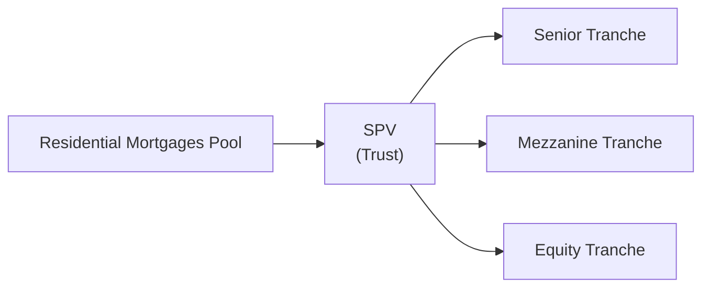

## Introduction

Mortgage-Backed Securities (MBS) can be a fascinating part of fixed income markets—though, let’s be honest, they can also feel intimidating. I remember the first time I had to break down the cash flows of a large pool of residential mortgages: I made a giant spreadsheet that ended up looking more like my morning to-do list than anything else. So let’s address MBS head-on and see how they fit into a broader portfolio context, especially for those preparing for advanced-level CFA exams (or just wanting a deeper dive).

In this section, we’ll explore both Residential Mortgage-Backed Securities (RMBS) and Commercial Mortgage-Backed Securities (CMBS). We’ll talk about how these securities are created, who invests in them, and what unique risks they bring along. We’ll also highlight the effect of prepayment risk, discuss how credit risk differs between RMBS and CMBS, and delve into the tranching structures that underpin these investments. Finally, we’ll segue into how you, as a portfolio manager, might analyze and integrate MBS within your fixed income (and multi-asset) framework.

## Core Concepts of MBS

### The Securitization Process

At a high level, MBS are formed by bundling individual mortgage loans—whether home mortgages (in RMBS) or commercial property mortgages (in CMBS)—into a pool. An intermediary such as a special purpose vehicle (SPV) issues securities backed by the cash flows (principal and interest) from that mortgage pool. Investors in these securities end up receiving those cash flows according to the rules established in the MBS structure.

Below is a simplified Mermaid diagram illustrating the general flow of payments in an RMBS transaction:

Conceptually, the same approach applies for a CMBS structure, although commercial properties have different cash flow and risk profiles—often with balloon payments at maturity.  

### Key Differences Between RMBS and CMBS

• RMBS pools consist of loans secured by residential properties—like single-family homes or condominiums.  
• CMBS pools contain mortgages on commercial properties: offices, shopping centers, hotels, and so on.  

These distinctions mean that RMBS investor performance is heavily influenced by individual homeowners’ ability (or inclination) to refinance or prepay, whereas CMBS is more reliant on the health of commercial rental revenue and mitigation of balloon extension risk.

## Residential Mortgage-Backed Securities (RMBS)

### Agency vs. Non-Agency RMBS

In jurisdictions such as the United States, “agency” RMBS refers to securitizations guaranteed by a government-sponsored enterprise (GSE), such as Fannie Mae or Freddie Mac. Agency MBS gives you a guarantee that principal and interest payments won’t fall victim to borrower default risk (though they still carry interest rate and prepayment risk). That guarantee, however, doesn’t eliminate negative convexity or the challenges of uncertain prepayments.

Non-agency RMBS, also called private-label MBS, lack a federal or GSE-backed guarantee. These instruments carry more credit risk, and their structures often incorporate credit enhancements—like senior/subordinate tranching, overcollateralization, or third-party guarantees—to offset that risk. As an investor, you’d want to look closely at the credit profile of the mortgages in these pools, checking loan-to-value (LTV) ratios, borrower credit scores, documentation standards, and more.

### Prepayment Risk in RMBS

Let’s face it: Prepayment risk can be a real headache for those modeling RMBS. The big question: When will the borrowers decide to refinance or pay off their mortgages early? The moment that mortgage rates drop, homeowners start calling their banks, right? This dynamic means RMBS can behave in ways that differ substantially from traditional fixed-rate bonds.

• Contraction Risk: When rates fall, borrowers may refinance earlier. That means principal gets returned faster than expected, so you, as the MBS holder, might have to reinvest at a lower prevailing interest rate.  
• Extension Risk: When rates go up, fewer people prepay, and your average maturity extends. That’s not necessarily a good thing if you expected to get principal back sooner.  

These swings in effective duration create complexities for relative value analysis, hedging, and portfolio integration.

#### Common Measures: CPR, PSA

• Conditional Prepayment Rate (CPR): An annualized measure of prepayments as a percentage of the remaining mortgage pool balance. It’s a fairly standard metric in MBS analysis.  
• Public Securities Association (PSA) Model: A standard prepayment model that expresses CPR as a percentage of a “benchmark” assumption. For instance, 100% PSA might assume prepayments start slow and ramp up over the first 30 months, then settle in.  

In practice, you might rely on advanced scenario analyses or option-adjusted spread (OAS) models to figure out fair valuations for RMBS. That’s especially relevant for advanced-level CFA exam questions: they often want to see that you can adjust your discount rates for the embedded prepayment option.

### Agency CMOs and Strips

Collateralized Mortgage Obligations (CMOs) essentially split the cash flows from the mortgage pool into distinct “tranches,” each with different payment priorities, coupon rates, and maturities. This structure can cater to varied investor appetites. For instance:

• A short-sequential tranche might appeal to someone seeking lower interest rate risk (until prepayments accelerate).  
• A longer support tranche might be comfortable absorbing early prepayments.  

Further slicing can lead to “IO” (Interest-Only) or “PO” (Principal-Only) strips, each offering unique risk/return profiles. IO strips, for instance, are super sensitive to prepayment speeds, because if those principal balances are paid down quickly, IO holders receive less total interest. POs, in contrast, benefit from prepayments accelerating principal redemption.

## Commercial Mortgage-Backed Securities (CMBS)

### Loan-Level Characteristics

Commercial mortgages differ from residential loans in several ways. Often they include a balloon payment at maturity, meaning a lump sum is due at the end of the loan term. Borrowers thus rely on refinancing or having enough cash on hand to pay that balloon. Analysts evaluate:

• Debt Service Coverage Ratio (DSCR): The ratio of a property’s net operating income (NOI) to its mortgage obligations. A DSCR comfortably above 1.0 indicates the borrower can cover interest (and sometimes principal) from the property’s cash flow.  
• Loan-to-Value (LTV) Ratios: A gauge of how leveraged a property is. LTV compares the mortgage balance to the property’s appraised value. A higher LTV suggests more risk.  

### Prepayment and Extension Risk in CMBS

Prepayment risk in CMBS is generally lower than in RMBS because commercial mortgages often include yield maintenance or prepayment lockouts, making it expensive or contractually impossible for borrowers to refinance early. However, you’ll encounter extension risk if property values tumble or refinancing becomes difficult at maturity. Commercial property cycles can sometimes turn quickly, causing heightened default risk if borrowers can’t cover that balloon payment.

### Cash Flow Stability and Property Market Risk

The health of the underlying commercial property—think: occupancy rates, tenant quality, lease terms—significantly influences default probabilities. A retail shopping center might see more cyclical tenant turnover, while a well-situated office building with long-term corporate leases might be more stable. As an investor, you have to factor in how broader economic or local market disruptions can erode property income and, in turn, hamper mortgage servicing.

### Tranching in CMBS

A typical CMBS transaction is structured with multiple tranches, from super-senior to mezzanine and subordinate slices, each absorbing losses in a specific order. Here’s the trade-off:

• Senior Tranches (AAA-rated typically): Lower yield, protected by subordination from lower tranches, but relatively safer.  
• Mezzanine and Subordinated Tranches: Higher yields, but they’re the first to absorb losses if property defaults occur.  

This risk separation often appeals to different investor classes. A risk-averse portfolio might only look at top-tier tranches, while a higher-yield-seeking investor could mix in subordinate tranches to capture more spread.

## Structuring Mechanics and Credit Enhancements

Both RMBS and CMBS often feature structural safeguards to protect senior bondholders or to enhance the overall credit perception of the transaction:

• Overcollateralization: The face value of the pool’s loans exceeds the bond principal balance, creating a cushion.  
• Reserve Funds: Cash reserves set aside to cover potential shortfalls in interest or principal payments.  
• Excess Spread: The net difference between interest earned on the underlying loans and the coupon paid to bondholders can serve as a buffer to cover delinquencies.

In a practical sense, analyzing credit enhancement is a critical exam question area—you might have to identify how structural protection can mitigate or shift certain risks. Additionally, for advanced portfolio managers, stress testing these enhancements under different economic scenarios is essential to ensure that exposures remain within risk tolerances.

## MBS Risk Analysis and Key Metrics

### Interest Rate Risk and Negative Convexity

Coupon-bearing MBS are sensitive to changes in interest rates. But because of prepayments, MBS typically exhibit “negative convexity:” as rates go down, principal gets paid back sooner, capping your upside. As rates rise, your maturity lengthens, and you might get stuck holding a low-coupon asset longer. Traditional duration and convexity approaches must be adapted to handle these option-like cash flows.

If you’re constructing a fixed income portfolio that includes MBS, you might use key rate duration for scenario analysis, focusing on how changes in certain segments of the yield curve (e.g., the 2-year vs. the 10-year) affect your MBS valuations. Tools like Option-Adjusted Spread (OAS) analysis are commonplace to measure the embedded prepayment option, enabling apples-to-apples comparisons to corporate bonds or other spread instruments.

### Credit Risk

• Agency RMBS: Mostly limited to the willingness and ability of the GSE or government to honor its guarantee. The main risk is prepayment and extension, not credit.  
• Non-Agency RMBS: Subject to borrower credit. You’ll assess FICO scores, LTV, property location, job markets, etc.  
• CMBS: More complex, reliant on property NOI and local commercial real estate markets. The DSCR and LTV are key.  

When modeling default probabilities in CMBS, you often apply scenario-based vacancy rates and lease rollover assumptions. If the local economy weakens—leading to higher vacancy or lower rents—a spike in defaults or delinquencies can occur. Stress scenarios might include big events like recessions or a dramatic shift in e-commerce for retail-based commercial properties.

### Liquidity Risk

MBS, particularly less standardized private-label RMBS or certain subordinate CMBS tranches, can become quite illiquid in times of market stress. For advanced-level exam analyses, it’s a good idea to discuss the effect of liquidity constraints on portfolio rebalancing and the potential for wide bid-ask spreads in volatile markets.

## Pricing and Valuation Methodologies

### Pass-Through Valuation

Pass-through securities distribute principal and interest collected from homeowners or commercial borrowers to investors. A common starting point is to discount future expected cash flows at a discount rate that reflects the yield environment plus a spread for credit and optionality. Still, because actual prepayments can deviate from expectations, you rely heavily on assumptions about future interest rates and borrower behavior.

### Option-Adjusted Spread (OAS) Models

OAS modeling uses a binomial tree or Monte Carlo simulation to ascertain the fair value of an MBS by considering the borrower’s refinancing option. You effectively simulate many interest rate paths, figure out cash flows under each scenario (including modeled prepayments), discount them back, and then derive a spread over a benchmark curve that equates to the MBS’s market price.

These OAS models are central to advanced-level analysis, especially for exam questions that require you to handle partial durations, interest rate volatility assumptions, and compare relative value across different structured products.

## MBS in Portfolio Context

### Asset Allocation and Liability-Driven Investing (LDI)

Institutional investors, like pension funds or insurance companies, often hold large allocations of MBS. They might be searching for yield pickup over Treasuries, or they see MBS as a good match for certain liabilities—especially if they’re dealing with uncertain liability timelines. The negative convexity, though, can pose problems for immunization strategies because the duration can shift unpredictably with changes in interest rates.

### Hedging Strategies

To manage MBS risk, portfolio managers might employ:

• Interest rate swaps or swaptions to hedge directional rate moves.  
• Treasury futures or short positions in interest rate–sensitive instruments to offset extension or contraction.  
• Swaptions that replicate the embedded call option in mortgages.  

These hedges aim to reduce the overall portfolio’s exposure to large changes in prepayment speeds.

### Regulatory Capital and Reporting

Under various regulatory regimes—like Basel III—for banks, or insurance-specific rules such as RBC regulations in the US, MBS may be assigned different risk weights depending on factors like credit rating or external guarantees. For IFRS or US GAAP, MBS might be classified as trading, available-for-sale, or held-to-maturity, each carrying different implications for balance sheet and income statement volatility.

## Real-World Examples and Case Studies

• 2008 Financial Crisis: The meltdown in subprime RMBS taught the market a painful lesson on the importance of credit analysis, correlation of defaults, and transparency. Many triple-A tranches turned out to be anything but safe.  
• CMBS Post-Crisis: Commercial real estate faced large-scale refinancings of balloon mortgages, leading to restructured deals and forced property sales. Bridge loans and specialty lenders stepped in at times, forging new CMBS issuance patterns.  
• COVID-19 Pandemic: CMBS for office and retail properties experienced stress as tenants struggled with rent obligations and remote-work transitions. DSCRs tightened, leading investors to reevaluate extension and default risk.

## Best Practices and Common Pitfalls

1. Underestimating Prepayment Risk: Don’t rely on generic “X% CPR” assumptions. Conduct scenario analyses incorporating volatility and interest rate paths.  
2. Ignoring Structure: All MBS are not created equal—pay attention to tranching, credit enhancements, and subordination.  
3. Failing to Hedge Properly: MBS can have high negative convexity. Ensure your interest rate hedges and partial durations reflect that.  
4. Limited Liquidity Data: Thin trading can hamper reliable quoted prices, so keep an eye on actual transaction data, or rely on reputable pricing services to confirm marks.  

## Practical Exam Tips

• When faced with MBS valuation questions, highlight the interplay between interest rate risk and prepayment risk. Use correct formulas (e.g., OAS vs. nominal spread) and discuss the underlying modeling assumptions.  
• If an exam question focuses on “structural features,” be sure to address how the structure redistributes credit and prepayment risk.  
• For performance attribution or risk analysis, be prepared to break out the effect of interest rate moves vs. prepayment variability.  
• In item sets, watch for clues about credit risk. If you see low DSCRs or high LTVs, that’s a major red flag in CMBS.  
• For essay (constructed response) questions, show that you can articulate the trade-offs of investing in higher-yield tranches vs. the stable cash flow of an agency-backed security.  

## References

• Fabozzi, F. J. (2006). “Bond Markets, Analysis, and Strategies.” Upper Saddle River, NJ: Pearson.  
• IMF Staff Discussion Note: “Commercial Real Estate and Financial Stability,” IMF.  
• CFA Institute. (Latest). “Mortgage-Backed Securities” in CFA Program Curriculum.  

--------------------------------------------------------------------------------

## Test Your Knowledge: Mortgage-Backed Securities (RMBS & CMBS) Mastery Quiz



### Which best describes prepayment risk in RMBS?

- [ ] The risk that interest payments will be reduced if borrowers default.  
- [ ] The risk that interest rates will fluctuate significantly between coupon dates.  
- [x] The risk that borrowers refinance or pay off their mortgages earlier than expected.  
- [ ] The risk that the government will introduce new mortgage regulations.  

> **Explanation:** Prepayment risk specifically refers to the likelihood borrowers will repay principal faster than expected. This alters the bond’s expected cash flows and can reduce returns if reinvestment rates are lower.

### When analyzing CMBS, which factor is generally least relevant compared to RMBS?

- [x] Personal credit scores of borrowers.  
- [ ] Debt service coverage ratio (DSCR).  
- [ ] Balloon payment structure.  
- [ ] Loan-to-value (LTV) ratio.  

> **Explanation:** In CMBS, the underwriting focus is on the commercial property’s NOI and related metrics. Residential borrower credit scores are a hallmark of RMBS analysis, not CMBS.

### Which statement is most accurate concerning the difference between agency and non-agency RMBS?

- [ ] Agency RMBS typically carry higher credit risk than non-agency RMBS.  
- [ ] Non-agency RMBS are usually guaranteed by government entities.  
- [x] Agency RMBS often feature reduced credit risk due to a GSE guarantee.  
- [ ] Agency RMBS have no prepayment risk.  

> **Explanation:** Because agencies like Fannie Mae or Freddie Mac guarantee payment of principal and interest, agency RMBS generally have less credit risk. They are still subject to prepayment risk.

### In CMBS analysis, a DSCR of 1.2 typically implies that:

- [ ] The borrower is unable to service debt.  
- [ ] Principal repayment is risk-free.  
- [x] Net operating income is 20% above the mortgage payment obligation.  
- [ ] The investor receives 1.2 times the mortgage principal upfront.  

> **Explanation:** The DSCR is the ratio of property net operating income to its required debt service. A DSCR of 1.2 means NOI is 20% above debt obligations, indicating a buffer above minimum payment needs.

### What is the main purpose of arranging MBS into different tranches?

- [x] To reallocate prepayment and credit risk among various classes of bondholders.  
- [ ] To ensure uniform maturity dates for all bondholders.  
- [ ] To diversify into non-mortgage assets.  
- [ ] To reduce the overall number of investors involved in the deal.  

> **Explanation:** Tranching structures carve out different risk-return profiles, channeling prepayment and default risk to meet investors’ varying appetites.

### How does negative convexity typically affect MBS prices when interest rates fall?

- [ ] MBS prices rise more sharply than a standard bond.  
- [x] MBS prices rise less than a similar-duration, option-free bond.  
- [ ] MBS prices remain unaffected.  
- [ ] MBS prices fall due to extension risk.  

> **Explanation:** Because prepayments accelerate when rates fall, investors get their principal back sooner and can reinvest at lower rates. This caps the potential price appreciation, resulting in negative convexity.

### Which of the following is more characteristic of RMBS than CMBS?

- [x] Significant prepayment risk from individual borrowers.  
- [ ] Balloon payment structures are a central theme.  
- [x] Greater reliance on personal credit scores and borrower documentation.  
- [ ] Yields that typically do not vary with the credit cycle.  

> **Explanation:** RMBS often hinge on residential borrower behavior, so personal credit scores and premount-of prepayment risk are significant. CMBS is more about commercial property cash flows.

### A typical reason CMBS prepayments are lower than RMBS prepayments is:

- [ ] CMBS typically have no refinancing options.  
- [x] Commercial mortgages often have prepayment penalties or lockout periods.  
- [ ] CMBS have unlimited government backing.  
- [ ] Borrowers in CMBS cannot default on their loans.  

> **Explanation:** Many commercial mortgages include contractual or financial penalties for early repayment, which deters prepayments.

### In modeling RMBS cash flows, the PSA model:

- [ ] Is used to measure overall credit risk in MBS.  
- [x] Proposes a standard pattern of prepayment ramp-up over time.  
- [ ] Completely eliminates uncertainty regarding future cash flows.  
- [ ] Is irrelevant for analyzing extension risk.  

> **Explanation:** The PSA model provides a benchmark for prepayment speeds, starting with a ramp-up period in the early months of the mortgage and then stabilizing. It remains a reference point rather than a guarantee.

### The statement “Agency MBS are free of all risk” is:

- [x] False  
- [ ] True  

> **Explanation:** While agency MBS have an implied or explicit guarantee against default risk, they still carry interest rate risk and prepayment risk.


