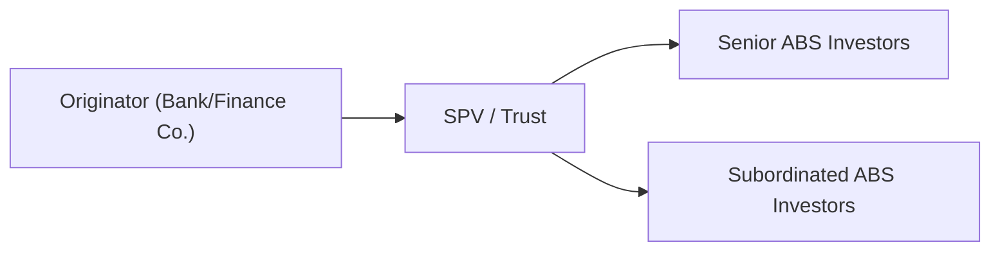

## Introduction and Overview

Has it ever happened to you that you’re walking through a finance office, hearing folks talk incessantly about “ABS,” and you wonder if it’s just another fancy acronym for something you already know? Well, trust me, you’re definitely not alone in that. Asset-Backed Securities (ABS) are quite a mouthful of a term, but they’re not as intimidating once we peel back the layers.

Broadly, ABS are bonds (or notes) created by pooling numerous financial assets—often consumer debt obligations—like auto loans, credit card receivables, student loans, or even equipment leases. The holders of these ABS essentially become investors in the cash flows generated when the borrowers (car buyers, credit card users, students, etc.) repay their debts. For portfolio managers and CFA candidates, understanding how ABS are structured, rated, and traded helps in building better diversification strategies, enhancing yield, and managing credit exposures in multi-asset portfolios.

## Key ABS Collateral Types

### Auto Loan ABS

Auto loan ABS are probably the simplest to understand. Consumers borrow money to purchase vehicles, and these loans, made by banks or specialty finance companies, are packaged (securitized) into bonds. You’ll see a bunch of these deals in the market, usually named something like “XYZ Auto Receivables Trust.” Investors receive principal and interest payments from the cash flows that come from borrowers’ monthly car loan payments.

• Maturity: Typically short to medium in duration (often 2–5 years).  
• Rates: Can be fixed or floating, depending on the market environment and how the transactions are arranged.  
• Credit Enhancement: Commonly includes subordination (i.e., some subordinate bonds absorb losses first), reserve funds, and overcollateralization (when the face value of the auto loan pool exceeds the principal of the ABS).  
• Unique Considerations: Auto loans are generally amortizing, so the principal is repaid progressively over time along with interest.

You might be curious about performance in economic downturns. Well, if unemployment spikes, some borrowers can’t make car payments. However, in many jurisdictions, repossessing a car is relatively straightforward compared to foreclosing on a home, and that influences recovery rates. From a portfolio perspective, auto ABS often offer higher yields than similarly rated corporate bonds of the same maturity because of their structured nature and consumer credit exposure.

### Credit Card ABS

Credit card ABS revolve around, well, revolving credit. This means you’re dealing with a different type of payment schedule: cardholders pay some portion or all of their outstanding balance month to month, and new charges may also accumulate at the same time.

• Master Trust Structures: A master trust is an entity that issues multiple “series” of ABS over time, all backed by a pool of credit card receivables. As new card charges come in daily, the trust can add more receivables.  
• Controlled Amortization Period: Many credit card ABS have a revolving period during which investors are mainly paid interest, and principal payments are reinvested in new receivables. After that, there’s a controlled amortization phase which systematically returns the principal to investors.  
• Credit Enhancement: As with auto loans, subordinate tranches, reserve accounts, and overcollateralization are common.  
• Key Risks: Economic factors such as unemployment, interest rate changes, and shifts in consumer spending. Default rates can increase significantly if the economy takes a nosedive, which reduces the trust’s cash flow.  
• Payment Rate and Yield: The principal payment rate (including any voluntary paydowns) is essential in analyzing the performance of these structures.

In the early 2000s, credit card ABS boomed as more established banks realized the profitability in securitizing consumer debt. Historically, consumers prioritize car and mortgage payments over credit cards in a crisis, but that definitely depends on local cultural and regulatory norms—some markets see consumers continuing to pay credit cards first. This behavioral variance is important when analyzing default and recovery expectations.

### Other Common Types

• Student Loan ABS: Often come with certain deferral or forbearance rights for borrowers. That can delay scheduled payments, so cash flow modeling requires extra caution.  
• Equipment Lease ABS: Typically offered by companies manufacturing large machinery or technology hardware.  
• Floorplan ABS: Backed by dealer inventory financing (think auto dealerships financing their showroom vehicles through short-term loans).

For the purposes of the CFA examination and advanced portfolio management, auto loan and credit card ABS are the core focus, but you can extend much of this logic to other consumer-based ABS.

## Typical ABS Structure

Before diving deeper into credit analysis, let’s visualize the structure of a straightforward ABS transaction. Imagine a scenario with an originator (the lender), a Special Purpose Vehicle (SPV), and you, the investor.

1. The originator extends loans or credit lines to consumers.  
2. Those receivables are sold to an SPV (or trust).  
3. The SPV packages the loans into securities—senior and subordinated tranches—offered to investors.  
4. Investors receive cash flows from the underlying pool as borrowers make payments.

This isolates the asset pool from the originator’s balance sheet, making the securitization “bankruptcy-remote.” If the originator goes bankrupt, the ABS investors generally still have a direct claim on the pooled collateral.

## Credit Enhancement and Structural Protections

### Subordination (Senior/Subordinate Tranching)

Every ABS transaction typically has multiple tranches, from AAA down to equity or residual pieces. Losses incurred in the collateral pool first wipe out the equity or junior (subordinate) tranches before affecting the senior tranches. This layering is there to protect the most senior bonds. When you, as a senior bond investor, see a thick supporting subordinate layer, you’re likely to receive a higher rating from agencies. That said, subordination has its limitations if defaults pile up unexpectedly.

### Overcollateralization (OC)

Overcollateralization is kind of like wearing a belt and suspenders; the collateral pool is set to exceed the par value of the bonds issued, leaving a protective cushion that can absorb losses. For instance, if you buy a $100 million bond backed by $110 million of auto loans, that extra $10 million forms a first line of defense against defaults.

### Reserve Accounts

A reserve account is a cash fund (like an escrow) carved out at the inception of the deal or built up over time from excess spread (the difference between the loan interest received and the coupon paid to investors). This reserve acts as a liquidity buffer. If payment collections are temporarily short or if default rates spike, the reserve covers the shortfall until normalcy resumes.

### Excess Spread

Excess spread is also important. It’s the difference between the interest received on the collateral and the sum of coupon payments plus fees. If the transaction is well-structured and the collateral performs as expected, the leftover can be accumulated or used to replenish reserve accounts, further protecting senior investors.  

## Evaluating ABS Performance

### Key Variables

1. Default Rate: Percentage of loans that become non-performing.  
2. Recovery Rate: How much is eventually recovered from defaulted loans.  
3. Payment Rate (for credit card ABS): Proportion of principal that cardholders pay back monthly.  
4. Prepayment Speed (for auto loan ABS): How quickly borrowers repay principal ahead of schedule.  

Mathematically, you might see default rate approximated like:


\text{Annual Default Rate} = \frac{\text{Number of Defaulted Loans in a Given Year}}{\text{Total Number of Loans at Beginning of That Year}}


Sure, that’s a simplified approach, but it helps give a sense of how we measure the health of the collateral pool.

### Servicing Quality

Ever tried to collect money from a friend who always “forgets” they owe you $20 for lunch? Well, in the ABS world, it’s somewhat similar. The party specializing in collecting payments and ensuring timely remittance to the trust is called the servicer. Their efficiency, ability to handle delinquencies, and strong infrastructure to manage accounts is critical. If the servicer falls short, the entire transaction can experience disruptions—and that’s obviously bad news for investors.

Portfolio managers are typically advised to review the servicer’s track record, servicing platform stability, and any backup servicing arrangements (in case the primary servicer fails).  

## Auto Loan ABS Nuances

Let’s say you’re looking at a $500 million auto loan securitization. Typically, interest rate risk might be modest if the underlying loans have fixed rates and the ABO (Asset-Backed Obligation) structure is also fixed-rate. If it’s not matched correctly, interest rate mismatches can appear. Also, repossession and resale values of vehicles matter (i.e., the recovery in the event of default). So, if used car prices sag dramatically, potential losses become more pronounced.

## Credit Card ABS Nuances

Given credit card receivables are revolving, analyzing them is a bit more dynamic. Payment rates, line utilization rates, and trust performance metrics (delinquency rates, net charge-offs, etc.) are typically reported monthly. Their structures often create bullet maturities or revolve for a certain period, making advanced forecasting tricky. One important factor is the discount rate applied to the principal when the trust is rotating in new receivables. If the economy goes south, card usage might go up (people rely on credit if they lose income), but simultaneously, delinquencies and charge-offs might jump.

## Real-World Scenarios

I remember working on a project to model an auto loan ABS for a mid-sized finance company right before a local economic downturn. They boasted low default rates historically, but the unemployment rate soared suddenly as a key local employer shut down. Borrowers began defaulting en masse. The subordinate tranches got wiped out fast. However, strong overcollateralization saved the senior paper, which continued paying nearly on schedule. That starkly demonstrates the utility and limitations of credit enhancements.

During the 2008–2009 crisis, many credit card ABS deals saw their yields spike, partly due to liquidity stress but also from rising consumer defaults. However, many deals held up relatively well due to robust servicing practices and the subordinate tranches’ ability to absorb initial losses.

## Investment Considerations for Portfolio Management

1. **Yield Enhancement**: ABS often offer yield pickup over Treasuries or similarly rated corporate bonds.  
2. **Diversification**: ABS can be less correlated to corporate credit risk (they are more correlated with consumer credit risk, which follows different patterns). This is handy for multi-asset strategies.  
3. **Liquidity Risk**: Some ABS, particularly older or smaller deals, can trade infrequently. Larger, standard credit card or auto ABS deals from big issuers are typically more liquid.  
4. **Interest Rate Sensitivity**: While many ABS are short to medium in duration, interest rate changes can still affect prepayment or revolve rates.  
5. **Regulatory Capital Considerations**: Large institutional investors might factor in capital charges associated with structured products.  
6. **Return Volatility**: If consumer default rates rise unexpectedly, especially in a recession, AAA tranches might still fare well, but mezzanine (mid-level) tranches can see performance deteriorate quickly.

From an LDI (Liability-Driven Investing) perspective, short to medium-duration ABS can be a suitable match for near- to intermediate-term liabilities, but it does introduce the complexity of consumer default risk rather than corporate credit risk.

## Best Practices and Common Pitfalls

• **Over-Reliance on Ratings**: Relying purely on credit ratings without looking at underlying collateral performance can lead to big surprises. Always dig deeper.  
• **Ignoring Servicer Strength**: A strong servicer can mitigate delinquencies through robust collection practices. A negligent servicer can let a well-structured deal flounder.  
• **Underestimating Macroeconomic Factors**: ABS are sensitive to consumer health, unemployment, interest rates, and disposable income. Keep an eye on cyclical data.  
• **Assuming Prepayment Speed**: If your prepayment assumption is wrong, your projected yield could go out the window.  
• **Insufficient Liquidity Analysis**: Not all ABS are equally liquid. Smaller, off-the-run deals can lock you in longer than intended.

## Putting It All Together

For a CFA candidate, particularly at Level III, the exam might test your ability to explain the mechanics of a securitization structure, analyze the risk factors, or incorporate an ABS position into a broader portfolio. On the essay portion, you may get a mini-case describing a trust with certain credit enhancements and be asked to assess if it’s suitable for a pension plan’s LDI strategy. Or in item sets, you could find yourself calculating the impact of higher default rates on the subordinate tranche and how that changes the senior tranche’s yield or rating.

ABS are a testament to financial engineering’s ability to spread risk—but it’s also a reminder that complexity can obscure underlying vulnerabilities. Knowing what’s “under the hood” helps you manage these instruments effectively.

## Glossary (Selected Terms)

• **Asset-Backed Security (ABS)**: A bond backed by pools of non-mortgage financial assets, such as auto loans or credit card receivables.  
• **Auto Loan ABS**: ABS derived specifically from auto loans; mostly amortizing.  
• **Credit Card ABS**: ABS derived from credit card receivables; revolve during the draw period.  
• **Master Trust**: A legal trust that can issue multiple ABS tranches backed by the same pool of collateral.  
• **Overcollateralization (OC)**: When the face value of the asset pool exceeds the face value of outstanding ABS, forming a protective cushion.  
• **Reserve Account**: A cash fund set aside to cover temporary shortfalls in cash flow or higher defaults than expected.  
• **Default Rate**: The proportion of loans that fail to make required payments on time.  
• **Recovery Rate**: The fraction of a defaulted loan’s principal eventually recouped by the investor.

## References and Further Reading

• Kothari, V. (2006). “Securitization: The Financial Instrument of the Future.” Singapore: Wiley.  
• Moody’s and S&P Rating Criteria for ABS (publicly available rating methodologies).  
• Citi Research (Ongoing). “Global Structured Finance Research Reports.”  
• CFA Institute. (Most Recent Edition). Fixed Income and Structured Products Curriculum Readings.  

## Test Your Knowledge on Asset-Backed Securities



### Analyzing Key Elements of Auto Loan ABS

- [x] They are typically short- to medium-term amortizing securities.  
- [ ] They rely primarily on balloon payments at maturity.  
- [ ] They do not provide any credit enhancement to protect investors.  
- [ ] They do not require a servicer to collect loan payments.  

> **Explanation:** Auto loan ABS generally have maturities under five years, feature amortizing payments, and include various forms of credit enhancement and a dedicated servicer.

### Credit Card ABS Payment Structures

- [ ] Credit card ABS principal payments are always scheduled and fixed.  
- [x] Credit card ABS have a revolving feature followed by a controlled amortization.  
- [ ] Credit card ABS rely on balloon payments at the end of the first year.  
- [ ] Credit card ABS are not allowed to add more receivables once the trust is created.  

> **Explanation:** Credit card ABS often utilize a revolving (interest-only) period and subsequently enter a controlled amortization phase. Master trusts can add new receivables over time.

### Role of Overcollateralization

- [x] It provides a buffer by having collateral in excess of the ABS note balances.  
- [ ] It lowers the holding cost by issuing fewer securities relative to the collateral.  
- [ ] It makes sure every tranche is senior in structure.  
- [ ] It is a form of liquidity facility provided by banks.  

> **Explanation:** Overcollateralization ensures that the principal amount of the underlying pool of loans exceeds the face value of the ABS, creating a protective cushion against losses.

### Master Trust Structures in Credit Card ABS

- [x] They allow multiple series of ABS to be issued from the same collateral pool.  
- [ ] They prohibit adding new receivables into the trust.  
- [ ] They exist only in mortgage-backed securitizations.  
- [ ] They do not require any form of credit enhancement.  

> **Explanation:** A master trust is a flexible structure permitting issuers to bring new series of bonds to market, backed by the same or expanding collateral pool.

### Importance of Servicing Quality

- [x] A stronger servicer can improve collection and reduce delinquencies.  
- [ ] The servicer has minimal impact on ABS performance.  
- [ ] Servicing quality is only relevant for home mortgage ABS.  
- [ ] Backup servicing arrangements are never utilized.  

> **Explanation:** The servicer’s collection efforts and infrastructure are crucial to ensuring timely payments. Backup or secondary servicers are often put in place for risk mitigation.

### Default Rate Calculation

- [x] Default Rate = (Number of Defaulted Loans) / (Total Loans).  
- [ ] Default Rate = (Recovery Rate) / (Total Receivables).  
- [ ] Default Rate = (Coupon Payment) / (Principal Outstanding).  
- [ ] Default Rate = (Excess Spread) – (Subordination Percentage).  

> **Explanation:** The default rate is the basic ratio of defaulting loans to total loans. Recovery rate is a separate measure.

### Credit Enhancement Tools

- [x] Subordination, overcollateralization, reserve funds.  
- [x] They help protect senior tranche investors.  
- [ ] They aim to increase the overall collateral supply to junior investors first.  
- [ ] They have no bearing on the bond’s rating.  

> **Explanation:** Credit enhancement typically benefits the senior tranches by shielding them from initial losses, thereby supporting higher ratings.

### Liquidity of ABS

- [x] Large, standardized issues often trade more frequently.  
- [ ] All ABS trades are extremely liquid at all times.  
- [ ] ABS is always more liquid than government bonds.  
- [ ] Liquidity is irrelevant to institutional investors.  

> **Explanation:** Liquidity can vary widely in ABS markets; higher-volume or more standardized deals often have better liquidity.

### Impact of a Rise in Unemployment on Consumer ABS

- [x] Likely increases delinquencies and defaults.  
- [ ] No effect on payment behavior.  
- [ ] Immediately restructures all outstanding ABS deals.  
- [ ] Reduces subordination’s role in the structure.  

> **Explanation:** Rising unemployment is closely tied to increased defaults among consumer receivables, influencing both short-term cash flows and bond prices.

### True or False: Credit Card ABS Pools Are Completely Static

- [ ] True  
- [x] False  

> **Explanation:** Credit card ABS often utilize a revolving structure (particularly in master trusts), which allows adding or removing receivables over time.


