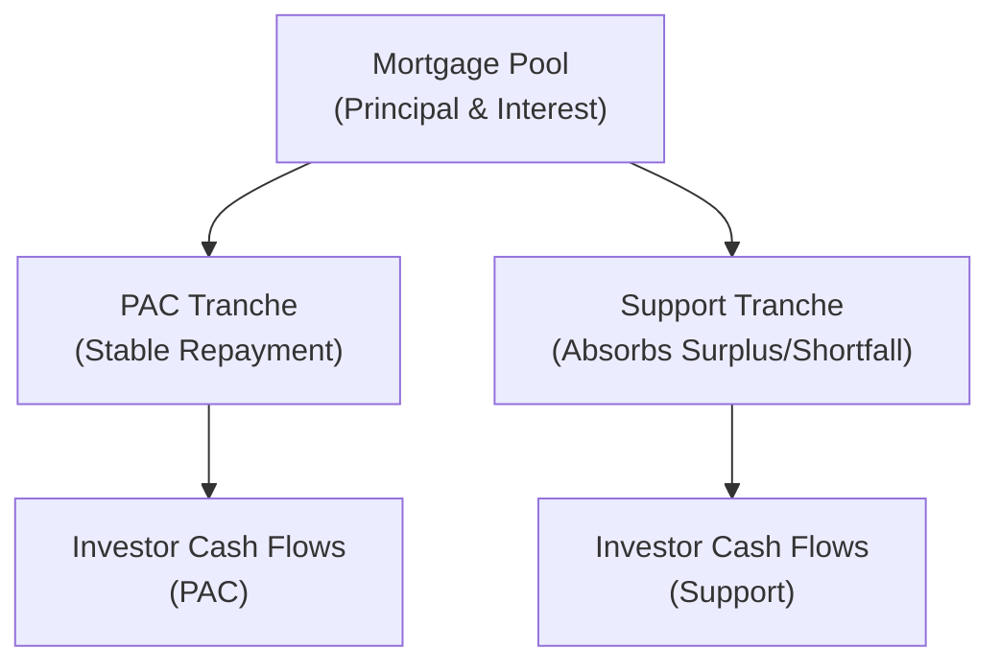

## Introduction

Collateralized Mortgage Obligations (CMOs) emerged as a structured solution to a longstanding problem: managing the unpredictable nature of mortgage prepayments. At some point, every budding fixed-income analyst stumbles upon pass-through mortgage-backed securities (MBS) and thinks, “Wow, these things pay interest and principal, but the timing is all over the place!” CMOs were designed to address that timing uncertainty and slice it into more manageable pieces for different investor tastes. In other words, if you want stable cash flows, you can buy specific tranches, while those willing to take on more prepayment variability can buy others.

But let’s not get ahead of ourselves. A CMO is essentially a special type of MBS that re-segments cash flows from an underlying pool of mortgages into multiple “tranches.” Each tranche, or class, has its own characteristics—such as maturity, coupon rate, and prepayment risk exposure. By doing this, issuers can create relatively safe and stable tranches for conservative investors while also meeting the appetite for higher-yield/higher-risk profiles.

Below, we’ll dive deep into how these tranches receive their principal and interest, why that matters when prepayment speeds change, and how these investments are modeled and valued. Despite the complexity, the goal of a CMO is pretty straightforward: break down the mortgage pool’s risk into neat little parcels.

## The Building Blocks of MBS and the Birth of CMOs

Before we unravel the complexities of CMOs, it’s helpful to recall the foundation: traditional pass-through MBS. In a pass-through structure, mortgage payments (both principal and interest) “pass through” to investors on a pro-rata basis. But as interest rates move, homeowners often prepay or refinance their mortgages at unpredictable times, creating contraction or extension risk. This can be unsettling for certain investors looking for stable maturities or predictable cash flows.

And that’s precisely where CMOs come in. They take that same pass-through pool and say, “Let’s repackage it so we can control who gets principal first, who gets it later, and how any changes in prepayment speed are best absorbed.” Different tranches form a natural waterfall, guiding the flow of cash.

## Key CMO Structures and Tranches

### Sequential-Pay Tranches

In the simplest CMO structure, known as a sequential-pay CMO, the tranches receive principal distributions in a strict sequence—Tranche 1 receives principal payments first until it’s fully retired, Tranche 2 receives them next, and so on. Interest, however, is typically paid to all tranches as long as they remain outstanding.

This structure inherently creates different average lives (and different levels of prepayment risk) for each tranche. Investors in Tranche 1 might see their principal returned quickly if prepayments run high, while investors in Tranche 3 or 4 might have to wait longer.

### Planned Amortization Class (PAC) Tranches

PAC tranches aim to provide the kind of predictability that many risk-averse investors crave. If you’ve ever heard someone say, “I want as little surprise as possible,” the PAC might be for them (though, you know, nothing’s absolutely guaranteed in fixed income).

PAC tranches operate based on a “planned” schedule of principal repayments. This schedule is supported by “support tranches,” sometimes called companion tranches, which absorb excess prepayments or shortfalls relative to a designated speed (often defined using PSA or CPR models—more on those later). The arrangement buffers the PAC tranches from the brunt of prepayment volatility. Essentially, the PAC says, “I’m going to get principal exactly on schedule—unless the entire mortgage pool’s prepayment speed goes way off the rails—because my support buddy here will handle the lumps.”

### Targeted Amortization Class (TAC) Tranches

TAC tranches also strive for cash flow stability, but typically with protection against either slower- or faster-than-expected prepayments—not both. This single-sided prepayment protection is less robust than the PAC, making TACs somewhat riskier. Investors get stable principal payments if prepayment speeds stay above or below a particular threshold, but if the speed deviates in the opposite direction, the TAC wraps up the potential turbulence.

### Support (Companion) Tranches

Support tranches are the unsung heroes (or maybe the under-appreciated older siblings who handle responsibilities). They come to the rescue by absorbing excess or insufficient prepayments first. If the mortgage pool pays too quickly, support tranches retire faster; if it’s too slow, they stick around longer. By adjusting their lifespan, they keep the PAC or TAC tranches humming along their respective schedules.

### Real Estate Mortgage Investment Conduits (REMICs)

In the United States, the REMIC structure is the legal framework that allows multiple classes of securities to be issued from the same mortgage pool. Think of REMIC as a special tax-advantaged entity that issues the CMO tranches. REMICs can accommodate a variety of structures—including sequential pay, PAC, TAC, and other exotic variations—and provide flexibility in how interest, principal, and tax liabilities are administered.

## The Waterfall Mechanism

One of the biggest draws of a CMO is the elaborately choreographed flow of funds, known as the “waterfall.” The idea is simple in theory but can be quite intricate in practice:

• Interest from the mortgage pool is collected and distributed first to each tranche (unless otherwise specified by a structure like interest-only or principal-only tranches).  
• Principal payments are prioritized according to the seniority of each tranche. In sequential structures, you’ll see the topmost (or earliest) classical tranche retire before the next begins receiving principal. In a PAC structure, the PAC tranches get principal according to their planned schedule, with surplus or deficit going to support tranches.  

When mortgage borrowers refinance faster than anticipated, certain tranches (often support tranches) get the lumps. By custom-tailoring these allocations, sponsors can create unique risk\return profiles, letting each investor decide how much prepayment risk they’re willing to bear.

Here is a simplified diagram to visualize waterfalls in a PAC-based CMO structure:

In this schematic, both the PAC tranche and the support tranche receive cash flows derived from the mortgage pool. However, if prepayments accelerate, the support tranche retires faster, keeping the PAC on track. If prepayments slow down, the support tranche extends, once again preserving the PAC’s schedule.

## Prepayment Modeling: PSA and CPR

The entire premise of a CMO’s structure hinges on how quickly principal gets paid back. That means everyone is obsessed with prepayment modeling. Two common acronyms thrown around are PSA (Public Securities Association) and CPR (Conditional Prepayment Rate):

• PSA Model: Often used as a benchmark, it assumes a monthly increase in prepayment rates in the first 30 months, then levels off. For instance, 100% PSA means the pool follows a “standard” pattern. 200% PSA suggests it’s prepaying twice as fast, and so on.  
• CPR: An annualized measure reflecting the percentage of outstanding principal expected to be prepaid in one year. If a pool has a 10% CPR, you assume about 10% of that pool’s outstanding principal will be prepaid in that year.

Investors often test “what if” scenarios by shifting PSA or CPR assumptions: “What if we’re at 150% PSA?” “What if rates drop drastically and we jump to 400% PSA?” This stress testing helps them see how each tranche might fare.

## Valuation Techniques and OAS

Just like mortgages contain embedded prepayment options (borrowers can choose to refinance or partially prepay), CMO tranches embed those same complexities. Traditional yield-to-maturity metrics struggle with the optionality. That’s why many professionals turn to option-adjusted spread (OAS). OAS is effectively the spread over a benchmark yield curve after accounting for the option-like features of the security.

Yes, it can get math-heavy. You might see complex Monte Carlo simulations embedded into analytics software, modeling thousands of interest rate paths. For each interest rate path, the prepayments are projected and discounted. The resulting distribution of present values forms the basis for computing an option-adjusted measure of relative value.

In simpler terms: OAS tries to isolate the compensation you earn for credit and liquidity risk once you’ve accounted for the borrower’s right to prepay. A higher OAS indicates potentially more attractive value, given the embedded risks.

## Extension Risk and Contraction Risk

For an MBS holder, there are generally two dreaded scenarios:

• Extension Risk: When interest rates rise (and no one refinances), your principal gets repaid more slowly, lengthening the life of the bond and forcing you to sit on lower coupons while rates in the marketplace are higher.  
• Contraction Risk: When rates fall (and everyone refinances), your principal is returned earlier than expected, forcing you to reinvest at lower rates.  

Because each CMO tranche is structured differently, extension and contraction risks show up in different degrees. PAC tranches are somewhat shielded from either scenario. Support tranches experience the largest extremes.

## Regulatory Perspectives and the Global Financial Crisis

CMOs came under fire after the 2008 Global Financial Crisis, mainly because certain structures (especially with subprime collateral) were overly complex. Some tranches turned out far riskier than originally advertised. Regulators, rating agencies, and investors have since become more cautious:

• Rating Agencies: They have revamped their models to better capture correlated risks in mortgage pools and to test the resilience of structured vehicles under stress.  
• Regulators: Post-crisis reforms (e.g., Dodd-Frank in the United States) introduced new disclosure and capital rules. Additionally, Basel requirements for bank capital have tightened the weighting for mortgage assets, especially those with higher risk exposures.  
• Investors: There’s greater emphasis on performing robust pre-purchase diligence—analyzing the collateral, distribution rules, and looking carefully at independent third-party stress tests.

Though CMOs remain a powerful tool for tailoring mortgage cash flows, the lesson from the crisis is to know exactly what you hold and how it behaves under various interest rate conditions. That due diligence can’t be overstated.

## Other Structured Vehicles

From Chapter 10, you’re probably noticing that the structured finance world is expansive. Beyond CMOs, there are numerous vehicles, each with unique quirks:

• REMICs (Real Estate Mortgage Investment Conduits): The favored structure for MBS issuance in the U.S. Allows the sponsor to create multiple classes of securities within a single legal entity.  
• Stripped MBS (IO/PO securities): Interest-Only (IO) or Principal-Only (PO) instruments further carve out the cash flows to isolate different components of risk.  
• Re-Remics: Re-securitizations of existing MBS, sometimes used post-crisis to enhance or transform the risk profile of older deals.  

All of these structures revolve around the same basic principle: slicing and dicing mortgage cash flows to cater to distinct investor appetites.

## Practical Examples and Case Studies

It might help to ground these concepts in a brief scenario:

• Suppose ABC Mortgage Company issues a CMO with a $500 million mortgage pool at par. The sponsor sets up two PAC tranches (each $150 million) and two support tranches (each $100 million). The PAC tranches assume a 150% PSA prepayment schedule, matching “normal” refining activity.  
• If prepayments spike to 300% PSA due to a massive dip in interest rates, the two support tranches will absorb the “extra” principal, returning their principal in bigger chunks earlier. The PACs try to stay on track for their targeted schedule, seeing only a limited acceleration.  
• Conversely, if prepayments slow to 80% PSA, the support tranches get stuck with delayed principal, potentially elongating their lives significantly, while the PACs hope to maintain relatively normal principal schedules.

Traders might run an OAS model, verifying that the additional yield in the support tranches compensates for that heightened prepayment volatility.

## Best Practices and Common Pitfalls

• Understand the Waterfall: Carefully read the deal’s prospectus. The differences between sequential-payment, PAC, TAC, or more exotic structures are crucial.  
• Model Multiple Scenarios: Always stress test for high and low prepayment speeds. Don’t rely on one scenario.  
• Assess Liquidity: Sometimes the more specialized tranches have thinner secondary markets, leading to higher bid-ask spreads.  
• Watch Credit and Collateral Quality: Even in an agency-backed pool, differences may exist in average FICO scores, geographic concentrations, or loan-to-value ratios.  
• Mind the Legal Structure: REMIC or other legal frameworks can impact tax treatment and accounting.  
• Evaluate OAS: Use robust analytics to see if you’re getting paid sufficiently for the embedded prepayment option.

You’d be surprised (or maybe not) how many investors skip these “obvious” steps and simply chase yield, only to be blindsided by a sudden shift in prepayment behavior or a liquidity crunch.

## Encouraging Further Exploration

CMOs and related structured vehicles are fantastic avenues for specialized risk management and yield enhancement in a diversified portfolio. But, as with anything that offers “just a bit more yield,” you’ve got to dive into the details. Feel free to reference earlier chapters on credit risk (Chapter 9) and the fundamentals of bond pricing (Chapter 6) to get a firm grip on the underlying mechanics.

Sometimes, even after analyzing OAS or running scenario-based valuations, intuition from actual market prices (and good old-fashioned caution) is the final guardrail. If you ever find yourself facing an unusually high yield for a security that “supposedly” has minimal prepayment risk, signposts from the Global Financial Crisis remind us to dig deeper.

## Glossary

• CMO (Collateralized Mortgage Obligation): A structured MBS that segregates mortgage collateral cash flows into specialized tranches.  
• Sequential-Pay Tranche: Receives principal in a set order, often creating varying average lives.  
• PAC (Planned Amortization Class) Tranche: Aims to maintain a steady repayment schedule, buffered by support tranches.  
• Support (Companion) Tranche: Absorbs surplus or shortfall in prepayments to protect other tranches (like PACs).  
• REMIC (Real Estate Mortgage Investment Conduit): A vehicle in the U.S. that allows the creation of multiple MBS classes within one legal entity.  
• Extension Risk: The danger that slower prepayments prolong a bond’s maturity.  
• Contraction Risk: The possibility that fast prepayments shorten a bond’s maturity.  
• PSA/CPR: Prepayment models used to estimate and project mortgage prepayment rates over time.

## Exam Tips

When you see a question on the exam about CMOs, they might present a scenario with different interest rate paths or a particular PSA assumption. They could ask how a certain tranche responds to changes in amortization schedules or which tranche is likely to suffer extension risk most severely. It’s crucial to keep track of:

• Which tranche is next in line for principal?  
• Is the tranche a PAC, a TAC, or a support?  
• How does the scenario’s compound effect on prepayments change the relative duration or average life?  

Being methodical in analyzing the deal structure will help immensely in both item set questions and constructed-response prompts.

## References and Further Reading

- Fabozzi, F. J. (Ed.). (2001). “Collateralized Mortgage Obligations: Structures and Analysis.”  
- BIS Quarterly Review. (Multiple Years). “Developments in Structured Mortgage Products.”  
- CFA Institute. (Latest). “Fixed-Income Study Session on MBS and CMOs.”

## Test Your Knowledge: CMO Tranche Structures and Valuation



### Which of the following best describes the role of a support (companion) tranche in a CMO structure?

- [ ] It receives stable cash flows and is insulated from prepayment risk.  
- [ ] It always receives principal payments before any other tranche.  
- [x] It absorbs excess or shortfalls in principal repayments to protect other tranches like PACs.  
- [ ] It is the junior-most tranche that pays a floating coupon rate.  

> **Explanation:** A support tranche is specifically designed to shelter PAC tranches from variations in prepayment speeds by absorbing principal over- or under-payments.

### An investor in a PAC tranche is primarily protected against:

- [x] Both extension and contraction risk within a certain range of prepayment speeds.  
- [ ] Only extension risk.  
- [ ] Only contraction risk.  
- [ ] No prepayment risk at all.  

> **Explanation:** PAC tranches maintain an amortization schedule buffered by support tranches. This design reduces the effect of both faster-than-expected (contraction) and slower-than-expected (extension) prepayments, albeit within defined tolerance corridors.

### What is the primary purpose of conducting an OAS (Option-Adjusted Spread) analysis on a CMO?

- [ ] To compare the bond’s coupon to the Treasury yield.  
- [ ] To approximate the bond’s expected maturity date under normal conditions.  
- [x] To account for embedded prepayment options and estimate a risk-adjusted spread to a benchmark curve.  
- [ ] To determine the bond’s default probability.  

> **Explanation:** OAS analysis isolates the spread attributable to credit and liquidity risks once the impact of prepayment (an embedded option) is factored out.

### In a sequential-pay structure, the tranche that will experience the most contraction risk if prepayment speeds rise significantly is usually:

- [ ] The last tranche in line.  
- [x] The first tranche in line.  
- [ ] The mezzanine tranche.  
- [ ] All tranches experience contraction risk equally.  

> **Explanation:** Because principal prepayments are allocated to Tranche 1 first in a sequential-pay structure, it will receive large lump sums of principal if prepayments accelerate, thus retiring earlier than expected.

### Why might a TAC (Targeted Amortization Class) tranche be considered slightly riskier than a PAC tranche?

- [x] It typically protects against only one side of prepayment risk.  
- [ ] It has lower coupons.  
- [x] It has no legal protection in the event of default.  
- [ ] It has no principal priority in the waterfall structure.  

> **Explanation:** TAC tranches typically protect investors either from faster prepayments or slower prepayments—not both—making them riskier relative to PAC tranches, which have dual-sided coverage.

### Which of the following factors can affect the OAS of a CMO?

- [x] Changes in current and expected future interest rates.  
- [ ] The sponsor’s equity issuance.  
- [ ] The local real estate tax code.  
- [ ] Temporary default on coupon payments by the sponsor.  

> **Explanation:** OAS can change with shifts in interest rate expectations, which drive prepayment behaviors and discount rates.

### In a PAC structure, which tranche sacrifices stability to protect the planned amortization schedule?

- [ ] PAC tranches themselves.  
- [ ] TAC tranches.  
- [ ] Sequential-pay senior tranches.  
- [x] Support (companion) tranches.  

> **Explanation:** Support tranches absorb principal repayment volatility (both excess and shortfalls), thereby helping PAC tranches maintain their stable amortization schedule.

### One major outcome of post-financial-crisis regulatory changes on CMOs is:

- [x] Enhanced disclosure and stricter rating criteria for structured securities.  
- [ ] A complete ban on issuing subprime mortgage-backed securities.  
- [ ] All CMO issuance must be government-guaranteed.  
- [ ] Elimination of the PAC structure from new CMO issues.  

> **Explanation:** After the 2008 crisis, regulators increased transparency requirements and rating agencies adjusted their models to ensure better scrutiny of underlying collateral and structural complexity.

### If prepayment speeds significantly slow, which risk is the most prominent for CMO investors?

- [ ] Contraction risk.  
- [x] Extension risk.  
- [ ] Credit risk.  
- [ ] Currency risk.  

> **Explanation:** Slower prepayments extend the bond’s life, exposing investors to lower-yielding coupons for a longer period, known as extension risk.

### True or False: PAC tranches completely eliminate all extension and contraction risk for investors.

- [x] True  
- [ ] False  

> **Explanation:** This is actually a tricky one. The short answer is “False.” While PAC tranches reduce prepayment risk significantly within a defined collar of prepayment speeds, they do not guarantee complete insulation if actual speeds deviate drastically beyond the collar.  


